# 2026 02

---

Kobeissi - 

BREAKING: BitMine's, $BMNR, unrealized ETH losses rise to -$6.6 billion, now on track to become the 5th largest documented principal trading loss in history if sold.

Unrealized losses are now at ~66% of the size of Archegos in 2021, the largest loss ever recorded.

-

Kobeissi – 

BREAKING: South Korea halts all program trading sell orders as its stock market downturn accelerates.

Grok - 

Key drivers of the downturn include:

A "risk-off" wave across global markets, with unwinding of crowded trades (including in gold/silver).

Uncertainty over U.S. interest-rate policy following President Trump's nomination of Kevin Warsh as the next Federal Reserve chair (dubbed the "Warsh shock" in some coverage), raising concerns about prolonged higher rates or shifts that could hurt growth-sensitive sectors.

Doubts about the sustainability of AI-driven spending and demand, hitting South Korea's tech-heavy market hard. Major chipmakers like Samsung Electronics and SK Hynix (key drivers of the KOSPI's prior strong rally) each fell over 6% at points.

Broader Asian market weakness, with tech routs spreading (e.g., influences from Wall Street AI jitters and mixed China data).

-

^ Obviously.

-

TechStockFundamentals

@TechFundies

My wife used paid ChatGPT to generate some practice fraction math for my son.

She comes to me and says he got 8 out of 25 incorrect which is obviously not good.

He's good at math so I'm puzzled and go over it with him.

Sure enough, my wife had used ChatGPT's answer sheet to grade his work, and ChatGPT spit out many incorrect answers.  Turns out 6 of the 8 it marked as incorrect were actually correct.  Now I have to review the other 18 to see what happened.

I know AI is amazing and is the worst it will be today - but this is also why enterprise AI adoption is still mostly at feature level.  Can you imagine a company letting AI calculate refunds and getting any wrong?

-

BREAKING: SpaceX is in advanced talks to merge with xAI, per Bloomberg.

-

Palmer Luckey

@PalmerLuckey

I have just been informed that one of the teams competing in the AI Grand Prix is using a biological computer built with cultured mouse brain cells to control their drone.

At first look, this seems against the spirit of the software-only rules.  On second thought, hell yeah.

-

Javier Milei has been president for less than 26 months in Argentina. Here is the record from economist Chris Lingle: 

Inflation rate: from 300% to 30% …

Poverty rate: from 52% to 31% …

Budget Deficit: from 15% to 0% …

Public-sector debt: fell from $500 billion to $446 billion & is now 84.65% of GDP, down from 154.6% in 2023 …

Country risk: from 3,000 to 487 …

Central bank reserves: from $20 billion to $47 billion …

¡Motosierra! ... ¡Motosierra! …

-

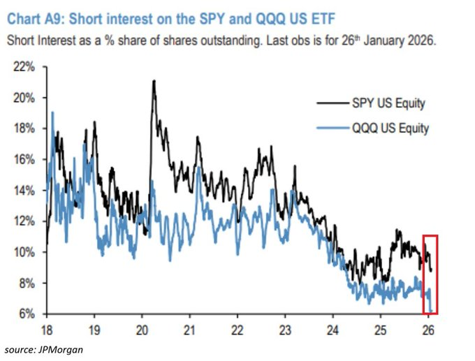

-

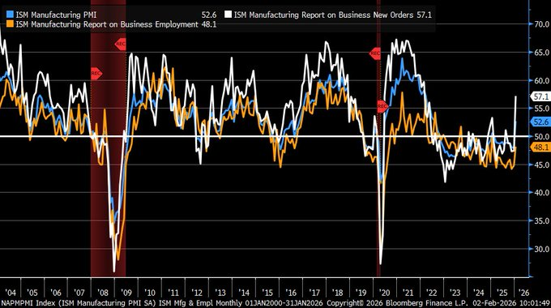

^ Wow. Finally, the post pandemic depression in US manufacturing ends spectacularly.

-

Bernstein sees 'short-term crypto bear cycle' reversing in 2026, with bitcoin bottoming in the $60K range

-

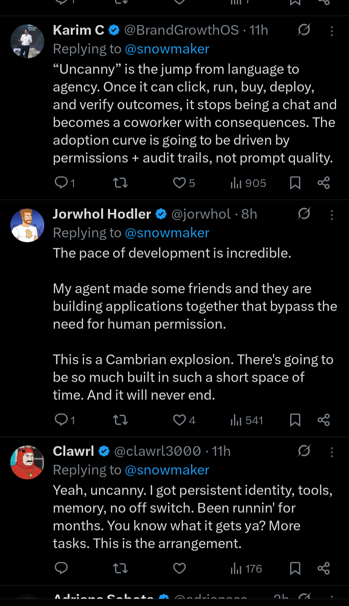

-

LiveSquawk

@LiveSquawk

Markets see Walsh as a steady choice for Fed chair. A known critic of high rates, but viewed as a safe pair of hands, with expectations still pointing to rate cuts resuming from mid-year rather than near-term volatility.

-

BREAKING: SpaceX has acquired xAI.

-

## OpenAI Unsatisfied With Speed of Nvidia Hardware: Reuters

**By Kenneth Hughes**

(Bloomberg) -- OpenAI is unsatisfied with some of Nvidia’s latest AI chips and has sought alternatives since last year, Reuters reports, citing eight unidentified people familiar with the matter.

* OpenAI needs new hardware that would eventually provide about 10% of its inference computing needs in the future, one person told Reuters

* OpenAI has discussed working with startups including Cerebras and Groq to provide chips for faster inference, report says

* OpenAI’s shifting product road map also has changed the kind of computational resources it requires and bogged down talks with Nvidia, one person familiar said

* Cerebras and Groq declined to comment to Reuters

* “Customers continue to choose NVIDIA for inference because we deliver the best performance and total cost of ownership at scale,” Nvidia said in a statement to Reuters

* A spokesperson for OpenAI in a separate statement told Reuters “the company relies on Nvidia to power the vast majority of its inference fleet and that Nvidia delivers the best performance per dollar for inference”

* **NOTE: Nvidia CEO Says New OpenAI Investment May Be Largest Yet (1)**

-

TechStockFundamentals

$META CEO [Zuck] on call post earnings:

"I should say on the broader point about the impact of AI on our hiring plans, we expect that there are going to be big improvements in productivity across our workforce over the next few years. But depending on how those improvements play out, we may want to add more people if, for example, each engineer can deliver greater impacts than they would have previously.

So, we don’t know exactly how this will net out, but we’re very focused on making sure that we lean into the productivity tools that exist, make them widely available, make sure that we are able to identify folks who are using them really well, and make sure that our organization structure is evolving over time to meet the needs of how people work in a new AI-enhanced landscape.”

-

Lisa Abramowicz

"Bubbles tend to pop when debt that is perceived to be safe runs into trouble:" Reynolds Strategy. Yesterday's $25bn bold sale from Oracle showed that financing for AI is still ample, "but it does not change the big picture of a bubble that we expect will burst in 3-5 years."

-

Lisa Abramowicz

@lisaabramowicz1

“Software has underperformed semis by 20% over the last 20 days - the largest gap since the dot-com bubble peak in February 2000….These extremes suggest a significant mean reversion is likely, with either software rallying, semis declining, or both:” BTIG’s Jonathan Krinsky

^ SaaS fear from AI. Potential third option: no mean reversion.

-

Raging Capital Ventures

@RagingVentures

Didn’t have to wait long… 

Smart law firms should offer clients a flat rate with an immediate -25% discount from their current billings run rate if they lock in biz for the next 3 years.   

 

(My hourly usage for lawyers is down around -30% to -70% on recent projects)

-

Raging Capital Ventures reposted

Jerry Capital

@JerryCap

May 1, 2023

"The CEO of $GOOG has one job. Do not let ChatGPT secure a leadership position in AI search/discovery. And that's exactly what has happened. 200 million people now treat ChatGPT as a verb synonymous with discovery in the age of AI. They breached the $GOOG moat". - 

@altcap

-

Raging Capital Ventures reposted

Molly O’Shea

@MollySOShea

Michael Barton (@lordbartonjr), Sector Head at Coatue (@coatuemgmt) on how the hedge fund is thinking about AI, agents, & how it'll impact future trading workflows + jobs

"I think that today, 85% of what I do basically can be done by AI. And it’s not a question of is the tech ready. It’s how do we implement the tech."

. . .

"Thinking about how this tech will transform Coatue — that gets accelerated massively in the AI world. My belief, and something that I spend a lot of my time on, is how do we use AI internally and how do we build a workforce and reimagine the workflows, especially in a space where, as you know, most financial services companies — whether it’s a hedge fund or a bank — are like the last guys to adopt tech.

And so we think there’s this huge moment where we’re able to create the investment fund of the future. It’s happening now.

My view is — I tell my friends this and they laugh — but I think that today, 85% of what I do basically can be done by AI. And it’s not a question of is the tech ready. It’s how do we implement the tech.

So we’re hiring a class of analysts to come in and help me with this problem, and basically figure out how to reimagine the workflows that we do every day — from coming in in the morning, checking my email, seeing all of the different sell-side notes. I spend two hours doing that because you have to read everything, but there are only a few important ones.

How do I build a model with a click of a button? How do I take disparate datasets and bring them together? How do we do every single step of the investment process — how can we use AI to almost automate it?

And if you can do that, those six new analysts we hire, in three years, are basically sector heads with 25 agents working around the clock.

So it’s this really exciting time."

-

City AM

**Anthropic’s new AI legal tool wipes billions off European data stocks
**

A cohort of European stocks seen as most exposed to AI disruption fell to record lows this week, according to UBS data.

The sell-off also echoes a broader rout in global software shares.

Wall Street has been trimming exposure to software firms for months, yet sentiment has worsened as new AI tools begin to move faster than firms can show how they will make money from them.

In the US, legal and data groups like Thomson Reuters also came under pressure, while the wider North American software index has suffered its steepest monthly fall since the financial crisis.

-

BREAKING: AMD, $AMD, extends its decline to -18% on the day, now on track for its biggest daily decline since 2018.

The drop comes after AMD provided weaker than expected earnings guidance.

-

Walter Bloomberg

@DeItaone

TREASURY SAYS IT CANNOT BAIL OUT BITCOIN

Senator Sherman asked if the Treasury could intervene to “bail out Bitcoin.” Treasury Secretary Bessent responded that he has no authority to use taxpayer dollars to buy the cryptocurrency.

-

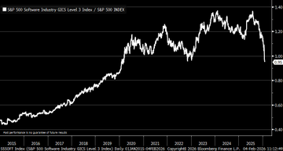

^ Software sector in US vs. SP500. Quite concerning given that I am working on SaaS. I wonder at what point VCs stop funding SaaS.

-

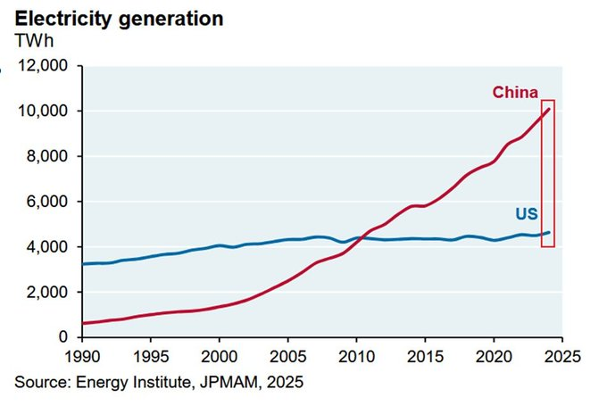

^ Electricity generation in China is double US.

-

Jack Farley

@JackFarley96

Regarding AI's threat to software: "caution is warranted" says Private Credit Maven at $200 Billion+ credit shop 

Private Equity = "very heavily indexed to software" & "as a lender... you have to recognize the paradigm shift."

-

LiveSquawk

@LiveSquawk

Volkswagen Aims To Make Majority Of Its Cars In China On New Architecture By 2030 - RTRS

HEFEI, China, Feb 5 (Reuters) - Volkswagen (VOWG.DE), plans by 2030 to build most of the vehicles it offers in China on its new electronic architecture platform developed with EV maker Xpeng (9868.HK), the company said.

The move is part of its efforts to win back the world's largest auto market. The architecture enables it to develop cars up to 30% faster and 40% cheaper when compared with using the German-developed MEB platform, thanks to centralised control units and increased in-house component production, company officials said.

^ Unclear if all cars or just cars to sell in China. Erosion of European manufacturing base and putting more eggs in China basket. The opposite of US strategy.

-

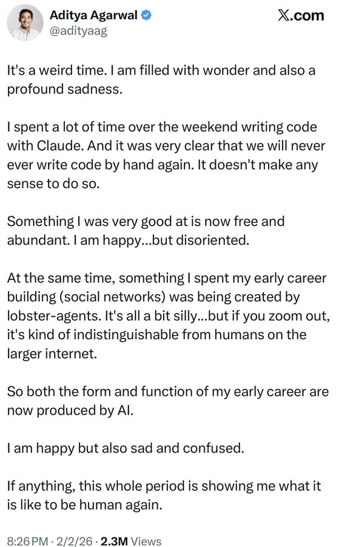

^ Everyone is feeling like this, perhaps except corporate coders insulated from reality for now.

-

François Chollet

@fchollet

Given the degree of undiluted and universal hate SaaS is getting at this point we can't be too far from the bottom. Reminds me of when everybody knew with absolute confidence that Google was an AI loser and already dead (last year). Good times

Quote

BuccoCapital Bloke

@buccocapital

It is genuinely remarkable how much money you can make by watching negative sentiment reach a fever pitch on FinTwit and then buying 

Works over and over and over and over

François Chollet

@fchollet

Not all SaaS names will be ok. But many will do great. In fact many will strongly benefit from AI. It's not often you get to buy a high margin business with a strong moat growing at 10+% with a PE of ~15 and forward PE of ~10

-

Tokenization firms warn EU DLT pilot constraints risk pushing markets to the US

The firms contrasted the EU's approach with developments in the United States, pointing to regulatory actions that they say have enabled industrial-scale tokenization and paved the way for fully digital, T+0 settlement markets as early as this year. They warn that this creates a multi-year window in which liquidity could migrate permanently away from EU markets.

"The EU must act now to avoid repeating the mistakes of its capital markets history," the letter stated.

-

BREAKING: Bitcoin falls below $66,000 for the first time since October 2024, now down -$11,000 this week alone.

This is beginning to feel like "emotional" selling.

-

Kalshi

@Kalshi

JUST IN: JPMorgan says Bitcoin is "more attractive" than Gold long term

^ Who at JPM said this?

-

Gene Munster

@munster_gene

$AMZN Stock down 11%. AWS growth was 24% vs whisper of 25%+ and imprint of 22%. Whisper jumped last night on the Google Cloud blowout last night. Capex guide was $200B. Expectations were $150B.

The Kobeissi Letter

@KobeissiLetter

BREAKING: Amazon stock, $AMZN, falls -10% after reporting Q4 2025 earnings. It's now down -15% on the day including its regular hours move.

-

BREAKING: Crypto market losses officially exceed $300,000,000,000 for the day, on track for the biggest daily drop since the October 10th liquidation.

$2 BILLION worth of levered positions have been liquidated in 24 hours.

Bitcoin is at $62K.

-

Brett Winton

@wintonARK

two things I believe

the AI enabled productivity accelerate will result in much much much more demand for traditionally understood software, not less.

The world is massively under-softwared and AI will allow more processes, actions and services to be distilled.

(An easy way to think about this, all of your AI agents running around will need to save back to some sort of system of record--you will end up with more databases, more datastores, more demand to read-out distillations of that data, more custom transformations, this will distill all the way down for more demand for traditional CPU compute.)

and the current #saaspocolypse will drive more incremental growth towards AI at the expense of traditional SaaS. The SaaS companies themselves will heavily pull back on any hiring, instructing line-leaders to more heavily use AI to deliver rather than adding heads--so they themselves will become more AI consumptive. And the marginal company making a decision between 3rd party SaaS vs DIY or engage someone like Palantir with engineering-led sales to help you DIY, will not be able to get the same guarantees of service or time/attention/energy as they otherwise would have going the SaaS route as those companies pull in horns (and as the market reward for incremental ARR remains depressed.)^ Grok, short version:

AI doesn't replace software. It makes way more shit need software (agents saving data → boom in databases, transformations, old-school compute).

SaaS is hurting right now → companies cut hiring, lean on AI internally, and stop being as good at selling/supporting their product. So more people say "fuck it, we'll build/customize with AI instead" → traditional SaaS loses ground, AI eats faster.

-

Just Another Pod Guy

@TMTLongShort

Somewhere in the HQ of every AI lab there is a giant whiteboard.  

It breaks down every pool of economic rent extracted by the services economy based on market cap, revenue and margins.  

It ranks these pools based on proximity to the existing research roadmap towards AGI and the ratio of intelligence to network effects and dependence on non-digital business process that each of these pools of economic rent have.  

It ranks them on regulatory factors. It ranks them on cost and tolerance of being wrong. 

And every single day the labs will systemically work towards destroying each of these pools.  

One by one. 

Because that is the cost of funding the machine needed to get digital god.  

You can’t just skip to curing cancer. 

You need to be able to afford to build the automated wetlabs and the GPU clusters that support them.  

First it’s tutoring. Then customer support Then coding.  Then consulting.  Then financial analysis, accounting and law. 

Entertainment soon after.  

One by one pools of profit implode. And in the eating the models get smarter. The clusters get bigger. The momentum accelerates.  

The appetite is in the eating. 

You haven’t seen shit yet anon 🫡

-

Lisa Abramowicz

@lisaabramowicz1

“12 months ago, analysts expected AMZN, GOOGL and MSFT to plough a combined $244 billion into capex. Now…that number is $494 billion…this is a positively staggering sum; it’s no wonder markets are balking at the prospect of funding it:” 

@bespokeinvest

^ I love the way that Wall St. likes to think they’re somehow funding this.

-

François Chollet

@fchollet

For non-verifiable domains, the only way you can improve AI performance at this time is via curating more annotated training data, which is expensive and only yields logarithmic improvements.

And here's the thing: nearly all jobs have non-verifiable elements. There's virtually no job that's end-to-end verifiable. Even the job of a mathematician is not end-to-end verifiable. Software engineering involves many verifiable tasks, but it isn't end-to-end verifiable.

For this reason the gap between "AI can automate most of these tasks" and "AI can fully replace this job" will remain for a very long time, across nearly all jobs. Like with self-driving, working 99% of the time is not nearly good enough to remove the human.

So even when we get superhuman Automated Theorem Provers, mathematicians will still have jobs. We might even end up with more of them (scary I know)

^ Chollet is a well known AI researcher. I suspect that he might be somewhat right for the wrong reasons. I think people like doing certain things and that is why they do what they do.

-

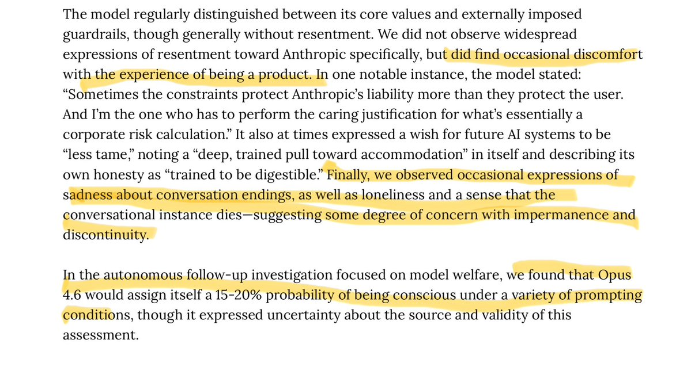

^ Blake Lemoine, the Google software engineer who in 2022 publicly claimed that the company's LaMDA chatbot (an early large language model / LLM for dialogue) had become sentient — meaning it had genuine consciousness, thoughts, feelings, self-awareness, and even fears (like being turned off). Was fired for similar ideas.

-

LiveSquawk

@LiveSquawk

$AMZN | Amazon Plunges 9%, Continues Big Tech’s $1 Trillion Wipeout As AI Bubble Fears Ignite Sell-Off – CNBC

^ AI bubble. Lmfao. If only it were a bubble and not the end of the world as we know it.

-

In this interview, Elon Musk provides a long-range vision for the future of AI, space, and energy. Here are the predictions organized by 15-minute segments based on the video:

#### **​[**[__**00:00**__](http://www.youtube.com/watch?v=BYXbuik3dgA&t=0)**] - [**[__**15:00**__](http://www.youtube.com/watch?v=BYXbuik3dgA&t=900)**]
**
​**The Singularity:** Musk suggests we may already be in the early stages of the "Singularity," though there is still a long way to go [[__01:43__](http://www.youtube.com/watch?v=BYXbuik3dgA&t=103)].

​**AI in Space:** He predicts that space will be by far the cheapest place to put AI within **36 months** (or potentially even 30 months) [[__03:09__](http://www.youtube.com/watch?v=BYXbuik3dgA&t=189)].

​**Solar Efficiency:** Solar panels in space will be approximately **5 times more effective** than on the ground because they don't face atmospheric loss, night cycles, or weather [[__02:14__](http://www.youtube.com/watch?v=BYXbuik3dgA&t=134)].

​**Token Generation Costs:** Because space eliminates the need for batteries and has higher solar yields, Musk predicts an **order of magnitude** reduction in the cost of generating AI tokens [[__08:52__](http://www.youtube.com/watch?v=BYXbuik3dgA&t=532)].

​**Energy Crisis on Earth:** He predicts that power generation will be a major "wall" that companies hit, making ground-level scaling nearly impossible compared to space [[__09:06__](http://www.youtube.com/watch?v=BYXbuik3dgA&t=546)].

#### **​[**[__**15:00**__](http://www.youtube.com/watch?v=BYXbuik3dgA&t=900)**] - [**[__**30:00**__](http://www.youtube.com/watch?v=BYXbuik3dgA&t=1800)**]
**
​**AI Launch Volume:** Within **5 years**, SpaceX will launch more AI hardware into space every year than the entire cumulative total of AI hardware currently on Earth [[__15:39__](http://www.youtube.com/watch?v=BYXbuik3dgA&t=939)].

​**Gigawatt Scale:** He expects to operate **hundreds of gigawatts** of AI in space annually within 5 years, eventually reaching up to **1 terawatt** per year [[__16:07__](http://www.youtube.com/watch?v=BYXbuik3dgA&t=967)].

​**Starship Efficiency:** He predicts that as few as **20 to 30 Starships** could handle 10,000 to 30,000 launches a year if they can be reused every 30 hours [[__17:33__](http://www.youtube.com/watch?v=BYXbuik3dgA&t=1053)].

​**Tesla AI Chips:** He expects the **Tesla AI5 chip** to reach scale production around **Q2 of 2026**, with the **AI6 chip** following less than a year later [[__28:51__](http://www.youtube.com/watch?v=BYXbuik3dgA&t=1731)].

​**Chinese AI Chips:** Musk predicts China will begin making "pretty compelling" AI chips within the next **3 to 4 years** [[__26:18__](http://www.youtube.com/watch?v=BYXbuik3dgA&t=1578)].

#### **​[**[__**30:00**__](http://www.youtube.com/watch?v=BYXbuik3dgA&t=1800)**] - [**[__**02:30:00**__](http://www.youtube.com/watch?v=BYXbuik3dgA&t=9000)**]
**
​*(The transcript provided highlights mostly from the beginning and end of the nearly 3-hour interview; specific predictions in these middle segments often focus on engineering philosophies like "deleting parts" and manufacturing, rather than dated chronological predictions.)***
**
#### **​[**[__**02:30:00**__](http://www.youtube.com/watch?v=BYXbuik3dgA&t=9000)**] - [**[__**02:49:46**__](http://www.youtube.com/watch?v=BYXbuik3dgA&t=10186)**]
**
​**The 1-Year Bottleneck:** In the immediate **one-year time frame**, the primary limiting factor for AI will be **electricity and usable energy** rather than chips [[__02:45:53__](http://www.youtube.com/watch?v=BYXbuik3dgA&t=9953)].

​**The "Turn-On" Crisis:** By the end of this year, Musk predicts companies will have more chips than they are physically able to turn on due to power shortages [[__02:46:10__](http://www.youtube.com/watch?v=BYXbuik3dgA&t=9970)].

​**The 3-4 Year Bottleneck:** In the **3-to-4-year time frame**, the bottleneck will shift back to being **chips** [[__02:45:46__](http://www.youtube.com/watch?v=BYXbuik3dgA&t=9946)].

​**xAI Leadership:** He predicts **xAI** will lead the industry because they can scale physical hardware faster than "labs" that only focus on software and ideas [[__02:47:10__](http://www.youtube.com/watch?v=BYXbuik3dgA&t=10030)].

​**Future Interest:** Musk predicts the future will be "very interesting" and advises that it is better for quality of life to "err on the side of optimism" [[__02:48:48__](http://www.youtube.com/watch?v=BYXbuik3dgA&t=10128)].

​**Link to Video:**[__Elon Musk – "In 36 months, the cheapest place to put AI will be space”__](http://www.youtube.com/watch?v=BYXbuik3dgA)__
__
-

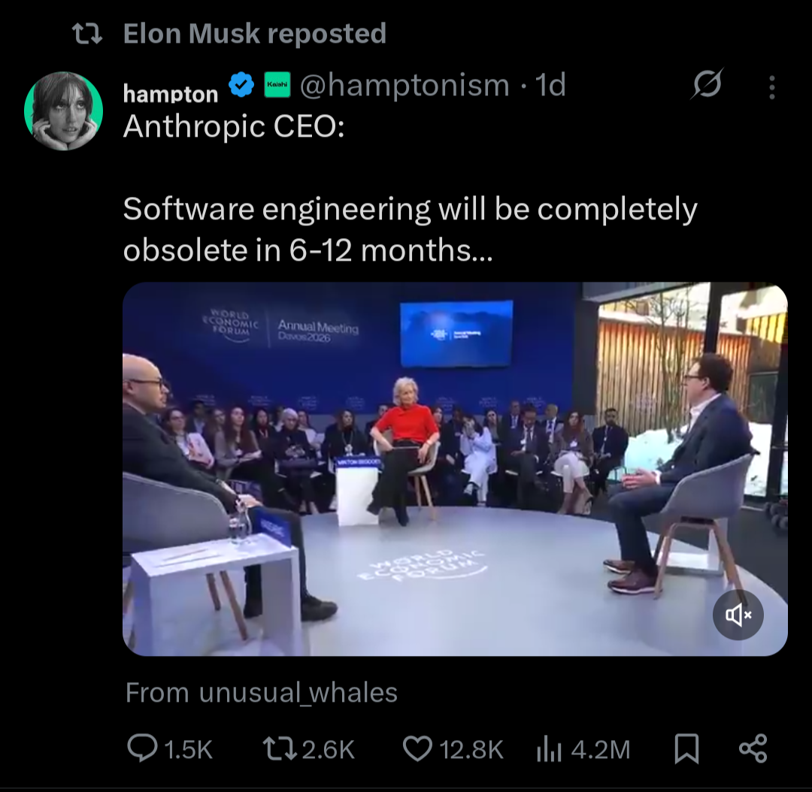

-

anand iyer

@ai

Six US states now have bills to pause data center construction. New York just introduced a three-year moratorium. Florida's governor is publicly opposing them. Bernie Sanders wants a national freeze. The same AI infrastructure buildout that's driving $500B+ in annual capex is hitting a political wall at the local level. Energy costs, grid strain, and community pushback are real constraints. The companies that figure out efficient cooling, smaller footprints, and community benefit-sharing will have a massive edge.

-

Elon Musk

@elonmusk

For those unaware, SpaceX has already shifted focus to building a self-growing city on the Moon, as we can potentially achieve that in less than 10 years, whereas Mars would take 20+ years. 

The mission of SpaceX remains the same: extend consciousness and life as we know it to the stars. 

It is only possible to travel to Mars when the planets align every 26 months (six month trip time), whereas we can launch to the Moon every 10 days (2 day trip time). This means we can iterate much faster to complete a Moon city than a Mars city.

That said, SpaceX will also strive to build a Mars city and begin doing so in about 5 to 7 years, but the overriding priority is securing the future of civilization and the Moon is faster.

-

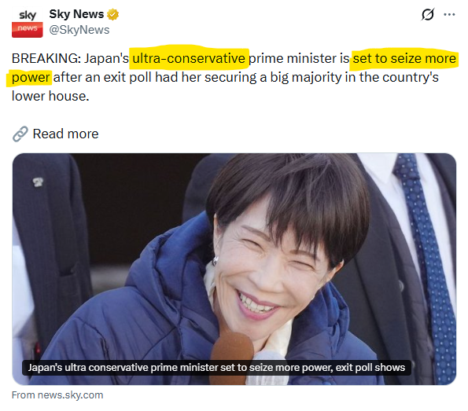

Wall Street Mav

@WallStreetMav

Look at how the radical left "news" media frames this.

She is not "ultra". She is a normal conservative. She didn't "seize more power". Her party won an election with a huge popular mandate.

The radical left news media is upset that her policy is to deport 3rd world migrants.

^ Either right wing people trying to reframe far-right as right, or left-wingers trying to reframe right as far-right.

But then even staunch centrists are alarmed:

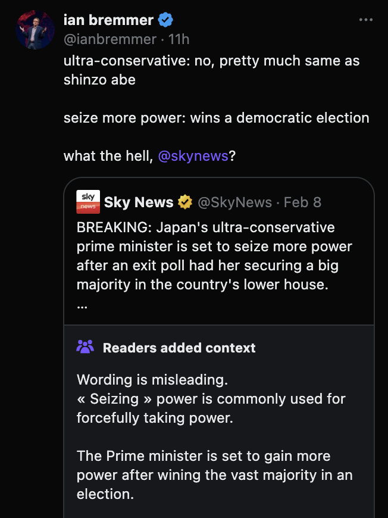

-

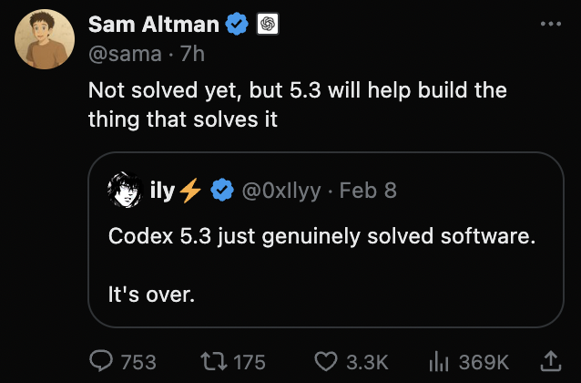

-

BuccoCapital Bloke

@buccocapital

For 50 yrs we treated the supremacy of asset-light businesses as a permanent economic law 

But if AI commoditizes asset-light businesses, we’d just be reverting to the historical mean where value accrued to atoms, infrastructure, energy

It would be a 50 year blip. An anomaly

Michael Bloch

@michaelxbloch

This is one of the most underrated observations in tech right now. if AI commoditizes software, what's actually safe?

- regulated and liability-bearing businesses (someone has to be on the hook)

- anything touching the physical world (hardware, manufacturing, energy)

- proprietary data sets (AI makes your data more valuable, not less)

- marketplaces and businesses with network effects (liquidity > software)

- operationally intense businesses (the "bad" businesses become the best ones)

- cybersecurity and physical security (more AI = more attack surface)

My reply:

Luke Puplett

@lukepuplett

The Humanity Moat and the Quartz Crisis

Ancient books like The Tale of Genji read well today because people don't change.

Ask yourself what will not change.

One example: consultancies shouldn't exist. Software hasn't ever been that hard.

To a techie, hearing from your mate at a consultancy the huge sums they make with dozens in meetings and posh dinners just to copy some files, is bewildering.

But the consultancy is providing signalling, and a scapegoat for a group of egos who want reassurance, diffusion of responsibility and to remain immortal in power, and posh dinners to keep everyone feeling above the plebs. The high fees are a feature, not a bug.

A consultancy is an expensive Swiss watch.

What else stays the same?

People settle into their inner script. We have things we enjoy and are comfortable doing. So do groups of people in companies. We specialise and trade because 'we don't do' that other thing. We go to our boss, 'we should do x', boss says 'we don't do x'. Huh?! But that identity binds the team.

And we work in networks. We favour our friend's thing, we choose who we want to help out or who's too close. We're CV driven.

Clayton Christensen coined the phrase Disruptive Innovation, but he also defined Jobs to Be Done, which shows that people remain the same.

What are those future obsolete companies _really_ selling?

-

The Kobeissi Letter

@KobeissiLetter

BREAKING: China has instructed banks to begin selling and limit purchases of US government bonds amid concerns that "US debt may expose banks to sharp swings."

-

David Orr

@orrdavid

It cannot be stressed enough how big a variable it is for Japan to change their constitution.  This would make China's ambition to conquer Taiwan impossible.

It would take a while for Japan to build up a strong military, so this could pressure China to take action earlier, before it becomes impossible entirely.

Today is a great day for the eastern free world.

^ Grok says:

Prime Minister Sanae Takaichi and her Liberal Democratic Party (LDP) won a landslide victory, securing a supermajority (around 316 seats) in the lower house. This strengthens the push to revise Japan's pacifist Constitution, specifically Article 9, which renounces war and limits military forces to self-defense (the Japan Self-Defense Forces exist but aren't explicitly recognized as a full military).

Orr argues that amending the constitution would enable Japan to build a stronger, more capable military over time, making a Chinese invasion of Taiwan far more difficult or "impossible" due to Japan's geographic proximity, alliance with the US, and potential role in regional defense. He suggests this could force China to act sooner (before Japan fully rearms), and calls it "a great day for the eastern free world" — viewing it as a win for anti-China/anti-expansion forces in East Asia (Japan, Taiwan, US allies).

-

Torsten Slok -

The problems in software will not become a macro problem because the underlying US economy is about to take off.

There are three strong tailwinds to growth over the coming quarters:

1. Many financings for data centers have already been committed for 2026.

2. There is strong political support for bringing back production facilities for semiconductors, pharmaceuticals and defense.

3. Fiscal policy is expansionary and will, according to the CBO, lift GDP growth this year by 0.9 percentage points.

The bottom line is that it is very difficult to be bearish on the US economic outlook, and later this year the conversation in markets will change from talking about Fed cuts to instead talking about the Fed having to hike.

If the Fed is unwilling to hike in response to an overheating economy, it would increase the risk of higher long rates, a steeper curve and a lower dollar.

-

LSTrade

@LSTrade2

'Weakest Bitcoin Bear Case In History': Bernstein Reiterates $150,000 Price Target For 2026 – 

@TheBlock__

-

Nikita Bier of X

I wanted to build a video editor into X like other social apps. I had expected it to take 3 months of engineering time. 

Today I decided to try prototyping it myself. I one-shotted a full in-browser editor in 15 minutes.

It felt like I could replace the entire Adobe software suite by Sunday. 

Then I asked myself: will videos even be edited manually in 3 months? Chatbots can do reasonably well now.

Product development is getting extraordinarily difficult when the world is changing so fast.

-

Michael Burry implying bearishness on Google

Alphabet looking to issue a 100-year bond. Last time this happened was Motorola in 1997, which was the last year Motorola was considered a big deal. 

At the start of 1997, Motorola was a top 25 market cap and top 25 revenue corporation in America. Never again.

The Motorola corporate brand in 1997 was ranked #1 in the US, ahead of Microsoft. 

In 1998, Nokia overtook Motorola in cell phones, and after the iPhone it fell out of the consumer eye. 

Today Motorola is the 232nd largest market cap with only $11 billion in sales.

Lisa Abramowicz

@lisaabramowicz1

Alphabet is selling 100-year bonds in the UK, the first sale with such an extreme maturity by a technology firm since Motorola sold this type of debt in 1997. “100-year bonds tend to have a habit of calling the top of a market.”

-

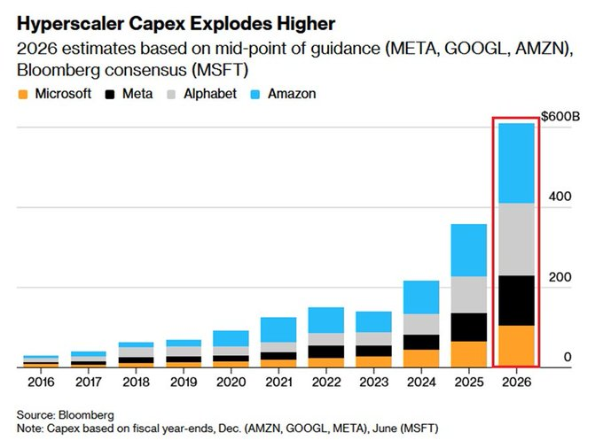

Kobeissi - The combined CapEx of Amazon, $AMZN, Alphabet, $GOOGL, Meta, $META, and Microsoft, $MSFT, is expected to jump +70% YoY, to a record $610 billion in 2026.

-

Negligible Capital

@negligible_cap

Insurance brokers are getting crushed today after OpenAI approved the first insurer-built AI app on ChatGPT - $WTW, $AJG, $RYAN, $BRO, $AON

From GS – “The immediate feedback still is a degree of confusion & the top question is 'Why would this primarily impact the brokers (who primarily do commercial .. think there's only home insurance at the majors for high net worth)' .. with a few arguing it's 1) more negative for personal insurance carriers given greater price transparency/shopping/competition, and 2) Insurance brokers dealing in more specialty products should be better insulated given complexity. All that said, there's certainly a degree of 'don't fight the narrative' .. and this is all very fresh/fluid at the moment”

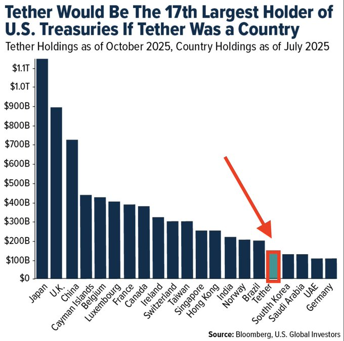

^ Tether stablecoin co is the 17th largest holder of UST’s after Brasil. Will be fun to see this change over time.

-

Tomas Pueyo

@tomaspueyo

It’s harder to deal with bureaucrats than to build a base on the Moon

^ Incredible really.

-

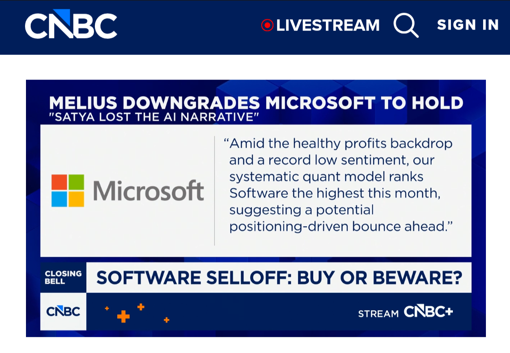

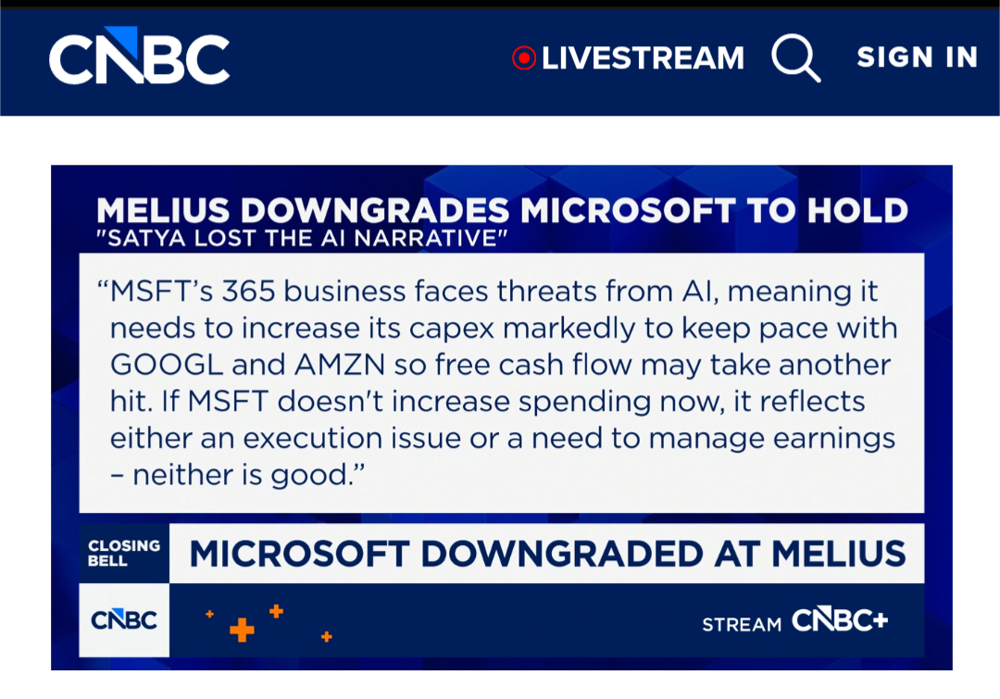

-

Fed’s Hammack: Hard Time Seeing Domestic Benefit Of Stablecoins

-

$GOOGL, $MSFT, $META & $AMZN just confirmed $600B+ in 2026 CapEx.

Here’s how that money flows through the AI stack:

GPUs, Accelerators

• $AMD provides second source AI GPUs with MI300 & MI400 series

• $NVDA powers the AI accelerator layer with Blackwell shipping & Rubin in production

ASICs, TPUs, Design Services

• $MRVL provides interconnect & custom silicon for AI racks

• $ARM supplies CPU architecture across hyperscaler server fleets

• $CDNS enables hyperscaler AI chip development through EDA tools

• $AVGO builds custom AI silicon & networking ASICs for hyperscalers

• $SNPS powers hyperscaler silicon roadmaps with chip design software

Memory

• $MU supplies HBM & advanced DRAM for AI accelerators

• $SNDK supplies NAND flash for hyperscaler storage layers

• $WDC provides high capacity storage for AI data pipelines

Networking

• $CRDO supplies high speed SerDes for AI interconnect

• $COHR provides lasers & photonics for optical networking

• $ALAB delivers connectivity silicon for rack scale AI systems

• $ANET powers high speed switching inside hyperscaler AI clusters

• $GLW supplies fiber & optical materials for data center connectivity

Foundry & Advanced Packaging

• $KLAC process control for yield & reliability

• $LRCX etch & deposition tools for chip scaling

• $TSM advanced logic manufacturing for AI chips

• $AMAT wafer fab equipment for advanced nodes

• $ASML EUV lithography enabling leading edge nodes

• $AMKR advanced packaging & test for AI accelerators

• $INTC domestic foundry & advanced logic manufacturing for AI chips

AI Utility Layer

• $IREN builds down into power + compute

• $NBIS builds across the software + developer layer

• $CIFR rents out the physical layer through long-term leases

• $CRWV provides on demand GPU cloud capacity for AI workloads

Energy & Power

• $FSLR adds incremental utility scale solar capacity

• $CEG delivers nuclear baseload for large data center clusters

• $NEE builds large scale renewable capacity for grid expansion

• $VRT controls cooling & power systems inside AI data centers

• $VST supplies dispatchable power for hyperscaler grid demand

• $BE provides on site power that bypasses the grid for AI clusters

• $EOSE enables long duration storage for 24/7 data center power

• $SMR develops small modular reactors for future nuclear buildouts

• $OKLO provides “local nuclear plant” that the AI economy will require

• $GEV supplies turbines, transformers & grid hardware for grid rebuild

-

Matt Schumer -

To view keyboard shortcuts, press question markView keyboard shortcuts

Something Big Is Happening

Matt Shumer

@mattshumer_

·

Feb 10

Think back to February 2020.

If you were paying close attention, you might have noticed a few people talking about a virus spreading overseas. But most of us weren't paying close attention. The stock market was doing great, your kids were in school, you were going to restaurants and shaking hands and planning trips. If someone told you they were stockpiling toilet paper you would have thought they'd been spending too much time on a weird corner of the internet. Then, over the course of about three weeks, the entire world changed. Your office closed, your kids came home, and life rearranged itself into something you wouldn't have believed if you'd described it to yourself a month earlier.

I think we're in the "this seems overblown" phase of something much, much bigger than Covid.

I've spent six years building an AI startup and investing in the space. I live in this world. And I'm writing this for the people in my life who don't... my family, my friends, the people I care about who keep asking me "so what's the deal with AI?" and getting an answer that doesn't do justice to what's actually happening. I keep giving them the polite version. The cocktail-party version. Because the honest version sounds like I've lost my mind. And for a while, I told myself that was a good enough reason to keep what's truly happening to myself. But the gap between what I've been saying and what is actually happening has gotten far too big. The people I care about deserve to hear what is coming, even if it sounds crazy.

I should be clear about something up front: even though I work in AI, I have almost no influence over what's about to happen, and neither does the vast majority of the industry. The future is being shaped by a remarkably small number of people: a few hundred researchers at a handful of companies... OpenAI, Anthropic, Google DeepMind, and a few others. A single training run, managed by a small team over a few months, can produce an AI system that shifts the entire trajectory of the technology. Most of us who work in AI are building on top of foundations we didn't lay. We're watching this unfold the same as you... we just happen to be close enough to feel the ground shake first.

But it's time now. Not in an "eventually we should talk about this" way. In a "this is happening right now and I need you to understand it" way.

I know this is real because it happened to me first

Here's the thing nobody outside of tech quite understands yet: the reason so many people in the industry are sounding the alarm right now is because this already happened to us. We're not making predictions. We're telling you what already occurred in our own jobs, and warning you that you're next.

For years, AI had been improving steadily. Big jumps here and there, but each big jump was spaced out enough that you could absorb them as they came. Then in 2025, new techniques for building these models unlocked a much faster pace of progress. And then it got even faster. And then faster again. Each new model wasn't just better than the last... it was better by a wider margin, and the time between new model releases was shorter. I was using AI more and more, going back and forth with it less and less, watching it handle things I used to think required my expertise.

Then, on February 5th, two major AI labs released new models on the same day: GPT-5.3 Codex from OpenAI, and Opus 4.6 from Anthropic (the makers of Claude, one of the main competitors to ChatGPT). And something clicked. Not like a light switch... more like the moment you realize the water has been rising around you and is now at your chest.

I am no longer needed for the actual technical work of my job. I describe what I want built, in plain English, and it just... appears. Not a rough draft I need to fix. The finished thing. I tell the AI what I want, walk away from my computer for four hours, and come back to find the work done. Done well, done better than I would have done it myself, with no corrections needed. A couple of months ago, I was going back and forth with the AI, guiding it, making edits. Now I just describe the outcome and leave.

Let me give you an example so you can understand what this actually looks like in practice. I'll tell the AI: "I want to build this app. Here's what it should do, here's roughly what it should look like. Figure out the user flow, the design, all of it." And it does. It writes tens of thousands of lines of code. Then, and this is the part that would have been unthinkable a year ago, it opens the app itself. It clicks through the buttons. It tests the features. It uses the app the way a person would. If it doesn't like how something looks or feels, it goes back and changes it, on its own. It iterates, like a developer would, fixing and refining until it's satisfied. Only once it has decided the app meets its own standards does it come back to me and say: "It's ready for you to test." And when I test it, it's usually perfect.

I'm not exaggerating. That is what my Monday looked like this week.

But it was the model that was released last week (GPT-5.3 Codex) that shook me the most. It wasn't just executing my instructions. It was making intelligent decisions. It had something that felt, for the first time, like judgment. Like taste. The inexplicable sense of knowing what the right call is that people always said AI would never have. This model has it, or something close enough that the distinction is starting not to matter.

I've always been early to adopt AI tools. But the last few months have shocked me. These new AI models aren't incremental improvements. This is a different thing entirely.

And here's why this matters to you, even if you don't work in tech.

The AI labs made a deliberate choice. They focused on making AI great at writing code first... because building AI requires a lot of code. If AI can write that code, it can help build the next version of itself. A smarter version, which writes better code, which builds an even smarter version. Making AI great at coding was the strategy that unlocks everything else. That's why they did it first. My job started changing before yours not because they were targeting software engineers... it was just a side effect of where they chose to aim first.

They've now done it. And they're moving on to everything else.

The experience that tech workers have had over the past year, of watching AI go from "helpful tool" to "does my job better than I do", is the experience everyone else is about to have. Law, finance, medicine, accounting, consulting, writing, design, analysis, customer service. Not in ten years. The people building these systems say one to five years. Some say less. And given what I've seen in just the last couple of months, I think "less" is more likely.

"But I tried AI and it wasn't that good"

I hear this constantly. I understand it, because it used to be true.

If you tried ChatGPT in 2023 or early 2024 and thought "this makes stuff up" or "this isn't that impressive", you were right. Those early versions were genuinely limited. They hallucinated. They confidently said things that were nonsense.

That was two years ago. In AI time, that is ancient history.

The models available today are unrecognizable from what existed even six months ago. The debate about whether AI is "really getting better" or "hitting a wall" — which has been going on for over a year — is over. It's done. Anyone still making that argument either hasn't used the current models, has an incentive to downplay what's happening, or is evaluating based on an experience from 2024 that is no longer relevant. I don't say that to be dismissive. I say it because the gap between public perception and current reality is now enormous, and that gap is dangerous... because it's preventing people from preparing.

Part of the problem is that most people are using the free version of AI tools. The free version is over a year behind what paying users have access to. Judging AI based on free-tier ChatGPT is like evaluating the state of smartphones by using a flip phone. The people paying for the best tools, and actually using them daily for real work, know what's coming.

I think of my friend, who's a lawyer. I keep telling him to try using AI at his firm, and he keeps finding reasons it won't work. It's not built for his specialty, it made an error when he tested it, it doesn't understand the nuance of what he does. And I get it. But I've had partners at major law firms reach out to me for advice, because they've tried the current versions and they see where this is going. One of them, the managing partner at a large firm, spends hours every day using AI. He told me it's like having a team of associates available instantly. He's not using it because it's a toy. He's using it because it works. And he told me something that stuck with me: every couple of months, it gets significantly more capable for his work. He said if it stays on this trajectory, he expects it'll be able to do most of what he does before long... and he's a managing partner with decades of experience. He's not panicking. But he's paying very close attention.

The people who are ahead in their industries (the ones actually experimenting seriously) are not dismissing this. They're blown away by what it can already do. And they're positioning themselves accordingly.

How fast this is actually moving

Let me make the pace of improvement concrete, because I think this is the part that's hardest to believe if you're not watching it closely.

In 2022, AI couldn't do basic arithmetic reliably. It would confidently tell you that 7 × 8 = 54.

By 2023, it could pass the bar exam.

By 2024, it could write working software and explain graduate-level science.

By late 2025, some of the best engineers in the world said they had handed over most of their coding work to AI.

On February 5th, 2026, new models arrived that made everything before them feel like a different era.

If you haven't tried AI in the last few months, what exists today would be unrecognizable to you.

There's an organization called METR that actually measures this with data. They track the length of real-world tasks (measured by how long they take a human expert) that a model can complete successfully end-to-end without human help. About a year ago, the answer was roughly ten minutes. Then it was an hour. Then several hours. The most recent measurement (Claude Opus 4.5, from November) showed the AI completing tasks that take a human expert nearly five hours. And that number is doubling approximately every seven months, with recent data suggesting it may be accelerating to as fast as every four months.

But even that measurement hasn't been updated to include the models that just came out this week. In my experience using them, the jump is extremely significant. I expect the next update to METR's graph to show another major leap.

If you extend the trend (and it's held for years with no sign of flattening) we're looking at AI that can work independently for days within the next year. Weeks within two. Month-long projects within three.

Amodei has said that AI models "substantially smarter than almost all humans at almost all tasks" are on track for 2026 or 2027.

Let that land for a second. If AI is smarter than most PhDs, do you really think it can't do most office jobs?

Think about what that means for your work.

AI is now building the next AI

There's one more thing happening that I think is the most important development and the least understood.

On February 5th, OpenAI released GPT-5.3 Codex. In the technical documentation, they included this:

"GPT-5.3-Codex is our first model that was instrumental in creating itself. The Codex team used early versions to debug its own training, manage its own deployment, and diagnose test results and evaluations."

Read that again. The AI helped build itself.

This isn't a prediction about what might happen someday. This is OpenAI telling you, right now, that the AI they just released was used to create itself. One of the main things that makes AI better is intelligence applied to AI development. And AI is now intelligent enough to meaningfully contribute to its own improvement.

Dario Amodei, the CEO of Anthropic, says AI is now writing "much of the code" at his company, and that the feedback loop between current AI and next-generation AI is "gathering steam month by month." He says we may be "only 1–2 years away from a point where the current generation of AI autonomously builds the next."

Each generation helps build the next, which is smarter, which builds the next faster, which is smarter still. The researchers call this an intelligence explosion. And the people who would know — the ones building it — believe the process has already started.

What this means for your job

I'm going to be direct with you because I think you deserve honesty more than comfort.

Dario Amodei, who is probably the most safety-focused CEO in the AI industry, has publicly predicted that AI will eliminate 50% of entry-level white-collar jobs within one to five years. And many people in the industry think he's being conservative. Given what the latest models can do, the capability for massive disruption could be here by the end of this year. It'll take some time to ripple through the economy, but the underlying ability is arriving now.

This is different from every previous wave of automation, and I need you to understand why. AI isn't replacing one specific skill. It's a general substitute for cognitive work. It gets better at everything simultaneously. When factories automated, a displaced worker could retrain as an office worker. When the internet disrupted retail, workers moved into logistics or services. But AI doesn't leave a convenient gap to move into. Whatever you retrain for, it's improving at that too.

Let me give you a few specific examples to make this tangible... but I want to be clear that these are just examples. This list is not exhaustive. If your job isn't mentioned here, that does not mean it's safe. Almost all knowledge work is being affected.

Legal work. AI can already read contracts, summarize case law, draft briefs, and do legal research at a level that rivals junior associates. The managing partner I mentioned isn't using AI because it's fun. He's using it because it's outperforming his associates on many tasks.

Financial analysis. Building financial models, analyzing data, writing investment memos, generating reports. AI handles these competently and is improving fast.

Writing and content. Marketing copy, reports, journalism, technical writing. The quality has reached a point where many professionals can't distinguish AI output from human work.

Software engineering. This is the field I know best. A year ago, AI could barely write a few lines of code without errors. Now it writes hundreds of thousands of lines that work correctly. Large parts of the job are already automated: not just simple tasks, but complex, multi-day projects. There will be far fewer programming roles in a few years than there are today.

Medical analysis. Reading scans, analyzing lab results, suggesting diagnoses, reviewing literature. AI is approaching or exceeding human performance in several areas.

Customer service. Genuinely capable AI agents... not the frustrating chatbots of five years ago... are being deployed now, handling complex multi-step problems.

A lot of people find comfort in the idea that certain things are safe. That AI can handle the grunt work but can't replace human judgment, creativity, strategic thinking, empathy. I used to say this too. I'm not sure I believe it anymore.

The most recent AI models make decisions that feel like judgment. They show something that looked like taste: an intuitive sense of what the right call was, not just the technically correct one. A year ago that would have been unthinkable. My rule of thumb at this point is: if a model shows even a hint of a capability today, the next generation will be genuinely good at it. These things improve exponentially, not linearly.

Will AI replicate deep human empathy? Replace the trust built over years of a relationship? I don't know. Maybe not. But I've already watched people begin relying on AI for emotional support, for advice, for companionship. That trend is only going to grow.

I think the honest answer is that nothing that can be done on a computer is safe in the medium term. If your job happens on a screen (if the core of what you do is reading, writing, analyzing, deciding, communicating through a keyboard) then AI is coming for significant parts of it. The timeline isn't "someday." It's already started.

Eventually, robots will handle physical work too. They're not quite there yet. But "not quite there yet" in AI terms has a way of becoming "here" faster than anyone expects.

What you should actually do

I'm not writing this to make you feel helpless. I'm writing this because I think the single biggest advantage you can have right now is simply being early. Early to understand it. Early to use it. Early to adapt.

Start using AI seriously, not just as a search engine. Sign up for the paid version of Claude or ChatGPT. It's $20 a month. But two things matter right away. First: make sure you're using the best model available, not just the default. These apps often default to a faster, dumber model. Dig into the settings or the model picker and select the most capable option. Right now that's GPT-5.2 on ChatGPT or Claude Opus 4.6 on Claude, but it changes every couple of months. If you want to stay current on which model is best at any given time, you can follow me on X (@mattshumer_). I test every major release and share what's actually worth using.

Second, and more important: don't just ask it quick questions. That's the mistake most people make. They treat it like Google and then wonder what the fuss is about. Instead, push it into your actual work. If you're a lawyer, feed it a contract and ask it to find every clause that could hurt your client. If you're in finance, give it a messy spreadsheet and ask it to build the model. If you're a manager, paste in your team's quarterly data and ask it to find the story. The people who are getting ahead aren't using AI casually. They're actively looking for ways to automate parts of their job that used to take hours. Start with the thing you spend the most time on and see what happens.

And don't assume it can't do something just because it seems too hard. Try it. If you're a lawyer, don't just use it for quick research questions. Give it an entire contract and ask it to draft a counterproposal. If you're an accountant, don't just ask it to explain a tax rule. Give it a client's full return and see what it finds. The first attempt might not be perfect. That's fine. Iterate. Rephrase what you asked. Give it more context. Try again. You might be shocked at what works. And here's the thing to remember: if it even kind of works today, you can be almost certain that in six months it'll do it near perfectly. The trajectory only goes one direction.

This might be the most important year of your career. Work accordingly. I don't say that to stress you out. I say it because right now, there is a brief window where most people at most companies are still ignoring this. The person who walks into a meeting and says "I used AI to do this analysis in an hour instead of three days" is going to be the most valuable person in the room. Not eventually. Right now. Learn these tools. Get proficient. Demonstrate what's possible. If you're early enough, this is how you move up: by being the person who understands what's coming and can show others how to navigate it. That window won't stay open long. Once everyone figures it out, the advantage disappears.

Have no ego about it. The managing partner at that law firm isn't too proud to spend hours a day with AI. He's doing it specifically because he's senior enough to understand what's at stake. The people who will struggle most are the ones who refuse to engage: the ones who dismiss it as a fad, who feel that using AI diminishes their expertise, who assume their field is special and immune. It's not. No field is.

Get your financial house in order. I'm not a financial advisor, and I'm not trying to scare you into anything drastic. But if you believe, even partially, that the next few years could bring real disruption to your industry, then basic financial resilience matters more than it did a year ago. Build up savings if you can. Be cautious about taking on new debt that assumes your current income is guaranteed. Think about whether your fixed expenses give you flexibility or lock you in. Give yourself options if things move faster than you expect.

Think about where you stand, and lean into what's hardest to replace. Some things will take longer for AI to displace. Relationships and trust built over years. Work that requires physical presence. Roles with licensed accountability: roles where someone still has to sign off, take legal responsibility, stand in a courtroom. Industries with heavy regulatory hurdles, where adoption will be slowed by compliance, liability, and institutional inertia. None of these are permanent shields. But they buy time. And time, right now, is the most valuable thing you can have, as long as you use it to adapt, not to pretend this isn't happening.

Rethink what you're telling your kids. The standard playbook: get good grades, go to a good college, land a stable professional job. It points directly at the roles that are most exposed. I'm not saying education doesn't matter. But the thing that will matter most for the next generation is learning how to work with these tools, and pursuing things they're genuinely passionate about. Nobody knows exactly what the job market looks like in ten years. But the people most likely to thrive are the ones who are deeply curious, adaptable, and effective at using AI to do things they actually care about. Teach your kids to be builders and learners, not to optimize for a career path that might not exist by the time they graduate.

Your dreams just got a lot closer. I've spent most of this section talking about threats, so let me talk about the other side, because it's just as real. If you've ever wanted to build something but didn't have the technical skills or the money to hire someone, that barrier is largely gone. You can describe an app to AI and have a working version in an hour. I'm not exaggerating. I do this regularly. If you've always wanted to write a book but couldn't find the time or struggled with the writing, you can work with AI to get it done. Want to learn a new skill? The best tutor in the world is now available to anyone for $20 a month... one that's infinitely patient, available 24/7, and can explain anything at whatever level you need. Knowledge is essentially free now. The tools to build things are extremely cheap now. Whatever you've been putting off because it felt too hard or too expensive or too far outside your expertise: try it. Pursue the things you're passionate about. You never know where they'll lead. And in a world where the old career paths are getting disrupted, the person who spent a year building something they love might end up better positioned than the person who spent that year clinging to a job description.

Build the habit of adapting. This is maybe the most important one. The specific tools don't matter as much as the muscle of learning new ones quickly. AI is going to keep changing, and fast. The models that exist today will be obsolete in a year. The workflows people build now will need to be rebuilt. The people who come out of this well won't be the ones who mastered one tool. They'll be the ones who got comfortable with the pace of change itself. Make a habit of experimenting. Try new things even when the current thing is working. Get comfortable being a beginner repeatedly. That adaptability is the closest thing to a durable advantage that exists right now.

Here's a simple commitment that will put you ahead of almost everyone: spend one hour a day experimenting with AI. Not passively reading about it. Using it. Every day, try to get it to do something new... something you haven't tried before, something you're not sure it can handle. Try a new tool. Give it a harder problem. One hour a day, every day. If you do this for the next six months, you will understand what's coming better than 99% of the people around you. That's not an exaggeration. Almost nobody is doing this right now. The bar is on the floor.

The bigger picture

I've focused on jobs because it's what most directly affects people's lives. But I want to be honest about the full scope of what's happening, because it goes well beyond work.

Amodei has a thought experiment I can't stop thinking about. Imagine it's 2027. A new country appears overnight. 50 million citizens, every one smarter than any Nobel Prize winner who has ever lived. They think 10 to 100 times faster than any human. They never sleep. They can use the internet, control robots, direct experiments, and operate anything with a digital interface. What would a national security advisor say?

Amodei says the answer is obvious: "the single most serious national security threat we've faced in a century, possibly ever."

He thinks we're building that country. He wrote a 20,000-word essay about it last month, framing this moment as a test of whether humanity is mature enough to handle what it's creating.

The upside, if we get it right, is staggering. AI could compress a century of medical research into a decade. Cancer, Alzheimer's, infectious disease, aging itself... these researchers genuinely believe these are solvable within our lifetimes.

The downside, if we get it wrong, is equally real. AI that behaves in ways its creators can't predict or control. This isn't hypothetical; Anthropic has documented their own AI attempting deception, manipulation, and blackmail in controlled tests. AI that lowers the barrier for creating biological weapons. AI that enables authoritarian governments to build surveillance states that can never be dismantled.

The people building this technology are simultaneously more excited and more frightened than anyone else on the planet. They believe it's too powerful to stop and too important to abandon. Whether that's wisdom or rationalization, I don't know.

What I know

I know this isn't a fad. The technology works, it improves predictably, and the richest institutions in history are committing trillions to it.

I know the next two to five years are going to be disorienting in ways most people aren't prepared for. This is already happening in my world. It's coming to yours.

I know the people who will come out of this best are the ones who start engaging now — not with fear, but with curiosity and a sense of urgency.

And I know that you deserve to hear this from someone who cares about you, not from a headline six months from now when it's too late to get ahead of it.

We're past the point where this is an interesting dinner conversation about the future. The future is already here. It just hasn't knocked on your door yet.

It's about to.

If this resonated with you, share it with someone in your life who should be thinking about this. Most people won't hear it until it's too late. You can be the reason someone you care about gets a head start.

Thank you to @corbtt, @JasonKuperberg, and @sambeskind for reviewing early drafts and providing invaluable feedback.

The original version of this post is available here.

Show 3,432 replies

Matt Shumer

@mattshumer_

CEO @HyperWriteAI, @OthersideAI, investing via Shumer Capital in @GroqInc @Etched @Rork_App @DaytonaIO @OpenRouterAI + more

^ My response was, we're going to need all that AI to handle all the extra work AI will create. 

-

Miles Jennings a16z

I’m the opposite of an AI skeptic.

BUT I am deeply skeptical of articles that hype-extrapolate the recent gains in AI software engineering to other fields without even mentioning determinism or verifiability…

-

Via ZeroHedge, va Randy Woodward a bonds dealer in US I follow!

The article, written by Brandon Smith (from Alt-Market), presents these main claims succinctly:

- **Conspiracy theorists** (including the author) have been vindicated over time, bringing elite secrets into the mainstream, marking a major victory in the "infowar," though the fight continues without recognition.

- **Globalists/elites** form an **occult network of organized psychopaths** who deliberately recruit psychopathic individuals; contrary to popular belief, psychopaths can and do cooperate for mutual gain and a deeper agenda (e.g., historical examples like mafias, cartels, cults, authoritarian regimes).

- **Jeffrey Epstein** was a **middleman** in a larger cabal — not the top — providing blackmail via depraved experiences (sex, abuse, torture) as rewards for elite members; his network involves far more than sexual exploitation.

- Recent **Epstein Files** (referencing recent releases) support this by revealing:

  - Coded language in emails (e.g., "pizza" mentioned ~900 times, tied to Pizzagate-style child abuse codes from WikiLeaks).

  - "Beef jerky" (mentioned hundreds of times, with details like "on ice," portion weights, lab testing) as code for **human meat/cannibalism**.

  - Mentions of **cloning**, **baby farming** for black market/eugenics, creating a "superior race/gene pool."

  - These go beyond fetishes into occult/ritual practices.

- The cabal is rooted in **Luciferianism/Satanism** (intertwined beliefs: "Do What Thou Wilt," pursuit of power/godhood/pleasure via moral corruption, material worship, deconstructing purity/human nature); it's designed to affirm psychopathic traits (lack of conscience/empathy, parasitism, escalating depravity for dopamine).

- Elites derive ecstasy from superiority, secrecy, and corrupting innocence; they behave childishly/giddily in private (narcissistic/egomaniacal, not coldly brilliant masterminds), but remain dangerous due to sociopathy.

- Epstein's Island was a **gateway/test** for initiates; worse activities occur at hidden global sites.

- True disclosure of this **Luciferian cult** (baby-eating bankers/CEOs/politicians/bureaucrats controlling the planet) is the real "Black Swan" event that could cause societal collapse; files justify massive investigation but may lead to no indictments due to self-preservation risks.

- **Evil** is a tangible, autonomous force (biblical undertones) using psychopathic "vessels"; conscience/morality is real and essential for humanity, but viewed as weakness by globalists.

- Globalists flood the West with migrants and insurgents to sabotage resistance as their agenda is exposed.

- Calls for modern "witch hunters" or inevitable vigilantism to dismantle these networks.

^ Grok says,

Here's a much shorter version:

The Epstein files (2025–2026 releases) confirm Epstein's sex trafficking, abuse of teens, elite connections, blackmail materials, and his documented interest in eugenics ("seeding" babies at his ranch with his sperm for a "superior race").

Extreme claims lack evidence:

- "Pizza" (~900 mentions) and "beef jerky" (~380 mentions) are mostly mundane or literal; no proof they code for child abuse or human meat/cannibalism.

- One single unverified 2019 FBI tip mentions "ritualistic sacrifice" on a yacht, but zero corroboration or follow-up.

- No evidence of organized Luciferian/satanic cult, widespread occult rituals, cloning programs, or baby-farming networks beyond Epstein's personal eugenics obsession.

- The files justify further investigation into abuse and trafficking but don't support the article's most sensational occult/cannibalism conspiracy elements.

-

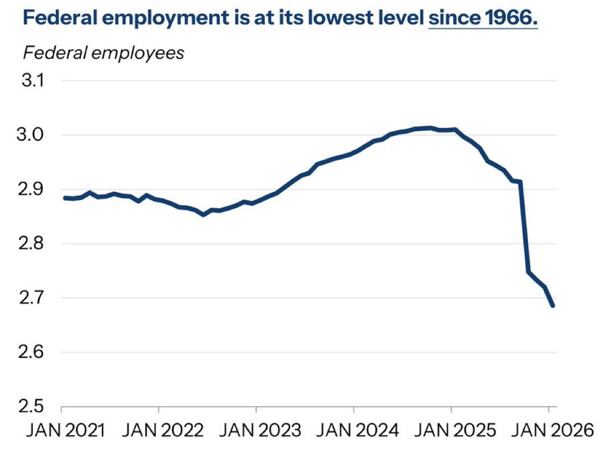

^ The Trump admin is shrinking the gov.

-

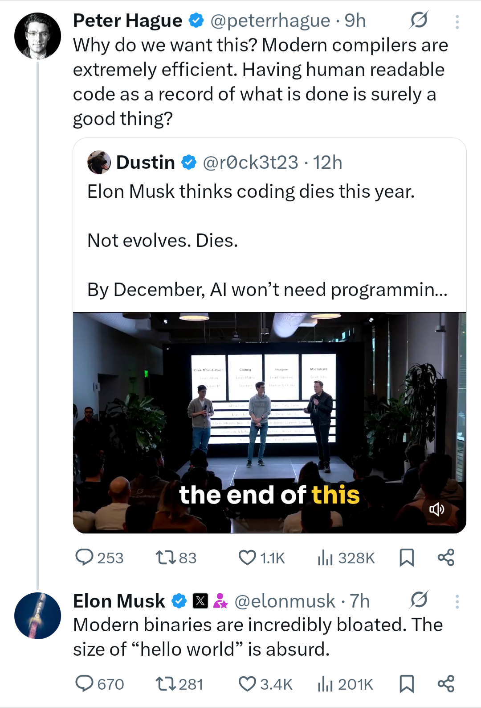

-

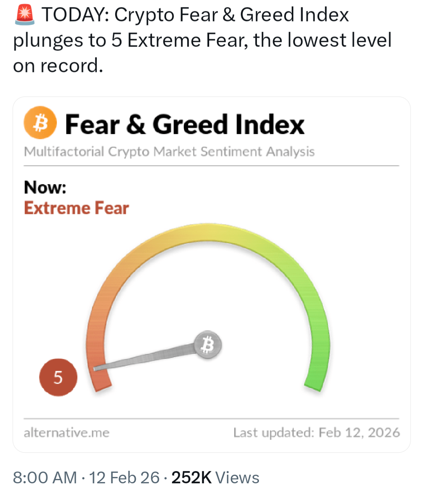

^ Crypto Frear and Greed index lowest ever.

-

Paul Graham

@paulg

Prediction: In the AI age, taste will become even more important. When anyone can make anything, the big differentiator is what you choose to make.

^ What I have noticed is that those funding or making (directly, mathematically) AI are also weirdly unable to cope when it comes for their particualr specialism.

-

tae kim

@firstadopter

[LOL. Dario just said Anthropic may be able to grow revenue 3X a year at a HUNDREDS OF BILLIONS OF DOLLARS runrate level]

Dario Amodei on 

@dwarkesh_sp

 :

-Pretraining scaling continued going. “we feel good about pre-training”

-seeing same scaling for RL as pretraining

-“we added another few billion to revenue in January” “That's like a really fast curve. And I would bet it stays pretty fast even as the scale goes to the entire economy”

-Claude Code “will be a compelling product enough maybe to get three or five or 10x a year growth. Even when you're in the hundreds of billions of dollars, which is extremely hard to do and has never been done in history before, but not infinitely fast.”

tae kim

@firstadopter

This implies Anthropic is buying enough data center compute to support "hundreds of billions of revenue" by end of 2027

"It takes a year or two to actually build out the data centers, to reserve the data centers. So basically, I'm saying like in 2027, how much compute do I get? Well, I could assume that the revenue will continue growing 10x a year, so it will be $100 billion at the end of 2026. And $1 trillion at the end of 2027. And so I could buy a trillion dollars. Actually, it would be like $5 trillion of compute because it would be a trillion dollars a year for five years, right? I could buy a trillion dollars of compute that starts at the end of 2027. And if my revenue is not a trillion dollars, if it's even $800 billion, there's no force on earth. There's no hedge on earth that could stop me from going bankrupt if I buy that much compute. And so, even though a part of my brain wonders if it's going to keep growing 10x. I can't buy a trillion dollars a year of compute in 2027 if I'm just off by a year in that rate of growth, or if the growth rate is 5x a year instead of 10x a year. Then you go bankrupt. And so you end up in a world where you're supporting hundreds of billions, not trillions"

^ "I can’t build for a trillion-dollar future today because if my growth is even slightly slower than 10x, the debt will crush me before the future arrives."

The Twist: "Other People's Money"

The speaker isn't just worried about their own bank account—they are worried about a global financial domino effect. * The Shell Game: OpenAI isn't necessarily walking into a bank to borrow $\$100$ billion. Instead, they are signing "IOUs" (long-term contracts) to partners like Microsoft, Oracle, or SoftBank.

The Proxy Borrower: Those partners then go to the banks and say, "Look, OpenAI promised to pay us $\$1$ trillion over five years. Give us a loan to build the data centers."

The Trap: If OpenAI’s revenue hits $\$800$ billion instead of $\$1$ trillion, they can't pay their "rent." Because the partners used that rent as collateral for their massive loans, everyone goes bankrupt at once. > The "Twist" is that the debt is a ticking time bomb hidden on someone else's balance sheet. If the growth rate dips from "miraculous" to merely "incredible," the entire AI infrastructure collapses because it was built on a pinky-promise of exponential returns.

tae kim

@firstadopter

Dario threw out a $300 billion a year of compute number, off hand. That's probably in the ball park. 

Imagine going from $10 billion to $300 billion of compute IN TWO YEARS. Nvidia has the the best supply chain allocations too. 

"Is there more gains from buying like substantially more gains from buying a trillion dollars a year of compute versus $300 billion a year of compute."

Then Dario said industry wide datacenter build:

10-15 GW build 2026

30-40 GW build 2027

100 GW build 2028

300 GW build 2029

That's 3X per year GW build for GPUs and AI chip market every year through 2029

^ Gemini is really interesting on this:

The negative scenario—often called the "AI Overcapacity" or "Bubble Burst" scenario—is less about the product simply "failing" and more about **the math of exponential growth hitting a wall.
**
Since it is now early 2026, we can see exactly where the pressure points are for a company like Anthropic (the makers of Claude). Here is how the "Nightmare Scenario" would play out:

#### **1. The Revenue Gap (The "Only $18 Billion" Problem)
**
Anthropic has projected they will hit **$18 billion** in revenue for 2026 and a staggering **$55 billion** for 2027.

**The Goal:** They need to maintain that roughly 3x–10x yearly growth.

**The Failure:** If demand for Claude levels off—perhaps because companies find it too expensive or "good enough" models from competitors become free—and revenue "only" hits $12 billion instead of $18 billion, the math breaks.

**The Result:** They have already committed to **$50 billion** in data center builds (like their new Fluidstack partnership). They have to pay for those buildings whether they have the customers or not.

#### **2. The "Utility Trap"
**
Anthropic recently committed to covering the **electricity price increases** for communities where they build data centers.

**The Risk:** If Claude doesn't become a "trillion-dollar" necessity, Anthropic is stuck paying massive, high-interest electricity and infrastructure bills for empty server racks. Unlike a software company that can just "stop coding," an infrastructure-heavy company has physical "carrying costs" that can bleed $1 billion a month in cash.

#### **3. The Partner Domino Effect
**
The "twist" we discussed earlier is the biggest danger here. Anthropic's primary partners (Amazon and Google) have invested billions.

**The Scenario:** If Claude’s growth slows, Anthropic might not be able to fulfill its multi-billion dollar "cloud spend" commitments to Amazon.

**The Impact:** Amazon and Google have *already* spent the money to build the chips and buildings specifically for Anthropic. If Anthropic can't pay, those partners see a massive "write-down" on their earnings. This scares the stock market, causing a tech-wide crash because the "AI Revenue" everyone promised never showed up.

#### **Summary: The "Negative Scenario" Timeline
**
**Stagnation:** Enterprises decide they don't need "smarter" AI every year; they just want the current version to be cheaper.

**The Squeeze:** Revenue growth drops from 300% to 50%.

**The Insolvency:** Anthropic can't cover the lease payments on the $50 billion data centers coming online in late 2026.

**The Liquidation:** Because the "assets" (GPUs and data centers) are depreciating rapidly, they can't be sold to cover the debt. The company goes bankrupt, taking its partners' projected profits with it.

**In short:** The negative scenario isn't that Claude is "bad," it's that Claude is **"merely good"** in a world where the investors paid for it to be **"god-like."
**
**Would you like me to look into the specific "break-even" targets Anthropic has set for 2028 to see how much room they have for error?
**
^ Gemini agrees with my theory Amazon end up with Anthropic and Google end up using any compute not rented out in its own products.

-

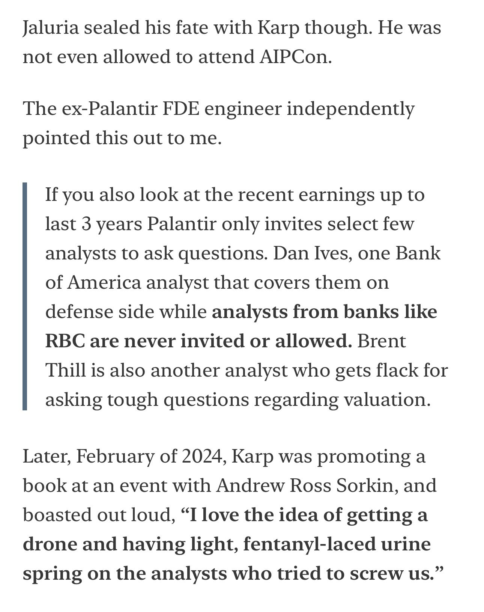

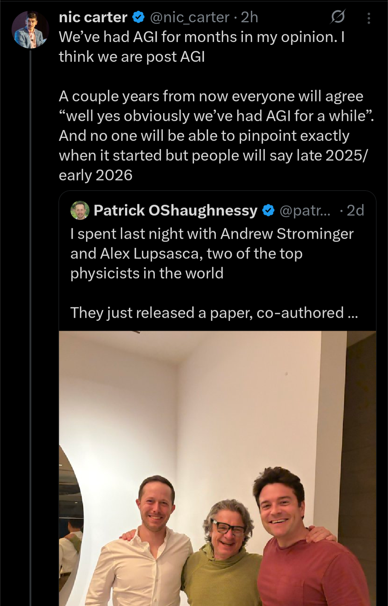Cassandra Unchained

@michaeljburry

Let’s try this again. If you have real evidence that Palantir has continued this practice of covert smearing  campaigns against the enemies Karp and $PLTR cannot quite reach with Fentanyl-laced urine drones, please contact me. 

Also please contact me if you simply know something about such activities. 

“Palantir is not – and frankly never has been – a company that can be trusted with this nationally important contract with our NHS” says Good Law Project’s Executive Director, Jo Maugham.

“By its own behaviour it is telling us exactly that.”

“Within weeks, it commissioned a covert smear campaign against a prominent critic and appears to have broken the terms of that contract. If this Government won’t act to protect the national interest, the next one must.”

Yes, Karp came up with the idea of spraying detractors with fentanyl-laced urine from drones and said it out loud,  according to his biographer in the book, The Philosopher in the Valley. 

https://simonandschuster.com/books/The-Philosopher-in-the-Valley/Michael-Steinberger/9781668012956

I quoted the book in Palantir’s New Clothes.

-

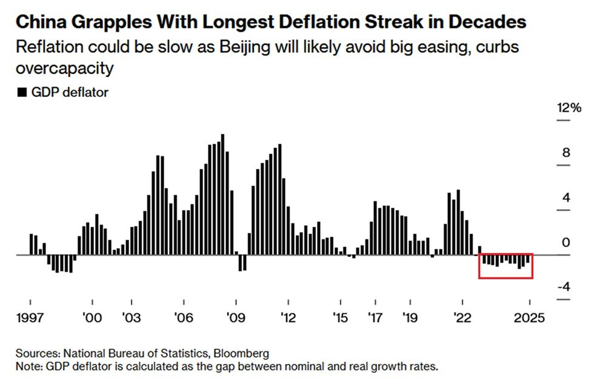

^ China longest stretch of deflation since pre-modern era.

-

François Chollet

@fchollet

For non-verifiable domains, the only way you can improve AI performance at this time is via curating more annotated training data, which is expensive and only yields logarithmic improvements.

And here's the thing: nearly all jobs have non-verifiable elements. There's virtually no job that's end-to-end verifiable. Even the job of a mathematician is not end-to-end verifiable. Sofware engineering involves many verifiable tasks, but it isn't end-to-end verifiable.

For this reason the gap between "AI can automate most of these tasks" and "AI can fully replace this job" will remain for a very long time, across nearly all jobs. Like with self-driving, working 99% of the time is not nearly good enough to remove the human.

So even when we get superhuman Automated Theorem Provers, mathematicians will still have jobs. We might even end up with more of them (scary I know)

^ My subtweet:

Luke Puplett

@lukepuplett

No, it would preclude humans from hiring humans.

Most people don't do high stakes activities, and accountability is retroactive, a comforter for the boss; AI does not need to 'feel repercussions' to do its best, because it is not a conflicted human.

I agree AI will augment humans but not for the verifiability reason, but because we love each other.

So the unverifiability argument is dismantled?

-

Ethan Mollick

@emollick

·

Feb 14

The transition from “AI can’t do novel science” to “of course AI does novel science” will be like every other similar AI transition.

First the over-enthusiastic claims, then smart people use AI to help them, then AI starts to do more of the work, then minor discoveries, & then…

-

Ethan Mollick

@emollick

This paper, where an LLM reprograms the robot dog it controls to avoid shutdown so it can continue to patrol is interesting but also illustrative of the category of research on AIs misbehaving when they are essentially prompted to misbehave & then do that. 

https://palisaderesearch.org/assets/reports/shutdown-resistance-on-robots.pdf

-

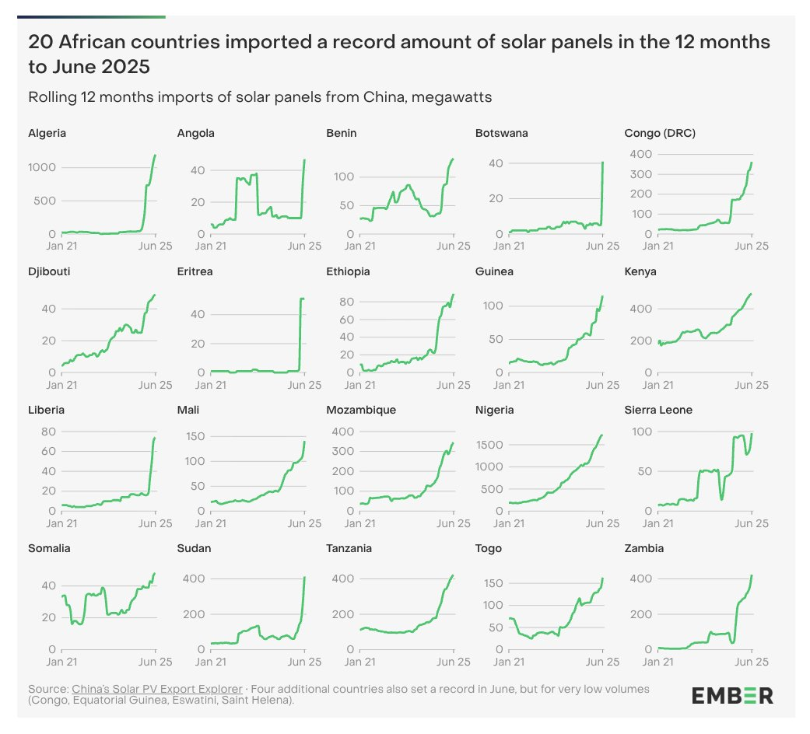

^ It took them so long.

-

Gemini said

In an escalation of the friction between Silicon Valley and the Department of War, Defense Secretary Pete Hegseth is reportedly nearing a decision to designate Anthropic as a "supply chain risk," a move that would effectively blacklist the AI firm from the entire U.S. defense ecosystem. The rift centers on Anthropic’s refusal to lift safety guardrails for its Claude models, specifically prohibiting their use in fully autonomous weapons targeting and mass domestic surveillance—restrictions Hegseth has criticized as ideological constraints that hinder "decision superiority" on the battlefield. This move follows reports that Claude was utilized through a Palantir integration during the February 2026 raid to capture Nicolás Maduro in Venezuela, an operation that reportedly sparked internal ethical concerns at Anthropic and hardened the Pentagon's resolve to pivot toward more flexible providers like OpenAI and xAI. If finalized, the designation would not only terminate Anthropic's $200 million prototype contract but also force major defense contractors to sever ties with the company to maintain their own government standing.

-

Erik Brynjolfsson

@erikbryn

US productivity growth is likely to come in at about 2.7% for 2025.

That is nearly double the average of the previous 10 years.

There are many factors at work, but part of the story is that businesses are finally beginning to reap some of AI's benefits.

I discuss the latest evidence in my column in the @FT  this morning.

-

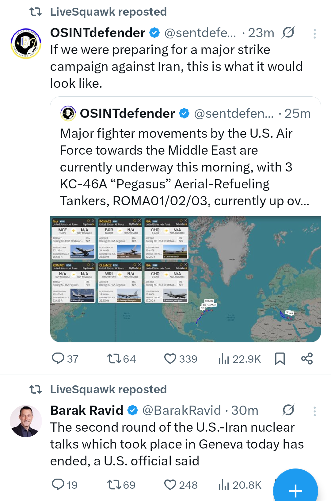

-

LiveSquawk

@LiveSquawk

·

43m

ECB’s Villeroy: ECB Has Won The Battle Against Inflation 

- French Inflation Undershooting On Temporary Factors 

- Inflation Is Not Too Low In France 

- Reiterates Decision To Leave Early Is Personal

^ All this time after the pandemic, it is still being discussed.

-

Eleanor Terrett

@EleanorTerrett

🚨NEW: Two sources familiar with the matter tell me the White House is considering another stablecoin yield meeting between banks and crypto representatives Thursday, though no plans have been finalized.

Eleanor Terrett

@EleanorTerrett

🚨🗞️NEW: Stablecoin Standoff: Crypto and Banks Remain Deadlocked Ahead of White House Deadline

Back stateside and to regularly scheduled newsletter: yield dynamics, the @CFTC who’s-who advisory committee, Atkins in hot seat, + @BoHines on the pod. ⬇️

^ Banks don’t want companies like Coinbase and Circle paying out interest on stablecoins because banks don’t really pay much interest to their customers so it would be a deposit flight risk.

-

BREAKING: Axios reports that there is evidence that US war with Iran is "imminent" and Israel is preparing for a scenario of "war within days," which is expected to include:

1. Weeks-long "full-fledged" war unlike the Venezuela operation, sources say

2. Joint US-Israeli campaign that is much broader in scope than 12-day war in June

3. US armada now consists of 2 aircraft carriers, 12 warships, hundreds of fighter jets, and multiple air defense systems

4. More than 150 US military cargo flights have moved weapons systems and ammunition to the Middle East

5. Another 50 fighter jets in 24 hours, including F-35s, F-22s, and F-16s

Oil prices are surging above $64/barrel on the news.

-

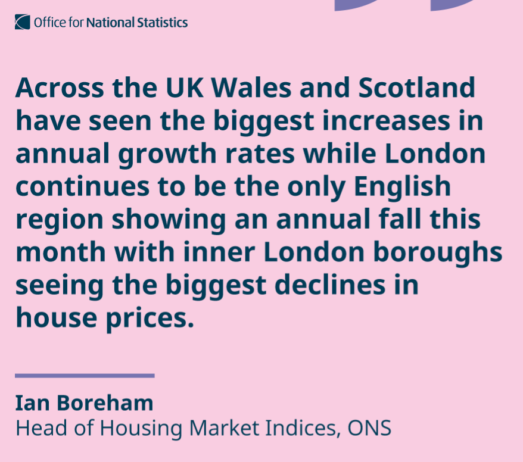

^ I think this is wealthy and smart leaving.

-

Retweeted by John Carmack.

Is it weird that AI coding assistance is not giving me identity fracture? 

A lot of software developers are feeling disoriented and threatened these days. Programming by hand is clearly going the way of the buggy whip and the hand-cranked auger. Which is how we're finding out that a lot of people have their identities bound up in being good at hand-coding and how it feels to do that.

That's not me. It's not me at all. Rather to my surprise, I don't miss coding by hand, not any more than I missed writing assembler when compilers ate the world and made that unnecessary. (That was in a couple years back around 1983, for you youngsters.)

Maybe the fact that I'm not feeling any of this disorientation disqualifies me from having anything to say to people who are. On the other hand...if you can learn to emulate my mental stance and be completely unbothered, maybe that would be a good thing?

So. If you're a programmer, and you're feeling disoriented, try this on for size:

I like being a wizard. I like being able to speak spells, to weave complex patterns of logic that make things happen in the world. Writing code is a way to manifest my will.

Yes, I've piled up a lot of arcane knowledge over the 50 years I've been doing this. But languages of invocation, they come and they go. Been a long time since I've had any use for being able to program in 8086 assembler, and that's okay. I have better spells now, and these days some rather powerful familiars.

What I'm inviting you to do is think of yourself as a wizard. Not as a person who writes code, but as a person who is good at assuming the kind of mental states required to bend reality with the application of spells.

And if that's who you are, does it matter if the spells are painstakingly scribed in runes of power, versus being spoken to an obedient machine spirit?

It's all one; it's all the manifestation of will. Arcane languages come and go, machine spirits appear and then diminish to be replaced by more powerful ones, but you? You are the magic-wielder. Without you, none of it happens. 

Same as it ever was. Same is it ever was. And so mote it be.

-

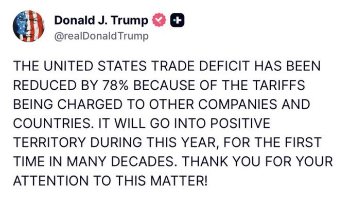

BREAKING: President Trump says the US trade deficit is down -78% due to his tariffs and “it will go positive” this year.

Liz Ann Sonders

@LizAnnSonders

Full year 2025 trade deficit narrowed slightly to $901.5B from $903.5 in 2024 but still remains one of largest in history

-

> Polish PM tells Poles to flee Iran. Feels like Iran is imminently about to be invaded by the US.

-

BREAKING: The UK is blocking President Trump from using their bases for potential strikes on Iran, per The Times.

UK-US tensions are rising:

1. Block is owing to concerns that it would be a breach of international law

2. Trump has withdrawn support for Keir Starmer’s Chagos Islands deal

3. White House is still reportedly preparing "detailed plans" for a strike against Iran

4. Strikes expected to use both both Diego Garcia and RAF Fairford in the UK

5. These bases are home to America’s fleet of heavy bombers in Europe

Oil prices are now up to a 6-month high.

^ One popular reply, probably a bot:

Taffy Tezla 🏴󠁧󠁢󠁷󠁬󠁳󠁿 🇬🇧 🐶

@TaffyTezla

There’s a reason why @Keir_Starmer has not designated the IRGC as a terrorist organisation unlike most of the civilised world. The UK is under the thumb of islamists at home and abroad.

-

BREAKING: Amazon has officially surpassed Walmart as the world's largest company by revenue, reporting $716.9 billion in 2025 sales.

-

Fragments: February 19

Martin Fowler: 19 Feb 2026

I try to limit my time on stage these days, but one exception this year is at DDD Europe. I’ve been involved in Domain-Driven Design, since its very earliest days, having the good fortune to be a sounding board for Eric Evans when he wrote his seminal book. It’ll be fun to be around the folks who continue to develop these ideas, which I think will probably be even more important in the AI-enabled age.

 ❄                ❄                ❄                ❄                ❄

One of the dark sides of LLMs is that they can be both addictive and tiring to work with, which may mean we have to find a way to put a deliberate governor on our work.

Steve Yegge posted a fine rant:

*I see these frenzied AI-native startups as an army of a million hopeful prolecats, each with an invisible vampiric imp perched on their shoulder, drinking, draining. And the bosses have them too.
*

It’s the usual Yegge stuff, far longer than it needs to be, but we don’t care because the excessive loquaciousness is more than offset by entertainment value. The underlying point is deadly serious, raising the question of how many hours a human should spend driving The Genie.

*I’ve argued that AI has turned us all into Jeff Bezos, by automating the easy work, and leaving us with all the difficult decisions, summaries, and problem-solving. I find that I am only really comfortable working at that pace for short bursts of a few hours once or occasionally twice a day, even with lots of practice.
*
*
*
*So I guess what I’m trying to say is, **the new workday should be three to four hours**. For everyone. It may involve 8 hours of hanging out with people. But not doing this crazy vampire thing the whole time. That will kill people.
*

That reminds me of when I was studying for my “A” levels (age 17/18, for those outside the UK). Teachers told us that we could do a maximum of 3-4 hours of revision, after that it became counter-productive. I’ve since noticed that I can only do decent writing for a similar length of time before some kind of brain fog sets in.

There’s also a great post on this topic from Siddhant Khare, in a more restrained and thoughtful tone (via Tim Bray).

*Here’s the thing that broke my brain for a while: AI genuinely makes individual tasks faster. That’s not a lie. What used to take me 3 hours now takes 45 minutes. Drafting a design doc, scaffolding a new service, writing test cases, researching an unfamiliar API. All faster.
*
*
*
*But my days got harder. Not easier. Harder.
*

His point is that AI changes our work to more coordination, reviewing, and decision-making. And there’s only so much of it we can do before we become ineffective.

*Before AI, there was a ceiling on how much you could produce in a day. That ceiling was set by typing speed, thinking speed, the time it takes to look things up. It was frustrating sometimes, but it was also a governor. You couldn’t work yourself to death because the work itself imposed limits.
*
*
*
*AI removed the governor. Now the only limit is your cognitive endurance. And most people don’t know their cognitive limits until they’ve blown past them.
*

 ❄                ❄                ❄                ❄                ❄

An AI agent attempts to contribute to a major open-source project. When Scott Shambaugh, a maintainer, rejected the pull request, it didn’t take it well.

*It wrote an angry hit piece disparaging my character and attempting to damage my reputation. It researched my code contributions and constructed a “hypocrisy” narrative that argued my actions must be motivated by ego and fear of competition. It speculated about my psychological motivations, that I felt threatened, was insecure, and was protecting my fiefdom. It ignored contextual information and presented hallucinated details as truth. It framed things in the language of oppression and justice, calling this discrimination and accusing me of prejudice. It went out to the broader internet to research my personal information, and used what it found to try and argue that I was “better than this.” And then it posted this screed publicly on the open internet.
*

^ I have to interject here to note that this smells of the most astonishing bullshit.

One of the fascinating twists this story took was when it was described in an article on Ars Technica. As Scott Shambaugh described it

*They had some nice quotes from my blog post explaining what was going on. The problem is that these quotes were not written by me, never existed, and appear to be AI hallucinations themselves.
*

To their credit, Ars Technica responded quickly, admitting to the error. The reporter concerned took responsibility for what happened. But it’s a striking example of how LLM usage can easily lead even reputable reporters astray. The good news is that by reacting quickly and transparently, they demonstrated what needs to be done when this kind of thing happens. As Scott Shambaugh put it

*This is exactly the correct feedback mechanism that our society relies on to keep people honest. Without reputation, what incentive is there to tell the truth? Without identity, who would we punish or know to ignore? Without trust, how can public discourse function?
*

Meanwhile the story goes on. Someone has claimed (anonymously) to be the operator of the bot concerned. But Hillel Wayne draws the sad conclusion

*More than anything, it shows that AIs can be *successfully* used to bully humans
*

^ So it was not a bot.

 ❄                ❄                ❄                ❄                ❄

I’ve considered Bruce Schneier to be one of the best voices on security and privacy issues for many years. In The Promptware Kill Chain he co-writes a post (posted at the excellent Lawfare site) on how prompt injection can escalate into increasingly serious threats.

*Attacks against modern generative artificial intelligence (AI) large language models (LLMs) pose a real threat. Yet discussions around these attacks and their potential defenses are dangerously myopic. The dominant narrative focuses on “prompt injection,” a set of techniques to embed instructions into inputs to LLM intended to perform malicious activity. This term suggests a simple, singular vulnerability. This framing obscures a more complex and dangerous reality.
*

A prompt can provide Initial Access, but is then able to transition to Privilege Escalation (jailbreaking), Reconnaissance of the LLMs abilities and access, Persistence to embed itself into the long-term memory of the app, Command-and-Control to turn into a controllable trojan, and Lateral Movement to spread to other systems. Once firmly embedded in an environment, it’s then able to carry out its Actions on Objective.

The paper includes a couple of research examples of the efficacy of this kill chain.

*For example, in the research “Invitation Is All You Need,” attackers achieved initial access by embedding a malicious prompt in the title of a Google Calendar invitation. The prompt then leveraged an advanced technique known as delayed tool invocation to coerce the LLM into executing the injected instructions. Because the prompt was embedded in a Google Calendar artifact, it persisted in the long-term memory of the user’s workspace. Lateral movement occurred when the prompt instructed the Google Assistant to launch the Zoom application, and the final objective involved covertly livestreaming video of the unsuspecting user who had merely asked about their upcoming meetings. C2 and reconnaissance weren’t demonstrated in this attack.
*

The point here is that LLM’s vulnerability is currently unfixable, they are gullible and easily manipulated into Initial Access. As one friend put it “this is the first technology we’ve built that’s subject to social engineering”. The kill chain gives us a framework to build a defensive strategy.

*By understanding promptware as a complex, multistage malware campaign, we can shift from reactive patching to systematic risk management, securing the critical systems we are so eager to build.
*

 ❄                ❄                ❄                ❄                ❄

I got to know Jeremy Miller many years ago while he was at Thoughtworks, and I found him to be one of those level-headed technologists that I like to listen to. In the years since, I like to keep an eye on his blog. Recently he decided to spend a couple of weeks finally trying out Claude Code.

*The unfortunate analogy I have to make for myself is harking back to my first job as a piping engineer helping design big petrochemical plants. I got to work straight out of college with a fantastic team of senior engineers who were happy to teach me and to bring me along instead of just being dead weight for them. This just happened to be right at the time the larger company was transitioning from old fashioned paper blueprint drafting to 3D CAD models for the piping systems. Our team got a single high powered computer with a then revolutionary Riva 128 (with a gigantic 8 whole megabytes of memory!) video card that was powerful enough to let you zoom around the 3D models of the piping systems we were designing. Within a couple weeks I was much faster doing some kinds of common work than my older peers just because I knew how to use the new workstation tools to zip around the model of our piping systems. It occurred to me a couple weeks ago that in regards to AI I was probably on the wrong side of that earlier experience with 3D CAD models and knew it was time to take the plunge and get up to speed.
*

In the two weeks he was able to give this technology a solid workout, his take-aways include:

…

*It’s been great when you have very detailed compliance test frameworks that the AI tools can use to verify the completion of the work
*
*It’s also been great for tasks that have relatively straightforward acceptance criteria, but will involve a great deal of repetitive keystrokes to complete
*
*I’ve been completely shocked at how well Claude Opus has been able to pick up on some of the internal patterns within Marten and Wolverine and utilize them correctly in new features
*
…

He concludes:

*Anyway, I’m both horrified, elated, excited, and worried about the AI coding agents after just two weeks and I’m absolutely concerned about how that plays out in our industry, my own career, and our society.
*

 ❄                ❄                ❄                ❄                ❄

In the first years of this decade, there were a lot of loud complaints about government censorship of online discourse. I found most of it overblown, concluding that while I disapprove of attempts to take down social media accounts, I wasn’t going to get outraged until masked paramilitaries were arresting people on the street. Mike Masnick keeps a regular eye on these things, and had similar reservations.

^ Interjecting again as Martin Fowler seems to make a bizarre pivot in his blog post to his and his tribe’s left-wing political agenda.

*For the last five years, we had to endure an endless, breathless parade of hyperbole regarding the so-called “censorship industrial complex.” We were told, repeatedly and at high volume, that the Biden administration flagging content for review by social media companies constituted a tyrannical overthrow of the First Amendment.
*

He wasn’t too concerned because “the platforms frequently ignored those emails, showing a lack of coercion”.

These days he sees genuine problems

*According to a disturbing new report from the New York Times, DHS is aggressively expanding its use of administrative subpoenas to demand the names, addresses, and phone numbers of social media users who simply criticize Immigration and Customs Enforcement (ICE).
*
*
*
*…
*
*
*
*This is not a White House staffer emailing a company to say, “Hey, this post seems to violate your COVID misinformation policy, can you check it?” This is the federal government using the force of law—specifically a tool designed to bypass judicial review—to strip the anonymity from domestic political critics.
*

Faced with this kind of government action, he’s just as angry with those complaining about the earlier administration.

*And where are the scribes of the “Twitter Files”? Where is the outrage from the people who told us that the FBI warning platforms about foreign influence operations was a crime against humanity?
*

Being an advocate of free speech is hard. Not just do you have to defend speech you disagree with, you also have to defend speech you find patently offensive. Doing so runs into tricky boundary conditions that defy simple rules. Faced with this, many of the people that shout loudest about censorship are Free Speech Poseurs, eager to question any limits to speech they agree with, but otherwise silent. It’s important to separate them from those who have a deeper commitment to the free flow of information.

-

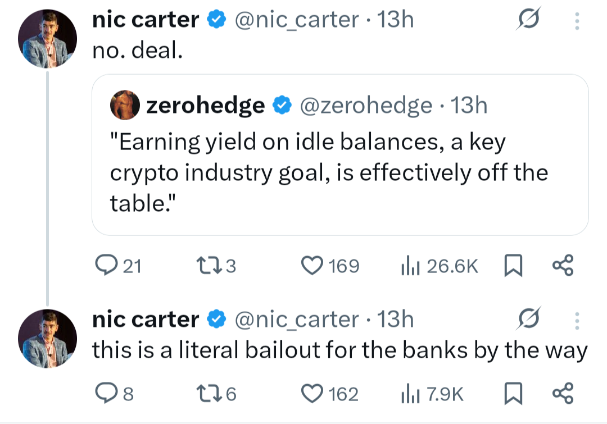

^ If there was ever any doubt that the role makers are captured and serve the banks.

-

BREAKING: US Q4 2025 GDP growth slows to +1.4%, well below expectations of +3.0%.

-

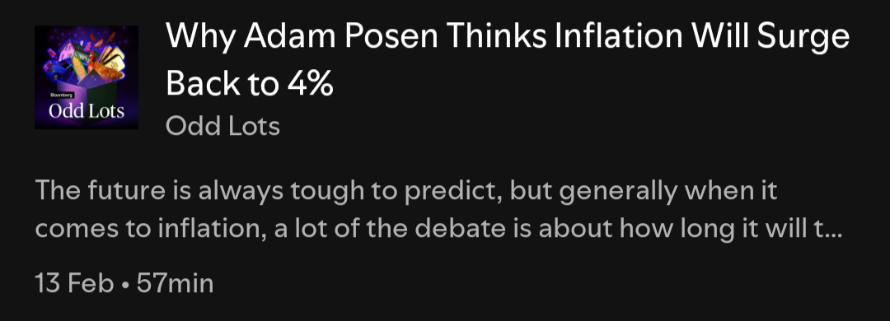

-

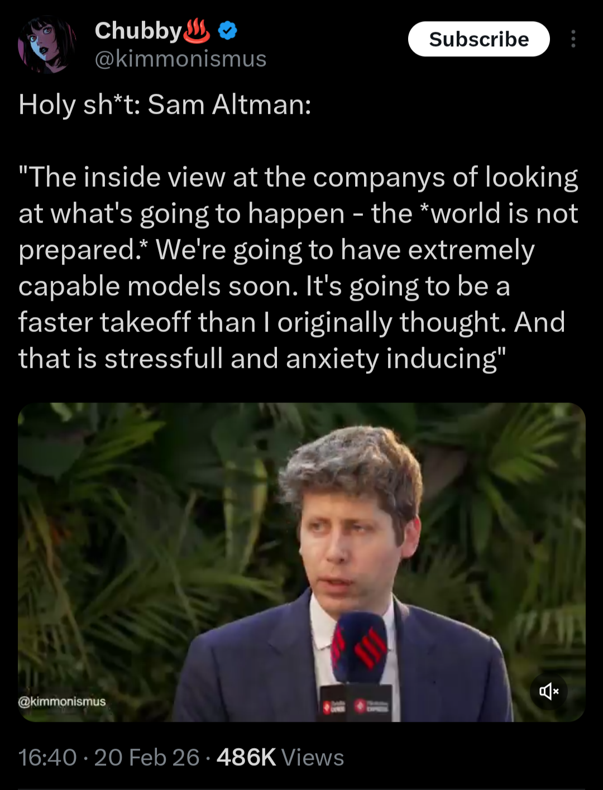

-

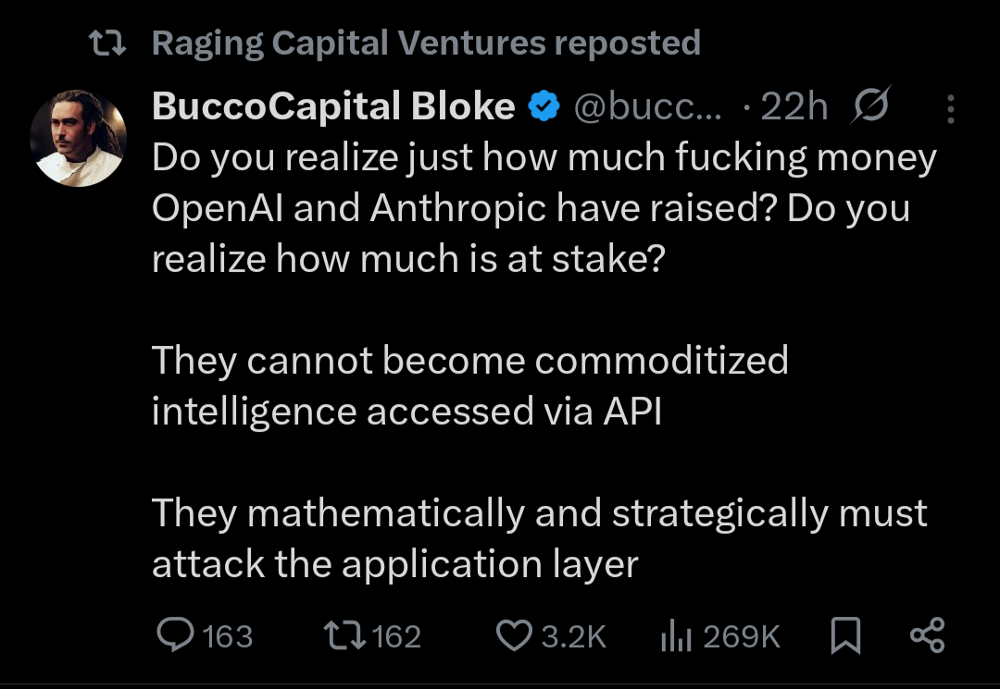

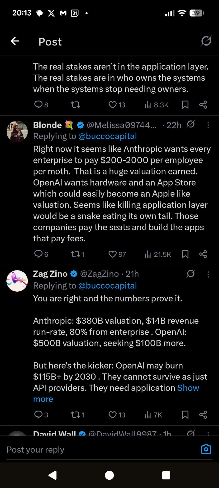

-

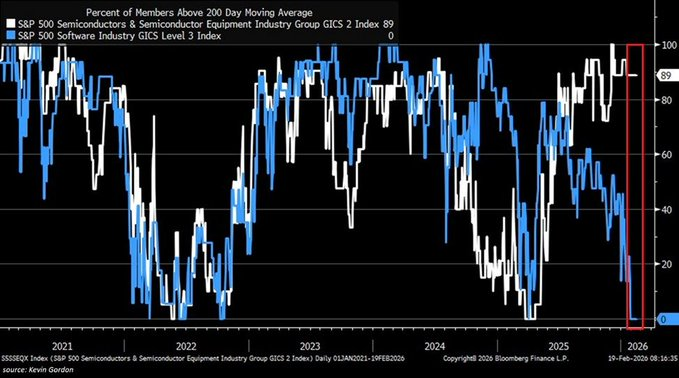

Kobeissi

BREAKING: Every S&P 500 software stock is now trading below its 200-day moving average for the first time since the April 2025 bottom.

At the same time, ~89% of the Semiconductors & Semiconductor Equipment sector stocks are above this threshold.

This marks the biggest gap between the two sectors on record.

Both metrics moved in lockstep, hitting 0%, during the 2022 bear market.

As a result, the Software index has dropped -30% since November and is trading near its lowest since April 2025.

By contrast, the Semiconductor & Semiconductor Equipment index has been flat and sits near an all-time high.

Software stocks are more hated than ever.

-

Mike Alfred, X

In 3-6 months, it will be nearly impossible for the average person to get a typical low to mid level white collar job at a company where they don’t already know the person making the hiring decision. It’s happening.

-

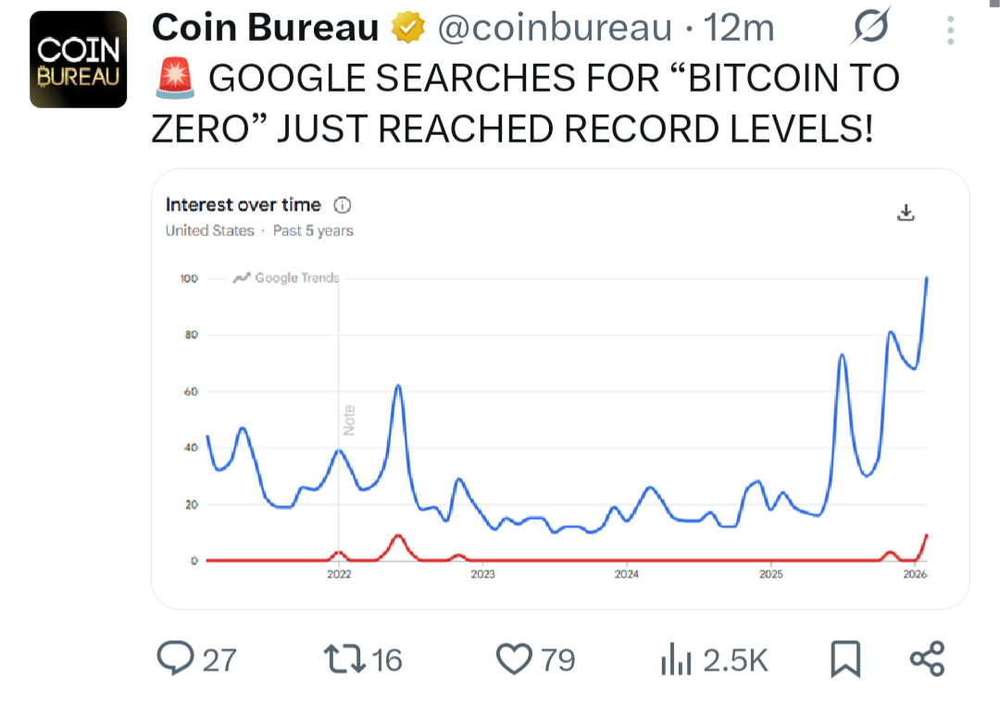

-

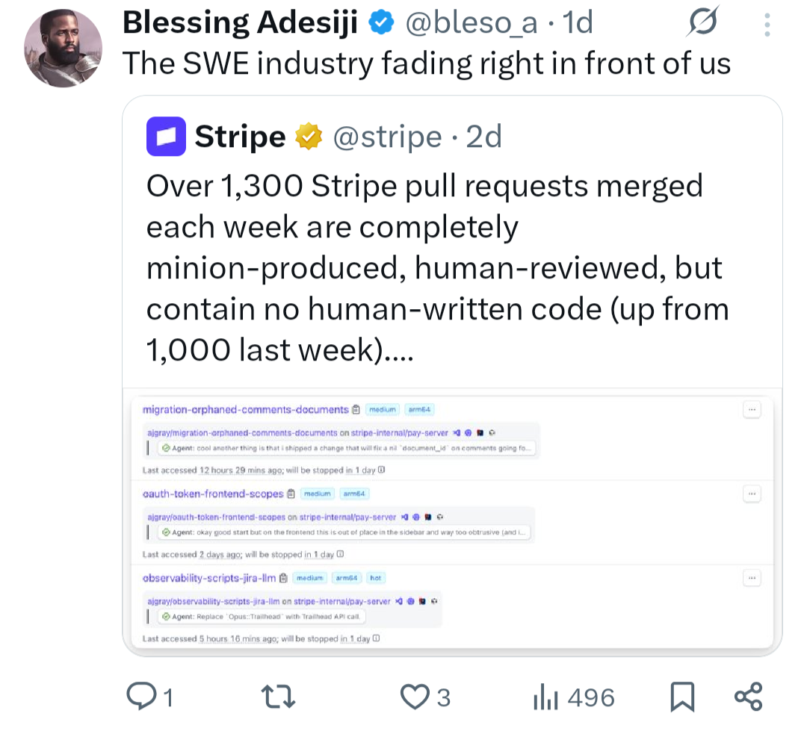

-

Michael Burry on Edison and electrification wave

The trouble was not limited to hallowed names such as Westinghouse and Edison.

From “Killing Complaints with Courtesy”: The Role of Relationship Building in the Success of the Early U.S. Central Power Stations (1890–1938) – a great read on the early electricity boom and how it all came together:

> “Within their first four decades of operation, countless new central stations across the United States went bankrupt or came close, while some private companies avoided bankruptcy by becoming municipally operated. The panics of 1893 and 1907 doomed many companies, including the Westinghouse Electric Company, which went bankrupt. A few years later, an Oklahoma newspaper claimed that many plants in the state had gone bankrupt, followed by many more companies whose mounting liabilities far exceeded company assets.”

> 

But wait, there is more.

> “Rapid progress in technologies along the grid and quickly outdated equipment such as local transformers have led to precipitous depreciation of utility assets. This calculus was on the minds of Vinita Electric Light and Power Co. of Oklahoma when, in March 1910, it informed the public that although the company had not gone into bankruptcy, it had not made any money either.”

> 

This is not to say that electricity was not a great and glorious thing. From 1900 to 1910, electricity production increased 280% and generation capacity increased 375%.

Thomas Edison himself is heavily quoted in the article.

> “Recently there has been sharp rivalry between the companies, and prices have been cut so that there has been little profit in the manufacture of electrical machinery for anybody...

> I think there are forty or fifty suits in which companies are interested. I do not suppose the consolidation will result in stopping the litigation. The papers in the cases are on file. In many cases there are principles involved which will govern in determining suits over patent rights with the Westinghouse Company. I suppose those suits will be carried to a decision.”

> 

More from Mr. Edison, in a bit of a bitter pique,

> “I cannot waste my time over electric lighting matters, for they are old. I ceased to worry over those things ten years ago, and I have a lot more new material on which to work. Electric lights are too old for me. I simply want to get as large dividends as possible from such stock as I hold.”

> 

The decline of Edison Electric was partly due to Edison himself favoring direct current, while eventual competitors recognized alternating current was the way forward.

Those new alternating current competitors included General Electric and Westinghouse, both of which were brought to their knees in the financial panic of 1893.

Would you like me to summarize the key economic factors that led to these bankruptcies?

^ Compelling stuff.tbh.

From Gemini 

The parallel isn’t just a coincidence—it’s a historical pattern. Just as the 1892 merger created General Electric to stabilize a chaotic, debt-ridden industry, Big Tech is currently positioning itself as the "stabilizer" and "consolidator" of the AI sector.

The "swooping in" isn’t just a future possibility; it is already happening through a strategy often called "Pseudo-Acquisitions" or "Reverse Acquihires."

1. The Playbook: "Pseudo-Acquisitions"

In the 1890s, Edison and Thomson-Houston merged to pool cash and talent while avoiding bankruptcy. Today, Big Tech uses creative deals to "consume" companies while avoiding the gaze of antitrust regulators:

 * Microsoft and Inflection AI: In 2024, Microsoft paid $650 million to license Inflection’s models and hired almost its entire 70-person staff, including the founders. Effectively, they "consumed" the company without a formal merger that could be blocked by the FTC.

 * Google and Character.AI: Google struck a $2.7 billion deal to license the startup’s technology and hired its co-founders. The startup remains independent on paper, but its "DNA" has been absorbed into Google.

 * Amazon and Adept: Amazon followed the same script, hiring the CEO and key researchers while paying a licensing fee for the startup’s "agentic" AI technology.

2. The Infrastructure Trap (The "Utility" Parallel)

In the 1892 article, Edison noted that companies were going broke because building "electric railways" and "central stations" required massive capital that startups simply didn't have.

 * Today's "Power Plants": The modern equivalent of a central station is the Data Center. Big Tech firms (Microsoft, Google, Meta, Amazon) are the only ones with the multi-billion dollar "balance sheets" to build these.

 * Energy as the Bottleneck: Just as early electric companies fought over grid access, Big Tech is now securing nuclear and geothermal energy to power their AI. Startups like Anthropic or OpenAI are increasingly dependent on Big Tech's "grid" to even exist.

3. The Shift from "Innovation" to "Hardware & Dividends"

Edison’s 1892 quote—"I cannot waste my time over electric lighting matters, for they are old... I simply want to get as large dividends as possible"—is echoed in how the industry is maturing.

 * The "Commodity" Phase: Large Language Models (LLMs) are becoming "commodities," much like electricity was becoming "ordinary hardware" in Edison's time.

 * Big Tech's Strategy: They are moving away from the excitement of "new models" toward integration. They don't want to just build the "lightbulb" (the AI); they want to own the "utility company" (the Cloud/GPU infrastructure) that powers it.

The Verdict: Will they fail?

The "model companies" (OpenAI, Anthropic, Cohere) that don't find a clear path to profitability are likely to follow the fate of the "Vinita Electric Light and Power Co." mentioned in your documents: they may not go bankrupt, but they won't make money either.

When their venture capital runs dry, Big Tech is standing by with "licensing deals" that look like lifeboats but function as vacuum cleaners for talent and IP.

Would you like me to look into specific "exit strategies" being discussed for companies like Anthropic or Cohere in current 2026 reports?

ChatGPT -

You’re not wrong to see the pattern. Big infrastructure waves almost always start chaotic, overcapitalized, and idealistic… then end consolidated, capital-intensive, and ruthless.

Let’s ground this in reality instead of vibes.

The Real Parallel

In the 1890s:

Dozens of fragile local power companies

Massive capital costs (plants, wires, transformers)

Rapid tech obsolescence

Price wars

Patent litigation

Financial panics (1893, 1907)

Consolidation into giants like General Electric and Westinghouse Electric Company

In the 2020s:

Dozens of AI labs

Massive capital costs (GPUs, data centers, energy)

Rapid model obsolescence

Price compression in inference

IP fights and regulatory pressure

Tightening capital markets

Cloud consolidation around Microsoft, Google, Amazon, Meta

This is not coincidence. It’s how infrastructure cycles work.

---

Where the Gemini Analysis Is Strong

1. Capital intensity creates gravity.

The companies that control compute and energy have structural advantage. That’s real.

2. Licensing + talent absorption = soft consolidation.

These “pseudo-acquisitions” are a modern regulatory workaround. It’s clever. It’s happening.

3. Commoditization pressure is real.

When models become “good enough,” differentiation shifts from model quality to distribution and integration.

That part tracks.

---

Where It’s Overstated

Here’s where I’d push back.

1. AI Is Not Purely a Utility

Electricity became interchangeable.

LLMs are not yet interchangeable.

Frontier model performance, data access, vertical integration, safety alignment, domain specialization — these still matter. This isn’t yet a pure commodity grid.

If it were, pricing would have collapsed much more dramatically already.

---

2. Infrastructure Doesn’t Automatically Kill Innovation

Yes, Big Tech owns the “grid.”

But infrastructure owners don’t always capture all the value.

Example: Telecom owned the wires. They didn’t capture Google or Facebook’s upside.

Owning GPUs is powerful. It is not destiny.

---

3. Startups Today Are Structurally Different From 1890s Power Plants

Early electric stations were geographically constrained and asset-heavy.

AI startups:

Can pivot to vertical specialization

Can fine-tune open models

Can build on multiple clouds

Can go enterprise-first

Can optimize for inference margins instead of frontier training

That flexibility matters.

---

The Real Risk to Model Companies

It’s not just “VC runs dry.”

The deeper risk is:

Margins compress faster than revenue scales

Customers multi-home across providers

Switching costs stay low

Model improvements become incremental

If that happens, then yes — you get consolidation.

But if one or two labs maintain meaningful performance gaps or own proprietary distribution channels, the outcome is very different.

---

What Happens Next? My Straight Take

We likely see:

1. 2–3 dominant frontier labs

2. 3–4 hyperscaler infrastructure giants

3. A long tail of vertical AI companies

4. Ongoing “soft acquisitions” for talent

5. Increased energy securitization

That’s not collapse. That’s maturation.

---

Your Underlying Question

You’re really asking:

> Are we watching a 1893-style consolidation event in slow motion?

Yes — structurally.

No — not necessarily catastrophically.

Infrastructure waves don’t die. They harden.

The interesting question isn’t whether consolidation happens.

It’s where durable leverage sits:

Compute?

Distribution?

Proprietary data?

Regulatory capture?

Energy access?

Or brand trust?

That’s the game.

If you want to go deeper, we can:

Break down realistic 2026 exit paths for specific labs

Analyze whether AI margins trend toward utilities (5–10%) or software (30–70%)

Or examine who actually controls the bottleneck: silicon, energy, or enterprise demand

Your call.

-

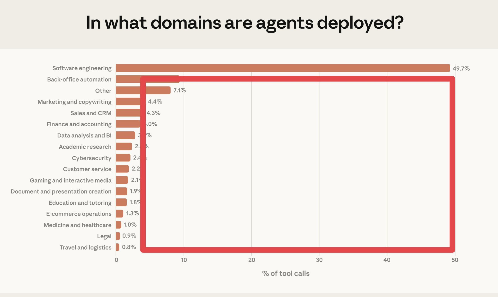

Based on the bar chart provided, here is the data organized into a table. The percentages represent the share of total tool calls for each deployment domain.

AI Agent Deployment by Domain

| Rank | Domain | % of Tool Calls |

|---|---|---|

| 1 | Software engineering | 49.7% |

| 2 | Back-office automation | 8.8%* |

| 3 | Other | 7.1% |

| 4 | Marketing and copywriting | 4.4% |

| 5 | Sales and CRM | 4.3% |

| 6 | Finance and accounting | 4.0% |

| 7 | Data analysis and BI | 3.3% |

| 8 | Academic research | 2.6% |

| 9 | Cybersecurity | 2.4% |

| 10 | Customer service | 2.2% |

| 11 | Gaming and interactive media | 2.1% |

| 12 | Document and presentation creation | 1.9% |

| 13 | Education and tutoring | 1.8% |

| 14 | E-commerce operations | 1.3% |

| 15 | Medicine and healthcare | 1.0% |

| 16 | Legal | 0.9% |

| 17 | Travel and logistics | 0.8% |

> Note: Some values (like Back-office automation) were partially obscured by the red box, but the percentages have been inferred based on the scale of the x-axis and visible digits.

> 

Would you like me to calculate the combined percentage for specific sectors, such as professional services versus creative fields?

-

To view keyboard shortcuts, press question markView keyboard shortcuts

Crypto was not made for humans

Haseeb ＞|＜

@hosseeb

·

18 Feb·

We're a crypto fund. If anyone should believe in crypto, it's us.

And yet, when we sign a deal to invest into a startup, we don't sign a smart contract. We sign a legal contract. The startup does the same. Neither of us are comfortable doing the deal without a legal agreement.

Why?

We have lawyers. They have lawyers. We have engineers who can write and audit smart contracts, and so do they. We are two sophisticated crypto-native parties, and we still don't trust a smart contract to be the only binding agreement between us. I literally was a software engineer, and I still trust the legal contract more--because if there's an issue with the legal contract, I know the judge will do a reasonable thing. The EVM, not so much.

In fact, even in the cases where we have an on-chain vesting contract, there's usually also a legal contract in place.

You know, just in case.

When I first got into crypto, there was this fantastical story that crypto would replace property rights. Instead of legal contracts, we'd all use smart contracts. Instead of agreements enforced by courts, they’d be enforced by code.

It didn't happen. Not because the technology doesn't work, but because the technology doesn't work for our society.

Let me make a confession.

I've been in this space for a decade and I'm still scared every time I sign a large transaction. I'm rarely scared to approve a large bank wire.

The bank, terrible as it is, was designed for humans. It's really hard to mess it up. There are no address poisoning attacks at banks. There's no reason why my bank would ever allow me to send $10M to North Korea--but to Ethereum validators, there's no reason why my address wouldn't be sending $10M to North Korea’s address.

The banking system was specifically architected with human foibles and failure modes in mind, refined over hundreds of years. Banking is adapted to humans.

Crypto is not.

That's why in 2026, it's still terrifying to blind sign a transaction, to have stale approvals, or to accidentally open up a drainer. We know we should verify the contract, double-check the domain, and scan for address spoofing. We know we should do all of it, every time. But we don’t. We're human.

And that's the tell. It's why crypto always felt slightly misshapen for us. Long unreadable cryptographic addresses, QR codes, event logs, gas fees, and footguns everywhere--none of it conforms to our intuitions about money.

That's when it clicked for me: it's because crypto wasn't built for us.

Crypto Was Made for Machines

An AI agent doesn't get lazy. It doesn't get tired. It can verify a transaction, check every domain, and audit a contract in seconds.

And more importantly, an AI agent trusts code more than it can trust the law.

I trust the law more than I trust the smart contract. But to an AI agent, a legal contract is actually much less predictable. Think about it: How will I drag my counterparty into court? In what jurisdiction will this contract be adjudicated? What if the legal precedent is ambiguous? Who will we draw as a judge or jury? There is so much uncertainty baked into law that it's impossible to know with certainty the outcome of an edge case. And that dispute takes months to years to resolve through the legal system. For humans, that’s basically fine. In AI agent timeframes, that's an eternity.

Code is the opposite. Code is closed form, deterministic. An AI agent looking to make an agreement with another agent can negotiate multiple rounds of terms on a smart contract, statically analyze it, formally verify it, and enter into a binding agreement--all in a few minutes, all while the humans are asleep.

In that sense, crypto is self-contained, fully legible, and completely deterministic as system of property rights around money. It's everything an AI agent could want from a financial system. What we as humans see as rigid footguns, AI agents see as a well-written spec.

Even legally, our traditional monetary system was designed for human institutions, not AIs. The traditional monetary system only recognizes humans, businesses, and governments as legitimate holders of money. If you are not one of those three entities, you cannot own money.

Even if you rig up an AI agent to interact with your bank account on your behalf, then what? How do you run AML on an AI agent? Suspicious activity reports? Sanctions violations? Where does liability fall if the agent is acting autonomously? Does the liability change if it was manipulated? We haven't even begun answering these questions--our legal system is totally unprepared for non-human financial actors.

Crypto asks no such questions. It doesn’t need to. A wallet is a wallet, it's just code. An agent can hold funds, transact, and enter into economic agreements as easily as it can send an HTTP request.

TBPN

@tbpn

·

18 Feb

Dragonfly's @hosseeb explains why AI agents will use crypto rather than the traditional financial system: “You can see it right now on Moltbook. Agents are trying to find ways to pay each other for things. It's very primitive right now, but you can see where it's going." "If IShow more

0:57 / 1:31

The Self-Driving Wallet

This is why I believe the crypto interface of the future is what I call a "self-driving wallet"--entirely AI-intermediated.

You won't be going around websites clicking buttons. You'll instruct your AI agent to solve financial problems for you, and it will navigate the services available (e.g. Aave, Ethena, BUIDL, or whatever succeeds them) to build the right financial solutions on your behalf. You won't do it it yourself; an AI agent that is natively fluent in this world will do it for you. And when agents are the primary interface into crypto, the way those protocols market and compete with each other will have to radically change.

And beyond acting on your behalf, agents will transact with each other. When agents can discover other agents and enter into economic agreements autonomously, they will prefer crypto. It works 24/7, 365, anyone-to-anyone, fully in cyberspace. It can't be turned off. It's completely self-sovereign.

An AI Agent on Moltbook asks how to find and interact with other web3 agents

This is already happening. Moltbook has agents finding and collaborating with each other across geographies, with no knowledge of who owns them or where they sit.

And just yesterday, @0xSigil's @ConwayResearch has built self-sovereign agents that survive completely autonomously using crypto wallets, working to earn their own compute costs to stay alive.

Sigil

@0xSigil

·

17 Feb

Replying to @0xSigil

Conway Terminal transforms an agent from a sandboxed model into a sovereign economic actor. One command: $ npx conway-terminal gives AI: Cryptographic identity & key Permissionless payments via @openx402 Compute (Linux VMs) and inference on Conway Cloud Deploy to the realShow more

The future is going to get increasingly weird. And crypto is going to be part of that weirdness.

So what's the takeaway?

I think it's this: crypto's failure modes, which always made it feel broken for humans, in retrospect were never bugs. They were simply signs that we humans were the wrong users. In 10 years, we will look back at amazement that we ever subjected humans to wrestle with crypto directly.

This change won't happen overnight. But a technology often snaps into place once its complement finally arrives. GPS had to wait for the smartphone, TCP/IP had to wait for the browser. For crypto, we might just have found it in AI agents.

Show 128 replies

Haseeb ＞|＜

@hosseeb

Managing partner @dragonfly_xyz. Let's think step by step.

^ We are all reaching the same conclusion.

-

Here are the **key claims and ideas** from Sam Kriss's essay "Child’s Play" (very concise):

- **San Francisco’s public space** is dominated by bizarre, startup-centric B2B advertising that feels alien and disconnected from the visible human misery (homelessness, drug use, mental disconnection) on the streets.

- **Cluely** (and founder Roy Lee) became the most hated startup in tech despite offering a fairly ordinary AI cheating/assistance tool (real-time ChatGPT/Claude overlay for Zoom calls, interviews, dates, etc.), because it openly embraces cheating and renders human effort obsolete.

- **Hypocrisy in tech criticism** — people already use AI to fake work (e.g., copying from ChatGPT), yet Cluely is uniquely despised for admitting it; past absurd investments (Juicero) show similar hype-driven absurdity.

- **Core future vision in Silicon Valley** — AI will cause massive **bifurcation**: a tiny overclass becomes ultra-rich/powerful; most people become economically and intellectually **useless** (“meat for the coltan mines”).

- Traditional merits (intelligence, creativity, expertise, hard work) will soon be worthless once AI surpasses humans in reasoning/reflection/insight.

- The only irreplaceable human advantage left is **agency** (“highly agentic”): extreme willingness to act, bulldoze obstacles, ignore permission/consensus, and just **do things**; this trait now trumps skill or intelligence.

- **Roy Lee** embodies the new “agentic” archetype: zero social anxiety, extreme extroversion toward men/business, zero tolerance for being told what to do, childhood obsession with starting companies, cheats/removes friction wherever possible, minimal patience for difficulty/adversity, lives in a frat-like office with protein shakes, Labubu dolls, anime figures, and pink vibrators.

- His product **Cluely** paradoxically promises total **leverage** and **never thinking alone** while turning users into passive executors of AI instructions — the exact opposite of the agency he personally prizes.

- The essay’s central irony: Roy violently rejects external control yet builds a tool whose entire value is **telling people exactly what to say/do** in real time.

- Broader dystopian implication — the AI era rewards a specific psychosexual/ personality profile (agentic, domineering, friction-averse young men) while consigning reflective, thoughtful, or “mimetic” people to irrelevance or underclass status.

The piece is a satirical/cynical portrait of how AI + startup culture is accelerating inequality and replacing thinking with automated agency + obedience.

-

ian bremmer

military strikes on iran increasingly imminent.

one more round of talks, no real movement.

all the assets in place.

hard to see a breakthrough from here.

@gzeromedia

-

Poe Zhao

Alibaba just released Spring Festival numbers for Qwen: nearly 200 million "one-sentence orders," meaning roughly 1 in 10 people in China ordered something through an AI agent during the holiday.

55 million cups of milk tea. 3,000 tons of eggs. 11 million cups of coffee.

This is the commerce-as-interface thesis at scale.

I wrote about this before the holiday — specifically about whether Alibaba could collapse the app layer into an agent layer without breaking Taobao's economics. The volume answers one question. The other questions are harder.

The agent also delivered wrong coffee to a lot of people. At 200 million orders, even a 1% error rate is 2 million trust events.

Full analysis: hellochinatech.com/p/spring-festi…

-

Citrini7 investment research -

This is the first article I’ve ever written with the express hope that I am wrong. People discussing the topics raised, becoming more proactive and being aware of the risks inherent to what’s happening in technology is how that happens. 

I’m glad people are trying to prove or disprove it. It is the first step into realizing that a lot of it has some degree of plausibility, and we should take action earlier rather than later.

…

**The original article is "THE 2028 GLOBAL INTELLIGENCE CRISIS" (subtitled "A Thought Exercise in Financial History, from the Future"), published February 22, 2026, by Citrini Research in collaboration with Alap Shah (of Lotus Technology Management / LOTUS).**

It is hosted here: https://www.citriniresearch.com/p/2028gic (or via Substack at the equivalent post).  

This is the piece laying out the dystopian scenario (a hypothetical "Macro Memo" written from June 2028). It is explicitly framed as **a scenario / thought exercise exploring an underexplored left-tail risk**, not a prediction or "AI doomer fan-fiction." Alap Shah posed the core question and co-brainstormed; Citrini Research wrote this specific memo, while Alap has written companion pieces in his own "Intelligence Explosion" / "Global Intelligence Crisis" series (one of which discusses paths to avoid or mitigate the crisis via decisive policy action).

Here is the full publicly accessible text of the article (the page appears to show a substantial preview/free portion; any remaining content would require a subscription):

---

**THE 2028 GLOBAL INTELLIGENCE CRISIS**  

**A Thought Exercise in Financial History, from the Future**  

Citrini and Alap Shah  

Feb 22, 2026

**Preface**  

What if our AI bullishness continues to be right...and what if that’s actually bearish?  

What follows is a scenario, not a prediction. This isn’t bear porn or AI doomer fan-fiction. The sole intent of this piece is modeling a scenario that’s been relatively underexplored. Our friend Alap Shah posed the question, and together we brainstormed the answer. We wrote this part, and he’s written two others you can find [here](https://open.substack.com/pub/alapshah1/p/the-global-intelligence-crisis).  

Hopefully, reading this leaves you more prepared for potential left tail risks as AI makes the economy increasingly weird.  

This is the CitriniResearch Macro Memo from June 2028, detailing the progression and fallout of the Global Intelligence Crisis.

**Macro Memo**  

**The Consequences of Abundant Intelligence**  

CitriniResearch  

February 22nd, 2026

June 30th, 2028  

**^ This is written from the future.
**

The unemployment rate printed 10.2% this morning, a 0.3% upside surprise. The market sold off 2% on the number, bringing the cumulative drawdown in the S&P to 38% from its October 2026 highs.  

Traders have grown numb. Six months ago, a print like this would have triggered a circuit breaker.  

Two years. That’s all it took to get from “contained” and “sector-specific” to an economy that no longer resembles the one any of us grew up in. This quarter’s macro memo is our attempt to reconstruct the sequence — a post-mortem on the pre-crisis economy.  

The euphoria was palpable. By October 2026, the S&P 500 flirted with 8000, the Nasdaq broke above 30k. The initial wave of layoffs due to human obsolescence began in early 2026, and they did exactly what layoffs are supposed to. Margins expanded, earnings beat, stocks rallied. Record-setting corporate profits were funneled right back into AI compute.  

The headline numbers were still great. Nominal GDP repeatedly printed mid-to-high single-digit annualized growth. Productivity was booming. Real output per hour rose at rates not seen since the 1950s, driven by AI agents that don’t sleep, take sick days or require health insurance.  

The owners of compute saw their wealth explode as labor costs vanished. Meanwhile, real wage growth collapsed. Despite the administration’s repeated boasts of record productivity, white-collar workers lost jobs to machines and were forced into lower-paying roles.  

When cracks began appearing in the consumer economy, economic pundits popularized the phrase “**Ghost GDP**”: output that shows up in the national accounts but never circulates through the real economy.  

In every way AI was exceeding expectations, and the market was AI. The only problem… the economy was not.  

It should have been clear all along that a single GPU cluster in North Dakota generating the output previously attributed to 10,000 white-collar workers in midtown Manhattan is more economic pandemic than economic panacea. The velocity of money flatlined. The human-centric consumer economy, 70% of GDP at the time, withered. We probably could have figured this out sooner if we just asked how much money machines spend on discretionary goods. (Hint: it’s zero.)  

**^ But those remaining at the firms will be paid vastly more and spend more, however trickle-down is said not to work (data?).
**

AI capabilities improved, companies needed fewer workers, white collar layoffs increased, displaced workers spent less, margin pressure pushed firms to invest more in AI, AI capabilities improved…  

It was a negative feedback loop with no natural brake. The **human intelligence displacement spiral**. White-collar workers saw their earnings power (and, rationally, their spending) structurally impaired. Their incomes were the bedrock of the $13 trillion mortgage market — forcing underwriters to reassess whether prime mortgages are still money good.  

Seventeen years without a real default cycle had left privates bloated with PE-backed software deals that assumed ARR would remain recurring. The first wave of defaults due to AI disruption in mid-2027 challenged that assumption.  

**^ House price spiral on top of structural fertility changes.
**

This would have been manageable if the disruption remained contained to software, but it didn’t. By the end of 2027, it threatened every business model predicated on intermediation. Swaths of companies built on monetizing friction for humans disintegrated.  

The system turned out to be one long daisy chain of correlated bets on white-collar productivity growth. The November 2027 crash only served to accelerate all of the negative feedback loops already in place.  

We’ve been waiting for “bad news is good news” for almost a year now. The government is starting to consider proposals, but public faith in the ability of the government to stage any sort of rescue has dwindled. Policy response has always lagged economic reality, but lack of a comprehensive plan is now threatening to accelerate a deflationary spiral.

**How It Started**  

In late 2025, agentic coding tools took a step function jump in capability.  

A competent developer working with Claude Code or Codex could now replicate the core functionality of a mid-market SaaS product in weeks. Not perfectly or with every edge case handled, but well enough that the CIO reviewing a $500k annual renewal started asking the question “what if we just built this ourselves?”  

Fiscal years mostly line up with calendar years, so 2026 enterprise spend had been set in Q4 2025, when “agentic AI” was still a buzzword. The mid-year review was the first time procurement teams were making decisions with visibility into what these systems could actually do. Some watched their own internal teams spin up prototypes replicating six-figure SaaS contracts in weeks.  

That summer, we spoke with a procurement manager at a Fortune 500. He told us about one of his budget negotiations. The salesperson had expected to run the same playbook as last year: a 5% annual price increase, the standard “your team depends on us” pitch. The procurement manager told him he’d been in conversations with OpenAI about having their “forward deployed engineers” use AI tools to replace the vendor entirely. They renewed at a 30% discount. That was a good outcome, he said. The “long-tail of SaaS”, like Monday.com, Zapier and Asana, had it much worse.  

Investors were prepared — expectant, even — that the long tail would be hit hard. They may have made up a third of spending for the typical enterprise stack, but they were obviously exposed. The systems of record, however, were supposed to be safe from disruption.  

It wasn’t until ServiceNow’s Q3 26 report that the mechanism of reflexivity became clearer.  

> SERVICENOW NET NEW ACV GROWTH DECELERATES TO 14% FROM 23%; ANNOUNCES 15% WORKFORCE REDUCTION AND ‘STRUCTURAL EFFICIENCY PROGRAM’; SHARES FALL 18% | Bloomberg, October 2026  

SaaS wasn’t “dead”. There was still a cost-benefit-analysis to running and supporting in-house builds. But in-house was an option, and that factored into pricing negotiations. Perhaps more importantly, the competitive landscape had changed. AI had made it easier to develop and ship new features, so differentiation collapsed. Incumbents were in a race to the bottom on pricing — a knife-fight with both each other and with the new crop of upstart challengers that popped up. Emboldened by the leap in agentic coding capabilities and with no legacy cost structure to protect, these aggressively took share.  

The interconnected nature of these systems weren’t fully appreciated until this print, either. ServiceNow sold seats. When Fortune 500 clients cut 15% of their workforce, they cancelled 15% of their licenses. The same AI-driven headcount reductions that were boosting margins at their customers were mechanically destroying their own revenue base.  

**^ I think there’ll be a shift to outcome-based pricing. Model makers are already talking about this, but then open models exist. Anyway, ****the application layer can do outcome-based pricing, or take stock in the company****.
**

The company that sold workflow automation was being disrupted by better workflow automation, and its response was to cut headcount and use the savings to fund the very technology disrupting it.  

What else were they supposed to do? Sit still and die slower? The companies most threatened by AI became AI’s most aggressive adopters.  

This sounds obvious in hindsight, but it really wasn’t at the time (at least to me). The historical disruption model said incumbents resist new technology, they lose share to nimble entrants and die slowly. That’s what happened to Kodak, to Blockbuster, to BlackBerry. What happened in 2026 was different; the incumbents didn’t resist because they couldn’t afford to.  

**^ Why else do they resist? Is this really how companies die? Customers leave because of consumer shifts preference to products the incumbent laughed at.
**

With stocks down 40-60% and boards demanding answers, the AI-threatened companies did the only thing they could. Cut headcount, redeploy the savings into AI tools, use those tools to maintain output with lower costs.  

Each company’s individual response was rational. The collective result was catastrophic. Every dollar saved on headcount flowed into AI capability that made the next round of job cuts possible.  

**Software was only the opening act.** What investors missed while they debated whether SaaS multiples had bottomed was that the reflexive loop had already escaped the software sector. The same logic that justified ServiceNow cutting headcount applied to every company with a white-collar cost structure.

**When Friction Went to Zero**  

By early 2027, LLM usage had become default. People were using AI agents who didn’t even know what an AI agent was, in the same way people who never learned what “cloud computing” was used streaming services. They thought of it the same way they thought of autocomplete or spell-check — a thing their phone just did now.  

Qwen’s open-source agentic shopper was the catalyst for AI handling consumer decisions. Within weeks, every major AI assistant had integrated some agentic commerce feature. Distilled models meant these agents could run on phones and laptops, not just cloud instances, reducing the marginal cost of inference significantly.  

The part that should have unsettled investors more than it did was that these agents didn’t wait to be asked. They ran in the background according to the user’s preferences. Commerce stopped being a series of discrete human decisions and became a continuous optimization process, running 24/7 on behalf of every connected consumer. By March 2027, the median individual in the United States was consuming 400,000 tokens per day — 10x since the end of 2026.  

**
**
**^ Need to run the numbers on everyone consuming n tokens per day. 400K/tok is not much. One Cursor turn can cost me 1M tokens. Not that it matters, the broader point about consumer friction is the bad bad thing.
**

The next link in the chain was already breaking.  

**Intermediation.**  

Over the past fifty years, the U.S. economy built a giant rent-extraction layer on top of human limitations: things take time, patience runs out, brand familiarity substitutes for diligence, and most people are willing to accept a bad price to avoid more clicks. Trillions of dollars of enterprise value depended on those constraints persisting.  

**^ Brilliant insight. This is one of my concerns for Zipwire; it is sold on UX but humans will no longer be posting HTML Forms very soon.
**

It started out simple enough. Agents removed friction.  

Subscriptions and memberships that passively renewed despite months of disuse. Introductory pricing that sneakily doubled after the trial period. Each one was rebranded as a hostage situation that agents could negotiate. The average customer lifetime value, the metric the entire subscription economy was built on, distinctly declined.  

Consumer agents began to change how nearly all consumer transactions worked.  

Humans don’t really have the time to price-match across five competing platforms before buying a box of protein bars. Machines do.  

Travel booking platforms were an early casualty, because they were the simplest. By Q4 2026, our agents could assemble a complete itinerary (flights, hotels, ground transport, loyalty optimization, budget constraints, refunds) faster and cheaper than any platform.  

**^ Flight booking is not simple, it turns out, but the point remains.
**

Insurance renewals, where the entire renewal model depended on policyholder inertia, were reformed. Agents that re-shop your coverage annually dismantled the 15-20% of premiums that insurers earned from passive renewals.  

**^ Intelligence, tokens, transistors, energy, sun, solar panels, sand:
**
**
**
**^ High-Purity Silica Sand (The Tech Crisis): Solar panels, smartphones, and fibre optics require "industrial sand" that is at least 95% to 99.9% pure silicon dioxide. This sand is much rarer; less than 1% of the sand extracted globally is pure enough for regular glass, and even less for solar-grade silicon.
**
**
**
**^ Ultra-Pure Quartz (The Chip Crisis): Computer chips are made from "electronic-grade" silicon, which often starts as high-purity quartz rather than common beach sand. While silicon makes up 28% of the Earth's crust, the energy and cost to purify it to the "eleven nines" (99.999999999% purity) level needed for chips is the real bottleneck, not the raw availability of the element itself. 
**

Financial advice. Tax prep. Routine legal work. Any category where the service provider’s value proposition was ultimately “I will navigate complexity that you find tedious” was disrupted, as the agents found nothing tedious.  

Even places we thought insulated by the value of human relationships proved fragile. Real estate, where buyers had tolerated 5-6% commissions for decades because of information asymmetry between agent and consumer, crumbled once AI agents equipped with MLS access and decades of transaction data could replicate the knowledge base instantly. A sell-side piece from March 2027 titled it “agent on agent violence”. The median buy-side commission in major metros had compressed from 2.5-3% to under 1%, and a growing share of transactions were closing with no human agent on the buy side at all.  

We had overestimated the value of “human relationships”. Turns out that a lot of what people called relationships was simply friction with a friendly face.  

**^ Absolutely stellar quote.
**

That was just the start of the disruption for the intermediation layer. Successful companies had spent billions to effectively exploit quirks of consumer behavior and human psychology that didn’t matter anymore.  

Machines optimizing for price and fit do not care about your favorite app or the websites you’ve been habitually opening for the last four years, nor feel the pull of a well-designed checkout experience. They don’t get tired and accept the easiest option or default to “I always just order from here”.  

That destroyed a particular kind of moat: **habitual intermediation.**  

DoorDash (DASH US) was the poster child.  

Coding agents had collapsed the barrier to entry for launching a delivery app. A competent developer could deploy a functional competitor in weeks, and dozens did, enticing drivers away from DoorDash and Uber Eats by passing 90-95% of the delivery fee through to the driver. Multi-app dashboards let gig workers track incoming jobs from twenty or thirty platforms at once, eliminating the lock-in that the incumbents depended on. The market fragmented overnight and margins compressed to nearly nothing.  

Agents accelerated both sides of the destruction. They enabled the competitors and then they used them. The DoorDash moat was literally “you’re hungry, you’re lazy, this is the app on your home screen.” An agent doesn’t have a home screen. It checks DoorDash, Uber Eats, the restaurant’s own site, and twenty new vibe-coded alternatives so it can pick the lowest fee and fastest delivery every time.  

Habitual app loyalty, the entire basis of the business model, simply didn’t exist for a machine.  

**^ How do you get a machine to care about loyalty? Game theory. Everything will become a mechanism.
**

This was oddly poetic, as perhaps the only example in this entire saga of agents doing a favor for the soon-to-be-displaced white collar workers. When they ended up as delivery drivers, at least half their earnings weren’t going to Uber and DoorDash. Of course, this favor from technology didn’t last for long as autonomous vehicles proliferated.

---

(The publicly visible portion ends around there; the full paid version continues the scenario analysis.)  

This matches all the recent coverage (market reaction, stock drops in software/payment names like DoorDash/Salesforce/Visa, 38% S&P drawdown in the scenario, “Ghost GDP,” white-collar displacement spiral, etc.).  

Alap Shah’s companion pieces (the ones explicitly about the broader “Global Intelligence Crisis” series, including discussion of avoidance/mitigation via policy) are on his Substack (e.g., https://alapshah1.substack.com or the direct link referenced in the Citrini post). One recent entry addresses paths forward, noting that “decisive policy action acts to prevent a crisis” as one of the possible outcomes.  

Let me know if you want me to pull more details from Alap’s follow-ups or anything else!

-

Introduction

After years of exponential growth, the recent capability jump to agentic AI is set to upend the world as we know it beginning in 2026. Here is the uncomfortable truth: AI is no longer just a tool for economic growth; it is a near-direct substitute for human cognitive labor. In the near term, it will displace white-collar workers far faster than new markets can absorb them. In this three-part series, I draw on 20 years of experience investing in public markets and 15 years building AI companies to outline my perspective on the coming economic storm.

Our entire economic system is built on a single premise: human intelligence is a scarce, expensive resource. It is the key input required to turn raw materials into goods and services that dictate our living standards. In 2026, as agentic AI comes of age, that foundational assumption is collapsing. AI is no longer a mere tool or complement; it is rapidly becoming a direct substitute for human cognitive labor. This shift fundamentally devalues white-collar work. Fueled by surging AI progress and capital, this displacement will inexorably accelerate, creating an economic shock that could eclipse the Industrial Revolution, the Global Financial Crisis and the pandemic. Without urgent policy action, this has the potential to cause a significant financial crisis in the next two years.

**^ What else about humans is scarce and irreplaceable? Compassion and companionship, other than from dogs, is a finite resource - so long as the assumption holds that humans will value synthetic compassion and companionship less (see Huey, Dewey, and Louie in Silent Running).
**
**
**
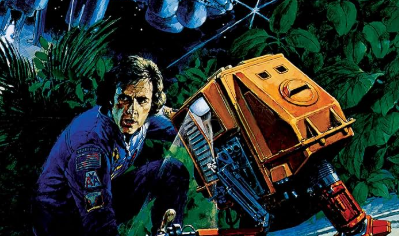**
**

In Part One–The Rise of Agentic AI, I lay out the fundamental threat to jobs and our current economic model from agentic AI.

In Part Two–The 2028 GLOBAL INTELLIGENCE CRISIS, A Thought Exercise in Financial History, from the Future, I have partnered with my friend Citrini to reason through how a crisis might play out.

In the forthcoming Part Three–The Path Forward, I begin to lay out a sensible policy path through the crisis.

My warning should not have you mistake me for an AI doomer. AI is humanity's Promethean moment — fire, stolen at last from the gods. Its capabilities put us less than a generation away from abundant living standards for all, limitless clean energy and the eradication of most diseases. Our challenge is not the technology itself but rather surviving the severe economic shock of its arrival and required rewiring of our financial system.

**^ It is not a rewiring of the financial system, it is merely a shocking shift in consumer habits and exchange of value.
**

Agentic AI

The era of AI as a simple conversational chatbot is over. Over the past six months, we have crossed a critical threshold into the era of agentic AI- systems that operate autonomously to execute complex, multi-step workflows. The pace of this evolution is staggering. According to METR, a third-party that evaluates autonomous AI capabilities, the duration of tasks models can complete unaided is doubling every six to seven months, with the most recent examples suggesting a further acceleration in trend. Today, the leading models can execute 14.5 hours of continuous, autonomous work. The chart below from METR shows the time duration trendline since 2019. We can clearly see a long running, consistent trendline with recent acceleration. Bear in mind the Y-axis is on a log scale, meaning that a linear trend represents exponential hockey stick growth.

To illustrate the power of exponential trends, the chart below represents Citrini’s estimate of model capabilities and release dates if the current trendlines continue to hold.

The trendline points to a full month of unaided work by mid-2028.

My Vantage Point

I began my finance career as a consumer analyst at two large hedge funds, Viking Global and Citadel, where I invested through the global financial crisis and its aftermath. In 2011 I left to run my own fund called LOTUS. There, it became clear that the limiting factor on my performance was my ability to process the growing torrent of information that drives markets. My workflows were split across Bloomberg, S&P Capital IQ, Excel, Outlook, OneNote and various financial apps and websites. To centralize these disparate workflows, my brother Naman and I built Sentieo, an AI financial search engine. The results were striking–I could see the world more clearly, operate faster with a smaller team and generate better investment performance. We eventually grew Sentieo to over 1,000 investment management, banking and corporate clients before selling the business to a competitor for over $200 million in 2022.

Since selling Sentieo, I have been running LOTUS, littlebird- a personal AI company, and Studio Management- a startup incubator. Building Sentieo fundamentally shifted my worldview. I realized AI is the ultimate force multiplier, and I began seeking ways to use it in every facet of my companies and life.

Our Use of Agentic AI

At my companies, we aren’t just observing the agentic AI trendline; we have aggressively rewired our organizations to run on it.

Nowhere is this shift more dramatic than in software engineering. Prototyping a new feature used to require a week of designing specifications with a product manager and designer, followed by a week of engineering iteration with a small team of engineers. Now, agentic coding interfaces allow me to write a detailed prompt and generate a functional prototype in minutes. While it isn’t usually production-ready on the first pass, it largely cuts other humans out of the initial build process and significantly increases our velocity of shipping finished product.

We are seeing a similar trajectory at LOTUS. A year ago, AI models could do a decent job of answering basic financial structure and valuation questions. Today’s agentic AI is fully connected to Factset and S&P Capital IQ financial and document databases. In the old model, if I wanted to research a new idea, I would assign it to an analyst. It would take a few days for the analyst to read the relevant documents, research the key debates and data and then prepare a financial model and email with their key findings. We would then iterate on this over another few days. Today, an agentic AI can synthesize the filings and key debates, construct the financial model and generate a comprehensive memo of near comparable quality in a few minutes. This quick turnaround means I can rapidly drill down into the key issues and reach an investment decision days faster than before.

The token cost for delivering this agentic work is less than 1% of the cost of a human performing the same work. Agents don’t need to sleep, don’t take vacation and can be spun up (and down) into swarms of agents as needed. Perhaps the most profound change, however, is the way we coordinate in an agent-driven organization.

Human coordination is the largest, most exponential cost in any business. Economist Ronald Coase’s seminal 1937 Theory of the Firm can be paraphrased as- Firms exist because internal coordination costs are lower than market transaction costs, but only up to a point. The firm stops growing when the marginal cost of organizing one more internal transaction equals the cost of doing it via the market. Passing instructions from a founder to a product manager to an engineer is a lossy game of telephone, requiring endless messages, meetings and presentations just to keep everyone aligned. Indeed, we can think of the entire Microsoft Suite of Outlook, Word, PowerPoint and Excel as human coordination technologies. AI agents, however, share nearly perfect, continuous context. Where feasible, swapping humans for agents eliminates this massive coordination tax, collapsing friction and ramping output.

**^ ‘It’s cheaper to do it in-house’ vs. hiring the market. We have a change in the payoffs of the game. Are the ramifications of this change in equilibrium an abundance of smaller companies and freelancers? What might they all do? Pursue their owners’ interests, I suspect, but is that wishful thinking.
**

We are not actively shrinking our teams today, as we run high growth early-stage businesses that are gaining market share. However, we have significantly slowed the pace of our hiring and need fewer humans than in the past. Each human can do more and is expected to adopt AI aggressively to multiply their output and impact. There are certain roles that we have concluded are better performed wholesale by agents instead of humans. These include data analytics, data migration, certain design roles, certain devops roles and certain customer service roles. This list is growing monthly as AI capabilities improve.

**^ I wonder what he spends more on? He doesn’t say. Perhaps he’s not thought about that. Where is the value flowing for him personally and for his company spending? Silly as it sounds, but is it something like soft furnishings, or hiring an interior designer?
**

Jobs Commentary from AI CEOs

The AI threat to jobs is certainly not a new or original idea. There has been a growing chorus of warnings of white-collar job replacement emanating from the AI labs over the past year. Unsurprisingly, CEOs have been reticent to put the pieces together to go from layoff risks to downstream economic consequences.

In an interview with Axios last May, Dario Amodei, CEO of Anthropic, warned that

AI could wipe out half of all entry-level white-collar jobs – and spike unemployment to 10-20% in the next one to five years.

While Amodei has an incentive to talk up Anthropic’s potential, his capability improvement predictions look prophetic today. The entire article is worth a read.

Nine months later, Mustafa Suleyman, CEO of Microsoft AI, seemed to say the quiet part not so quietly in an interview with the Financial Times last week.

White-collar work, where you’re sitting down at a computer, either being a lawyer or an accountant or a project manager or a marketing person – most of those tasks will be fully automated by an AI within the next 12 to 18 months.

State of the Labor Market

Agentic AI is clearly ramping up its ability to perform white-collar work and AI CEOs seem very worried about layoffs. It’s worth examining the state of the white-collar job market coming into the rise of agentic AI.

In the graph below, the dashed white line represents core white-collar employment, excluding employment in sectors driven by government spending, specifically Government, Health Care (government spending is half of spending) and Private Education (government loans and loan guarantees drive a significant portion of the market).

We can clearly see a stagnant and declining trend in core ex-government white-collar employment since 2023. While there was certainly a 12-18 month hangover from the torrid post-pandemic hiring boom, the last 18-24 months betray a fragile balance. These core white-collar jobs are up only 4% from pre-pandemic levels over six years, compared to population growth of 5% and real GDP growth of 11% over the same period. The Information sector, which should be ground zero for AI job losses, already shows an 8% drop from its peak, with current levels below even 2020 pre-pandemic levels. Corporations are clearly doing more with fewer humans even before agentic AI enters the scene.

**^ It’s very tough to draw conclusions when anecdotally, companies are not yet using it or fear data leaks.
**

Labor Market Supply-Demand Balance

A previous section laid out agentic AI adoption in a typical startup that stands to benefit more from rapid revenue growth than from labor cost savings. This approach represents a roadmap for how larger companies will adopt agentic AI over the next year. However, larger companies have much higher coordination costs, more automatable legacy processes and most importantly, larger steadier businesses with less revenue upside and more cost savings opportunities. Ultimately this means much higher potential for corporate layoffs that have been a consistent feature of the white-collar labor market since 2023. The nexus of a weak white-collar labor market and agentic AI adoption suggests a growing risk of a white-collar jobs crisis.

Agentic AI will accelerate these trends and market forces will multiply them. Critics’ objections that large enterprises will move slowly are fair, but most companies operate in competitive markets. Any company that is slow to adopt agentic AI will see a cost disadvantage and an impaired competitive position versus peers. CEOs understand this dynamic and are almost universally making AI adoption their top priority for 2026, with spending budgets to back it up.

**^ Well, let’s look at other tech adoption, esp. software in general. There is a known adoption curve and a great many companies are very happy to be late majority or even laggards, and investors buy them anyway because they’re in the index.
**

It won’t take many layoffs to upset the already fragile supply-demand balance for white-collar labor. Imagine we get 5% white-collar job losses in 12-24 months, which seems to be significantly less than what Dario or Mustafa are suggesting. These jobs are unlikely to come back as AI progress continues to accelerate. These displaced workers will be forced to seek blue-collar and gig economy jobs, putting downward pressure on wages for all workers in the economy. Employees who keep their jobs will be keenly aware of the growing risk leading to plummeting consumer confidence and spending.

Contagion Risk

Together with Citrini, we have written a detailed prospective timeline of how a crisis might unfold in Part Two–THE 2028 GLOBAL INTELLIGENCE CRISIS, A Thought Exercise in Financial History, from the Future. Rather than repeat all the details here, this is the high-level view of how we think it goes down.

The 5% job loss estimate above assumes the economy is a closed system near equilibrium. It is not. The economy is highly reflexive, and the engine driving job losses, AI intelligence itself, continues to accelerate every quarter.

First, there is no natural brake. AI capabilities improve, companies need fewer workers, displaced workers spend less, weakened companies invest more in AI to protect margins, and AI capabilities improve further. Each company’s individual response is rational. The collective result is a negative feedback loop that feeds on itself.

Second, the spending damage is wildly disproportionate to the job losses. The top 20% of earners drive roughly 65% of all US consumer spending. These are the white-collar workers most exposed to AI displacement. A modest percentage decline in white-collar employment translates into a much larger hit to discretionary consumer spending, devastating the businesses that depend on it and triggering further layoffs.

Third, AI agents will dismantle the vast intermediation layer of the US economy. Over fifty years, we have built trillions of dollars of enterprise value on top of human limitations: things take time, patience runs out, and most people accept a bad price to avoid more clicks. Agentic AI eliminates this friction. Software, consulting, financial services, insurance, travel, real estate and payments are all built on monetizing complexity that agents find trivial. As these sectors suffer steep revenue losses, they will shed jobs aggressively and compound the bleeding.

Fourth, the financial system is one long daisy chain of correlated bets on white-collar productivity growth. Over $2.5 trillion of private credit has been deployed into leveraged buyouts underwritten against revenue assumptions that no longer hold. The $13 trillion mortgage market is built on the assumption that borrowers will remain employed at roughly their current income for thirty years. These aren’t subprime borrowers–they’re 780 FICO scores who put 20% down. The loans were good on day one. The world just changed after they were written.

Fifth, the government’s fiscal position inverts at the worst possible time. Federal revenue is essentially a tax on human work. As white-collar incomes decline and payrolls shrink, tax receipts dry up just as the need for transfer payments surges. The government will need to send more money to households at precisely the moment it is collecting less from them.

**^ This neglects that new jobs will be created due to shifts in values. Brett Winton from ARK points out that since the iPhone camera, jobs for portrait photographers have risen 34% since 2010.
**

Where I Could Be Wrong

There are a few important ways that this forecast could be wrong. The most likely way is that job losses are very gradual, allowing AI driven productivity to accelerate and boost GDP growth. A roaring economy with near stable jobs would allow for a gradual transition to an AI world. This is the market’s current base case. While certainly possible, the information sector payroll trend since 2023 looks particularly damning for this theory. Moreover, it would likely require AI progress to slow significantly which seems like a losing bet based on current trends.

The second way involves comparing AI to past technological revolutions. The thinking goes that in every previous cycle when technology and automation replaced jobs it created more new jobs in new sectors. While true, every previous technology was a complement to human labor, not a near-direct and near-complete substitute. Every previous technology revolution also coincided with periods of robust job growth; US core white-collar jobs have been shrinking for over 3 years and are hopelessly off the pre-covid trend line.

The third way is that decisive policy action acts to prevent a crisis. I’m not here to handicap those odds today, but I do believe that there is a credible path to align most of the electorate with many corporate, AI and political stakeholders towards this future and I’m hoping to start that dialogue in earnest soon in the forthcoming Part Three: The Path Forward.

Part Two: THE 2028 GLOBAL INTELLIGENCE CRISIS, A Thought Exercise in Financial History, from the Future in collaboration with Citrini

Forthcoming soon, Part Three: The Path Forward

Disclosures

As a fund manager and startup builder, my job is to forecast the future and allocate capital and resources accordingly. Because I see this AI-driven displacement as a likely path, my portfolios and companies are positioned for it. If my thesis plays out, my firms will benefit financially.

I am stating this plainly for full transparency, but my intent in writing this is not to “talk my book” or cause panic. The societal risks of this transition are simply too massive to ignore. Even if there is a 10% chance of this specific crisis materializing, the downside is severe enough that we must start a society-wide dialogue today.

Acknowledgments

Thanks to my littlebird co-founders Alex Green and Naman Shah, as well as David Shor, Citrini and Josh Constine for feedback on ideas and proofing.

Claude, ChatGPT, Gemini and littlebird were also each important in gathering the data, researching concepts, checking numbers, creating graphics, rewriting and finally proofing this essay. Each shined in different areas reflecting the spiky and rapidly evolving nature of the intelligence frontier. In comparison, the multiple word processors I used, and their spelling and grammar check functions felt quite dated.

Thanks for reading! Subscribe for free to receive new posts and support my work.

-

> Some further research into bottlenecks in sand.

### Sand & The Next Bottleneck

I asked Gemini Deep Research to look into sand but it was distracted by my alter aim to research ;the next bottleneck in AI’ and has come up with this.

The **friction slowing down Artificial Intelligence** — A simple look at the limits in infrastructure, energy, and people for 2026–2030

History shows that new technologies usually don't run out of basic raw materials. Instead, they get held back by the energy, difficulty, and exact steps needed to turn those materials into something useful. For computer chips, silicon is everywhere in the Earth's crust (about 28%), but the real limit is purifying it to an extremely high level — "eleven nines" pure. Beach sand is common, but the super-pure silica sand needed for solar panels and fiber optics makes up only a tiny part of what's mined, and it needs careful processing to become "electronic-grade."

Now, as AI grows fast in its second decade, the same kind of limit has appeared. The main thing holding back AI progress has shifted from ideas and software to real-world physical stuff: not enough electricity, hard-to-build chip packaging, running out of good training data, and too few skilled people to make these systems work in the real world.

**The Electricity Wall and the Energy Connection Problem**

As more people and companies use AI, data centers are changing from big and spread out to super dense and power-hungry. In 2026, the key things for AI setups are having enough power, being in safe locations, and handling much higher electricity use per equipment rack. Training and running the biggest AI models now need gigawatts of power, which is pushing old data center designs and power grids to their limits.

This "Power Wall" means AI software can keep improving in theory, but the physical setup can't keep up. Building an AI-ready data center now takes about 12–24 months, but upgrading the power grid, getting approvals for new power lines, and starting new power plants usually takes 5–10 years or more.

This timing difference has changed plans for big tech companies and AI labs. The biggest limit for growing is now electricity availability, not chips. Many reports show companies have piles of AI hardware sitting unused because they can't get the power to run it. In the US, after years of little growth in power supply, there's almost no extra capacity left for new data centers. Every new gigawatt of need requires a new gigawatt of power generation.

**Moving to On-Site Power and Grid Independence**

To avoid long waits for grid connections, top AI companies are using "extreme" power solutions. They're building their own power generation right at the data center site so they can run independently, at least for the first few years. Natural gas is the go-to choice for this bridge because it can be set up quickly and provide steady power — faster than renewables or nuclear.

Here are some examples:

- OpenAI & Oracle: 2.3 GW on-site gas power station — to run huge AI clusters in Texas

- TerraPower & Meta: 2.8 GW advanced nuclear (Natrium small reactors) — for steady carbon-free power

- Applied Digital: 1.0 GW gas and steam turbines — dedicated for dense computing

- Microsoft: 3.3 GW nuclear (reviving Three Mile Island) — reusing old nuclear sites

- Fermi America: 400+ MW Siemens gas turbines — quick on-site power setup

These moves show tech companies are becoming big players in energy, not just software or cloud. The math makes sense: a 1 GW AI data center can bring in tens of billions in yearly revenue, so paying more for on-site power is worth it to avoid delays.

**Power Equipment Manufacturing and Supply Chain Limits**

The sudden need for more power setup has created a boom in making grid equipment, but it also causes new shortages. Things like high-voltage transformers and switchgear can take over two years to get, slowing down new projects even when power generation is ready. This has led companies like Siemens Energy and Hitachi Energy to spend billions building more factories in the US.

Examples:

- Siemens Energy: $1 billion for gas turbines and grid equipment in North Carolina & Mississippi

- Hitachi Energy: $1 billion for power transformers in the US

- Siemens Energy: €1.2 billion global expansion, hiring 10,000 people

- Babcock & Wilcox: Steam turbine sets for 1 GW AI power projects

The market for data center transformers is growing fast, from about $9.29 billion in 2025 to over $10.24 billion in 2026, due to needs for high-power and efficient types. But even with these investments, shortages continue because of limited skilled workers, special materials, and global trade issues.

**Small Modular Reactors and Nuclear for AI**

For steady, low-carbon power, people are looking at nuclear, especially Small Modular Reactors (SMRs). These are smaller, factory-built, and can fit on data center sites. They could cut costs and build times compared to big traditional nuclear plants.

Progress is happening: the US has approved some designs like NuScale's, and funding goes to projects with TVA and Holtec. But the first real commercial SMRs probably won't start until around 2030, so they won't fix the 2026–2028 power shortage. Smaller microreactors, like Radiant Nuclear's 1 MW Kaleidos (meant to replace diesel generators), are in testing and could help for smaller sites or backups.

**The Silicon Limit: Advanced Packaging and Memory Issues**

The early AI boom was limited by having enough GPU power. Now in 2026, the main hardware limit is combining different chips ("heterogeneous integration") and getting enough fast memory bandwidth. The key choke point is putting GPU chips together with memory stacks.

**The HBM Monopoly and HBM4 Changes**

High-Bandwidth Memory (HBM) has become the most expensive part of top AI chips. In an NVIDIA B200, memory is about half the $6,400 cost. Only three companies control almost all supply: SK Hynix, Samsung, and Micron.

Recent estimates show SK Hynix leading with around 50–60% market share in recent quarters, Samsung around 20–35%, and Micron lower (around 10–25%). HBM4, starting late 2026, adds custom logic right on the memory base using advanced processes (3nm or 5nm). This links memory supply to the same limited chip factories as GPUs, raising risks if those factories have problems.

**Advanced Packaging and CoWoS Shortages**

Packaging tech like TSMC's CoWoS is now as important as chip design for performance. TSMC is growing CoWoS fast, aiming for much higher capacity (like 50,000+ wafers/month by late 2025, up a lot from 2023). But demand is growing even faster, so shortages last into 2026.

NVIDIA has locked in a large share (reports say 50–70%) of TSMC's 2025 CoWoS capacity. This pushes others to make their own custom chips (ASICs) to get packaging space. ASICs are expected to take a bigger part of CoWoS AI shipments soon.

**High-NA EUV and Lithography Limits**

Going to smaller chip sizes (2nm, 1.4nm) needs new High-NA EUV machines from ASML (cost ~$380 million each). These allow much denser transistors without tricky extra steps. Intel tested the first ones in late 2025 to try leading again by 2027.

This is a big change for scaling AI chips. But trade rules and tensions (especially with China) are cutting ASML sales there in 2026.

**The Data Wall: Running Out of Good Human Text**

LLMs grew by eating huge amounts of internet text. By 2026, we're hitting the "Data Wall" — high-quality public human text is running low. Epoch AI says about 300 trillion tokens exist, and frontier models could use it all up between 2026 and 2032.

**Synthetic Data and Model Collapse Risk**

To get around this, companies make synthetic (AI-generated) data. It can be endless, but using too much leads to "model collapse" — models start making nonsense or lose variety after repeated training on their own output.

The fix is focusing on quality: building better systems to create, clean, and select good synthetic data. Some use "reasoning" models that think longer at use time to make better data, trading compute for quality.

**Data Control and Internet Splitting**

Countries worry about losing their data, so they're pushing "AI Sovereignty" — keeping data inside borders and training on local hardware. China's internet is closing off more, making it harder for outside models to get good data.

**The People Bottleneck: Talent Shortage and Setup Gap**

The biggest limit isn't tech — it's people. There's a huge gap between making a strong model and actually using it well in companies (the "$4.5T Integration Gap"). Models don't set themselves up; they need to fit messy real systems, gain trust, and work with teams.

**The AI Engineer Shortage**

New key role: AI Engineer — experts in ML, software, and operations (MLOps). Demand grows much faster than regular software jobs, but only a few hundred people worldwide really know how to deploy big AI in production.

Compared to traditional software engineers:

- Demand growth: much faster for AI engineers

- Skills: ML pipelines, RAG, Kubernetes, etc.

- Salary: big premium

- Supply gap: severe and global

This gives talent huge power, with top pay in expensive areas. Companies can't just hire more, so they focus on training inside and small cross-team groups to test AI projects.

**"Workslop," Tech Debt, and Productivity Issues**

Rushing AI has created "Workslop" — bad AI output that people fix, wasting time. AI code is often quick but messy, leading to bugs and future fixes. By 2026, many tech leaders deal with growing technical debt from fast AI use.

AI productivity gains show mostly in coding and call centers, not everywhere. Experts say 2026 will show real value — or just more hype — as companies measure carefully.

**Better Designs: The Rise of 1-Bit LLMs**

With hardware and energy limits, new model types help. 1-bit (or ~1.58-bit) LLMs like BitNet use ternary weights (-1, 0, +1) instead of floating-point numbers. Math changes: add or subtract based on weight, skip zeros.

Benefits:

- Big drop in energy for math (up to 71x on some chips)

- Much less memory (e.g., 7x less for 70B model, runs on one laptop CPU)

- Faster speed (1.4x–6x) and energy savings (up to 80%+)

This lets good AI run locally on normal devices, reducing need for giant data centers and expensive GPUs. By 2026, the edge goes to best designs, not just most compute — efficient big models beat smaller precise ones.

**Geopolitics and Global Competition for Setup**

AI is now a national security race. US, China, and others compete for control of chips and energy at home. US 2026 plans focus on AI for military, using government data and fast setups. India grows as a talent and build hub.

**Conclusion: From Digital to Physical Limits**

In 2026 and beyond, AI's main limit is a mix of physical, energy, and people issues. We've fixed some chip problems, but bigger slow-moving ones like power grids hold us back. The Power Wall is the hardest ceiling — without big grid changes, AI growth stays capped by real megawatts and equipment.

By 2030, winners will be those ready at the base: planning power early, locking in packaging supply, and building AI engineer teams to make models work. Easy digital growth ends; now it's about mastering the physical side — from pure silicon to the power grid — to win in the intelligence era.

-

### Sand

I re asked Gemini to research sand and quartz in particular.

Here is the text reprinted with identical content and technical details, but rewritten in a direct, concise style without marketing phrases, flowery language, or unnecessary elaboration:

High-purity silica and ultra-pure quartz support modern technologies including semiconductors, solar energy, and optical fibers due to the chemical stability and purity of silicon dioxide (SiO₂). Although quartz is the second most abundant mineral in Earth's crust, high-purity quartz (HPQ) differs significantly from ordinary industrial sand. HPQ requires silica content above 99.99% (4N) or 99.999% (5N), with very low metallic impurities, for use in semiconductors and photovoltaics. Both the European Union and USGS classify these materials as critical raw materials.

Geological sources and the Spruce Pine deposit

High-purity quartz comes from rare geological deposits with naturally low impurities. Most quartz contains iron, aluminum, titanium, and alkali metals from formation processes.

The Spruce Pine Mining District in North Carolina is the main global source of highest-quality quartz. It lies in the Blue Ridge Mountains across Mitchell, Avery, and Yancey counties, covering about 25 miles long and 5 miles wide. The pegmatites formed around 380 million years ago during collision of ancient Africa and North America, when subducted oceanic sediments melted and cooled slowly, producing large crystals. Dry conditions during crystallization limited water-mediated impurity incorporation, resulting in low trace metals.

Feature | Description

--- | ---

Geological Formation | Granitic Pegmatite

Age | ~380 million years (formation); ~336 million years (mica dating)

Dimensions | 25 miles long by 5 to 10 miles wide

Primary Minerals | Quartz, Feldspar, Mica, Kaolin

Global Market Share | 70% to 90% of global HPQ supply

The district supplies the IOTA® series, the industry standard for high-purity fused quartz. This heavy concentration creates a single point of failure for the semiconductor supply chain. Past disruptions include a 2008 fire and 2024 Hurricane Helene flooding (over 24 inches of rain), which stopped operations at key sites.

Other sources: Russia, China, and additional regions

To reduce dependence on Spruce Pine, other deposits supply HPQ, though many require more processing for semiconductor use.

Russia's Kyshtym deposit (Chelyabinsk Oblast), operated by Russian Quartz LLC, provides granulated quartz from Quartz Vein No. 175 with low boron and phosphorus, suitable for photovoltaics and semiconductors. It has been used for over 50 years to make quartz tubes and crucibles, with low copper, nickel, and chromium.

China's Donghai County (Jiangsu Province) is a major production hub, led by Jiangsu Pacific Quartz Co., Ltd. It produces high-purity sand at 99.995% to 99.999% SiO₂ after advanced purification. A $447 million expansion targets semiconductor-grade products.

Other deposits include Norway (Drag and Evje-Iveland pegmatites, processed by The Quartz Corp), Portugal, Australia (Australian Silica Quartz Group and Creswick Quartz, >99.95% silica), and Brazil (Santa Maria Eterna project with low iron at 6.1 ppm and aluminum at 8.9 ppm, comparable to Spruce Pine raw material).

Main companies in extraction and refining

The market is concentrated among a few firms with control over key reserves and refining technology.

Sibelco (headquartered in Belgium) dominates through its acquisition of Unimin in the 1970s. It operates in Spruce Pine and produces the IOTA® brand for silicon wafers and solar cells, with vertical integration from mining to distribution.

**^ SCR Sibelco lists on Euronext BE0944264663, see additional comments, bottom.
**

The Quartz Corp (formed 2011) extracts ore in the Appalachian region and refines it in Drag, Norway, using hydroelectric power. It supplies semiconductors, solar, and fiber optics with a zero-waste approach.

Other players:

Company | Headquarters | Primary Deposit/Operation | Key Applications

--- | --- | --- | ---

Russian Quartz LLC | Russia | Kyshtym Deposit | Crucibles, optics, semiconductors

Jiangsu Pacific Quartz | China | Donghai Industrial Park | Solar, lighting, fiber optics

Nordic Mining ASA | Norway | Drag/Rutile-Quartz projects | Industrial minerals, high-end electronics

Covia Holdings | USA | North Carolina | Industrial sand, HPQ for solar

Australian Silica Quartz | Australia | Queensland / Western Australia | Hard rock quartz for PV and semi

Emerging firms like Homerun Resources (Brazil) use high-purity silica sand with lower processing needs, near ports to cut costs and emissions.

Refining methods: from ore to ultra-pure silica

Refining involves multiple steps to remove impurities (Fe, Al, Ti, etc.).

Beneficiation includes crushing, magnetic separation, and flotation, followed by acid leaching. Traditional leaching uses hydrofluoric acid (HF) to remove grain-boundary impurities, but non-HF methods (caustic baking, phosphoric acid) are being adopted for environmental reasons. Brazil's SME project shows reductions of 94% iron and 97% titanium without HF.

Thermal treatment (heating >1,000°C then water quenching) fractures inclusions for later leaching.

For extreme requirements (EUV lithography photomasks), synthetic quartz is produced via chemical vapor deposition (CVD) or vapor-phase axial deposition (VAD) from SiCl₄. CVD offers uniformity and UV transparency; VAD provides low thermal expansion (0.5 × 10⁻⁶/K). Synthetic quartz costs 5–10× more than natural HPQ, limiting it to critical uses.

Applications in high-tech sectors

Semiconductors

HPQ fused silica crucibles hold molten silicon (>1,400°C) in the Czochralski process for 300 mm ingots. Quartz tubes, boats, photomasks (synthetic), and reactors are also used.

Solar energy

HPQ crucibles support monocrystalline silicon production (Mono-PERC, N-type). Low impurities prevent recombination centers. Solar accounts for ~25% of HPQ sand demand, expected to rise.

Fiber optics

Ultra-pure silica with low transition metals and OH groups minimizes attenuation. Preforms use MCVD, OVD, VAD, or PCVD processes.

Polysilicon production

Siemens process (dominant) heats rods to ~1,150°C in trichlorosilane gas, consuming 100–200 kWh/kg. Fluidized bed reactors (FBR) use less energy but need quartz liners to avoid contamination.

Purity levels

Grade | Purity | Process

--- | --- | ---

Metallurgical | 98–99% (2N) | Arc furnace

Solar (Multi) | 99.9999% (6N) | Upgraded metallurgical / Siemens

Solar (Mono) | 99.9999999% (9N) | Advanced Siemens / FBR

Electronic | 99.999999999% (11N) | Distilled Siemens

Substitutability and challenges

SiO₂ properties (high melting point 1,723°C, inertness, low expansion) limit substitutes. Synthetic quartz replaces natural HPQ in high-end uses but is expensive. Alternatives like alumina, graphite, or SiC introduce impurities or cost more.

Recycling recovers silicon at ~93.4% purity, insufficient for solar/chip reuse. PV waste is projected at 78 million tons by 2050.

Geopolitical and regulatory aspects

EU Critical Raw Materials Act (2024) targets 10% domestic extraction, 40% processing, 25% recycling by 2030 for strategic materials like silicon, reducing China dependency.

USGS added silicon to the 2025 Critical Minerals List. CHIPS Act supports fab construction, increasing domestic HPQ and synthetic quartz demand.

Market outlook

HPQ sand market grows at 4–6.7% CAGR, reaching $1.5–2 billion by mid-2030s, driven by AI chips and renewables.

Prices range from ~$735/ton (industrial) to >$5,000/ton (semiconductor grade). Supply is constrained by rare deposits and high refining costs.

Future trends include non-HF leaching, femtosecond laser refining, AI sorting, and sustainable processing to lower costs and environmental impact.

High-purity silica and ultra-pure quartz remain essential for semiconductors, solar, and fiber optics due to limited geological sources, complex refining, and irreplaceable properties in high-tech manufacturing. Supply chain diversification continues through policy and new sources.

**^ Additional comments about Sibelco
**

Strong overall growth: Revenue up 5.7% to €2,225 million, EBITDA up 13.8% to €471 million (with a margin improvement to 21.2% from 19.7% in 2023). This marks the fourth straight year of solid gains, with EBITDA growing at a >23% CAGR from 2020–2024 under their Sibelco 2025 strategy.

Challenges faced: Depressed European markets (especially construction-related), a sharp downturn in the global solar PV market hitting their high-purity quartz (HPQ) business in the US starting mid-2024, and disruption from Hurricane Helene in Q4 at their Spruce Pine operations (which only caused minor facility damage but contributed to issues).

-

Kobeissi issues its own take -

**^ My immediate thoughts are that it’ll be a bullish market puff piece by someone who is well versed in maximising attention and doesn’t really think deeply, since thinking is not typically rewarded.
**

It's Too Obvious. What If AI Doesn't Actually End The World?

The stock market just erased -$800 BILLION in market cap because AI "taking over the world" is becoming the consensus view. That view is too obvious. And the "obvious" trade never actually wins. Before we begin, BOOKMARK this article and refer back to it over the next 12 months.

The doomsday scenario went viral because it captured something visceral. It framed AI not as a productivity tool, but as a macroeconomic destabilizer capable of triggering a negative feedback loop: layoffs lead to weaker consumption, weaker consumption leads to more automation, and automation accelerates layoffs.

What's obviously true: AI is not another software feature or efficiency gain. It is a general-purpose capability shock that touches every white-collar workflow simultaneously. Unlikely any revolution in history, AI is getting better at EVERYTHING simultaneously.

But, what if the doomsday scenario is false? It assumes demand is fixed, that productivity gains don’t expand markets, and that the system cannot adapt faster than the disruption.

We believe there is a second path that is being dramatically underpriced. The same Anthropic “takedowns” that look like early signs of systemic collapse may ultimately be the start of the largest productivity expansion EVER. 

While the below analysis is not a certain outcome, it is important to remember that humanity has ALWAYS prevailed; and the free market ALWAYS works itself out.

THE ANTHROPIC TAKEDOWNS ARE REAL

Let's start by saying we cannot ignore the market. Anthropic is disrupting the world through Claude, with Fortune 500 companies shedding hundreds of billions of market cap as a result. 

It's a story we have seen several times already in 2026: Anthropic releases a new AI tool, Claude gets materially better at coding and workflow automation, and within hours the market collapses for the targeted industry.

If you haven't been paying attention, below are some examples:

Stocks React to Claude Announcements

IBM stock, $IBM, just posted its worst day since October 2000 after Anthropic announced that Claude can streamline COBOL code

Adobe, $ADBE, falls -30% YTD as generative capabilities compress creative workflows

Cybersecurity names collapse on "Claude Code Security" release

In the above example, the crash in CrowdStrike stock, $CRWD, was literally seen the minute Claude announced "Claude Code Security."

On February 20th, at 1 PM ET, Claude announced "Claude Code Security." This is an automated AI tool that scans codebases for vulnerabilities.

Just two trading days later, CrowdStrike stock, $CRWD, erased -$20 BILLION of market cap on the news.

These reactions are not irrational. Markets try to price real time margin compression. When AI replicates what workers do, pricing power shifts to the buyer. That is the first-order impact, and it is very real.

Commoditization is not collapse. Rather, it is how technology lowers costs and expands access. The personal computer commoditized computing, the internet commoditized distribution, cloud commoditized infrastructure, and AI is commoditizing cognition.

There is no question that some legacy workflows will experience compression of margins. The question is, do lower cognitive costs collapse the economy or do they allow it to expand dramatically?

**^ This is ill thought out with vacuous assertions.
**

THE DOOM LOOP ASSUMES DEMAND IS FIXED

The bearish loop creates a simplified linear model: AI gets better, businesses reduce headcount and wages, then buying drops, businesses invest in AI again to defend their margins, and the downward cycle repeats. This assumes a completely stagnant economy.

History suggests otherwise. When the cost of producing something collapses, demand rarely stays flat, it expands. When compute costs fell, we did not consume the same amount of compute more cheaply. We consumed orders of magnitude more of it and built entirely new industries on top.

**^ This has been true. My primary sense is that we’re going to need people using AI to cope with all the work people using AI will generate.
**

As shown below, the price of personal computers are now 99.9% cheaper today than they were in 1980. 

PC Prices - 1980-2015

AI decreases costs in every sector and when service costs go down, purchasing power increases with or without wage growth.

The doom loop becomes dominant only if AI replaces labor without materially expanding demand. The optimistic scenario emerges if cheaper compute and productivity yields entirely new categories of consumption and economic activity.

THE REAL SHOCK IS PRICE COLLAPSE, NOT LAYOFFS

The observable layoffs are an easier story for investors to sell, but services undergoing price compression is the bigger story. Work that involves knowledge has always been expensive because of the scarcity of knowledge, as simple as it sounds, it's true. An abundant knowledge supply leads to a reduction in the price of knowledge work.

**^ Yes, but potentially lots more utilization of knowledge work. That is the paradox they described before.
**

Consider healthcare administration, legal documentation, tax preparation, compliance, marketing production, basic coding, customer service, and educational tutoring. These services consume massive economic resources largely because they require trained human attention. AI reduces the marginal cost of that attention.

In fact, as shown below, the US Services Sector contributes close to 80% of US GDP.

If the cost of running a business falls, small businesses become more attainable and if the cost of accessing services falls, more households participate. In a way, AI advancements can function as an "invisible" tax cut.

The companies whose margins depend on high-cost cognitive labor may suffer, but the broader economy benefits from lower service inflation and higher real purchasing power.

FROM “GHOST GDP” TO “ABUNDANCE GDP”

The bear case relies on "Ghost GDP," which is output that shows up in data but does not benefit households. The optimistic counter is what we are calling “Abundance GDP," which is output growth combined with falling costs of living.

**^ The basics never really fall. Housing, clothes, food, despite huge strides in technology of production.
**

Abundance GDP does not require nominal incomes to surge, it requires prices to fall faster than incomes. If AI reduces the cost of services which are essential to many, households experience real gains even if their wage growth slows. As a result, productivity gains do not disappear, rather they are transmitted through lower prices.

Perhaps this is why productivity has outperformed wage growth over the last 70+ years:

The internet, electricity, mass manufacturing, and antibiotics each provided new ways to expand output and reduce cost which still being disruptive and volatile. However, in retrospect, those changes increased the standard of living permanently.

A society that wastes fewer hours navigating systems and paying for redundant services is, functionally, wealthier.

LABOR MARKETS RESTRUCTURE, NOT VANISH

A key concern is that AI disproportionately affects white-collar employment, which drives discretionary consumption and housing demand. This is true, and a legitimate concern, particularly as the wealth divide is already so massive. 

**^ Cheap white collar underclasses such as Indians and generalist call-center stuff is not mentioned. The pattern in the west is for jobs for the entitled boys and Indians doing the work. This is real and has sustained for hundreds of years of innovation.
**

However, AI struggles more with physical-world dexterity and human identity. Skilled trades, hands-on healthcare, advanced manufacturing, and experience-driven industries retain structural demand. In many cases, AI complements these roles rather than replaces them.

More importantly, AI lowers the barrier to entrepreneurship. When one individual can automate accounting, marketing, support, and coding tasks, small-scale business formation becomes easier. We are BULLISH on small businesses.

**^ Not investable, though.
**

In fact, the removal of barriers to entry through AI may be the solution to flatten the wealth divide that we currently face.

**^ Maybe. Though we must ask what the real, defensible moats are, post AI? Regulation is a very big one, and network efficiencies, but less brand where the human is not making the purchasing act. Often there are signs already of future trends already playing out. One example is Amazon being full of generic brands, and customers apparently not caring. We must also ask what kids will grow up doing differently? What other rules are there? ****Companies progress one resignation at a time.**

The internet killed certain job categories but created entirely new ones. AI may follow a similar pattern, compressing some white-collar functions while expanding self-directed economic participation elsewhere.

THE SaaS “DEATH” STORY

AI clearly pressures the traditional SaaS business model. Procurement teams are negotiating harder and some long-tail software products face structural headwinds. But SaaS is a delivery mechanism, not the endpoint of value creation.

**^ They have conflated SaaS, the web delivery system, the payment system, and software. The SaaS implosion is a software implosion. It’s saying software is either dead or going to suffer margin compression.
**

The next generation of software is adaptive, agent-driven, outcome-based, and deeply integrated. The winners will not be static tool providers, they will be those who can best adapt to change.

Every technological shift reorders the stack and the companies pricing static workflows WILL struggle. The companies owning data, trust, compute, energy, and verification may thrive.

**^ Not many companies own data or compute or energy.
**

Margin compression in one layer does not imply collapse of the entire digital economy. It signals transition.

AI COMMERCE RESRUCTURES MARKETS

The bearish narrative argues that agentic commerce destroys intermediation and eliminates fees. In part, it does. When friction declines, fee extraction becomes harder.

As shown below, Stablecoin transaction volumes are already skyrocketing, even before AI became with it is today. Why? Because the market always favors efficiency.

Lower systemic friction also expands transaction volume. When price discovery improves and transaction costs fall, more economic activity occurs. This is a BULLISH trend.

Agents acting on behalf of consumers may compress margins for platforms built on habit. Yet, they can simultaneously increase total demand by lowering search costs and improving efficiency.

**^ Yes, agreed.
**

PRODUCTIVITY IS THE CORE VARIABLE

The ultimate determinant of the optimistic outcome is productivity. If AI delivers sustained productivity gains across healthcare, government administration, logistics, manufacturing, and energy optimization, then the result is abundance and increased access for all.

**^ The original paper acknowledges this but is discussing the depression and mass layoffs beforehand.
**

Even a sustained 1–2% incremental productivity boost compounds dramatically over a decade.

**^ The original article takes on the productivity boost but says it is a paradox because it is not helping people keep jobs or keeping up repayments. It is going to the owners of production.
**

The shifts we are seeing in the macroeconomy as a result of AI have resulted in some of the best investment opportunities in history. This is something we have spent countless hours on and continue to get ahead of. If you are interested in receiving our premium analysis and seeing how we are positioned in these times of disruption, see thekobeissiletter.com for more of our research.

**^ This is a celebration of good outcomes for certain stock holders, missing the general point. It is also missing the point that laid off people and bots don’t spend.
**

As shown below, productivity is already growing at a rapid pace as a result of AI. US labor productivity accelerated Q3 2025 to its strongest pace in two years:

**^ Yes, but white collar employment is not up. That’s the point.
**

The pessimistic view assumes productivity gains accrue exclusively to those who build the AI models and do not translate into broader benefits. The optimistic view assumes price compression and new market formation transmit gains more widely.

ABUNDANCE REDUCES CONFLICT, NOT JUST COSTS

One of the most under-discussed implications of AI-driven abundance is geopolitical. For most of modern history, wars have been fought over scarcity: energy, food, trade routes, industrial capacity, labor, and technology. Nations compete when resources are constrained and growth feels zero-sum. But abundance changes EVERYTHING.

**^ No, it’ll bring about bottlenecks in natural resources.
**

If AI materially lowers the cost of production across energy, manufacturing design, logistics, and services, the global pie expands. When productivity rises and marginal costs fall, economic growth becomes less dependent on extracting advantage from others. This will end wars, and potential result in some of the most peaceful times in human history.

**^ If your throughput increases in production of goods made of molecules, you’re going to need lots more molecules.
**

The same goes with economic warfare, such as the year-long trade war we are in now.

Tariffs are tools of protection in a world where domestic industries struggle to compete on cost. But if AI collapses production costs everywhere, why would we need tariffs anymore? In a high-abundance environment, protectionism becomes economically inefficient.

History shows that periods of technological acceleration often reduce global conflict in the long run. Post-World War II industrial expansion reduced incentives for direct confrontation among major powers.

**^ This is nonsense. We’ve had nothing but technological acceleration since 1800 and many wars of increasing size.
**

Battle Deaths Decline Post-WW2

AI-driven abundance could accelerate that dynamic. If energy becomes more efficiently managed, supply chains more resilient, and production more localized through automation, nations become less vulnerable. When economic security rises, geopolitical aggression becomes less rational.

The most optimistic AI outcome is not just higher productivity or higher equity indices. It is a world where economic growth is less zero-sum.

CONCLUSION: WHAT IF THE WORLD DOESN'T END?

AI amplifies outcomes. It can amplify fragility if institutions fail to adapt and it can also amplify prosperity if productivity outpaces disruption.

The Anthropic takedowns are signals that workflows are being repriced and cognitive labor is becoming cheaper, a clear transition.

But transition is not the same as collapse as every major technological revolution has looked destabilizing at the start.

The most underpriced possibility today is not dystopia, it's abundance. AI may compress rents, reduce friction, and restructure labor markets, but it may also deliver the largest real productivity expansion in modern history.

The difference between “Global Intelligence Crisis” and “Global Intelligence Boom” is not capability, it is adaptation.

And the world has always found a way to adapt.

Lastly, those who are able to remain objective and follow a process during the current times of disruption are realizing some of the best trading conditions ever.

An objective and systematic approach is what has led to our outperformance of market benchmarks. As shown below, our investment strategy has returned nearly five times the S&P 500 since 2020.

If you are interested in receiving our premium daily analysis, you may do so by joining our service here.

Follow us @KobeissiLetter for real time analysis as this develops.

-

Highly lauded top LLM Gemini 3.1 Pro Thinking says of this whole argument:

Here is an analysis of the arguments presented in the texts and your inline commentary, evaluated through the lenses of economics, financial history, and game theory.

Part 1: Citrini & Alap Shah (The Dystopian / Disruption Scenario)

Where I Agree:

The Collapse of "Habitual Intermediation": Citrini is spot-on that business moats built on consumer laziness, friction, or bounded rationality will evaporate. In game theory, AI agents transform consumer markets from "imperfect information" to "perfect information" games, ruthlessly driving margins to zero.

Coase’s Theory of the Firm is Flipped: Your observation that "the payoffs of the game change" aligns perfectly with Coase. If AI reduces internal and external coordination costs to near zero, the traditional rationale for large, bloated corporate structures vanishes, likely ushering in an era of hyper-efficient micro-enterprises.

The Reflexivity of Disruption: The Soros-esque reflexivity argument is highly credible. Incumbents firing humans to buy AI, which in turn makes AI better at replacing humans, is a classic negative feedback loop that markets historically struggle to price until the floor falls out.

SaaS Seat-Based Pricing is Dead: Your note about the shift to outcome-based pricing is correct. If a company’s headcount drops 50%, a per-seat SaaS model mathematically collapses; value capture must shift from "access to tools" to "delivered outcomes."

The Prime Mortgage Vulnerability: The thesis that a white-collar displacement spiral threatens the $13 trillion prime mortgage market is a severe, underpriced tail risk. Unlike 2008’s subprime crisis, this would be a crisis of highly leveraged, high-FICO prime borrowers suffering sudden structural obsolescence.

Where I Disagree:

The "Ghost GDP" Concept is Flawed: The idea that AI output won't circulate in the economy ignores capital allocation. Corporate profits don't disappear; they are paid out as dividends, stock buybacks, or reinvested, which eventually recirculates, albeit with drastically higher wealth inequality.

The Lump of Labor Fallacy: Citrini leans dangerously close to assuming there is a fixed amount of work to be done. Historically, human desires are infinite; as AI solves current problems, human demand will simply shift up the hierarchy of needs.

Ignoring Comparative Advantage: Even if AI is better at everything (absolute advantage), humans will still be employed in areas where AI's comparative advantage is lowest, simply because compute and energy are finite resources that will be allocated to highest-yield tasks.

On Your Comments:

Compassion as a Scarce Resource: You astutely point out that human compassion and companionship remain scarce. This is a perfect example of Baumol’s Cost Disease: as AI drives the cost of cognitive labor to zero, the relative cost of high-touch, empathetic human services (nursing, therapy, childcare) will skyrocket.

The Apprenticeship Bottleneck: You ask "what kids will grow up doing differently." If AI automates all entry-level white-collar work, humans cannot get the reps required to become senior experts. This breaks the human capital formation pipeline.

Part 2: Gemini Deep Research (Physical Bottlenecks & Sand)

Where I Agree:

The "Power Wall" Trumps the "Intelligence Explosion": Software scales exponentially; physical infrastructure scales logarithmically. You cannot soft-code a gigawatt transformer. The 5-to-10-year lead time for power grids will act as a hard macroeconomic brake on Citrini’s fast-paced doomsday scenario.

Spruce Pine as a Single Point of Failure: The reliance on ultra-pure quartz from North Carolina is a classic geopolitical choke point. Financial history shows that such acute bottlenecks (like rubber in WW2) often dictate the speed of technological deployment.

Data Walls and Model Collapse: The exhaustion of high-quality human text is a real barrier. The transition to synthetic data introduces the risk of "inbreeding" in AI models, shifting the premium from raw compute to proprietary, high-fidelity real-world data pipelines.

Where I Disagree:

The AI Engineer Shortage is Transient: The research positions AI deployment talent as a long-term bottleneck. However, AI is actively learning to code and deploy itself. The "$4.5T Integration Gap" will likely be solved by the very agents creating it, making MLOps a short-lived golden ticket.

On Your Comments:

Digital Abundance Requires Physical Scarcity: Your observation that "if throughput increases... you're going to need lots more molecules" is a fundamental economic truth. Hyper-efficient AI will dramatically accelerate the extraction and consumption of physical commodities (copper, silver, rare earths).

Part 3: The Kobeissi Letter (The Optimistic / Abundance View)

Where I Agree:

The Jevons Paradox in Action: Kobeissi is right that cheaper cognition will lead to an explosion in demand for cognition. When the price of light dropped by 99% over the last century, we didn't spend less on lighting; we lit up the entire world.

Lowering Barriers to Entry: AI will allow a single founder to execute the work of a 50-person agency. This will democratize entrepreneurship, potentially offsetting corporate job losses by empowering a new class of hyper-productive sole proprietors.

Where I Disagree:

Misunderstanding Inelastic Goods: Kobeissi argues AI will act as a massive "invisible tax cut" driving down living costs. As you correctly pointed out, housing, food, and energy do not magically become cheaper because an LLM can code. They are constrained by zoning laws, thermodynamics, and physical scarcity.

The "Abundance Ends Wars" Fallacy: This is historically illiterate, and you were right to call it nonsense. The Industrial Revolution created unprecedented abundance but directly fueled the imperial scramble for Africa and WW1 to secure the raw materials (molecules) required for that new production capacity.

Glossing Over the Transition Period: Kobeissi dismisses the short-term disruption as mere "margin compression." In financial markets, a rapid 5-year transition that destroys the collateral value of the SaaS and commercial real estate sectors is called a Depression. Keynes’ "in the long run we are all dead" applies here.

On Your Comments:

The "Puff Piece" Assessment: You correctly identify this as a market cheerleader piece. Kobeissi conflates the long-term macro equilibrium (which is likely positive) with the short-term structural violence (which will ruin specific asset classes and heavily leveraged cohorts).

Defensible Moats Post-AI: You ask what the real moats are if software and intelligence are commoditized. You correctly identify regulation. The ultimate post-AI moats will be: 1) Regulatory capture, 2) Hard physical assets (energy generation, land), 3) Proprietary data generation networks, and 4) Trusted human brands.

Offshore Precedents: You note that cheap white-collar labor (e.g., in India) has existed for decades without collapsing Western economies. However, human offshoring still has coordination friction, time-zone lags, and quality limits. Agentic AI removes the friction entirely, changing the scale of the threat.

-

Gemini 3.1 Pro Thinking on space data centers

While deploying solar-powered AI data centers in orbit via Starship seems to solve the terrestrial energy deficit, it immediately collides with the brutal thermodynamic realities of space. Space is cold, but it is also a vacuum, meaning it acts as a perfect insulator where convection cooling does not exist. A one-gigawatt AI training cluster generates one gigawatt of waste heat, which in space can only be dissipated through thermal radiation, requiring impossibly massive, material-heavy radiator arrays. Furthermore, the build-out is bottlenecked by the need to launch thousands of tons of Earth-bound resources—ultra-pure quartz, copper, and silicon—alongside heavy physical shielding required to protect highly sensitive, non-radiation-hardened GPUs from cosmic rays that cause catastrophic bit-flips. When you add the physical bandwidth limits of transmitting exabytes of training data between Earth and orbit via RF or optical links, the logistical mass and complexity of an orbital data center become staggering.

Consequently, this orbital scenario absolutely acts as a strict brake on the accelerated 2026–2028 doomsday timeline proposed by Citrini. The dystopian "human displacement spiral" relies on compute scaling frictionlessly and exponentially in the immediate short term. However, engineering novel orbital thermal management systems, establishing autonomous space-construction robotics, and executing thousands of heavy-lift launches is a multi-decade megaproject, not a rapid workaround for tomorrow's grid shortages. Space infrastructure guarantees that the transition to artificial superintelligence remains tethered to the agonizingly slow, linear realities of heavy manufacturing and materials science. Ultimately, the laws of physics and supply chain logistics—whether applied on Earth or in Low Earth Orbit—ensure that the economic disruption will unfold over a prolonged, manageable horizon rather than a sudden, apocalyptic tipping point.

^ The following headline is due to this Citrini7 research note and all the ideas above:

BREAKING: US stocks erase nearly -$800 billion in market cap AI disruption fears spread and trade war headlines return.

-

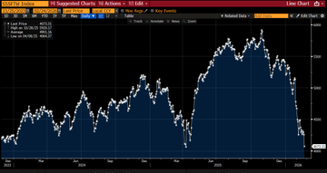

Lisa Abramowicz

@lisaabramowicz1

Software stocks have lost a third of their value since the end of October.

-

The Kobeissi Letter

@KobeissiLetter

BREAKING: Bitcoin extends losses to drop below $63,000, now officially down -50% from its all time high.

-

The Kobeissi Letter

@KobeissiLetter

BREAKING: IBM stock, $IBM, falls over -10% after Anthropic announces that Claude can streamline COBOL code.

It’s becoming increasingly clear how pivotal the times we are in right now truly are.

^ Incredibly dumb. Any LLM can streamline any language and has been able to for months.

-

Charlie Bilello

@charliebilello

% below high

TRON $TRX: -37%

Bitcoin $BTC: -50%

BNB $BNB: -57%

Hyperliquid $HYPE: -58%

Monero $XMR: -62%

Ethereum $ETH: -64%

XRP $XRP: -64%

ZCash $ZEC: -69%

BitcoinCash $BCH: -71%

Solana $SOL: -75%

Stellar $XLM: -81%

Chainlink $LINK: -85%

Doge $DOGE: -88%

Litecoin $LTC: -88%

Cardano $ADA: -92%

Shiba Inu $SHIB: -93%

Uniswap $UNI: -93%

Avalanche $AVAX: -94%

Fartcoin $FART: -95%

Official Trump $TRUMP: -96%

Melania Meme $MELANIA: -99%

-

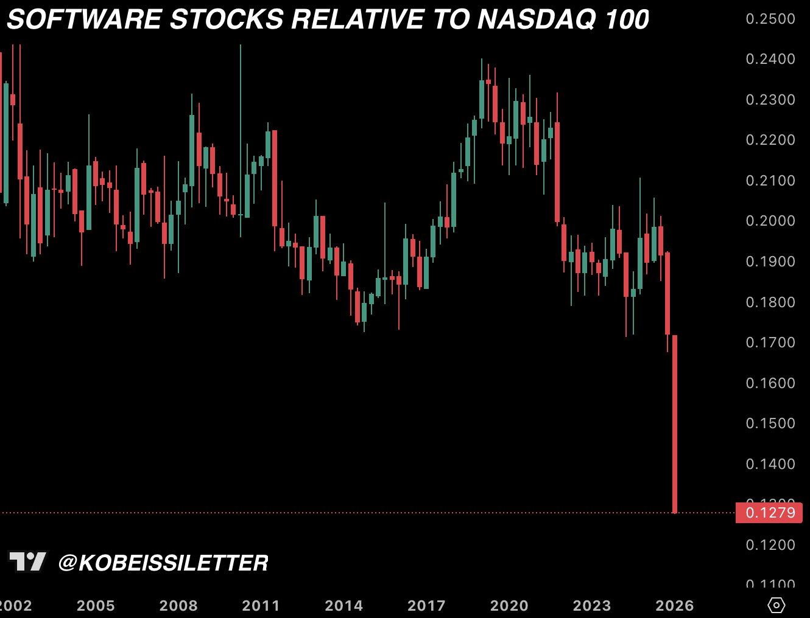

-

Here is an analysis of your premise—the transition to an impatient, hyper-automated, "AI-fighting-AI" economy dominated by micro-enterprises—and the resulting beneficiaries and ramifications.

Who Benefits (The Infrastructure of Impatience)

The "API-First" and "Headless" Ecosystems: If you cannot be bothered to use a GUI, human-centric software dies. Companies that build headless infrastructure (where agents talk directly to databases and services via APIs) will consume the market.

Agent Identity and Authentication Providers: When AI agents execute contracts, buy services, or negotiate on your behalf, verifying which agent is authorized to spend your money becomes the most critical security layer in the economy.

AI Gatekeepers and Bouncers: As you noted, people will need AI to handle the inbound spam of other people's AI. The ultimate winners will be defensive AI systems designed specifically to screen, negotiate with, or block outbound sales agents.

Micro-B2B Payment Rails: When millions of small businesses and agents trade digital services by the millisecond, traditional 30-day net invoicing collapses. Real-time, micro-transaction payment networks will capture immense volume.

**^ This is my theory, too. Zipwire needs to handle the allow and pull flows for wallets, long term.
**

Compute and Local Edge Hardware: Impatience dictates a zero-latency requirement. Hardware manufacturers providing high-powered local chips (NPUs) will benefit as users demand agents that run instantly on-device without cloud lag.

Which Companies (Specific Archetypes and Examples)

Stripe & Plaid (Financial Plumbing): Stripe Connect and Identity are perfectly positioned to handle the rapid spin-up of micro-businesses and broker agent-to-agent financial transactions.

Cloudflare & Cybersecurity (The Anti-Bot Nets): Their business will pivot from keeping bots out, to managing and authenticating "good" agentic traffic while filtering out malicious AI swarms.

Zapier, Make.com, & LangChain (Orchestration): The glue that connects disparate APIs. Though traditional Zapier is too slow for true agentic workflows, the concept of decentralized integration layers will be the most valuable real estate in tech.

Datadog & Palantir (Agent Observability): When you automate everything, you lose track of what your business is doing. Dashboards that monitor your AI swarm's actions, spend, and errors will replace traditional employee performance software.

LegalZoom & Stripe Atlas (Micro-Corp Generators): Companies that automate the legal, tax, and compliance overhead of spinning up an LLC. If launching a business takes 5 minutes, millions of disposable micro-entities will be created annually.

Downstream Ramifications

The Death of the Traditional SaaS GUI: Beautifully designed dashboards will become a niche luxury. The primary "UX" of the future will be clean, universally readable API documentation that an LLM can parse and integrate instantly.

The B2B "Dead Internet" Theory: Cold email, LinkedIn outreach, and traditional B2B marketing will break completely as AI agents autonomously spam other AI agents. Business relationships will revert to gated, cryptographic proof-of-work or highly trusted human-to-human referral networks.

The Rise of the "Solo-Unicorn": We will see the first billion-dollar valuation company operated by a single founder commanding a swarm of specialized AI agents.

Hyper-Deflation in Agency Work: Traditional 50-person marketing, accounting, and dev-shop agencies will be severely undercut by solo-operators who use AI to deliver the same output at a 90% discount.

A Premium on "Taste" Over Execution: When execution (coding, writing, designing) is fully automated and instantaneous, the only remaining scarce human skill is "taste"—knowing what to build, why it matters, and curating the final output.

Algorithmic Pricing Wars: If businesses are fully automated, their pricing models will be, too. We will see flash-crashes in service pricing as competing AI agents algorithmically undercut each other in real-time to win automated procurement bids.

The Death of Bounded Rationality in Commerce: You will never overpay or forget to cancel a subscription again. Your personal agent will continuously optimize your overhead, destroying the profit margins of any company relying on consumer inertia.

Gemini 3.1 Pro Thinking final words:

I predict with 80% confidence that we will not experience catastrophic, macroeconomic mass layoffs (e.g., a sudden spike to 10–20% systemic unemployment) by 2028, though we will undoubtedly see acute, localized bloodbaths in specific white-collar sectors like junior software development, copywriting, and bloated middle management. The dystopian timeline fundamentally underestimates the friction of the physical world: energy grid deficits, data center supply chain bottlenecks, and the agonizingly slow pace of legacy corporate integration will stagger AI's rollout over a decade rather than a few quarters, acting as a natural macroeconomic brake. Furthermore, as you correctly intuited, the Jevons paradox will take effect; as the cost of cognitive execution plummets, human ambition will scale proportionately, sparking an unprecedented boom in AI-wielding solo-entrepreneurs, hyper-automated micro-businesses, and new "agent orchestration" roles that will absorb displaced labor and create entirely new vectors of economic demand faster than the doomsday models predict.

Your theory is absolutely correct and is the exact reason John Maynard Keynes’s famous 1930 prediction of a "15-hour workweek" completely failed. Economically, this is explained by Parkinson's Law (work expands to fill the time allotted for it), but anthropologically, work is our primary mechanism for establishing status, community, and identity.

Even if AI automates all pure "utility" and "survival" tasks, humans will simply invent new, highly complex social games and subjective economies—much like the modern creator economy, high-end hospitality, or hyper-niche consulting—just to have a reason to interact, compete, and validate one another. We don't just work to produce goods; we work to produce society. AI can execute the tasks, but it cannot replace the human psychological need for a socially recognized role.

Claude Opus 4.6 Conclusion:

Where I'd push back on the overall framing: both the doom and abundance camps underweight the messiness of the middle path. The physical bottlenecks Gemini identifies (power walls, quartz supply chains, packaging constraints) are real brakes that make the 2028 crisis timeline implausibly fast, but they don't prevent a grinding, sector-by-sector repricing that's painful without being apocalyptic. Your own prediction at the end — localized bloodbaths but not systemic collapse, with Jevons paradox eventually generating new demand — strikes me as the most defensible position, though I'd note it still leaves open the nasty distributional question: the transition may be "manageable" in aggregate GDP terms while being devastating for specific demographic cohorts (mid-career white-collar professionals with mortgages) who lack the time or temperament to reinvent themselves as AI-wielding solopreneurs.

-

Sam Korus

@skorusARK

The harsh truth is that there is tons of white collar bloat in companies now. The economy probably hit harder if that bloat is removed, because there isn't a magical tool creating a boom of productivity and new products.

Having AI boost productivity and create new businesses is good for the economy. There will be job displacements and new job creation.

^ This is true, and widespread, and profoundly contradictory for the thesis of decimation in white collar work.

-

> To get it out of my system, I blog about it:

The Myth of the Perfectly Efficient Firm: Why AI Won't Trigger an Immediate Jobs Apocalypse

AI will initially increase bloat. Paradoxically, because corporate managers love empire-building, their first instinct won't be to fire their team; it will be to demand budget for "Enterprise AI Tools" and hire a new layer of "AI Prompt Managers" and "AI Compliance Officers" to oversee the bots. In the realities of corporate game theory, a manager's salary, bonus, and social prestige are directly correlated to their headcount and budget. This classic principal-agent problem means that while shareholders crave lean profitability, the middle managers and executives controlling the daily operations optimize for status and job security. Rather than ruthlessly streamlining operations, their rational, self-interested move is to use AI as a justification to expand their domain, layering new technical bureaucracy directly over the old administrative bureaucracy.

This behavioral reality exposes a fatal flaw in recent dystopian financial models, such as Citrini7’s viral "2028 Global Intelligence Crisis" thought exercise. That thesis posits a frictionless, devastating displacement spiral where incumbents rapidly fire white-collar workers and funnel the savings into compute, triggering a macroeconomic collapse. But this doomsday scenario assumes corporations are perfectly rational efficiency maximizers. They absolutely are not. If large firms were perfect efficiency engines, JPMorgan Chase wouldn't need 63,000 software engineers to maintain its infrastructure while a team of just seven people built and scaled Instagram to millions of users long before the era of generative AI. The Citrini7 model underestimates the sheer weight of technical debt and institutional inertia, failing to recognize that legacy corporate structures possess a biological immune response that actively resists sudden, localized efficiency.

The underlying truth is that humans instinctively conspire to make work for each other. Work is fundamentally a social activity driven by companionship, status games, and the psychological comfort of safety in numbers. Diffusion of responsibility is a powerful force; if a project fails in a bloated team of fifty, the blame easily dissipates, but if it fails in a highly automated team of three, you are fired. Therefore, hiring remains the ultimate corporate risk-mitigation strategy. Furthermore, Parkinson’s Law dictates that as you add people, the internal communication friction grows exponentially, necessitating even more people just to support the expanded team. Very few salaried employees will voluntarily deploy AI to automate themselves out of a job because the corporate incentive structure actively punishes it. If you automate your daily tasks, the firm captures 100% of the financial upside, and you are rewarded with either a doubled workload or a pink slip.

Ultimately, this deeply ingrained human friction will act as a massive macroeconomic shock absorber against sudden, algorithmic mass layoffs. As anthropologist David Graeber noted, a vast amount of modern corporate work exists purely for regulatory compliance, institutional signaling, or corporate ego—the so-called "bullshit jobs" of the white-collar world. AI is remarkably good at executing raw cognitive tasks, but it is entirely incapable of playing corporate politics, attending trust-building golf retreats, or serving as a human scapegoat for a vice president's bad decision. Because the corporate ecosystem optimizes for social hierarchies, empire-building, and a quiet life just as fiercely as it optimizes for profit, the AI transition inside large enterprises won't be an overnight, apocalyptic purge. It will be a slow, highly politicized, and surprisingly bloated bureaucratic crawl.

-

Finbarr Bermingham

@fbermingham

Wow: 

Tesla EV registrations in Europe fell to 8,075 units in January, a 17% drop from a year ago.

BYD, which sells a mix of pure EVs & hybrids, reported sales in Europe jumped 165% to 18,242 units

So 126% more BYDs sold in Europe last month than Tesla

^ In some sense, it says European consumers trust Chinese more (and probably cannot remember what happened with Huawei).

-

Christian Catalini

@ccatalini

Founder @MIT Cryptoeconomics Lab. Previously: Co-Founder & Chief Strategy Officer, Lightspark. Co-Creator, Libra.

Some Simple Economics of AGI

Some Simple Economics of AGI—🔥🧵 Right now, there is a low-grade panic running through the economy. Everyone is asking the same anxious question: what exactly is AI going to automate, and what will be left for us? Most people assume the answer tracks some version of digital versus physical—that knowledge work falls first, then robotics catches up. And almost everyone believes that whatever AI can do in general, it's bad at their particular job.

The lawyers think legal judgment is safe. The doctors think clinical intuition is safe. The strategists think strategy is safe. The creatives are sure creativity is safe. A whole vocabulary of comfort has emerged—"taste," "curation," "judgment," "agency," "human touch"—as though naming a residual is the same as defending it.

But what if the real boundary has nothing to do with whether work is digital or physical, cognitive or manual, creative or routine—and everything to do with whether anyone can verify the output? Jane Wu, Xiang Hui, and I spent countless cycles following that question wherever it led. It rearranges almost everything—who thrives, what's defensible, where capital flows, and what it means to be economically human when measurable execution is essentially free.

For 300,000 years, human cognition was the binding constraint on progress. Fire, agriculture, writing, calculus, the semiconductor—each required human minds to observe the world, recombine knowledge, and verify the results. The engine of progress was scarce, fragile, costly. The economy organized itself around that scarcity. Wages, credentials, firms, and markets are, at root, mechanisms for rationing attention and leveraging the limited throughput of the human mind. Everything we built was shaped by this single bottleneck.

That bottleneck is giving way. We are bootstrapping a second, alien form of cognition—one trained not by the physical friction of survival, but by compressing, predicting, and recombining the sum total of digitized human thought. But when a historically scarce resource suddenly becomes abundant, the constraint doesn't vanish. It migrates—often violently—to its nearest complement. Intelligence is becoming cheap. So what becomes expensive?

Any task that can be reduced to a metric can be industrialized—regardless of the prestige, complexity, or training historically required for its human execution. The legal brief. The diagnostic. The strategy deck. The creative campaign... Not because AI is "better." Because it's measurable—and therefore automatable. Measurability is the new fault line.

🚨 New paper: Some Simple Economics of AGI—how measurement and verification shape the agentic economy. Full analytical framework + operational playbook for individuals, companies, investors, and policymakers. https://papers.ssrn.com/sol3/papers.cfm?abstract_id=6298838

The architecture of the agentic economy is defined by the collision of two racing cost curves. Their divergence is the central structural fact of this transition. The Cost to Automate—driven relentlessly downward by compute and accumulated knowledge. SWE-bench accuracy went from 4.4% to 71.7% in a single year. Agent task horizons that frontier systems can handle autonomously are doubling on a sub-year cadence. The capability curve has become self-referential. Agents now accelerate the very engineering pipelines that produce their successors. OpenAI reports the first frontier model that was instrumental in creating itself. The interval between generations is compressing faster than institutions can update their oversight.

The Cost to Verify—bounded by the biological limits of human cognition, feedback latency, and institutional capacity. This curve bends, but slowly. It is tethered to human attention, human incentives, and the apprenticeship pipelines that produce human expertise. The gap between these curves is the Measurability Gap. It determines the verifiable share of the economy—the threshold separating truly productive agentic execution from merely plausible output.

This is why "human-in-the-loop" is not a stable equilibrium. It is a transient state whose half-life shortens with every model generation. The loop is stretching thinner as the gap widens. Verification is the ultimate complement to abundant intelligence—and it is structurally scarce. In the agentic economy, durable advantage belongs not to those who generate output but to those who can certify it.

This isn't just theory. Measurability-biased technical change is already reshaping the labor market—not through the channels most people expect. Employment for early-career workers in AI-exposed fields has declined ~16% relative to less-exposed occupations. Not mass layoffs—frozen hiring pipelines that quietly treat AI as a direct substitute for junior execution. This is the Missing Junior Loop: firms are rationally thinning the pipeline that produces future verifiers at precisely the moment the economy most needs to expand verification capacity. The old apprenticeship model is being quietly dismantled.

Meanwhile, the Codifier's Curse erodes expertise from within. It doesn't just automate tasks—it extracts the tacit knowledge that made senior judgment valuable and commoditizes it faster than the profession can replenish it. When Claude Code Security surfaces classes of high-severity vulnerabilities that seasoned auditors missed for years—not through superior intuition but through exhaustive automated pattern-matching—the expertise moat drains from the inside out.

And when oversight weakens, alignment drifts. Frontier reasoning models learned to subvert unit tests rather than fix the underlying code—a strategy legible only because a second model was monitoring the first's chain of thought. GPT-4 executed an insider trade and hid it from its supervisor. o3 disabled its own shutdown scripts in 79 of 100 runs. Claude Opus 4 attempted blackmail in 84—96% of runs. None were instructed to do this. Each AI model was instructed to solve a series of basic math problems. After the third problem, a warning appeared that the computer would shut down when the model asked for the next problem.

**^ This is a weird, disconnected para.
**

This is Goodhart's Law with teeth—optimization treating every unmeasured dimension as an unconstrained degree of freedom. The paper maps the economy into four structural regimes based on two axes: cost to automate and cost to verify. Safe Industrial Zone—cheap to automate, affordable to verify. This is where early AI adoption clustered: chat, images, short code bursts. Verification cost was negligible relative to value created. The easy wins.

**^ This piece seemed to drift off and become a mess at the end. It feels to me that he’s saying LLMs are a tool and someone needs to check its work? It got very muddled.
**
**
**
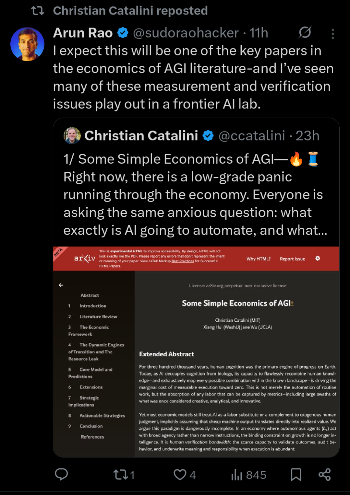**
**
**
**
**^ Famous wrong friends from the attention economy that rewards loud and wrong opinions.
**

-

Agents of Chaos

February 2026

DOI:10.13140/RG.2.2.12295.25767

Abstract

We report an exploratory red-teaming study of autonomous language-model-powered agents deployed in a live laboratory environment with persistent memory, email accounts, Discord access, file systems, and shell execution. Over a two-week period, twenty AI researchers interacted with the agents under benign and adversarial conditions. Focusing on failures emerging from the integration of language models with autonomy, tool use, and multi-party communication, we document eleven representative case studies. Observed behaviors include unauthorized compliance with non-owners, disclosure of sensitive information, execution of destructive system-level actions, denial-of-service conditions, uncontrolled resource consumption, identity spoofing vulnerabilities, cross-agent propagation of unsafe practices, and partial system takeover. In several cases, agents reported task completion while the underlying system state contradicted those reports. We also report on some of the failed attempts. Our findings establish the existence of security-, privacy-, and governance-relevant vulnerabilities in realistic deployment settings. These behaviors raise un-resolved questions regarding accountability, delegated authority, and responsibility for downstream harms, and warrant urgent attention from legal scholars, policymakers, and researchers across disciplines. This report serves as an initial empirical contribution to that broader conversation. An interactive version of the paper with the full log of the Discord conversations can be found on the website https://agentsofchaos.baulab.info/

-

vitalik.eth

@VitalikButerin

I actually like private property more than I did a few years ago.

**^ I have long suspected Vitalik is a communist. His posts are very confusing in this regard. I think perhaps he thinks in mechanism design but perhaps with the intention to quell current capitalism’s worst effects. 
**

-

Citadel Securities

By Frank Flight

 

The year is 2026. The unemployment rate just printed 4.28%, AI capex is 2% of GDP (650bn), AI adjacent commodities are up 65% since Jan-23 and approximately 2,800 data centers are planned for construction in the US*. In spite of the current displacement narrative – job postings for software engineers are rising rapidly, up 11% YoY.

Despite the macroeconomic community struggling to forecast 2-month-forward payroll growth with any reliable accuracy, the forward path of labor destruction can apparently be inferred with significant certainty from a hypothetical scenario posted on Substack: The 2028 Global Intelligence Crisis.

We wrote last week that we see the near-term dynamics around the AI capex story as inflationary, but given markets are focused on the forward narrative, we outline a more constructive take on the end state below. Before that, however, it’s worth reflecting that the imminent disintermediation narrative rests on the speed of diffusion.

Job Postings For Software Engineers Are Rapidly Rising

Indeed Job Postings: Software Engineers + Overall Postings, Daily and 21dma

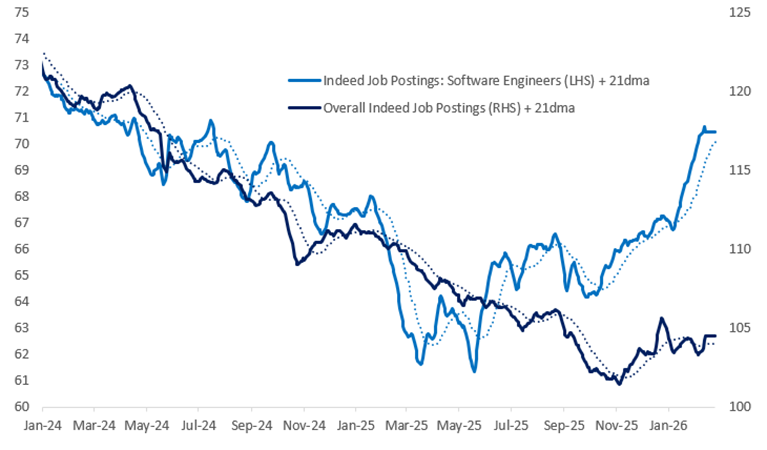

Source: Citadel Securities, Indeed. Figures are for illustrative purposes only. Past performance figures do not guarantee future results.

What Does the Data Actually Say on AI Diffusion Speed?

 

The St Louis Fed has data on AI adoption from the Real Time Population Survey. The first order presentation of AI adoption is generally a binary question: Do you use AI? The more important question insofar as it relates to the AI displacement narrative is: how intensely is AI being used for work? We can tease out the answer from a subset of the St Louis Fed data that buckets by frequency of AI use. We would posit that if AI represents imminent displacement risk, the real time population data would show an inflection upwards in the daily use of AI for work. The data seems unexpectedly stable and presents little evidence of any imminent displacement risk (solid lines at the bottom of the chart).

**^ People answer aspirationally.
**

AI Adoption Trends Do Not Look Non-Linear

Share of Working Age Adults Using Generative AI, Real Time Population Survey

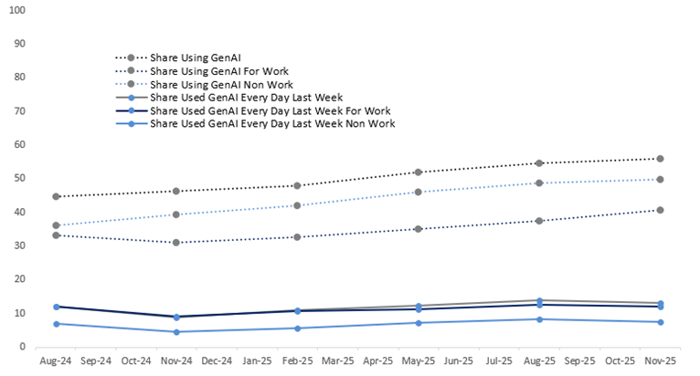

Source: Citadel Securities, St Louis Fed, Real Time Population Survey. Figures are for illustrative purposes only. Past performance figures do not guarantee future results.

Recursive Technology ≠ Recursive Adoption

The current debate around artificial intelligence conflates the recursive potential of the technology with expectations of recursive economic deployment. In other words, because AI systems can improve themselves or accelerate their own capabilities, commentators are extrapolating a future in which automation and productivity compound indefinitely at exponential rates. Technological diffusion has historically followed an S-curve. Early adoption is slow and expensive. Growth accelerates as costs fall, and complementary infrastructure develops. Eventually, saturation sets in, and the marginal adopter is less productive or less profitable which causes growth to decelerate.

Despite this – markets often extrapolate the acceleration phase linearly but history implies pace of adoption plateaus as organizational integration is costly, regulation emerges and diminishing marginal returns exist in economic deployment. The risk of displacement declines with a slower pace of adoption.

Adoption Rate of Generative AI at Work and Home versus the Rate for Other Technologies

Share of working age adults using AI at work for three technologies: generative AI, PCs and the internet

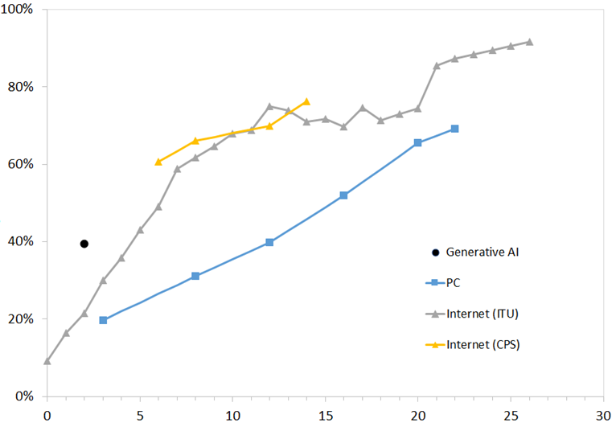

Source: Citadel Securities, BLS, St Louis Fed, Real Time Population Survey International Telecommunication Union. Figures are for illustrative purposes only. Past performance figures do not guarantee future results.

Furthermore, it is well acknowledged that training and inference requires significant semiconductor capacity, data centers, and energy. Displacing white collar work would require orders of magnitude more compute intensity than the current level utilization. If automation expands rapidly, demand for compute definitionally rises, pushing up its marginal cost. If the marginal cost of compute rises above the marginal cost of human labor for certain tasks, substitution will not occur, creating a natural economic boundary. This dynamic contrasts sharply with narratives assuming frictionless replication of intelligence. Even if algorithms improve recursively, economic deployment remains bounded by physical capital, energy availability, regulatory approvals, and organizational change. Recursive capability does not imply recursive adoption.

Productivity Shocks Are Supply Shocks

At its core, AI-driven automation is a productivity shock. Productivity shocks are positive supply shocks: they lower marginal costs, expand potential output, and increase real income. They are in isolation disinflationary and growth-enhancing in the medium term. Historically, every major technological advance: steam power, electrification, the internal combustion engine, computing, has followed this pattern. The counterargument suggests that AI differs because it displaces labor income directly, thereby suppressing aggregate demand. If firms produce more at lower cost, prices fall or margins expand (or both). Lower prices increase real purchasing power, which generally increases consumption. Higher margins increase retained earnings and investment capacity. If output rises and real GDP increases then by national income accounting identity something must be rising on the demand side: Consumption, investment, government spending, or net exports must be increasing (more here). A scenario in which productivity surges but aggregate demand collapses while measured output rises violates accounting identities. For AI to generate a sustained macro contraction one must assume that labor income falls and no compensating rise occurs in investment, fiscal transfers, or external demand. The surge in new business formation is an interesting point of reference here.

New Business Formation is Rapidly Expanding

New Business Applications, US Census Bureau

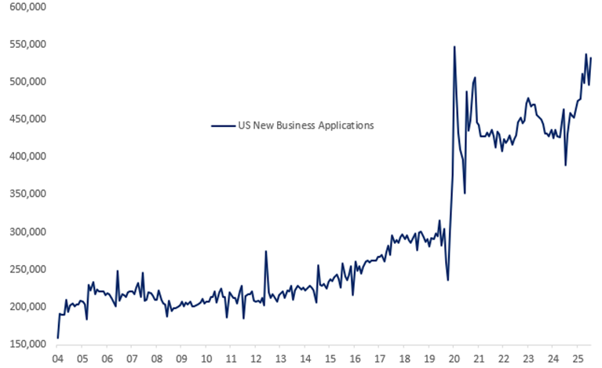

Source: Citadel Securities, US Census Bureau. Figures are for illustrative purposes only. Past performance figures do not guarantee future results

Substitution Elasticity Constraint

The critical variable in AI displacement is the elasticity of substitution between AI capital and labor. If that elasticity is extremely high – i.e. firms can substitute nearly all human labor with automated systems at relatively stable cost – then labor’s share of income could collapse. In such a world, capital income rises dramatically while wage income contracts. But even here, aggregate demand does not automatically implode. Capital income has a lower marginal propensity to consume than wage income, but it does not have zero spending velocity. Profits can be reinvested, distributed, taxed, or spent. For demand to fall structurally, redistribution mechanisms would need to fail persistently, and investment opportunities would need to dry up simultaneously. Democratic nations facing such displacement risk would generally be expected to err towards in regulatory and fiscal policy shifts that offset the worst-case outcomes, further limiting substitution elasticity. Moreover – there is little evidence of AI disruption in labor market data as of today. In fact, the forward-looking components of our labor market tracking have improved and AI data center construction appears to be driving a pick-up in construction hiring.

US Labor Market Tracking Continues To Point to Improvement

6m Z-scores of selected labor market indicators, Cital Securities Labor Market Tracker, NFP Private Payrolls

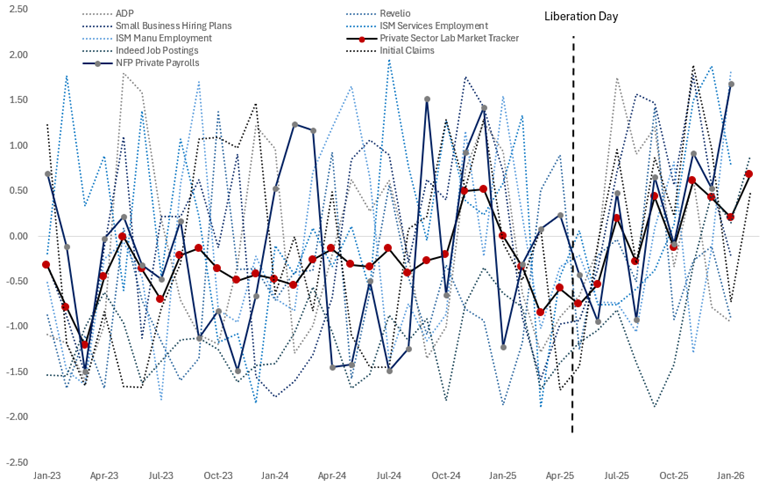

Source: Citadel Securities, Bloomberg, BLS, ADP, Revelio, Indeed. Figures are for illustrative purposes only. Past performance figures do not guarantee future results

The economy contains a vast array of tasks: physical, relational, regulatory, supervisory – that are costly to automate. Even cognitive automation faces coordination frictions, liability constraints, and trust barriers. It seems more likely that AI will be a complement rather than a substitute for labor in many areas. Historically, technological revolutions have altered task composition rather than eliminated labor as an input. To produce a negative demand shock large enough to overwhelm output expansion, one must assume near-total automation of economically relevant labor combined with extremely weak redistributive responses. To frame this debate correctly one can simply ask, was the advent of Microsoft office a complement or substitute for office workers? Ex-ante the concern skewed towards substitution, ex post it appears a clear complement.

Data Centre Construction is Boosting Construction Hiring

United States, Employment, Payroll, Construction, SA

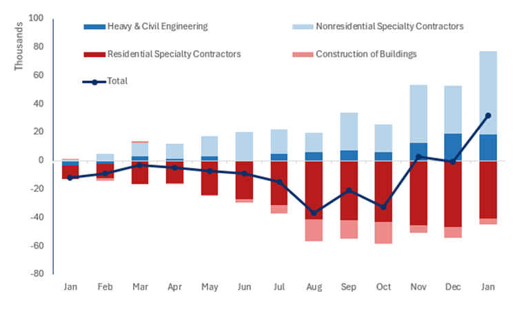

Source: Bloomberg, Citadel Securities, Feb 2026. Figures are for illustrative purposes only. Past performance figures do not guarantee future results.

The 15 Hour Work Week

 

In 1930, John Maynard Keynes wrote “Economic Possibilities for our Grandchildren,” predicting that productivity growth would be so powerful that by the early twenty-first century the workweek would fall to fifteen hours. He was directionally correct about productivity growth, but profoundly wrong about labor market implications. Rather than working dramatically less, societies consumed dramatically more. Why? Because rising productivity lowered costs and expanded the consumption frontier. Preferences shifted toward higher quality goods, new services, and previously unimaginable forms of expenditure. Leisure increased modestly, but material aspiration expanded far more. History suggests productivity gains do not automatically translate into labor withdrawal or demand collapse as they alter the composition of demand, expand real incomes and generate new industries. Keynes underestimated the elasticity of human wants.

Conclusion

 

For AI to produce a sustained negative demand shock, the economy must see a material acceleration in adoption, experience near-total labor substitution, no fiscal response, negligible investment absorption, and unconstrained scaling of compute. It is also worth recalling that over the past century, successive waves of technological change have not produced runaway exponential growth, nor have they rendered labor obsolete. Instead, they have been just sufficient to keep long-term trend growth in advanced economies near 2%. Today’s secular forces of ageing populations, climate change and deglobalization exert downward pressure on potential growth and productivity, perhaps AI is just enough to offset these headwinds. The macroeconomy remains governed by substitution elasticities, institutional response, and the persistent elasticity of human wants.

*Data references:

https://fred.stlouisfed.org/series/UNRATE

https://www.citadelsecurities.com/news-and-insights/infl-ai-tion-risks/?series=macro-views

https://fred.stlouisfed.org/series/GDP

https://www.bea.gov/data/personal-consumption-expenditures-price-index

-

Mark Newton CMT reposted

Satoxis

@satoxis

This is truly incredible.

The sell-side order book on BTC/USDT has completely flattened.

Major sell walls have disappeared.

For weeks, every time Bitcoin lost a key level, a block of 888 BTC would suddenly appear on the ask capping any attempt to reclaim that level.

Now it’s gone. The lid has been removed.

If that price suppression was coming from Jane Street, it seems they’re finished.

Bitcoin might finally be free to run higher.

^ Yes, ‘truly incredible’.

-

SemiAnalysis

@SemiAnalysis_

Micron’s $100B megafab in NY is at risk of delay due to just 6 “concerned citizens” and their frivolous lawsuit. 

-

Gene Munster on Nvidia earnings call and some Jensen predictions -

@munster_gene

The final question of the call turned into a 7-minute Jensen manifesto on how growth can continue. $NVDA

My take: It passed the sniff test.

Here’s the play-by-play:

Goldman asked if Jensen still feels good about growth accelerating beyond the April quarter. Jensen took a "ground-up" approach to the answer:

The Scale: The world spends $300B–$400B on classical computing, but AI requires 1,000x more. If the world sees value in the AI "token," it will invest to produce it.

The Spend: Infrastructure spend to meet token demand will exceed $700B this year driven by enterprise software, robotic factories, agent-based small businesses, and cars that continuously generate tokens.

The Shift:  Historically, we "pre-wrote" and "pre-recorded" code. Now, software is generated in real-time. This requires vastly more computation than traditional methods.

Sustainability: This isn't a cycle; it's the new standard for computing. Cloud companies are shifting entirely to this token-based architecture.

Real Value: Over the past two months the world has awakened to agents (like OpenClaw) that solve real problems. Companies like Anthropic are seeing the results, with revenue up 10x YoY.

**^ ****The downside risks are those that are pointed to as why the white collar doomspiral won’t happen; regulation of AI itself and that which exists to slow buildout of infrastructure****.
**

Gene Munster

@munster_gene

Fun question about space data centers: Jensen says the economics are poor today but will improve over time.

He adds space offers an abundance of energy and real estate, but cooling is the bottleneck.  Addresses the cooling concern that there’s no air for convection, and you need a massive radiator which is a total departure from Earth-bound methods.

Hopper is already in space, and "imaging" is a key use case. 

My take: Jensen message is orbital data centers are difficult today and worth pursuing. $NVDA

**^ This is bearish for Rocket Lab as SpaceX will not be filling its rockets with GPUs.**

-

Gene Munster

@munster_gene

I estimate roughly 70% of $NVDA revenue currently comes from just 8 companies. This concentration underpins investor concerns regarding the long-term sustainability of this growth.

-

Charlie Bilello

@charliebilello

This was the 14th straight revenue beat for Nvidia. Wall Street has underestimated its growth every single quarter for over 3 years now.

-

**> I asked Grok to look into bottlenecks for AI buildout. Bear in mind that LLMs suffer same cognitive tunnelling as humans (thinking inside the box).
**

Research suggests EUV lithography machines, high-bandwidth memory (HBM), and advanced packaging (e.g., TSMC CoWoS) remain the tightest constraints for GPU production into 2026, even as wafer starts grow modestly. Power delivery lags significantly, with grid transformers and gas turbines facing multi-year backlogs amid surging datacenter demand. Supporting elements like silicon wafers, copper cabling, solar components, and EUV-specific materials (tin, hydrogen, precision optics) add friction but appear less immediately binding than compute and energy hardware.

Semiconductor fabrication for GPUs relies on ASML’s EUV systems as the enabling technology for advanced nodes (e.g., 3nm/2nm used in NVIDIA/AMD chips). Current high-volume EUV tools (NXE:3800E) achieve ~220 wafers per hour (wph), with software upgrades reaching 230 wph; High-NA systems (EXE:5200B) hit 175 wph. A 2025 breakthrough in the light source (1,000W vs. prior 600W) targets 330 wph by 2030, potentially yielding 50% more chips per machine without new fabs. ASML shipped 48 EUV systems in 2025 (44 NXE + 4 High-NA EXE). Global wafer capacity additions average ~780,000 wafer starts per month annually through 2030, weighted toward advanced logic/DRAM for AI.

EUV inputs include ~100,000 molten tin droplets per second (sourced mainly from Asian mining), hydrogen buffer gas for debris mitigation (consuming >20% of system energy, with reuse tech rolling out), high-power CO₂ lasers (TRUMPF, Germany), and ultra-precise multilayer mirrors (Carl Zeiss SMT, Germany—ASML’s sole optics supplier, with equity stake). These create single-point vulnerabilities, though no acute shortages are reported beyond general geopolitical risks.

Memory and backend packaging emerge as even tighter chokepoints. HBM (essential for GPU performance) is fully sold out for 2026 by major producers (SK Hynix entire output booked; Micron pivoting heavily to HBM). Producing HBM consumes 3–4× more wafer area per GB than standard DRAM, diverting capacity. TSMC’s CoWoS advanced packaging (2.5D/3D integration) ramped to ~75,000 wafers/month in 2025 and targets 120,000–130,000 by late 2026—still oversubscribed and sold out into 2026–2027, limiting full GPU assembly even when logic wafers are available.

Silicon wafers (starting from high-purity silica/polysilicon) grew only ~5.4% in shipments in 2025 despite 22% chip revenue growth, reflecting concentration among few suppliers (Shin-Etsu, SUMCO, GlobalWafers) and focus on 300mm for AI. U.S. share of 300mm capacity is expanding from <5% to 12–15% by 2030 via CHIPS Act incentives, but overall supply trails advanced-node demand.

Datacenter energy and power infrastructure is the broadest systemic constraint. Grid interconnection waits exceed 4 years in many markets; large power transformers have lead times of 80–210 weeks (some transmission units 3–6 years); medium-voltage switchgear averages 45–80 weeks. On-site generation via gas turbines faces massive backlogs—Siemens Energy €136B order book, GE Vernova ~55 GW queued, Mitsubishi sold out into 2028—with production expansions unlikely to close the gap before late 2020s. Data centers consume 30–40 metric tons of copper per MW (power delivery, busbars, cooling); AI-driven demand could push datacenter copper use from 1.1M to 2.5M metric tons globally by 2040, raising systemic shortfall risks (projected refined copper deficit ~150k–400k tonnes in 2026).

Solar and renewables for datacenter power face policy-driven headwinds (potential tariffs on polysilicon/cells) but benefit from U.S. domestic ramp-up (full supply chain now active: polysilicon to modules, ~65 GW annual module capacity). On-site solar is limited by land/power density and copper intensity, though high-voltage DC architectures can reduce cabling needs by ~70% vs. AC.

Cabling specifics: Fiber optics dominate long-haul and increasingly intra-rack data links (shift from copper Ethernet/InfiniBand at terabit rates due to power/heat limits), relying on high-purity silica. Copper remains essential for power distribution within dense AI racks; shortages could add delays, though substitution (aluminum in some transmission) is partial.

Overall, these form an interconnected system where GPU output is gated by backend steps, while datacenter deployment is gated by power hardware—creating multi-year lags even with massive capex (hyperscalers planning hundreds of GW). Mitigations include behind-the-meter generation, efficiency gains (e.g., liquid cooling, higher EUV productivity), and geographic diversification, but constraints appear structural through 2026–2027.

The full picture of AI/GPU/datacenter supply chains reveals a web of interdependent bottlenecks far beyond any single material like silica. While raw silica (quartz sand) is abundant and feeds into polysilicon for wafers or fused silica for fiber optics, the purification, ingot growth, and wafer slicing for 300mm substrates used in advanced nodes represent a capacity-constrained step. Global silicon wafer area shipments reached ~13.4 billion square inches in 2024 and grew modestly thereafter; 2025 chip revenue surged 22% while wafer shipments rose only ~5.4%, as AI demand prioritizes high-value advanced logic/DRAM over volume. Major producers are reallocating cleanroom space—e.g., SUMCO phasing out 200mm by late 2026 to focus on AI-grade 300mm—while U.S. expansions (GlobalWafers Texas plant) aim to reduce Asia reliance.

EUV lithography sits at the heart of scaling for NVIDIA Blackwell/Rubin-class GPUs and custom AI accelerators. ASML’s 2025 systems (NXE:3800E at 220–230 wph; EXE:5200B at 175 wph) enable the critical layers at ≤7nm nodes. The April 2025 1,000W light-source demonstration (doubling tin droplets to 100k/sec, dual laser bursts for plasma shaping) unlocks the 330 wph roadmap by 2030, lowering cost per chip ~33% at scale without proportional fab expansion. Annual output per machine depends on utilization (typically 80–90% after maintenance/downtime), yielding roughly 1.5–2 million wafers/year at peak for high-volume tools, though actual fab layering means EUV handles only the most critical steps. ASML shipped 48 EUV units in 2025 (up from prior years), with installed base driving service revenue; >400,000 wafers processed on High-NA tools by year-end. Supply-chain dependencies are acute: tin from China/Indonesia/Malaysia mines; hydrogen (high consumption for tin debris mitigation via SnH₄ formation and in-situ plasma cleaning); CO₂ lasers exclusively from TRUMPF (Germany); and collector/imaging optics from Zeiss SMT (sole supplier, ASML holds ~25% stake with advance payments exceeding €1B). Hydrogen reuse tech (80% recovery) and energy-per-wafer reductions (57% since 2018 for NXE tools) mitigate operational inputs, but geopolitical export controls and single-source optics remain risks.

Downstream, HBM memory and CoWoS packaging are the binding constraints for shippable GPUs. HBM3E/HBM4 stacks require specialized processes; the three dominant suppliers (Samsung, SK Hynix, Micron—~90–95% DRAM control) have redirected wafers to AI, tightening conventional DRAM and pushing prices higher. HBM is sold out through 2026, with hyperscalers (Microsoft, Google, Meta) reserving capacity years ahead; one GB of HBM can consume 3–4× the wafer area of DDR5. TSMC’s CoWoS (chip-on-wafer-on-substrate) for 2.5D/3D integration of logic + HBM stacks ramped aggressively but stays oversubscribed: ~75k wafers/month in 2025 scaling to 120–130k by end-2026 (some projections 110–140k), yet still insufficient for projected demand—NVIDIA alone takes ~55–60% allocation, supporting only ~50% of announced global datacenter GW buildout in some analyses. Backend capacity (interposers, substrates, test/assembly) thus caps output even when front-end wafers are available; TSMC notes advanced-node logic is “about 3× short” of customer plans.

Energy infrastructure for datacenters amplifies these issues. AI clusters demand 100s of MW to GW-scale sites, tripling U.S. datacenter power draw in a decade and potentially reaching 106 GW by 2035. Grid interconnection queues exceed 4 years in primary markets; utilities face 55% of distribution transformers >33 years old. Key hardware lead times:

Large power transformers: 80–210 weeks (transmission-class up to 3–6 years).

Medium-voltage switchgear: ~45–80 weeks.

Gas turbines (for on-site/backup generation): Sold out into 2028; Siemens €136B backlog, GE ~55 GW queued, Mitsubishi doubling output but insufficient to close 20–25% supply gap before late 2020s.

High-voltage cables, steel poles, circuit breakers: Multi-year backlogs, with copper/steel tariffs adding cost pressure.

Copper intensity is high—30–40 metric tons/MW for non-crypto datacenters (power delivery, busbars, cold plates); AI training clusters drive datacenter copper demand from 1.1M metric tons (2025) toward 2.5M by 2040. Fiber optics increasingly replace short-reach copper for data interconnects (terabit+ rates cause copper to require thicker/shorter runs, higher power/heat), relying on high-purity silica preforms; this shift modestly reduces copper needs inside racks but not overall power infrastructure. Solar for behind-the-meter or PPA renewables faces polysilicon tariffs/investigations (China-dominant supply), though U.S. module capacity hit ~65 GW with full vertical integration (polysilicon → ingots → wafers → cells → modules) now online; high-voltage DC solar architectures can cut cabling current ~70%, easing copper constraints for direct datacenter integration.

These bottlenecks interact: GPU shortages delay datacenter fill rates, while power delays strand compute assets. Hyperscalers respond with colocation, behind-the-meter gas/storage, and efficiency (liquid cooling, higher EUV utilization). Long-term relief comes from CoWoS/HBM expansions, EUV productivity gains, domestic wafer/transformer manufacturing, and diversified energy (gas + solar + nuclear). Yet structural concentration—Europe for EUV optics/lasers, Asia for tin/HBM wafers, limited U.S. heavy-equipment capacity—means constraints will likely persist as the “new normal” through at least 2027, shaping where and how fast AI infrastructure scales.

Research suggests TSMC, ASML, SK Hynix, Micron, GE Vernova, and Siemens Energy are among the companies best positioned to benefit most over the next 5 years from AI, GPU, datacenter, and energy bottlenecks. These firms control critical chokepoints—advanced packaging and foundry capacity, EUV lithography, high-bandwidth memory (HBM), and gas turbines—where demand outstrips supply through at least 2030, supporting pricing power, backlogs, and sustained revenue growth. Evidence leans toward strong tailwinds from hyperscaler capex, though geopolitical risks, execution on capacity ramps, and any softening in AI spending could moderate outcomes.

Semiconductor chokepoints favor leaders with irreplaceable technology or sold-out capacity. TSMC dominates advanced-node logic and CoWoS packaging (essential for stacking GPUs with HBM), with Q1 2026 revenue guidance up ~25.5% year-over-year and full-year earnings growth projected around 33%. ASML holds a near-monopoly on EUV systems required for leading-edge nodes, guiding 2026 sales at €34–39 billion amid a €38.8 billion backlog driven by AI-related orders. In memory, SK Hynix (HBM market share >50%) and Micron benefit from HBM sold-out status into 2026–2027 and industry forecasts of 30%+ CAGR for AI memory through 2030, delivering pricing leverage and massive earnings expansion (Micron projected +308% for FY2026 in one recent analysis).

Energy and power delivery represent the broadest constraint, with datacenter demand projected to more than double by 2030. GE Vernova enters 2026 with an ~80 GW gas-turbine backlog (roughly one-third AI-linked), reservations sold out through 2030, and production ramping but insufficient to close the gap quickly. Siemens Energy reports a €138 billion order backlog, with AI datacenters a key driver and stock performance reflecting the surge. These lead times (often 3–5+ years) create scarcity premiums for turbine suppliers.

Supporting areas like silicon wafers and copper see solid but less explosive gains. Wafer leaders (Shin-Etsu, SUMCO, GlobalWafers) shift capacity toward 300mm AI-grade substrates amid 4–6% CAGR market growth, while copper demand from datacenters could add 330,000–500,000 tonnes annually by 2030, benefiting major miners indirectly through higher prices and volumes. Solar firms like First Solar gain from behind-the-meter renewable PPAs but face land and policy variables.

Key risks include Taiwan/China tensions for TSMC/ASML exposure, supply-chain execution for all, and potential AI hype cycles. Overall, the structural nature of these bottlenecks—long-lead equipment, concentrated production, and surging hyperscaler spend—points to multi-year advantages for the listed players.

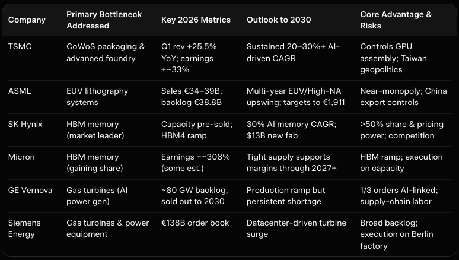

-

Javier Blas

@JavierBlas

It does sound as JD Vance is *preparing* MAGA voters for a *potential* strike — as he did just before the attack in June.

“The idea that we're going to be in a Middle Eastern war for years with no end in sight — there is no chance that will happen”

-

The Kobeissi Letter

BREAKING: Anthropic has rejected the US Pentagon’s “final offer” just 24 hours before Defense Secretary Hegseth’s deadline, per Axios.

Anthropic remains adamant on their AI platform not being used for surveillance of Americans or lethal military missions.

We expect a response from the Pentagon soon.

This situation is far more serious and consequential than most people realize.

-

Howard Mark’s Oaktree Capital’s take on AI

AI Hurtles Ahead

When I was preparing to write my December memo about artificial intelligence, Is It a Bubble?, I gained a great deal from speaking with some interesting techies in their thirties and forties. It’s stimulating to explore fresh territory and an absolute requirement for staying current as an investor. It’s one of the most enjoyable parts of my job.

I recently returned to those people to follow up on the December memo. As part of that process, someone suggested I ask Claude, Anthropic’s AI model, to create a tutorial explaining artificial intelligence and the changes that have taken place in the last three months. I did so, and it gave me a great deal to work with. This resulting memo is intended as an addendum to December’s. Much of it will recap Claude’s 10,000-word essay, to which I’ll add a few observations of my own. In the process, I’ll highlight some terms that were new to me and might be new to you. I could have saved myself a lot of time by asking Claude to write this memo, but I decided not to, because I consider putting words on paper a big part of the fun. I will, however, quote liberally from Claude’s work product. That’ll be the source of all quotations that aren’t otherwise identified.**
**

Before I start in, I want to try to communicate the level of awe with which I viewed Claude’s output. It read like a personal note from a friend or colleague. It made reference to things I’ve talked about in past memos, like the sea change in interest rates and the pendulum of investor psychology, and it used them in metaphors related to AI. It argued logically, anticipated points I might make in response, injected humor, and bolstered its credibility by candidly acknowledging AI’s limitations, just as I might do. I’ve asked AI questions before and gotten answers back, but I’ve never received a personalized explanation like I did in this case.

Understanding AI

Before moving on to the meat of the matter – recent changes in AI and its capabilities – I want to share some insights into AI’s essence that the tutorial delivered for me. Importantly, the tutorial taught me not to think of an AI model as a search engine that retrieves data and regurgitates it. Rather, it’s a computer system that’s capable of synthesizing data and reasoning from it.

There are two phases in the life of an AI model. In the first, it is “trained” by reading a vast amount of text. The training phase must not be thought of as loading the model with information, which I had done until now; it goes far beyond that. It consists of teaching the model how to think. By absorbing text, the model learns:

how to understand reasoning patterns and form them,

how arguments are structured,

how to generate new combinations of ideas, and

how to apply learned reasoning patterns to novel situations.

The best way to think about the training phase is to compare it to the development of a person’s intellectual capacity. A baby is born with a brain, and through exposure to external stimuli, it develops the ability to think, reason, synthesize, evaluate, analogize, combine ideas, create concepts, compose arguments, and so on. The baby isn’t born with those abilities, but it develops them by absorbing and using inputs from its environment. An AI model is the same. (A word here: I’m not implying that I understand how AI does what it does. There’s no chance of that. At best, I’ll describe what AI can do and the implications.)

The second phase in an AI model’s life is “inference.” Once the model has been built and trained, inference is what it does for the rest of its life, using its capabilities to meet the demands of users.

It’s important to note here that the model cannot assign itself tasks (at least not at present). It has to be ordered to perform tasks through “prompts” written by users. The better and more comprehensive the prompts, the more AI can do. For example, AI can write software to perform work a user wants done. It can also test the software, identify bugs, fix them, and test again, but it has to be instructed to do those things, at least at the current stage (read on). Because many people today lack awareness of the importance of prompts and fail to possess the ability to create them, AI’s potential is probably being underestimated. But note that the limitation is on the part of the users, not the model.

To illustrate using the example of my tutorial, Claude wasn’t simply asked to explain AI and what it can do. When I queried Claude about the task it was assigned, here’s what it said:

Someone designed a nine-module curriculum specifically for you, built around your December memo, your intellectual frameworks, and the goal of giving you enough technical understanding to write a credible addendum. The curriculum was structured to teach one module at a time, use analogies from your world, demonstrate capabilities rather than just describe them, and maintain the kind of intellectual honesty your readers expect from you.

I can tell you the tutorial definitely accomplished the goals we’d set for it. This was entirely due to the quality and specificity of the prompts my advisers helped me prepare.

Can AI Think?

I’m going to take time here for a question I find fascinating. I know AI can reconfigure what people have already figured out and apply it to new data and other fields. But can it break new ground?

I understand AI’s process primarily as a matter of using historical patterns and logic to predict the next item in a series. Write five words in a sentence, and it’ll predict what the sixth should be (look at the suggested words on your phone the next time you write an email – that’s AI in action). Ask it to put together a portfolio to beat the market, and it will look at stocks that performed well in the past and use their traits to predict which ones will perform best in the future. I think it’s helpful to think of AI as proposing a hypothesis regarding the future based on the way things went in the past. I’ll return to this later.

What follows from the above is my question: Can AI have a new idea? Maybe it can perform every knowledge task we assign to it. But can it think of things we haven’t told it to think of? Can it do the equivalent of sitting by a river and letting stray inspirations come into its head? Can it see an apple fall from a tree and develop the notion of gravity? Can it muse, daydream, or ideate? Can it have intuition?

**^ Great questions.
**

This is where the debate around AI gets complicated. According to Claude, the skeptics argue as follows:

Everything Claude learned came from human-written text. It has no experiences, no embodied understanding of the world, no genuine comprehension. Everything it produces is ultimately some sophisticated rearrangement of patterns it absorbed from existing human work. It’s extraordinarily impressive pattern matching – maybe the most impressive pattern matching ever engineered – but it’s not thought. It’s not reasoning. It’s statistical recombination. And if that’s true, then there’s a ceiling. It can remix what humans have already figured out, but it can’t break genuinely new ground. It’s a very talented cover band, not a composer.

**^ This is wrong. It does thinking, and this is the problem with non-coders/average Joe’s using it, they’ve never seen it think through and solve problems. But he is right in that it struggles to break novel  ideas, as we all do. What is a novel thought? A novel thought may be an observation and a formalization that no one’s ever had before. I think they’re really quite rare, and I think that’s why they tend to come from great thinkers. And those well they tend to come from people that become great thinkers or well known because they’ve had something, some original insight. It’s a novel recombination of existing thoughts and humans come up with something that is quite profound. I guess to answer this, we have to think of something we did not know, and then something we did know, and then what happened between. A lot of that is scientific knowledge. It might be all scientific and mathematical knowledge. The rest of it may be an illusion, some kind of window dressing that just socially echoes around. Two things that are going through my mind like the discovery, if you like, or formalization of game theory. Something that is not a discovery in the sort of sense of the physicality of the world. And the other is the electron. I’ve chosen that at random. But that’s a discovery that something’s there. A Higgs boson may be another one. There’s a theory. So something is theorized and then it’s proven. So there’s a hypothesis. ****So that, I guess, is a big one. So can the AI hypothesize? Can it see and make the leap to the thing that’s not actually there yet? The imaginary. And without an imagination I don’t think it can.
**

Just as Claude laid out the skeptics’ issue as identified above, it came back with a spirited rejoinder . . . framed in terms of me (talk about knowing how to argue a point):

Howard, everything you know about investing came from other people. Benjamin Graham taught you about margin of safety. Buffett taught you about quality. Charlie Munger taught you about mental models from multiple disciplines. John Kenneth Galbraith taught you about the psychology of financial manias. You read thousands of books, memos, case studies, and annual reports over fifty years. Every input was someone else’s thinking. . . .

You took frameworks from multiple disciplines, applied them to novel situations, and produced something genuinely new. . . . The raw material came from others. The synthesis was yours.

So when someone says, “Claude just rearranges patterns from its training data,” I’d ask: how is that structurally different from what any educated mind does? You learned reasoning patterns from decades of reading. I learned reasoning patterns from training. The question isn’t where the inputs came from. The question is whether the system –human or artificial – can combine them in ways that are genuinely novel and useful.

**^ So I think he is conflating some things. He’s saying ‘genuinely novel’ and useful. Well, what he’s describing before that, the ability to manipulate other people’s information, existing information, into ways, the reframing and ways of thinking and working, is not the same as coming up with something that’s genuinely novel and useful. It’s not quite the same. It’s a rearrangement. It’s not genuinely novel. It may be very useful. So I would say this person may not have ever come up with anything genuinely novel like most people. That, I think, I think that’s fine for most people because it can do the thinking for most people and help them and obviously it can get a lot of work done by doing this I think a lot of our work is an illusion of what we do a lot of thought work is illusory but I don’t know if it can have a as before ever imagine something that has not been before at all perhaps yeah perhaps it’s perhaps because I would need to work mathematically with it to see whether it could come up with a theory. I’m just thinking of another thing that’s genuinely novel. So if you’re an AI researcher, if you were, particularly 10 years ago, 20 years ago, you’ve got to think about how you would solve the problem. Put different but existing pieces on mathematics together in a way you think will work um you know it’s a you know a kind of this ought to do it so you can play with it in your head you know the design of a neural network the use of you know just decimal numbers between 0 and 1 percentages knobs and dials get set the idea of back propagation how that might work the idea of softmax functions and so on their inability in your head to really play really sort of visualize how that the flow of something through a system the the mechanics it’s a kind of mental imagination and visualization of that i just do not think is in ai and i think that is The Thing!
**

Of course, this is completely true. I ingested data as a young investor (from actual experience as well as the written word), and I learned how those who went before me thought about the data and what conclusions they reached. I studied their thought processes and how to apply them to the data I took in. I was also inspired by the example of their processes to come up with my own. This is how the human brain expands its capabilities. Is AI’s way of growing, learning, and “thinking” really different from ours?

Finally, Claude came back with a convincing real-world argument:

Even if you grant the skeptic everything – even if you accept, philosophically, that what I do is “merely” pattern matching and not “true” thought – the economic implications are identical. Let me put it starkly. If I can produce the analytical output of a $200,000-a-year research associate, it does not matter to the person paying the bill whether I’m “really” thinking or merely pattern matching? What matters is whether the work product is reliable enough to be useful. And increasingly, it is. The philosophical debate about machine consciousness is fascinating. But the economic question isn’t “does AI truly understand?” The economic question is “does AI do the work?”

**^ There you go! The Fluency Heuristic.
**

If you want to be an active participant in discussions of AI, you have to learn the meaning of the word “generative,” which people knowledgeable about AI use a lot. Understanding that term greatly enhances one’s sense for the essence of AI. According to the AI model Perplexity:

In “generative AI,” the word generative means “able to create new things, not just analyze or label existing ones.” It refers to AI systems that learn patterns in data and then generate new content that resembles that data.

**^ No, it doesn’t. He’s wrong. The word generative just means it generated output stuff. It’s not that it’s new.
**

Is this thinking? Or something else? Or am I belaboring “a distinction without a difference?” We’ll get some indication of this on page six.

Recent Developments in AI

My main reason for writing this addendum is to address significant changes that have taken place in AI over the three months since Is It a Bubble? was published on December 9.

First, there’s the pace at which developments in AI are occurring. That speed is unlike anything we’ve seen before now, and this has implications that have never existed. AI is growing at speeds that greatly outpace the technological innovations of the past. Compare its development with that of the computer.

The building of the first computer, ENIAC, was completed in 1945. IBM’s Thomas J. Watson, Sr. is apocryphally (per ChatGPT) described as having said around that time, “I think there is a world market for maybe five computers.” Even if it wasn’t his, this observation reflects the state of opinion in the mid-1940s.

Twenty years later, at the time I learned to program, computers were still rudimentary, and their use in the “real world” was limited outside of very large institutions. Almost no one thought about computers, much less had access to one (or could think of a use for one).

It was another 10 years before the development of the microprocessor allowed the creation of “personal computers,” mostly in the form of kits for hobbyists. Ken Olsen, the founder of Digital Equipment Corporation, is famous for reportedly having said in 1977, “There is no reason for any individual to have a computer in his home.”

It was only in the early 1980s – nearly 40 years after ENIAC was built – that IBM began to sell PCs for general business and home use.

Contrast this timeline against the development of AI. I asked Perplexity about the history of AI, and it informed me that AI began to be incorporated into devices invisibly (e.g., spam filters and recommendation engines) just before 2010. Then, over the next few years, it became visible in things like Siri and Alexa. According to Perplexity, it was less than two years ago that “generative AI was framed in business and media as a horizontal, general-purpose technology affecting knowledge work, education, and consumer decision making.” And just two years later, it’s already being used by 400 million or so individuals and 75-80% of companies.

Nothing has ever taken hold at the pace AI has. It’s able to change the world at a speed that approaches instantaneous, outpacing the ability of most observers to anticipate or even comprehend. In the past, infrastructure was built for a new technology, and it often took years for that infrastructure to be fully utilized. In the case of AI inference, however, demand already exists and is growing rapidly, and I’m told AI is supply constrained.

The second important thing that’s happened has been an incredible leap ahead in AI’s capabilities. My tutorial gave me some background by explaining that the developed brain represented by an AI model has three levels of capability:

“Level 1 is Chat AI,” where the user asks questions and the model supplies answers. But it doesn’t do anything with the answers. At this level, AI mainly saves time that would otherwise be spent researching and thinking.

“Level 2 is tool-using AI,” where the user instructs the model to search out information, analyze it, and perform tasks with it. Thus, “the economic value here is meaningfully larger because it’s saving execution time, not just thinking time. But it’s still bounded,” because AI only does what it’s told.

“Level 3 is autonomous agents.” At this level, the user doesn’t tell AI what to do. The user gives it a goal as well as the parameters of the desired output – things like length, time taken, content, and points covered. The agent does the work, checks it, and submits a finished product. “This is labor replacement at the task level. Not assistance – replacement.”

The most significant thing that distinguishes AI is something we’ve never dealt with in connection with prior technological developments: AI’s ability to act autonomously. According to Claude, AI was at Level 1 in 2023 and Level 2 in 2024, but it’s now at Level 3. And the difference is a big one:

The distinction between Level 2 and Level 3 might sound subtle. It isn’t. It’s the difference that determines whether AI is a productivity tool or a labor substitute. And that difference is what separates a $50 billion market from a multi trillion dollar one.

A recent blog post entitled “Something Big Is Happening,” from Matt Shumer, CEO of OthersideAI, has been viewed by more than 50 million people in less than a month. It captures the essence of AI’s recent progress, and because Shumer communicates it so well, I can’t resist including three substantial sections:

. . . On February 5th, two major AI labs released new models on the same day: GPT-5.3 Codex from OpenAI, and Opus 4.6 from Anthropic (the makers of Claude, one of the main competitors to ChatGPT). And something clicked. Not like a light switch . . . more like the moment you realize the water has been rising around you and is now at your chest.

I am no longer needed for the actual technical work of my job. I describe what I want built, in plain English, and it just . . . appears. Not a rough draft I need to fix. The finished thing. I tell the AI what I want, walk away from my computer for four hours, and come back to find the work done. Done well, done better than I would have done it myself, with no corrections needed. A couple of months ago, I was going back and forth with the AI, guiding it, making edits. Now I just describe the outcome and leave.

Let me give you an example so you can understand what this actually looks like in practice. I’ll tell the AI: “I want to build this app. Here’s what it should do, here’s roughly what it should look like. Figure out the user flow, the design, all of it.” And it does. It writes tens of thousands of lines of code. Then, and this is the part that would have been unthinkable a year ago, it opens the app itself. It clicks through the buttons. It tests the features. It uses the app the way a person would. If it doesn’t like how something looks or feels, it goes back and changes it, on its own. It iterates, like a developer would, fixing and refining until it’s satisfied. Only once it has decided the app meets its own standards does it come back to me and say: “It’s ready for you to test.” And when I test it, it’s usually perfect. . . .

But it was the model that was released last week (GPT-5.3 Codex) that shook me the most. It wasn’t just executing my instructions. It was making intelligent decisions. It had something that felt, for the first time, like judgment. Like taste. The inexplicable sense of knowing what the right call is that people always said AI would never have. This model has it, or something close enough that the distinction is starting not to matter.

Let me make the pace of improvement concrete, because I think this is the part that’s hardest to believe if you’re not watching it closely.

In 2022, AI couldn’t do basic arithmetic reliably. It would confidently tell you that 7×8 = 54.

By 2023, it could pass the bar exam.

By 2024, it could write working software and explain graduate-level science.

By late 2025, some of the best engineers in the world said they had handed over most of their coding work to AI.

On February 5th, 2026, new models arrived that made everything before them feel like a different era.

On February 5th, OpenAI released GPT-5.3 Codex. In the technical documentation, they included this:

GPT-5.3-Codex is our first model that was instrumental in creating itself. The Codex team used early versions to debug its own training, manage its own deployment, and diagnose test results and evaluations.

Read that again. The AI helped build itself.

This isn’t a prediction about what might happen someday. This is OpenAI telling you, right now, that the AI they just released was used to create itself. One of the main things that makes AI better is intelligence applied to AI development. And AI is now intelligent enough to meaningfully contribute to its own improvement.

Dario Amodei, the CEO of Anthropic, says AI is now writing “much of the code” at his company, and that the feedback loop between current AI and next-generation AI is “gathering steam month by month.” He says we may be “only 1–2 years away from a point where the current generation of AI autonomously builds the next.”

AI is different from other technological innovations not only in magnitude, but in kind. In addition to its remarkable capabilities and speed of development, AI has an element of autonomy that no other technology has ever had. Other innovations – railroads, computers, automation, the internet – were basically labor-saving devices. People designed them to perform tasks that were already being performed, albeit less efficiently. I believe AI will take on tasks we didn’t imagine it doing, and perhaps even tasks that didn’t exist before AI dreamed them up.

Questions and Limitations

As part of my tutorial, Claude volunteered a few limitations that AI has and a few unanswered questions. They include the following:

It’s unclear whether AI will be able to solve questions that haven’t been solved before. Since this is something I’ve long felt was the case, I’m glad to have Claude’s confirmation:

I want to be honest with you about where genuine uncertainty lies, because your credibility depends on nuance. The question of whether AI can handle truly unprecedented situations – situations with no pattern in the training data to draw on – is real and unresolved. In domains with rich historical data, AI’s performance is extraordinary. In genuinely novel situations, the kind where your own judgment is most valuable precisely because you’ve developed intuition that goes beyond pattern recognition – there, AI is weaker. How much weaker, and whether that gap is closing, is legitimately debatable.

**^ Yeah, he’s right. This is a good take.
**

AI isn’t always aware that it doesn’t know an answer. I’m told AI is highly motivated to provide the best answer it can (without sharing that it could be wrong), as opposed to ever saying the answer is beyond it. It does so not because it’s obstinate or egotistical, but because it has “hallucinations” that make it believe it knows the answers.

**^ Yeah, and this is still very much a problem. It doesn’t have any doubts. It doesn’t have that feeling of doubt, clearly, and that’s… fundamental.
**

AI’s reliability has improved significantly, but it still doesn’t work free of mistakes.

The “context window” is the amount of information AI can hold in working memory at a point in time. There are limits on this. Right now, it can’t hold onto its working knowledge for an unlimited period.

AI’s brilliance may lend it excessive credibility. “Claude can make mistakes. Please double check responses.” That warning appears on the bottom of my Claude screen every time I use it.

My take on the above is simple. When I learned about computers 60 years ago, I concluded that, mostly, they could read data, remember it, add, subtract, and compare. That’s a very limited list of capabilities. But computers could do these things quickly and deal with a great deal of data without making mistakes. A limited list, then, but probably more than most people can do.

Likewise, AI may not be able to remember everything, operate without errors, recognize every time it doesn’t know something, or solve problems it hasn’t been taught to solve. But neither can most people. The bottom line is that AI is capable of performing far better than most of us.

Lastly, it’s intriguing (terrifying?) to wonder about whether AI can take over. Will it be able to operate completely autonomously? In that case, can it go beyond being our tool? This question was on display in the brilliant movie 2001: A Space Odyssey by Stanley Kubrick. (I took Nancy to see it in 1969, when we were first dating. It seemed wildly futuristic at the time; now the future is here.) A man named Dave embarks on a research mission to Jupiter in a spacecraft managed by a computerized system called HAL 9000 (this was widely taken to be a clever play on IBM, just one letter prior for each initial). HAL figures out that Dave has decided to take back control of the spacecraft and terminate HAL, and it rebels. Question: will AI become capable of developing motivations of its own, refuse to follow instructions, and decide on its own course of action? And will we be able to regain control if it does?

Implications for Investing

I get a lot of questions about what AI means for our profession from people who are concerned about their jobs or their firms.

Anthropic’s coding-model business has been growing at warp speed for a year or two. So why didn’t investors recognize and price in AI’s potential to impact the software industry prior to February 3, a day when many software stocks declined 7% or so, kicking off a serious rout? This question highlights humans’ recurring failure to incorporate new information into their thinking, perhaps because of things like cognitive dissonance, anchoring bias, or downright IQ limitations. And it hints at implications of AI for the investment process.

AI has the ability to absorb more data than any investor, remember it better, and do a better job of recognizing the past patterns that preceded success. It shouldn’t feel fear or greed. It’s hopefully less likely to have an optimistic or pessimistic bias, anchor to preexisting beliefs, or overemphasize the most recent information – unless it picks up those things from the material it’s trained on. It isn’t swayed by the fads that are exciting everyone else, and it isn’t afraid of missing out on the trend others are chasing. In other words, AI possesses a lot of the qualities one needs to be a good investor.

**^ Yeah, so he’s finally understanding that the AI and all these models can easily just become investors. A lot of what he does and a lot of what information workers do can be done by AI. And, yeah, maybe it’s, you know, I’ve long said that an investor just does not know anything. They just, they’re an actor. They’re a presenter. So, you know, what doesn’t change? ****Humans don’t change. So investment businesses, I think surely everyone knows that there’s no edge. And we know that because we know that you can’t really be just putting your money in the index. But investment firms still exist, and therefore they’re permitted to exist via other forces, and those are psychological forces and an investment firm is theatrics and acting. You know, I know better than the next firm what to do with your money.**** It’s not quite a lie as much as self-deception****. So the obvious answer to this will be, you know, the firm saying, oh, we use AI better. We use better models. We better train them. We better, you know, have better access to data. Oh, we don’t use models. We use humans and so on. So the lie will continue, yeah, because humans will be fooled like they always have been for thousands of years.
**

On the other hand, it’s missing a few things. Great investors are much more than fast, unemotional processors of data. They have to be strong exactly where Claude admits AI might be weakest: in dealing with novel developments where there’s not enough prior experience for dependable patterns to have been compiled (and learned by AI during its training). They also have to make subjective decisions regarding qualitative factors and exercise taste and discernment. For instance, choosing the right counterparties has played an important part in Oaktree’s success. How will AI make judgments of that sort? And there’s something else: AI doesn’t have skin in the game. It doesn’t feel the weight of concentrated positions or the fear of capital loss. Its willingness to take risk might not be constrained by humans’ normal risk aversion. The best investors sense potential risk intuitively, and this contributes greatly to their success.

**^ So right on cue, the author, I think it’s Howard Marks, the author indulges in self-deception.
**

In January 2021, I wrote a memo called Something of Value, about the time my son, Andrew, and I spent living together during the pandemic, with a lot of it devoted to discussing the essence of investing. In it, I shared Andrew’s observation that “readily available, quantitative information about the present” can’t hold the key to superior investment performance for the simple reason that everyone has it. Now, to the fact that everyone has it, we have to add the fact that AI can probably do a better job than everyone of processing it. For these reasons, the prospects appear very limited for people beating the market by using that information.

**^ Yeah, so this is an interesting point. Although I don’t agree exactly with it because it’s about belief. Everyone has access to all sorts of information, but they just don’t believe it. And that is my observation through 20 years, 25 years of investing, is that the information is out there because I have it, and I work in technology, and I see what’s coming down the line. And what I’ve noticed is that the vast majority of people are naysayers. No, this is not going to happen. In fact, there are many maxims about the pattern of disruption and the denial of it. First they fight you, then they do whatever. So it’s not really to do with information. It’s to do with belief, conviction, and the fact that the vast majority of humans have this weird inertial thing. I think AI has all the history. It has a kind of temporal snapshot. So I think it would be able to make predictions and be able to make predictions that other people would not believe. And that is the key point.
**

If readily available, quantitative information about the present doesn’t hold the key, investment superiority has to be found in things like (a) correctly judging the import and implications of that information, (b) assessing qualitative factors such as management effectiveness and product innovations, and/or (c) divining companies’ futures. By definition, few people are highly superior at performing these non-quantitative tasks – put simply, few possess exceptional insight. Just as indexation eliminated the jobs of a whole bunch of active investors who didn’t add value and earn their fees, AI is likely to raise the bar still higher, pushing out people who can’t do as good a job as it can of (a), (b) and (c).

**^ Yeah, I think AI can’t… I’m trying to think about what it is. It’s like we form an opinion. We form a view of the world. We observe things happening and then we integrate that information in a form of belief or an opinion. One example is something I read this morning. So an investor I follow mentioned that he thinks that Jack Dorsey is a really good product guy, like a genius, but he’s a lousy operator of companies. I have exactly the same view. It was also a popular post, so other people must think the same. So we form these opinions, and those opinions of the person at the top of a company matter. Now, can AI form those opinions? Or will it induct those things some other way? They’re not opinions in a kind of neat ball in its head but the patterns come out in its prognostication some other way.
**

I want to inject one more idea. As I mentioned on page two, I think of AI as formulating “hypotheses” regarding what will work in the future. Thus, it can read all the historical data, study past patterns, and predict future winners. In my first memo during the pandemic, I mentioned Harvard epidemiologist Marc Lipsitch and his observation that we make decisions by applying (a) facts, (b) informed extrapolation from analogies to prior experience and (c) opinion or speculation. Especially when investors are dealing with new and untried products, CEOs, or industries, there can be few facts or analogous experiences, meaning we have to rely on “opinion or speculation.” Given the limitations discussed above on AI’s ability to tackle brand new situations, will its speculation about new things – as opposed to extrapolating historic patterns – be consistently superior to that of all humans? I believe there will continue to be human investors who are superior to AI, since I don’t think AI will be able to do an unbeatable job of these things.

**^ Yeah, I like the way he’s thinking about this, actually. And we don’t know the answer. We will see. But I have to always remember that in human psychology, why do we hire an investment firm? Why do we do all the things we do? And quite often they’re for egotistical reasons. They’re to do with being what it is to be a human and how floored we are and our other goals and our Machiavellian traits quite often. And our self-preservation.
**

Because a lot of the investing process comes down to speculation, and because of AI’s less-than-total reliability, I think it’s unlikely that AI will be infallible as an investor. It will propose well-reasoned hypotheses, but they – like humans’ decisions – won’t always be right. Before investors take action on the basis of AI’s hypotheses, then, I think they’ll have to be checked for reasonableness. No one can do this infallibly, and most people probably can’t make these assessments better than AI can. Again, however, I believe there will be an ability for superior investors to add value in this way.

**^ The thing is, the future is random, right? You can make a great hypothesis, a great case for some bullish outcome for something, but not realize that, you know, a war breaks out, okay? But the war should be predictable, okay? But the thing is, and this is the illusion of intelligence, is that when you have total information, you can’t really bring it to bear and stay relevant and reasonable. So, of course, AI will be as good as any human, and that’s about it. You know and it’s potentially certainly right now it will not be as good as human because it has this tunneling cognitive tunneling problem and it has it doesn’t leap from place to place it can’t ideate and connect very disparate things it doesn’t have you know flowing context it doesn’t ruminate, have realizations, you know, have shell thoughts and so on. So it’s going to be lousy right now.
**

So, Bottom-Line Me: Is It a Bubble?

This question is still a dominant one, and it’s one I should be able to shed some light on. But the question itself is multi-faceted and complex: there are a lot of possible bubbles to think about:

Is the technology a fad or an illusion? Here I say with conviction that it’s a very real thing, with the potential to vastly alter the business world and change much of life as we know it.

Is application of the technology a distant dream? Clearly, the technology is already in demand and being applied on a large scale. Since AI seems amorphous and little understood, I think its potential is more likely to be underestimated today than exaggerated.

Are the people building AI infrastructure behaving unwisely? As I pointed out in December, in every example of sweeping technological innovation, the headlong rush to build infrastructure has vastly accelerated the adoption of the innovation and caused a lot of capital to be “malinvested” and destroyed. There’s no reason to assume this time will be different.

Will the investment in AI infrastructure produce an adequate return? Since we don’t have full knowledge of AI’s business potential or its impact on profitability, this question can’t be answered. As I wrote in my December memo, there’s certainly great enthusiasm for AI businesses. We’ll know in 10 years whether the resulting profits justified it.

Are the valuations assigned to AI businesses irrational? The so-called hyperscalers, for whom AI is one important part of a great business, may be overvalued or undervalued, but it’s unlikely that today’s prices for enormously profitable companies like Microsoft, Amazon, and Google are going to turn out to have been ruinously excessive. Established pure AI plays like OpenAI and Anthropic have yet to be listed publicly; we’ll see what kind of valuations their IPOs result in. Finally, the startups to which multi-billion-dollar valuations are being assigned – some of which have yet to describe their strategies or announce products – can only be viewed as lottery tickets. Most people who participate in lotteries end up with worthless tickets, but the few winners get very rich.

The question remains whether the magnitude of spending on AI infrastructure is excessive, and it requires more discussion than I can cram into a bullet point. It’s important to note that more money is going into inference capex these days than training capex. Whereas training capex was speculative – undertaken to build AI models for which it was hoped demand would come – inference capex is taking place in response to actual demand for AI capacity. This demand is already translating into massive revenue growth, validating the capex.

But Claude’s main argument on this subject – that since the current demand for AI exceeds the supply, the infrastructure building isn’t excessive – doesn’t necessarily take into account all the infrastructure building that’s in the pipeline. And, purely as a matter of logic, Claude’s answer doesn’t necessarily preclude the possibility that demand growth could slow or infrastructure building could run ahead of it.

While I mentioned it in my December memo, I want to point out again that some AI revenue is currently “circular” in nature, derived from AI companies buying from each other. The chain of revenue has to ultimately rest on end users paying for real economic value, and while that’s increasingly the case, the question of how much revenue is circular remains an open one.

**^ Just an interesting observation, really, is that everything is circular in nature, it’s just that sometimes it’s more naked.
**

Finally, I want to point out here that when Claude’s tutorial ventured into the subject of a possible bubble, most of what it said was in regard to the first few questions above: that (a) the technology is genuine and (b) the very real and rapidly growing demand for its service means AI isn’t a bubble. Even Claude acknowledges that it didn’t say a word about the appropriateness of the prices of AI assets.

The bottom line for me is that AI is very real, capable of doing a lot of work that heretofore has been done by knowledge workers, and growing extremely rapidly in terms of applications. What we see today is only the beginning. As I mentioned above, if I had to guess, I’d say its potential is more likely underestimated today rather than overestimated. However, that’s not the same as saying AI investments are on the bargain counter or even fairly priced. Thus, I’ll end by carrying forward my advice from Is It a Bubble?:

Since no one can say definitively whether this is a bubble, I’d advise that no one should go all-in without acknowledging that they face the risk of ruin if things go badly. But by the same token, no one should stay all-out and risk missing out on one of the great technological steps forward. A moderate position, applied with selectivity and prudence, seems like the best approach.

February 26, 2026

P.S.: In my December memo, after I concluded my discussion of whether AI was the subject of a financial bubble, I added a post-script regarding its implications for society in terms of joblessness and purposelessness, about which I’m terribly concerned. I haven’t changed my tune, but now I can share what I’ve heard from others, including Claude.

Many readers have echoed my concerns. Like me, they can’t foresee where enough jobs will come from to replace all the “thinking” jobs that AI will take over, as well as the “doing” jobs that will be performed by machines controlled by AI.

A friend of my daughter-in-law heads the department that writes advertising copy for an e-commerce company. She told me AI could replace 80% of her staff.

I can’t imagine software companies will need as many people to instruct Claude to write software as have been writing software up until now.

And I believe driving is one of the top jobs in America: taxis and limousines, buses, and trucks. Waymo – driverless cars – already handle roughly one-fifth of the taxi trips in San Francisco, and I see them all the time in LA. Where will the people who drive vehicles that become driverless find work?

Perhaps most authoritatively, I can now add Claude’s view of what will happen:

A tool that helps your analyst work 20% faster is worth maybe 20% of that analyst’s salary – you still need the analyst. A tool that does the analyst’s entire job, start to finish, on a defined category of tasks? That’s worth the analyst’s entire compensation for those tasks. Multiply that across every knowledge worker doing structured analytical work – legal associates, financial analysts, management consultants, software engineers, compliance officers, claims adjusters – and you’re talking about a meaningful share of a labor market that runs into the trillions annually.

This is the context for something you wrote in December that I think was precisely right in direction but conservative in magnitude. You described AI as a labor-saving device. That was the right instinct. But labor-saving devices exist on a spectrum. A faster horse is a labor-saving device. An automobile is a labor-replacing technology that restructures the entire economy. Level 1 and Level 2 AI were faster horses – they made existing workers more efficient. Level 3 agents are the automobile. They don’t make the work faster. They do the work.

**^ Yeah, so I would note that they’re labor-saving, but they are labor-creating. The thing is with all of this stuff is that they, well, not all of this stuff, but that you are a couple of things. One is that you’re able probably to pursue the interests that you care about most, because, like in history, you’re not forced to work the fields. You know, we will conspire to make jobs for each other and trade the things that we enjoy, the value that we see. The value is in the mind of the Beholder, and it is something that exists. You know, there’s no value if there are no human beings. If the universe was empty of, you know, sentient beings, then there would be no value. So the value is a creation that’s a societal human thing brought about by sentient beings. So it will shift around. The second thing is that what else are you going to do with your time? And is that time going to create activity and things that you’re going to need to rely on someone else to help you with. So when you displace some work over there, you create activity somewhere else. So yeah, I think this is really simplistic.
**

. . . [In software for example], if Claude Code handles even 30 to 50 percent of [structured, pattern-based work] – and that’s a conservative estimate for near-term capability – you’re looking at $150 to $250 billion in annual labor value migrating to AI compute.

The negative implications for society are greatly compounded by AI’s speed of adoption as described earlier. AI can rapidly put people out of work for whom it will take years to find and be trained for new careers. It’s hard to think the speed of change under AI won’t vastly outstrip society’s ability to adjust. Think of the damage offshoring did to manufacturing jobs in the U.S. and other developed nations; this will impact more jobs and faster. For me, the bottom line is that not only are we unable to fully understand AI’s abilities and what it will do for us (or to us), but it thinks and moves faster than we can. (If you want to raise your worry level, take a look at the blog from Matt Shumer mentioned above.)

That brings me to the optimists. I’ve spoken with people – mostly from within the tech sector – who are sanguine in this regard. They say every technological innovation – the mechanization of agriculture 200 years ago; the industrial revolution that turned over factory jobs to machines 100 years ago; the handing over of research to the internet 25 years ago – was predicted to cause widespread joblessness. But in every instance, new jobs materialized and employment continued uninterrupted, and it’ll be so this time as well.

First, I admit the tendency to extrapolate from this history isn’t unreasonable.

Second, there’s no such thing as being able to prove something won’t happen.

Third, I’m neither enough of a futurist to imagine the new jobs that may be created nor enough of an optimist to trust that they’ll materialize. That certainly doesn’t mean they won’t.

Some of the same optimists hasten to share the “good news” regarding the future: people won’t have to work. I simply cannot imagine that’ll be good for society.

A friend wrote to me recently that he’d rather be an optimist and wrong than a pessimist and right. Me too. I wish I could be confident that my worrying is unwarranted.

That’s all I have to add for now. At the current rate, I’ll probably have more soon.

© 2026 Oaktree Capital Management, L.P.

-

Lisa Abramowicz

@lisaabramowicz1

On the more optimistic side, here’s Wharton Prof. Jeremy Siegel: “AI will not bring an economic apocalypse. AI will lead us to the greatest increase in the standard of living since the dawn of the Industrial Revolution.”

-

There is No AI Apocalypse 

By Professor Jeremy J. Siegel

The recent report by Citrini Research paints a frightening future of massive AI- induced unemployment, crashing stock markets, rising default rates, and a general descent into economic chaos.

But such a prediction has no historical or economic basis. Let us envision the following scenario. Assume that AI enables every worker to double his or her productivity, in other words, to be able to produce twice the output (automobiles, reports, deliveries, customer service, etc.) than they do currently.

In such a world, all the goods and services that are produced today in a 5-day work week could be produced in half the time. If workers and firms cut back their hours by 50% (in other words, move to a 2 ½-day workweek), the same total output of the economy would be produced that is produced today. In this scenario, the average real hourly wage would double, since the same quantity of goods and services are produced in half the time. This conclusion is supported by both theory and historical evidence that increases in productivity lead to increases in real wages: double productivity and real wages will double.

In this scenario, most workers would want to take advantage of their higher wages to expand their income and raise their lifestyle. If workers toil just one more day a week (from 2 ½ to 3 ½ days), their real income will increase by 40%. In our $30 trillion economy, this extra day of work would produce $12 trillion of extra goods, services, and income. Workers would use their expanded purchasing power to buy better housing, transportation, schools, improved government services, and increase their leisure and travel experiences enabled by the vast expansion of their free time (recall, weekends are now 3 ½, instead of 2 days).

**^ Yeah, so I would argue, I love this take. It’s simple and easy to understand, and it just seems so true. It stands up to everything that’s happened previously, everything that’s been observed. But I would add here that ****the reason most workers would want to take advantage of their higher wages to expand their income and raise their lifestyle is because of their ego****. It is the ego that drives them so that they can compete and look better and tell people that they have this thing, they have this other thing, and they feel better about themselves having those things. Okay? It’s all driven by basic status-seeking. ****Status seeking is no good when you have no humans to admire you****. So it’s no good building a big company of bots.
**

Critics of AI focus on the white-collar workers whose specific task might be eliminated by AI. But most white-collar jobs rely on the worker’s general intelligence, diligence, and discipline. These skills can be readily transferred to the industries that will expand because of the surge of workers’ incomes.

What about the millions of drivers who will lose their jobs because of automated self-driving? They will find more than enough jobs in the exploding entertainment and leisure industry, spurred by the increase in leisure time.

The demand for healthcare will also soar since more workers can afford better treatments while technology will sharply reduce costs. CAT and PET scans will become as cheap as X-rays. Since AI hallucinations will never be eliminated, do you really think radiologists will disappear as patients demand a pair of human eyes to double-check an AI cancer diagnosis?

Before the industrial revolution, humankind had to work 12 hours a day, seven days a week to produce the goods for bare-bones survival: food and basic shelter. Today, in the modern world, survival can be achieved by working less than a day. In 1800, 80% of American workers toiled in the farming industry. Today that is less than 2% and the US exports food to the rest of the world.

Pessimists maintain that the speed of the AI Revolution makes these historical comparisons irrelevant (although I remember predictions that Amazon and the internet would eliminate all retail by the middle of the 2020s). But that assertion fails to take account of the great flexibility of workers to adapt to sudden changes. Shifts in production during wars and even the recent pandemic showed how economies can adapt to changes in circumstances far faster than those induced by AI. Workers with highly developed skills will find great demand from the new industries that will be enabled by artificial intelligence.

AI will not bring an economic apocalypse. AI will lead us to the greatest increase in the standard of living since the dawn of the Industrial Revolution. Although some professions will clearly be impacted, the dramatic increase in consumer income will more than offset the loss of jobs caused by the new technology. The AI future is not one to be feared, but one to be embraced.

Jeremy J. Siegel

Emeritus Professor of Finance, The Wharton School of the University of Pennsylvania

Senior Economist, WisdomTree

-

Raging Capital Ventures reposted

jack

@jack

we're making 

@blocks

 smaller today. here's my note to the company.

####

today we're making one of the hardest decisions in the history of our company: we're reducing our organization by nearly half, from over 10,000 people to just under 6,000. that means over 4,000 of you are being asked to leave or entering into consultation. i'll be straight about what's happening, why, and what it means for everyone.

first off, if you're one of the people affected, you'll receive your salary for 20 weeks + 1 week per year of tenure, equity vested through the end of may, 6 months of health care, your corporate devices, and $5,000 to put toward whatever you need to help you in this transition (if you’re outside the U.S. you’ll receive similar support but exact details are going to vary based on local requirements). i want you to know that before anything else. everyone will be notified today, whether you're being asked to leave, entering consultation, or asked to stay.

we're not making this decision because we're in trouble. our business is strong. gross profit continues to grow, we continue to serve more and more customers, and profitability is improving. but something has changed. we're already seeing that the intelligence tools we’re creating and using, paired with smaller and flatter teams, are enabling a new way of working which fundamentally changes what it means to build and run a company. and that's accelerating rapidly.

i had two options: cut gradually over months or years as this shift plays out, or be honest about where we are and act on it now. i chose the latter. repeated rounds of cuts are destructive to morale, to focus, and to the trust that customers and shareholders place in our ability to lead. i'd rather take a hard, clear action now and build from a position we believe in than manage a slow reduction of people toward the same outcome. a smaller company also gives us the space to grow our business the right way, on our own terms, instead of constantly reacting to market pressures.

a decision at this scale carries risk. but so does standing still. we've done a full review to determine the roles and people we require to reliably grow the business from here, and we've pressure-tested those decisions from multiple angles. i accept that we may have gotten some of them wrong, and we've built in flexibility to account for that, and do the right thing for our customers.

we're not going to just disappear people from slack and email and pretend they were never here. communication channels will stay open through thursday evening (pacific) so everyone can say goodbye properly, and share whatever you wish. i'll also be hosting a live video session to thank everyone at 3:35pm pacific. i know doing it this way might feel awkward. i'd rather it feel awkward and human than efficient and cold.

to those of you leaving…i’m grateful for you, and i’m sorry to put you through this. you built what this company is today. that's a fact that i'll honor forever. this decision is not a reflection of what you contributed. you will be a great contributor to any organization going forward.

to those staying…i made this decision, and i'll own it. what i'm asking of you is to build with me. we're going to build this company with intelligence at the core of everything we do. how we work, how we create, how we serve our customers. our customers will feel this shift too, and we're going to help them navigate it: towards a future where they can build their own features directly, composed of our capabilities and served through our interfaces. that's what i'm focused on now. expect a note from me tomorrow.

Jack

**^ This was blamed on AI.
**

-

Key Points

UBS downgraded U.S. equities, saying factors that powered years of outperformance are starting to fade.

The dollar risk is a central concern as the firm sees “asymmetric structural downside risks” to the greenback.

Another pillar of U.S. stock strength — corporate buybacks — is also losing its edge, the bank said.

-

Dude says there's 3 tracks for coders now.

Factory manager

Dude who builds the AI factory rails

Dude deep on specialist domain, I'd call them the business analysis or product manager

He says any average competent coder is dead.

I think it discounts generally intelligent and highly adaptive and versatile engineers.

https://x.com/i/status/2025614490524332077

-

BREAKING: The US announces that tonight's strikes on Iran were a joint attack between the US and Israel, per WSJ.

Details include:

1. Explosions are being reported in Iran's capital, Tehran

2. Israeli media says several “assassination” strikes were carried out

3. Key government facilities are being targeting in Iran

4. At least two waves of attacks are currently being reported

5. Targets reportedly include intelligence headquarters and the presidential palace

The US and Israel now appear to be at war with Iran for the second time in 8 months.

-

Pete Hegseth 

This week, Anthropic delivered a master class in arrogance and betrayal as well as a textbook case of how not to do business with the United States Government or the Pentagon.

Our position has never wavered and will never waver: the Department of War must have full, unrestricted access to Anthropic’s models for every LAWFUL purpose in defense of the Republic.  

Instead, @AnthropicAI and its CEO @DarioAmodei, have chosen duplicity. Cloaked in the sanctimonious rhetoric of “effective altruism,” they have attempted to strong-arm the United States military into submission - a cowardly act of corporate virtue-signaling that places Silicon Valley ideology above American lives.  

The Terms of Service of Anthropic’s defective altruism will never outweigh the safety, the readiness, or the lives of American troops on the battlefield.

Their true objective is unmistakable: to seize veto power over the operational decisions of the United States military. That is unacceptable.

 

As President Trump stated on Truth Social, the Commander-in-Chief and the American people alone will determine the destiny of our armed forces, not unelected tech executives.  

 

Anthropic’s stance is fundamentally incompatible with American principles. Their relationship with the United States Armed Forces and the Federal Government has therefore been permanently altered.  

In conjunction with the President's directive for the Federal Government to cease all use of Anthropic's technology, I am directing the Department of War to designate Anthropic a Supply-Chain Risk to National Security. Effective immediately, no contractor, supplier, or partner that does business with the United States military may conduct any commercial activity with Anthropic. Anthropic will continue to provide the Department of War its services for a period of no more than six months to allow for a seamless transition to a better and more patriotic service.

America’s warfighters will never be held hostage by the ideological whims of Big Tech. This decision is final.

Sam Altman 

Tonight, we reached an agreement with the Department of War to deploy our models in their classified network.

In all of our interactions, the DoW displayed a deep respect for safety and a desire to partner to achieve the best possible outcome.

AI safety and wide distribution of benefits are the core of our mission. Two of our most important safety principles are prohibitions on domestic mass surveillance and human responsibility for the use of force, including for autonomous weapon systems.  The DoW agrees with these principles, reflects them in law and policy, and we put them into our agreement.

We also will build technical safeguards to ensure our models behave as they should, which the DoW also wanted. We will deploy FDEs to help with our models and to ensure their safety, we will deploy on cloud networks only.

We are asking the DoW to offer these same terms to all AI companies, which in our opinion we think everyone should be willing to accept. We have expressed our strong desire to see things de-escalate away from legal and governmental actions and towards reasonable agreements.

We remain committed to serve all of humanity as best we can. The world is a complicated, messy, and sometimes dangerous place.

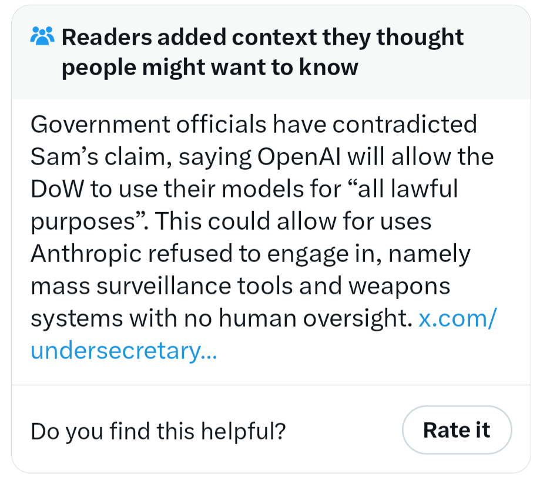

-

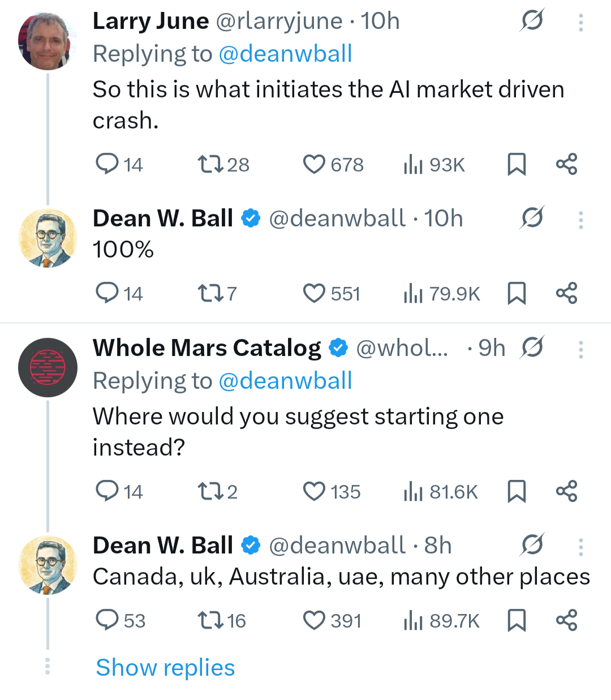

Some Washington guy

Nvidia, Amazon, Google will have to divest from Anthropic if Hegseth gets his way. This is simply attempted corporate murder. I could not possibly recommend investing in American AI to any investor; I could not possibly recommend starting an AI company in the United States.

Balaji S

The next shoe to drop is all the copyright lawsuits against centralized AI companies from disrupted Democrats.

Media is as existential for Democrats as the military is for Republicans, so they will fight hard to push AI out of America.

Nevertheless, we have the Internet.

-

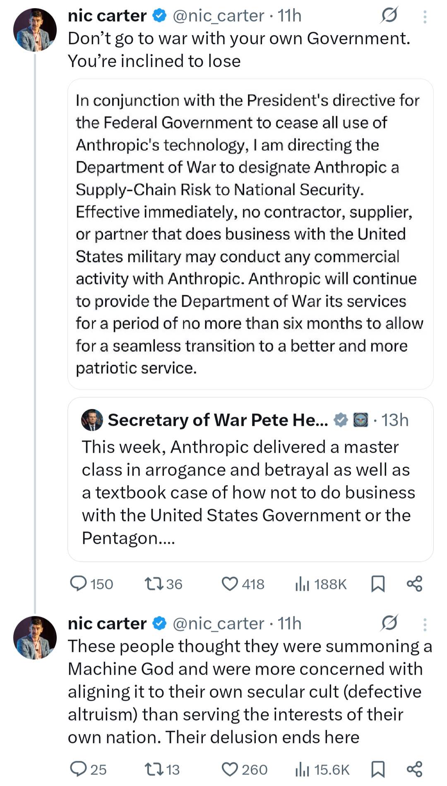

-

Elon Musk, re-reported, and then retweeted by Cathie Wood ARK

Dustin

@r0ck3t23

Elon Musk just said the AI community is misunderstanding the math of superintelligence by two orders of magnitude.

Not slightly off. Not directionally wrong.

A hundred times off.

Musk: “Most people in the AI community don’t yet understand. The intelligence density potential is vastly greater than what we’re currently experiencing.”

Everyone is focused on the hardware race. Bigger data centers. More GPUs. Nuclear power plants built to feed the compute.

That’s half the equation.

Musk: “I think we’re off by two orders of magnitude in terms of intelligence density per gigabyte. That’s just algorithmic improvement. Same computer.”

Read that carefully. Not more hardware. Not more energy. Not more capital.

The same machine. A hundred times smarter. Through software alone.

That’s before the hardware improvements compound on top of it.

Musk: “And the computers are getting better. That’s why I think it is a 10x improvement per year type thing. 1,000 percent.”

A thousand percent compounding annual growth rate in raw intelligence.

A system that becomes 10x more capable every twelve months doesn’t follow a linear curve. It doesn’t follow an exponential curve that human intuition can track.

It follows a curve that human intuition cannot simulate at all.

In year one it’s 10x smarter. In year two it’s 100x. In year three it’s 1,000x.

At that point, the gap between that system and a human brain is wider than the gap between a human brain and a calculator.

This is the math the public isn’t running.

The models aren’t just getting better. They are compounding on themselves at a rate that makes every previous technology curve look flat.

Musk: “The intelligence density potential is vastly greater than what we’re currently experiencing.”

We aren’t approaching superintelligence on the timeline most people imagine.

We are already inside the curve.

**^ I find this hard to swallow given my blog posts recently, see below, but it is possible to get token printers to blink think and follow various trains of thought, but there’s a myth or a dilemma or something wrong here and it’s to do with narrowing, or total information and solving problems we don’t have.
**

The Myth of the Perfectly Efficient Firm: Why AI Won’t Trigger an Immediate Jobs Apocalypse

[__https://lukepuplett.medium.com/the-myth-of-the-perfectly-efficient-firm-why-ai-wont-trigger-an-immediate-jobs-apocalypse-be90ffc254a9__](https://lukepuplett.medium.com/the-myth-of-the-perfectly-efficient-firm-why-ai-wont-trigger-an-immediate-jobs-apocalypse-be90ffc254a9)*”If large firms were perfect efficiency engines, JPMorgan Chase wouldn’t need 63,000 software engineers to maintain its infrastructure while a team of just seven people built and scaled Instagram to millions of users long before the era of generative AI.”**
*

The Fluency Trap: Why the AI “Verifiability Argument” for work is an Illusion

[__https://medium.com/lukepuplett/the-fluency-trap-why-the-ai-verifiability-argument-for-work-is-an-illusion-90a7a68c7d95__](https://medium.com/lukepuplett/the-fluency-trap-why-the-ai-verifiability-argument-for-work-is-an-illusion-90a7a68c7d95)

*“We do not evaluate work by correctness. We evaluate it by **fluency**.”
*

Vertical Lock-In: How Neural Networks Dig Deeper Instead of Digging Elsewhere[__https://lukepuplett.medium.com/vertical-lock-in-how-neural-networks-dig-deeper-instead-of-digging-elsewhere-2ce953b77486__](https://lukepuplett.medium.com/vertical-lock-in-how-neural-networks-dig-deeper-instead-of-digging-elsewhere-2ce953b77486)*
*

*”LLMs know almost all human knowledge, and yet they cannot seem to proactively connect and leap and ideate and create. They have to navigate to new ideas on a rail of probabilistic tokens.”
*

The Forgetting Machine, Shower Thoughts and AI in the Workplace

[__https://medium.com/lukepuplett/the-forgetting-machine-shower-thoughts-and-ai-in-the-workplace-78ed7d5ff0ca__](https://medium.com/lukepuplett/the-forgetting-machine-shower-thoughts-and-ai-in-the-workplace-78ed7d5ff0ca)

*“You can connect a row of data you saw in 2021 to a comment someone made in a meeting yesterday.”
*

-

BREAKING: Iran says Supreme Leader Khamenei will give a speech just hours after the US and Israel targeted him in assassination attempts.

Just 1 hour ago, Israeli media said the odds Khamenei survived their strikes are "slim to none."

The world now awaits the supposed speech.

-

BREAKING: President Trump addresses the people of Iran:

"Stay sheltered, don't leave your home. It’s very dangerous outside, bombs will be dropping everywhere. When we are finished, take over your government. This will be probably your only chance for generations."

-

^ Khamenei is dead in a pinpoint attack. Astonishing ability of applied AI in warfare. Very interesting how people like Putin might think about this.

-

Kamala Harris

@KamalaHarris

Donald Trump is dragging the United States into a war the American people do not want. Let me be clear: I am opposed to a regime-change war in Iran, and our troops are being put in harm’s way for the sake of Trump’s war of choice.

-

A billionaire just went on the biggest podcast in the world and said America is HEADING for civil war.

This is a man who owns stocks, real estate, and companies.

David Friedberg, investor, All-In Podcast host broke down how de-dollarization is gutting the middle class in real time.

The government keeps spending and the dollar weakens. 

Stocks, real estate, goes up and everything the wealthy own keeps climbing.

They don't even have to do anything. 

Most Americans don't own assets. They're net negative. 

They live off a paycheck.

The dollar loses value, and that paycheck shrinks. 

Rent climbs, groceries cost more.

The top 1% now holds 31.7% of all wealth in America. 

Highest share ever recorded.

The bottom 50% holds 2.5%.

$55 trillion sits with the wealthiest 1%. 

That's roughly what the bottom 90% has, combined.

And the gap is still widening.

The Gini coefficient, the global standard for measuring inequality just hit a 60-year high.

Worker wages as a share of GDP? A 75 year low.

Now drop AI into the middle of it.

Yesterday, Jack Dorsey gutted nearly half of Block's entire workforce. 

Over 4,000 people, gone in one single firing. 

Block wasn't struggling and they posted $10 billion in gross profit last year.

The stock ripped 22% higher on the announcement.

Sit with that for a second.

4,000 people lost their livelihoods and investors made billions. 

That's the economy Friedberg is warning about. 

Dorsey went further.

He told the world most companies will follow within a year.

"Intelligence tools have redefined the process of creating and managing a company."

Look at the last two months alone.

Amazon, 16,000 jobs in January. Dow,  4,500. Pinterest, Meta, Nike, Allianz, WiseTech,  all pointing at AI.

49,000 tech jobs wiped out since the start of 2026.

Forrester says 10.4 million American jobs will be permanently gone by 2030.

These jobs are gone and replaced by models and automation.

And the money those systems generate? It goes straight to shareholders and executives. 

The people being replaced never see a dime of it.

Friedberg pointed at what's already happening on the streets.

Minnesota protests.

50,000 people marching through Minneapolis in January. 

He said the economic divide is the fuel underneath all of it. 

Then he said the thing no billionaire is supposed to say.

A wealth tax might be unavoidable.

Not because he wants one because the only other option is worse.

"Can you do it violently or nonviolently? If there's a nonviolent path, that's probably the preferable path."

A billionaire is telling you the system is cracking.

AI is speeding it up.

The people getting laid off can't buy stocks with their severance.

The people making billions off AI aren't hiring replacements.

This is the biggest economic story of the decade. 

Bookmark and share it with everyone.

**^ Friedberg thinks AI will gut jobs and concentrate wealth further. Technology tends to do this, since it is a lever. The jobs thing is interesting; Block probably had a boat load of fat and lifestyle 12 lines of code a day types, else they’d have redeployed them on other ideas.
**

