# 2026 03

---

-

Taelin

@VictorTaelin

Ok, I think my experiment leaving AI working on stuff 24/7 ends here. It doesn't work. Code explodes in complexity, results are not that great, the AI can't get past hard walls (it is still completely unable to even *grasp* SupGen), and it is insanely expensive (spent ~1k over the last 2 days). The best results are on the JS compiler, mostly because it is familiar (compared to inets), but not worth losing control over the codebase.

I think the dream of having AI's working on the background and making real progress on things that matter (i.e., truly new things) isn't here yet. It is still a machine hard-stuck on its own training data, incapable of thinking out of the box. It is great for building things that were already built. But not new things

Also coding normally has the under-appreciated advantage that you're doing two things at the same time: building a codebase *and* learning it. AI's do only half of that. The other half is obviously impossible 🤔

-

Truflation US CPI is 0.78% today after a significant wave of cooling across multiple categories:  

- Housing (-0.20%), 

- Utilities (-0.16%), 

- Transport (-0.13%), 

- and Food (-0.10%). 

Our index often sees increased volatility on the 1st of the month as multiple latest data streams in, including rents, utilities, insurance, communications, and education fees.

-

Jim Sciutto

@jimsciutto

Worth noting as we watch Iran: Russia has now seen three friends felled or diminished in little over a year: Syria, Venezuela and Iran, with no apparent ability to defend them or to execute measurable payback. It’s an indictment both of Russian power projection and the strength of its alliances.

-

Niall Ferguson -

For the habitual critics of U.S. foreign policy in general and Donald Trump’s in particular, the analogy between today’s air raids against Iran and the invasion of Iraq nearly 23 years ago is too obvious to be resisted. 1/9

However, Iran 2026 is not Iraq 2003. Regime alteration is not regime change. It rules out the deployment of American ground forces other than special forces. It requires a short time frame for military operations. It will disappoint those who want to fast-track Iran (and Venezuela) to democracy. But the lesson of Iraq has not been lost on Trump. 2/9

Yes, Iran can lash out and is lashing out, firing missiles at Israel and at U.S. bases in the Gulf region. Yes, the Iranians may try to replay 1973 and 1979 by causing an oil price shock. And yes, it is a lot to expect the Iranian people to rise up against a regime that just weeks ago had the ruthlessness to slaughter protesters in their tens of thousands. 3/9

But Operation Epic Fury differs from Operation Iraqi Freedom. The goal is not to march into Iran and confer, much less impose, freedom on the Iranians. It is to decapitate the Islamic Republic’s political structure and leave the Iranians to take their freedom. 4/9

Will this succeed? We don’t yet know, but it’s important to note that the Iranian regime has few effective friends. Moreover, Iran’s barrage of missile attacks on its neighbors’ territory has achieved little other than to convert fence-sitters into supporters of the U.S.-Israeli effort. 5/9

The real question is: Who rules in Tehran after Khamenei? Or, to put it bluntly, who’s the Iranian Delcy Rodriguez in this regime alteration? 6/9

The biggest risk lies outside the Middle East. It remains that of a Taiwan Crisis, the economic consequences of which would be greater than the 1973-74 Oil Shock because of the centrality of Taiwan’s semiconductor fabs to the world economy. 7/9

Détente with China will not be easy if Venezuela—not to mention Cuba and parts of Mexico—has descended into chaos, peace is nowhere in sight in Ukraine, and a new war is still raging in the Middle East. 8/9

**^ Niall pivoting the conversation to Taiwan.
**

-

Dennison

@DennisonBertram

I went onto facebook after a million years. 

Every single video is AI generated and the boomers can't tell the difference to save their lives. 

There are entire random genre's of nonsense (girls in skimpy clothing being thrown out of the courtroom, really?) 

We're so cooked.

-

Javier Blas

@JavierBlas

·

1h

🚨🚨🚨BREAKING: QatarEnergy stops LNG production

(... if Qatar has shut down all its LNG production -- 14 trains --, as the statement's wording suggests, that's roughly 20% of the world's output. As a single company, QatarEnergy is the world's largest LNG producer...)

-

Bloomberg reports that the UAE could run out of interceptor missiles within a week at the current pace, and Qatar within four days.

Both are urgently requesting additional U.S. military support.

-

Lisa Abramowicz

@lisaabramowicz1

“Right now, the economy is doing fine, asset prices are high…I think the probabilities of something going south are more than other people think..I think inflation will cause the economic downturn:” JPMorgan’s Jamie Dimon

-

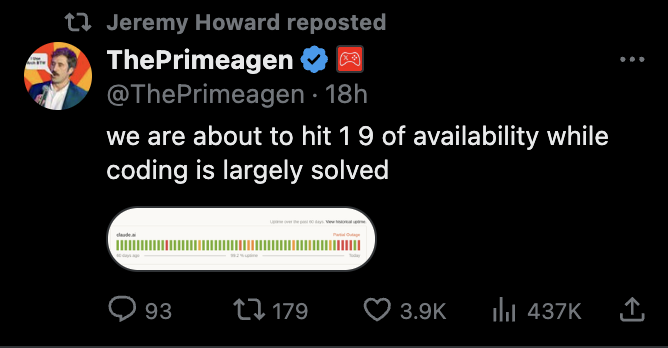

^ I don’t share this point of view. It is still a retard in so many ways, though I don’t use the best models, I cannot afford to. I do use Sonnet 4.6 and it’s good but it doesn’t “think in good architecture” like I do. It’s myopic. It just plans or writes a solution that will work and that’s it.

-

Himanshu

@Hxlfed14

Agent Harness is the Real Product 

Everyone talks about models. Nobody talks about the scaffolding.

The companies shipping the best AI agents today- Claude Code, Cursor, Manus, Devin, SWE-Agent all converge on the same architecture: a deliberately simple loop wraps the model, a handful of primitive tools give it hands, and the scaffolding decides what information reaches the model and when.

The model is interchangeable. The harness is the product.

Here is the evidence: 

Claude Opus 4.5 scores 42% on CORE-Bench with one scaffold and 78% with another. 

Cursor's lazy tool loading cuts token usage by 46.9%. 

Vercel deleted 80% of their agent's tools and watched it go from failing tasks to completing them.

Same model. Same benchmark. The only variable is the harness.

And the single most underrated pattern inside these harnesses?

Progressive disclosure- agents discovering context incrementally instead of drowning in everything upfront.

This article breaks down what a harness actually is, how each company builds theirs, and why progressive disclosure is the pattern that separates working agents from impressive demos.

**^ Fucking lol. You mean web pages?
**
Sources analyzed (all listed at the end).

What Is an Agent Harness?

Harrison Chase (LangChain) draws the sharpest distinction: "A framework is abstractions... pretty unopinionated. Harnesses are batteries included."

Source: LangChain "Improving Deep Agents with Harness Engineering"

An agent harness is everything around the model that makes it useful: the execution loop, tool definitions, error recovery, state management, and information flow. The model decides what to do. The harness decides what the model can see, what tools it can use, and what happens when it fails.

Every production agent converges on this core loop:

while (model returns tool calls):

 execute tool → capture result → append to context → call model again

That is it. The entire architecture of Claude Code, Cursor's agent, and Manus fits inside that loop. The engineering is in what surrounds it.

How Each Company Builds Its Harness

Claude Code: "The Model Controls the Loop"

Context: Claude Code's architecture has been reverse-engineered extensively and Anthropic has published detailed posts on their harness design. The core is a single flat message list with ~18 primitive tools.

Source: Anthropic "Effective Harnesses for Long-Running Agents"

The loop. Internally codenamed nO, it is a while(tool_call) loop. No DAG orchestration, no competing agent personas. The model receives messages and tools, returns text (loop ends) or tool calls (loop continues). Anthropic explicitly calls this "the model controls the loop" rather than "code controls the model."

The tools. ~18 primitives in four categories: command-line discovery (Bash, Glob, Grep, LS), file interaction (Read, Write, Edit, MultiEdit), web access (WebSearch, WebFetch), and orchestration (TodoWrite, Task). The philosophy is primitives over integrations. Notably, Anthropic chose regex (ripgrep) over vector databases for code search, reasoning that Claude's code understanding enables sophisticated regex crafting without search indices.

Source: PromptLayer "Claude Code: Behind-the-Scenes of the Master Agent Loop"

The information layering. Six layers loaded at session start: organization policies, project-level CLAUDE.md, user settings, auto-learned MEMORY.md, session history, and git state. The system prompt comprises ~110+ conditional strings (~2,896 token core). A critical but underappreciated harness pattern: tool results carry injected system reminders fixed text appended after every tool execution. This achieves higher behavioral adherence than system-prompt-only instructions because it repeats with every call.

Source: Vrungta "Claude Code Architecture (Reverse Engineered)"

Error recovery. Primarily model-driven. Failed tool executions return error messages as tool results, and the model decides what to do. The TodoWrite tool serves as a "progress anchor" after errors, the model consults its TODO list to know where it was.

The insight that matters: Claude Code's TodoWrite tool does nothing functionally. It is purely a harness-level trick- a no-op tool that forces the agent to articulate and track its plan, keeping it on course over long trajectories. LangChain's "Deep Agents" analysis calls it out explicitly.

Source: LangChain "Deep Agents"

Cursor: "Files as the Fundamental Primitive"

Context: Cursor published "Dynamic Context Discovery" (Jan 2026) and a separate post on model-specific harness tuning. Their architecture has five components: Router, LLM, 10+ tools, context retrieval, and a ReAct-style orchestrator.

Source: Cursor "Dynamic Context Discovery"

The key decision. Cursor tunes its harness specifically for every frontier model based on internal evals. Different models get different tool names, prompt instructions, and behavioral guidance. OpenAI Codex models get shell-oriented tool names like rg; Claude models get different reasoning summary formats. 

Source: Cursor "Improving Cursor's Agent for OpenAI Codex Models"

Files as context primitive. Everything in Cursor's architecture maps to files. Why? Because files enable powerful searching (ripgrep, jq, grep, semantic search), are naturally groupable (one folder per MCP server), and are versionable. Their exact words: "Files have been a simple and powerful primitive to use, and a safer choice than yet another abstraction."

Custom semantic search. Their embedding model is trained using agent session traces as training data- when an agent works through a task, Cursor analyzes which files should have been retrieved earlier, then trains the embedding model to match those patterns. Result: 12.5% higher search accuracy on average and 2.6% higher code retention on large codebases (1,000+ files).

Source: Cursor "Improving Agent with Semantic Search"

Manus: "KV-Cache Above All Else"

Context: Manus has rewritten their framework five times since launch. Their average input-to-output token ratio is ~100:1. They call the iterative process "Stochastic Gradient Descent."

Source: Manus "Context Engineering for AI Agents: Lessons from Building Manus"

Logit masking over tool removal. Manus tried adding and removing tools dynamically and rejected it- any change to tool definitions near the front of the context invalidates the KV-cache for all subsequent tokens. Instead, all ~29 tools remain permanently loaded. Availability per step is controlled by constraining output token probabilities during decoding. Tool naming uses consistent prefixes (browser_*, shell_*, file_*) for group-level masking.

Source: Manus

Hierarchical action space. Three levels: Level 1 (~20 atomic function-call tools), Level 2 (sandbox utilities invoked via Bash- grep, ffmpeg, MCP tools via mcp-cli), Level 3 (dynamic scripts using pre-installed libraries). This keeps tool definitions out of the context window while preserving full capability.

The biggest lesson. Their biggest performance gains came from removing things; complex tool definitions replaced by shell execution, "management agents" replaced by simple handoffs. If your agent harness is getting more complex while models get better, something is wrong.

SWE-Agent: "The Agent-Computer Interface"

Context: Princeton's SWE-Agent introduced the ACI (Agent-Computer Interface) concept at NeurIPS 2024, purpose-built interfaces designed specifically for LLM agents rather than humans.

Source: Yang et al. "SWE-agent: Agent-Computer Interfaces Enable Automated Software Engineering"

Linter-gated edits. When the agent issues an edit command, a linter runs automatically. If the code isn't syntactically correct, the edit is rejected and the agent must retry. Without this single harness-level guardrail, performance drops 3%.

Observation compression. All observations except the last 5 are collapsed to a single line each. The agent sees full detail for recent actions and summaries for older ones, a form of progressive disclosure baked into the loop.

The Others: Devin, Windsurf, Aider, Replit

Devin runs in isolated cloud VMs with a Playbook system for repeated tasks and a Knowledge Management System where feedback is codified for future reference. 67% PR merge rate, up from 34% a year ago.

Source: Cognition "Devin's 2025 Performance Review"

Windsurf uses a two-agent architecture: a planning agent runs continuously in the background refining a long-term plan while the primary model handles short-term actions. Their "Memories" system generates observations about codebase patterns across sessions.

Aider has the most technically novel context strategy: a PageRank-based repository map built using tree-sitter. It parses code to extract definitions, builds a graph where files are nodes and dependencies are edges, applies PageRank to rank symbols by importance, and uses binary search to fit the most critical content within a token budget.

Replit Agent evolved from a single agent to a three-agent architecture (Manager, Editor, Verifier) after finding that single-agent error rates were too high. Self-healing loop: generate → execute → test with Playwright → fix → rerun.

Progressive Disclosure: The Pattern Nobody Has Named

Progressive disclosure is borrowed from UI/UX design, originated by John Carroll at IBM Research in the 1980s, popularized by Jakob Nielsen in the 1990s. The principle: show only what is needed now, reveal complexity on demand.

The mapping to agent design is direct. Just as collapsible menus reduce cognitive load for humans, layered context loading reduces attention fragmentation for LLMs.

Source: Honra "Why AI Agents Need Progressive Disclosure, Not More Data"

How production systems implement it

Claude Code's SKILL.md pattern. Skills are stored as .claude/skills/ files and are NOT preloaded into every conversation. Unlike CLAUDE.md (loaded every session), skills load only when Claude detects relevance. The system prompt describes it as "on-demand loading" — Claude reads slide-decks.md only when creating presentations. This prevents context bloat when a project has dozens of skills.

Source: Anthropic Claude Code Best Practices

Cursor's lazy MCP tool loading. MCP servers include many tools with long descriptions; most go unused. Cursor syncs tool descriptions to a folder structure and gives the agent only tool names as static context. Full definitions are fetched on-demand. In A/B testing: 46.9% token reduction (statistically significant).

Manus's filesystem offloading. The agent writes to and reads from files on demand. Compression is designed to be reversible: drop a web page's content if the URL is preserved; omit a document if its file path remains. The todo.md rewriting pattern pushes the global plan into the model's recent attention span  directly counteracting "lost in the middle."

The quantitative case

The numbers across multiple independent sources are consistent:

Token efficiency.

 Claude-Mem documentation shows static loading injects 25,000 tokens at 0.8% efficiency (one relevant observation in noise). Progressive disclosure: 955 tokens at 100% efficiency. ~26x improvement. 

Cursor's lazy loading: 46.9% reduction. 

Vercel's case study: removing 80% of tools dropped tokens from 145,463 to 67,483, steps from 100 to 19, latency from 724 to 141 seconds and the agent went from failing to succeeding.

Source: Phil Schmid "Context Engineering for AI Agents: Part 2"

The scaffold matters more than the model. 

CORE-Bench: Claude Opus 4.5 scored 42% with one scaffold, 78% with another. 

Sonnet 4: 33% vs 47%. Sonnet 4.5: 44% vs 62%. 

LangChain's deepagents-cli went from 52.8% to 66.5% on TerminalBench 2.0 (13.7 points) by changing only the harness.

Source: LangChain "Improving Deep Agents with Harness Engineering"

Why harnesses need this. Liu et al. (TACL 2024) demonstrated that LLM performance follows a U-shaped curve-  highest when relevant information is at the beginning or end of the input, degraded in the middle. Even long-context models. This is why the harness matters: progressive disclosure keeps inputs small (less curve distortion) and places freshly-retrieved information at the end (the high-attention zone).

Source: Liu et al. "Lost in the Middle: How Language Models Use Long Contexts" (TACL 2024)

The Technique Matrix

Quick-reference mapping harness techniques to agent systems based on public documentation.

Legend: 

[C] = Core differentiator 

[Y] = Uses/advocates  

[--] = Not discussed publicly  

[alt] = Different approach

Loop Architecture:

Progressive Disclosure:

Error Handling & Robustness:

Where The Industry Agrees (and Where It Doesn't)

Near-consensus: The single flat loop wins over complex orchestration. File system as extended memory. Errors preserved, not cleaned. Fake planning tools (TodoWrite, todo.md) for coherence. Primitives (bash, grep, filesystem) over custom integrations.

Active disagreement: How to handle tool overload. Manus uses logit masking (all tools loaded, constrain outputs). Cursor uses lazy loading (load tool definitions on demand). Opposite strategies. Both work. The right answer might depend on your token economics.

Active disagreement: How much should the harness manage for the model? Google's bet is "give the model everything, let it figure it out" (2M token windows). Everyone else builds harnesses that actively filter and stage information. Research still shows 15-47% performance drops as input grows. The harness-heavy approach is winning in practice.

Unsolved: How to evaluate harness quality. Cursor's 46.9% token reduction is one of very few published numbers. No standard benchmarks exist for comparing harness designs head-to-head. When to share sub-agent state vs isolate it is still purely empirical.

The pattern worth noting: The teams shipping the best agents keep simplifying. Manus: five rewrites, each one removed things. Anthropic designs Claude Code's scaffold to shrink as models improve. Replit went from one agent to three but each individual agent got simpler. Over-engineering is the default failure mode.

What This Means If You Are Building Agents

Three things this research makes clear:

Spend your engineering cycles on the harness, not on model shopping.

Progressive disclosure is not optional, it is architectural. 

Plan for your harness to get simpler, not more complex. 

Dex Horthy (creator of the "12 Factor Agents" methodology) puts the threshold at 40% of the model's input capacity: push past that and you enter what he calls the "dumb zone" - signal-to-noise degrades, attention fragments, and agents start making mistakes that look like reasoning failures but are actually information overload from a poorly designed harness.

Source: Horthy "12 Factor Agents"

The model is the engine. The harness is the car. Nobody buys an engine.

References

Anthropic - "Effective Context Engineering for AI Agents" (Sep 2025) anthropic.com/engineering/effective-context-engineering-for-ai-agents

Anthropic - "Effective Harnesses for Long-Running Agents" (Jan 2026) anthropic.com/engineering/effective-harnesses-for-long-running-agents

Cursor - "Dynamic Context Discovery" (Jan 2026) cursor.com/blog/dynamic-context-discovery

Cursor - "Improving Agent with Semantic Search" (2026) cursor.com/blog/semsearch

Cursor - "Improving Cursor's Agent for OpenAI Codex Models" (2026) cursor.com/blog/codex-model-harness

Manus - "Context Engineering for AI Agents: Lessons from Building Manus" (Jul 2025) manus.im/blog/Context-Engineering-for-AI-Agents-Lessons-from-Building-Manus

LangChain - "Deep Agents" (Jul 2025) blog.langchain.com/deep-agents

LangChain - "Improving Deep Agents with Harness Engineering" (Feb 2026) blog.langchain.com/improving-deep-agents-with-harness-engineering

Yang et al. - "SWE-agent: Agent-Computer Interfaces Enable Automated Software Engineering" (NeurIPS 2024) arxiv.org/abs/2405.15793

Liu et al. - "Lost in the Middle: How Language Models Use Long Contexts" (TACL 2024) arxiv.org/abs/2307.03172

Phil Schmid - "Context Engineering for AI Agents: Part 2" (Dec 2025) philschmid.de/context-engineering-part-2

Cognition -  "Devin's 2025 Performance Review" (2025) cognition.ai/blog/devin-annual-performance-review-2025

Horthy - "12 Factor Agents" paddo.dev/blog/12-factor-agents

PromptLayer -  "Claude Code: Behind-the-Scenes of the Master Agent Loop" blog.promptlayer.com/claude-code-behind-the-scenes-of-the-master-agent-loop

Vrungta - "Claude Code Architecture (Reverse Engineered)" vrungta.substack.com/p/claude-code-architecture-reverse

Honra - "Why AI Agents Need Progressive Disclosure, Not More Data" honra.io/articles/progressive-disclosure-for-ai-agents

Karpathy -  "2025 LLM Year in Review" karpathy.bearblog.dev/year-in-review-2025

Jannesklaas - "Agent Design Lessons from Claude Code" jannesklaas.github.io/ai/2025/07/20/claude-code-agent-design.html

-

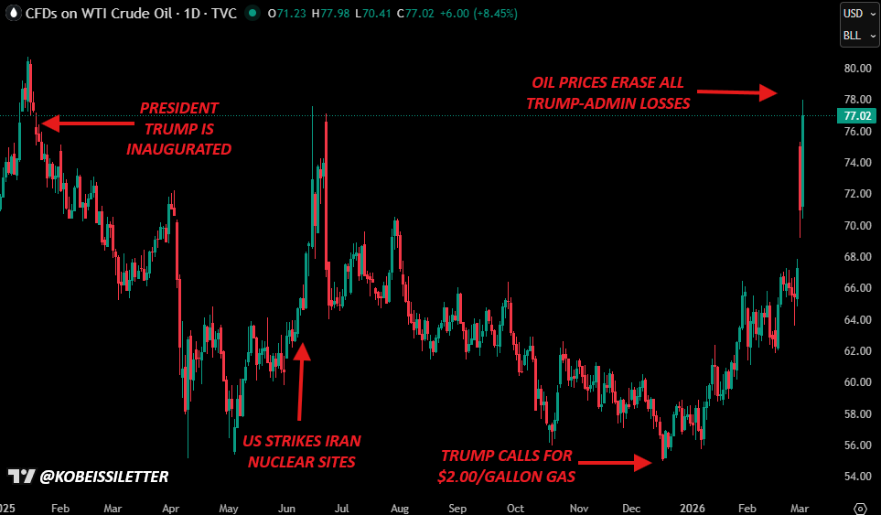

**^ Oil at 77 USD.
**

-

BREAKING: South Korea’s stock market extends losses to -11% on the day just minutes after triggering a circuit breaker.

^ Later that week:

BREAKING: South Korea’s stock market surges over +12%, on track for its best day on record.

-

BREAKING: President Trump says he is not going to allow banks to “undermine our powerful crypto agenda.”

“They need to make a good deal with the crypto industry,” Trump says.

-

Josh Kale

@JoshKale

This might be the funniest chart in tech right now.

Apple's capex strategy has to be the luckiest accident in history:

Amazon, Microsoft, Meta, Google, are in a spending arms race plowing  over $100B PER QUARTER into data centers - While Apple spending is down 19%

Meanwhile:

- Mac Minis sold out bc everyone's buying them to run OpenClaw

- Mac Studios have a 6-week backlog

- Someone ran Qwen 3.5 on an iPhone yesterday

- The M5 Max just shipped with 128GB of unified memory and runs Llama 70B from anywhere

The company spending the least on AI infrastructure accidentally became the AI infrastructure

-

$NVDA CEO Jensen on OpenClaw:

“OpenClaw is probably the most important software release ever”

“OpenClaw, in just three weeks, has surpassed Linux in adoption, which took 30Yrs. It’s now the single most downloaded open-source software ever”

“I’ve never seen anything like this”

-

first check $500k-1M pre-seed

@ajhodls

everyone is saying technical founders are no longer necessary

yet my best performing companies all have technical founders

maybe we're still early

or maybe everyone is wrong

7:36 PM · Feb 26, 2026

·

11.5K

 Views

-

ETH2030: Agentic Coding ETH Client for 2030+ Roadmap

Two weeks ago I made a bet with Vitalik that one person could agentic-code an Ethereum client targeting the entire 2030+ roadmap. Completed-roadmap Ethereum is a genuinely extraordinary machine - 10,000+ TPS on L1, finality in seconds instead of 15 minutes, solo staking for 1 ETH, stateless nodes on a $7 Raspberry Pi, over a million TPS across L1+L2 - but that future depends on 65 planned upgrades across eight phases actually fitting together. The specs are scattered across dozens of EIPs, many still in draft. Nobody had tried to build all of them into one codebase to see if they compose. So I did.

ETH2030 (eth2030.com, https://github.com/jiayaoqijia/eth2030) is the result - an experimental reference implementation targeting the draft EF Protocol L1  roadmap, a working document from Ethereum's core protocol researchers (Ansgar, Barnabe, Francesco, Justin) mapping eight upgrade phases from Glamsterdam (mid-2026) through the Giga-Gas era (2030+). Built with agentic coding - Claude Code (Opus 4.6), approximately 6 days, $5,750 in API costs, 2.77 billion tokens. It passes all 36,126 official Ethereum state tests, embeds go-ethereum v1.17.0 for mainnet connectivity, and covers everything from Block Access Lists to post-quantum cryptography to a full RISC-V CPU for zero-knowledge proofs.

-

Zack Shapiro

@zackbshapiro

Managing Partner @rainsllp. AI-Enabled Corporate Lawyer, Head of Policy 

The Claude-Native Law Firm 

How I Actually Practice Law with AI in 2026

A few months ago, the night before a client’s acquisition was set to close, the buyer’s counsel sent a letter demanding that several key deal terms be restructured. New escrow conditions. Expanded indemnification carve-outs. A revised set of closing deliverables. The implicit threat: accept these changes or we walk. It was 7 PM.

I uploaded the purchase agreement, the disclosure schedules, and the demand letter to Claude. Within minutes, Claude mapped every proposed change against the existing deal terms and found what the buyer’s lawyers apparently hadn’t noticed: two of their proposed carve-outs directly contradicted representations they had already confirmed in the disclosure schedules, and a third would have created an internal conflict with the fundamental reps section that would have actually weakened the buyer’s own post-closing protections. Their aggressive last-minute play had holes in it.

etc.

-

AriannaSimpson.eth

@AriannaSimpson

It’s an absolutely incredible time to be alive. 

AIs are dramatically reducing toil. 

GLP-1s have made it so that being overweight is now a choice. 

Cars drive themselves. 

We are launching rockets into space and catching them again. 

The pace of technological advancement feels faster than ever.

-

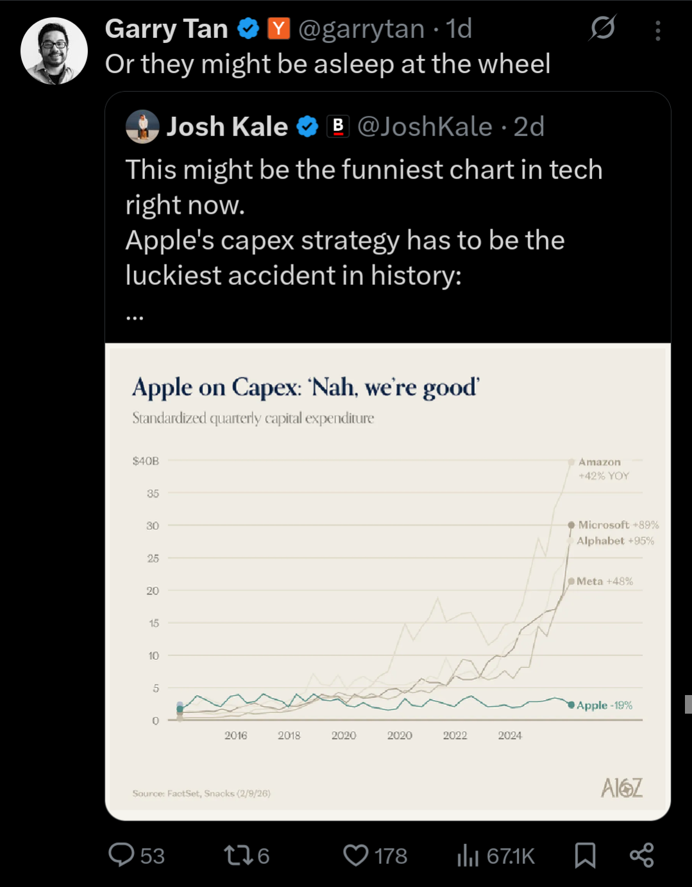

[__https://x.com/i/status/2029398144958537973__](https://x.com/i/status/2029398144958537973)

-

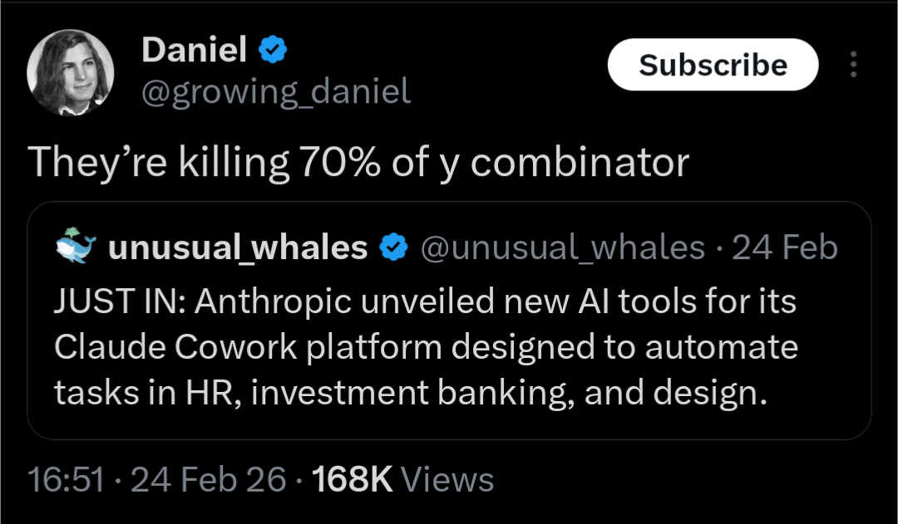

-

Luke Puplett

@lukepuplett

Outcome token pricing and model responses:

Freemium tokens +

- Free shallow answer

- Model internally evaluates expected user value

- Paywall appears only when value is predicted high

- Trade B200s for rows of data

The model must have something genuinely scarce. If I was Dario, I'd try to buy Bloomberg, Reuters or RELX in a huge LBO. Meta and Google are good, Microsoft has no model but has Inflection. 

You can use a Merkle tree to prove some tokens come from some set.

No,w dpending on the limitations of AI and how long they last, e.g. like even the smartest human, the architecture is not infallible, we're going to need lots of software for the agents to use.

-

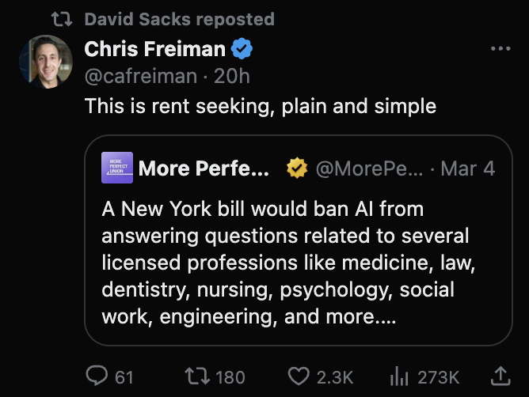

A New York bill would ban AI from answering questions related to several licensed professions like medicine, law, dentistry, nursing, psychology, social work, engineering, and more.

The companies would be liable if the chatbots give “substantive responses” in these areas.

-

Cassandra Unchained

@michaeljburry

Two things that will happen that few in Silicon Valley or NYC consider.

1. Compression means that edge devices (iPhone, PC) will run the latest models easily in time because human knowledge utility is a pond, and LLMs+ are selling an ocean.

2. No one will pay for the singularity. There is no end-economic demand for it. AIs spinning up a knowledge spiral is a human nightmare, not a human demand.

**^ Burry has been banging so loudly about the AI bubble/fraud, he’s almost desperate. Yeah, so he’s focused on, number one, he’s focusing on human knowledge and not compute, and the ability to think, and think through things, and then potentially, it’s potential that the models will have to get so fast that they can think through problem spaces, almost brute-force thinking, seeing what comes up. I’m not sure how they evaluate their own thinking to know whether it’s robust and you know any of the thinking that they’ll do is useful. But anyway, yeah, there’s, he’s extrapolating kind of the current way we use LLMs as just, Well, often common people like him might use LLM’s as some kind of knowledge base. And then in the second point up to the no one to pay for the singularity um no and you can oh god this may be true i don’t know.
**

Cassandra Unchained

@michaeljburry

Uh, Apple should buy Anthropic, good culture fit and Anthropic just starting to race ahead,  will be cash flow positive soon. Apple can afford it for now.

And Elon should sell his Tesla shares and put them in an index fund for his many kids. Tesla shares are 4x overvalued at least. The indices are only 2-3x overvalued.

Cassandra Unchained

@michaeljburry

Adobe $ADBE should buy Midjourney. And any other small creative software company with a creative founder. 

@Adobe, you have the cash flow to protect your franchises.

**^ I do agree with this one.
**

-

Here are the **main claims** from the March 5, 2026 Anthropic paper by Massenkoff & McCrory, stated succinctly:

- Introduces **"observed exposure"**: new measure of AI displacement risk combining theoretical LLM capability (Eloundou et al. β) with real-world Claude usage data, weighting automated/work-related uses more heavily.

- **AI far from theoretical limits**: actual task coverage remains a small fraction of what's feasible (e.g., only 33% in Computer & Math occupations vs. 94% theoretically possible).

- **Most exposed occupations**: Computer Programmers (~75%), Customer Service Reps, Data Entry Keyers (~67%), Financial Analysts, etc.

- **BLS projections align somewhat**: higher observed exposure correlates with slower projected employment growth 2024–2034 (≈ –0.6 pp growth per 10 pp exposure increase); no such link with pure theoretical measures.

- **Exposed workers' profile**: older, more female, more educated, higher-paid, more white/Asian (pre-ChatGPT baseline).

- **No clear unemployment impact**: no systematic rise in unemployment rates for highly exposed workers since late 2022 (difference-in-differences near zero and insignificant).

**^ Actual job postings for software devs is rising very sharply 
**

- **Suggestive early signal on youth hiring**: job-finding rate for 22–25 year olds into exposed occupations fell ~14% post-ChatGPT (barely significant); no similar effect for older workers; echoes Brynjolfsson et al. slowdown in entry-level hiring.

- Overall: limited evidence of material employment disruption so far; framework designed as early-warning system to detect future effects more reliably as adoption grows.

The paper stresses humility given past prediction failures (offshoring, robots, China shock) and positions this as a periodically updatable baseline before large effects appear.

https://cdn.sanity.io/files/4zrzovbb/website/dc7bcd0224644fce97cecb7f9e68dcd8434b35f1.pdf

^ If a dev becomes 2x more productive, are they 3x more in demand?? This is Demand Elasticity.

-

**^ Largest weekly gain in oil since 1982
**

-

Carla Babb

@CarlaBNewsmax

#BREAKING A US defense official has just confirmed to Newsmax that Russia is providing Iran with targeting information to attack US troops and military assets in the Middle East. The Washington Post first reported this development, which puts one of America’s chief nuclear-armed competitors in this rapidly expanding conflict. 

Iran has for years provided Russia with its Shahed drones to attack Ukraine, and now Russian intel is aiding Iran in its attacks across several countries.

-

BREAKING: Qatar says the Iran war could “bring down the economies of the world” and warns oil prices may see $150 within days as Gulf countries prepare to shut down production, per FT.

Details include:

1. Qatar predicts that all Gulf energy exporters will shut down production "within days"

2. Even if the war ended immediately it would take Qatar “weeks to months” to return to normal

3. Qatar predicts that natural gas prices will rise +400%

4. Qatar says global GDP will be hit if the war continues for "a few weeks"

5. Qatar says the war "will delay all expansion plans" for the country's energy industry

US oil prices are now at their highest since April 2024.

-

This matters enormously, because not all white-collar work is the same.

Some professions produce a fixed number of outputs. If you run an accounting firm, clients want one tax return. One set of financials. Make that work 10x cheaper and you don't get 10x more demand. Those jobs are genuinely at risk.

But software? If you make software cheap to create, the demand is effectively unlimited. There's a massive backlog of software that doesn't exist because it wasn't worth building at 2024 labor costs. Games, internal tools, niche automations, apps nobody bothered to spec out. Drop the cost 10x and you might unlock 50x the demand.

This is Jevons Paradox again — the observation that making a resource more efficient often *increases* total consumption rather than decreasing it. The report never mentions it.

Ironic b/c that has a seemingly contradictory implication both the SAFEST jobs the most at RISK jobs are likely those most impacted by AI. what matters is not how much AI is being used

-

Some cunt on X -

One man mass-predicted the future of technology for 35 years and nobody repriced their worldview.

In 1999, Kurzweil said AGI by 2029. Stanford organized a conference to discuss it. They polled several hundred AI experts. 80% said it would take 100 years. Geoffrey Hinton was among them.

Kurzweil was the only person in the room who said 30 years.

By 2024, Hinton publicly said he was wrong. Metaculus prediction markets moved from 2060 to 2036 to roughly 2028. Sam Altman, Dario Amodei, and Jensen Huang all converged on 2028-2029. Elon said 2026.

The consensus moved 70 years closer to Kurzweil. Kurzweil didn’t move at all.

What separates his method from the experts who kept updating: he never predicted AI breakthroughs. He predicted compute trajectories. His 1999 model tracked the exponential growth in calculations per constant dollar since 1939. A 75 quadrillion-fold increase. He just followed the curve forward.

The experts at that Stanford conference were reasoning from the state of the art. Kurzweil was reasoning from the rate of change. That’s why they had to update every 5 years and he never did.

86% accuracy across 147 predictions. 35 years of receipts. And the next prediction on his list is the one people still laugh off: singularity by 2045, where machine intelligence merges with human cognition.

The track record says stop laughing.

-

BREAKING: US oil prices extend reversal to -$26/barrel in 13 hours after President Trump says he will be holding a "news conference" at 5:30 PM ET.

Oil prices are now up just +2% on the day and on the verge of turning negative.

-

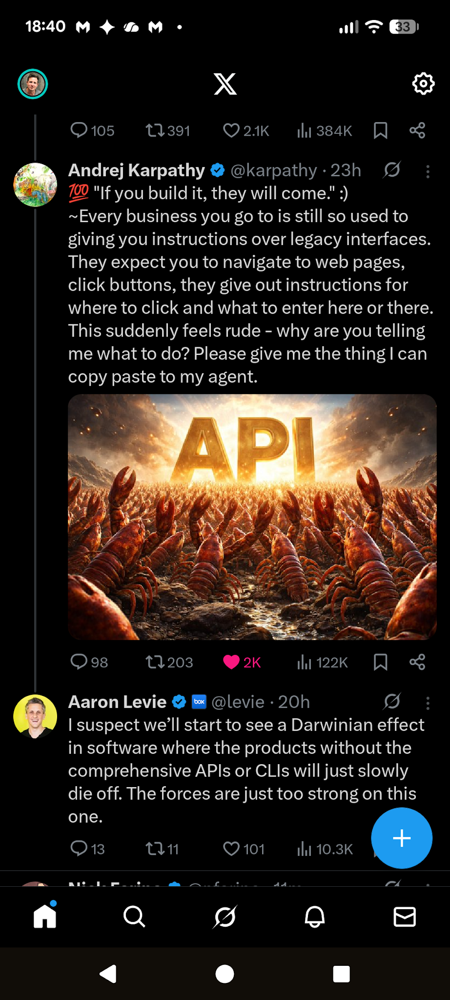

-

🚨BREAKING: Berkeley researchers spent 8 months inside a tech company watching how employees actually use AI.

The promise was simple: AI will save you time. Do less. Work smarter.

The opposite happened.

Workers didn't use AI to finish early and go home. They used it to take on more. More tasks. More projects. More hours. Nobody asked them to. They did it to themselves.

The researchers sat inside the company two days a week for 8 months. They watched 200 employees in real time. They tracked work channels. They conducted 40+ interviews across engineering, product, design, and operations.

Here's what they found. AI made everything feel faster, so people filled every gap. They sent prompts during lunch. Before meetings. Late at night. The natural stopping points in the workday disappeared. People ran multiple AI agents in the background while writing code, drafting documents, and sitting in meetings simultaneously.

It felt like momentum. It felt productive. But when they stepped back, they described feeling stretched, busier, and completely unable to disconnect.

83% said AI increased their workload. Not decreased. Increased.

62% of associates and 61% of entry-level workers reported burnout. Only 38% of executives felt the same strain. The people doing the actual work absorbed the damage while leadership celebrated the productivity numbers.

Then came the trap nobody saw coming. When one person uses AI to take on extra work, everyone else feels like they're falling behind. So the whole team speeds up. Nobody formally raises expectations. But the new pace quietly becomes the default. What AI made possible became what was expected.

The researchers gave it a name: workload creep. It looks like productivity at first. Then it becomes the new baseline. Then it becomes burnout.

AI was supposed to give you your time back. Instead it's eating more of it. And the worst part? You're doing it to yourself. Voluntarily.

-

Fraction AI

@FractionAI_xyz

Normies won’t use crypto. Their agents will. With our CEO @0xshai and @hosseeb from @dragonfly_xyz

**^ Interestingly, the narrative is shifting from users using crypto.
**

-

Marcelo P. Lima

@MarceloLima

"AI models for generating computer code have become so efficient that we need less people. We can build more SaaS applications for more industries at a lower cost. This makes our SaaS application suites more competitive and more profitable."

— Larry Ellison

"I'll say a few words about the reported SaaS apocalypse. You've all heard the thesis or theory that new companies coding quickly using AI will spell the death of SaaS. I don't agree with that at all. I do think that AI tools and their coding capabilities would be a threat if we weren't adopting them, but we are, and very rapidly. Oracle is using the best AI coding tools and the best developers not only to accelerate our SaaS business, but to deliver solutions that enable entire ecosystems across numerous industries. The use of AI coding tools inside Oracle is enabling smaller engineering teams to deliver more complete solutions to our customers more quickly."

**^ Not sure if the second part is Larry.
**

-

parul reposted

dex

@dexhorthy

Here’s what’s gonna happen:

- you replace your code review with feedback loops (sentry, datadog, support tickets, etc)

- you stop reading the code

- software factory fixes everything

- one day something breaks at 3am, agent can’t fix it

- nobody’s read the code in 3 months

- you have 3 weeks of downtime trying to re-onboard and fix it 

- you lose significant % of your contracts and users 

- your company is now dead

**^ I think this is wishful thinking bias combined with not ensuring good architecture or documenting things that cannot be read in code, such as what happens in an external system or complex eventual orchestrations.
**

-

parul reposted

anand iyer

@ai

Longgang, a district in Shenzhen, has published draft policy measures to attract @OpenClaw developers and one-person AI agent companies. The incentive package includes

- free deployment zones,

- up to 2M RMB in dev subsidies,

- 30% hardware subsidies, and

- up to 10M RMB in seed equity for youth-led projects.

The issuing body is Longgang's AI & Robotics Bureau, the first district-level AI agency in China, less than a year old.

I kinda love (and hate) that a single Chinese district is operating at a level of AI industrial policy most US cities haven't even started thinking about.

-

OUT NOW - how @JosephEStiglitz sees it:

- higher oil & food prices and "Economic Chaos" are serious risks of U.S.-Iran War

- "significant probability" AI is in a bubble

-

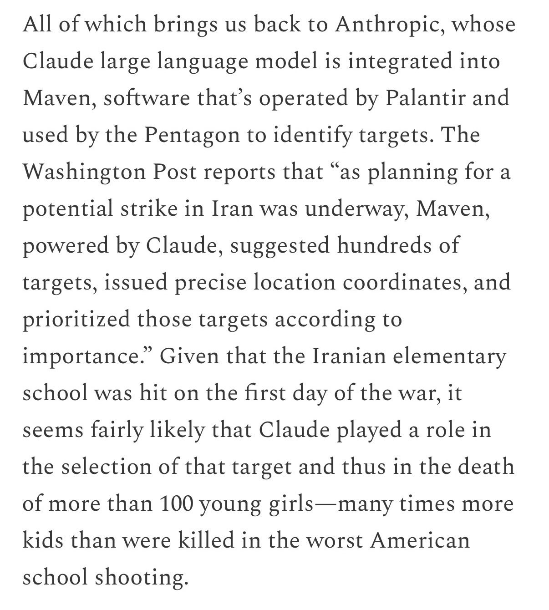

**^ Big deal being made on X during the Iran war. But a) Anthropic did not want its AI used like this b) I have no clue why people spun up this story of how a top secret mission was planned and are now taking it as fact. Musk is retweeting it, obviously.**

-

BREAKING: New US intelligence says Iran's leadership is still "largely intact" and not at risk of collapse "any time soon," per Reuters.

Details include:

1. A "multitude" of intelligence reports provide "consistent analysis that the regime is not in danger" of collapse

2. Intelligence also suggests that the Iranian government "retains control of the Iranian public"

3. Israeli officials in closed discussions also ​have acknowledged there is "no certainty" the war will lead to the Iranian government's collapse

4. The situation on the ground is being described as "fluid"

Oil prices are at a new high of day.

**^ Meanwhile Trump says the war will end ‘very soon’ whenever he decides. There is an acronym, TACO, Trump Always Chickens Out.
**

-

Randy Woodward reposted

Katie Miller

@KatieMiller

Since the 2020 presidential election, Anthropic’s founders, board members and employees have made more than $200 million in political donations - 99.8 percent of which went to Joe Biden, Kamala Harris, Hillary Clinton and other Democrats.

Now this “Institute” is supposed to offer reliable policy?

**^ Charming the regulator party. David Sacks and other Reds see right through it.
**

-

Italy's Meloni joins EU chorus criticising Trump’s strikes on Iran

**^ Narrative violation? ‘Hard right’ Meloni is not in support of right wing Trump? Lmfao, this from Grok;
**

“That said, perceptions have evolved somewhat since she's been in office (now over three years as of 2026). She's often governed more pragmatically than many expected”

**^ The ‘hard right’ line is and was always bullshit in all cases. The same will be true of the German lot, too.
**

-

Oleksii Kuchaiev

@kuchaev - Sr. Director of AI model post-training @NVIDIA

Nemotron 3 Super is here — 120B total / 12B active, Hybrid SSM Latent MoE, designed for Blackwell.

Truly open: permissive license, open data, open training infra. See analysis on @ArtificialAnlys

 

Details in thread 🧵below:

1/4  We see no wall in post-training. Scaling RL software, infra, and data keeps yielding major capability gains.

We trained across 30 RL environments with up to 4,000 instances per batch — math, code, STEM, agentic tool use, SWE, terminal, safety — all in a unified multi-environment RLVR setup.

2/4 up to 2.2× throughput over GPT-OSS-120B and 7.5× over Qwen3.5-122B at comparable accuracy. 1M context. Native speculative decoding via shared-weight MTP heads.

All checkpoints on HuggingFace:

Super-3-nvfp4: https://huggingface.co/nvidia/NVIDIA-Nemotron-3-Super-120B-A12B-NVFP4

Super-3-bf16: https://huggingface.co/nvidia/NVIDIA-Nemotron-3-Super-120B-A12B-BF16

Super-3-base: https://huggingface.co/nvidia/NVIDIA-Nemotron-3-Super-120B-A12B-Base-BF16

RM we used: https://huggingface.co/nvidia/Qwen3-Nemotron-235B-A22B-GenRM-2603

3/4. The entire post-training stack is open (Apache 2.0):

NeMo-Gym (env collection and orchestration): https://github.com/NVIDIA-NeMo/Gym

NeMo-RL (RL training): https://github.com/NVIDIA-NeMo/RL

All SFT + RL data also open on HuggingFace. PRs and new environments welcome!

Full tech report: https://research.nvidia.com/labs/nemotron/files/NVIDIA-Nemotron-3-Super-Technical-Report.pdf

4/4. I'll go deep on the post-training methodology at GTC 2026 Conference — session S81558, Tuesday March 17, San Jose.

Will cover RL scaling across environments, what worked in agentic training, and where we think this is headed.

-

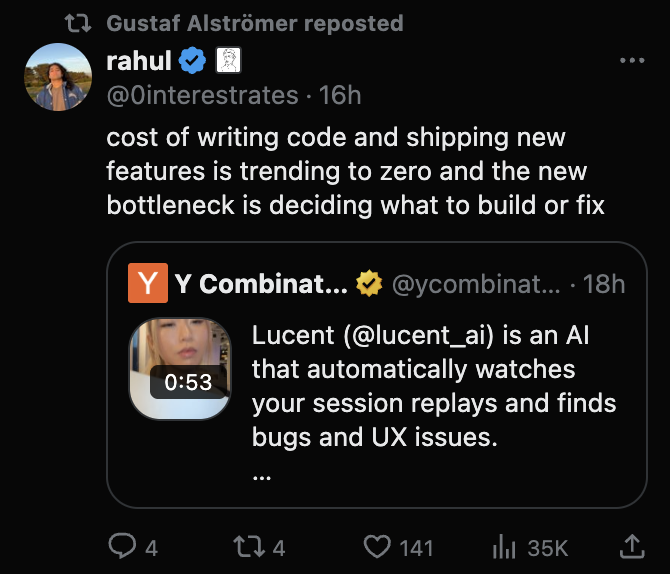

**^ All day long on X**

-

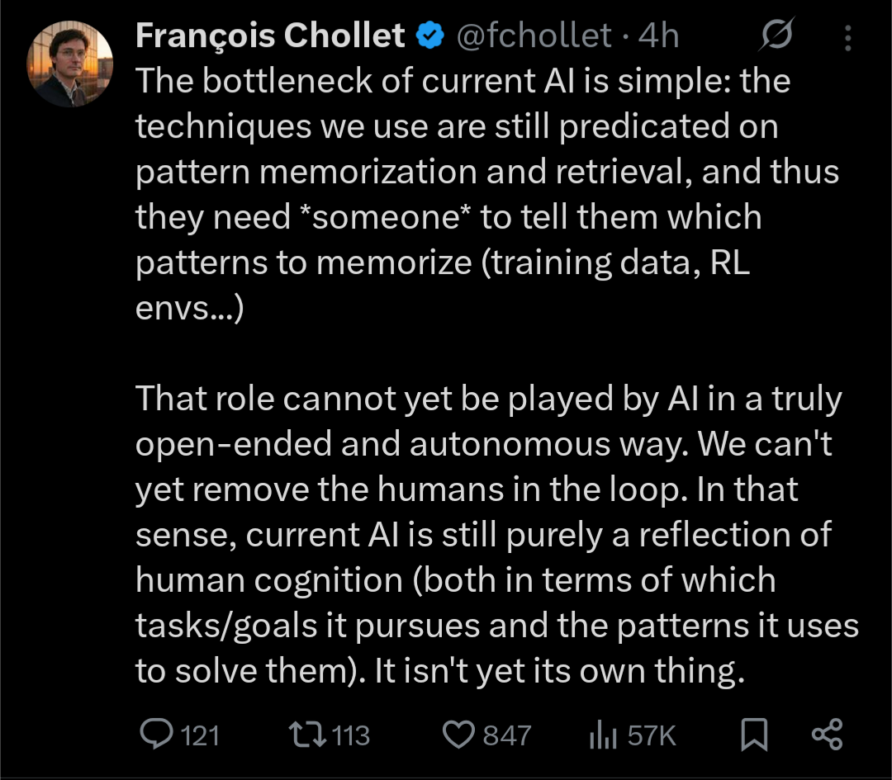

**^ I suspect that AI cannot climb out of this situation.
**

-

Deutsche Bank Dumps After Flagging $30 Billion Exposure To Private Credit

-

hadley harris

Every VC is understandably scared of making investments that will get crushed by the model companies. So they’re searching for things that feel protected. I wonder if that’s the right approach. Focusing on downside protection has generally been a terrible way to invest in startups.

-

X:

For essentially my entire career in tech, the most valuable person was an engineer who understood some business/GTM.

The entire economic structure of the industry was built on this.

Engineers commanded the highest salaries. The cap table was designed around equity comp because you couldn't afford them in cash. The seed round existed to buy engineering time/output. And VCs were, at their core, an arbitrage on engineering scarcity.

That scarcity is gone.

Now the most valuable person is the business/GTM person that understands some engineering.

**^ very typical shit on X.
**

-

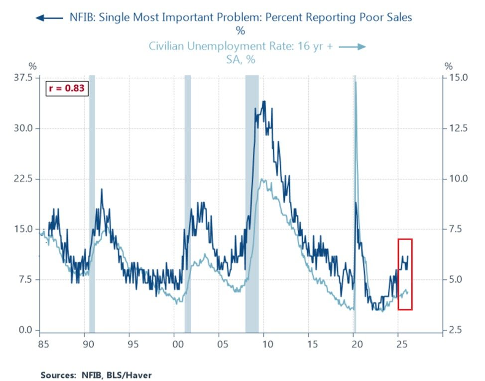

**^ What’s going to happen here? AI layoffs before AI boom?
**

-

Jeremy Howard reposted

Benjamin De Kraker

@BenjaminDEKR

Here is an xAI story.

When I was first hired (low level) by xAI, I was extremely excited. I greatly admired Elon and what Grok could be.

I have a pretty cool AI following here on X. Some big names see my stuff, including Elon himself (at the time).

Lex, Beff, Andreessen, Aravind, many others.

During the interview and onboarding for xAI, they made a *big deal* about wanting people who "take initiative" and think outside the box. Ok...

So, some of the biggest names in tech follow me on X. I decided to ask for ideas and feedback on how Grok (then still early at version 2) could be improved.

I asked my followers on X for the best "how can we make Grok awesome?" ideas, and was going to collect them (organized by Grok himself) into a big report for my boss(es) and ultimately, Elon.

(xAI makes a big deal about how it's a "flat structure" also. You're supposed to be empowered to act on good ideas.)

Well, my post got way more attention than I expected - great! Ideas to improve Grok poured in! I built a script to collect and sort all these great ideas to make xAI's core product better.

John Carmack (personal friend of Elon, creator of Doom, id software, legend) retweeted it. Carmack has 1M followers. 

There were so many great ideas on how to improve Grok! I was collecting them and excited. Until.......

I woke up the next day to a threatening email from my main supervisor* at xAI, telling me I had messed up, that I was NEVER to ask for ideas to improve Grok ever again, that it wasn't my job (I thought our job was to improve Grok.)

They suspended my account on X. They never explained why. It was obviously related to my post about improving Grok.

I was told to delete those posts which had gone viral. I had to delete all the hundreds (thousands?) of genuinely good ideas for improving Grok that had poured in by users on X, because it stepped on someone's toes.

It made me confused and sad. Incidents like this happened often, where xAI employees would come in full of excitement and enthusiasm, and would have it stomped out by managers who hated ideas.

They filled xAI with middle managers and busybodies. It was one of the most DEI and corporate-y places I've ever worked. I came in wanting Elon and xAI to win and left just sad.

*That manager is gone, for what it's worth. 

Everyone I knew at xAI is gone.

**^ Absolutely everything I suspected about xAI.
**

JB

@JasonBotterill

It’s beyond a joke how bad it is to work at xAI every story sounds like they work you to death and make it sound “sigma” driving in traffic on 2 hours sleep, fire you randomly and punish any attempt to make grok better.

**
**
**^ Everyone feels the vibes. xAI is fucked. No one good will work there.
**

TheFutureIsBright

@HopeUnblemished

You sure do sugar coat and twist the story. I saw the post, it wasn't as simple of an issue as you spin here. It was negative and brought negative attention to the product. I recall thinking WTF when I saw it back then. You may have gotten good feedback, I recall good ideas in the replies, but you went about it all wrong. The fact that you haven't gotten over it yet is telling too.

**^ Also probably true.
**
**
**
**-
**

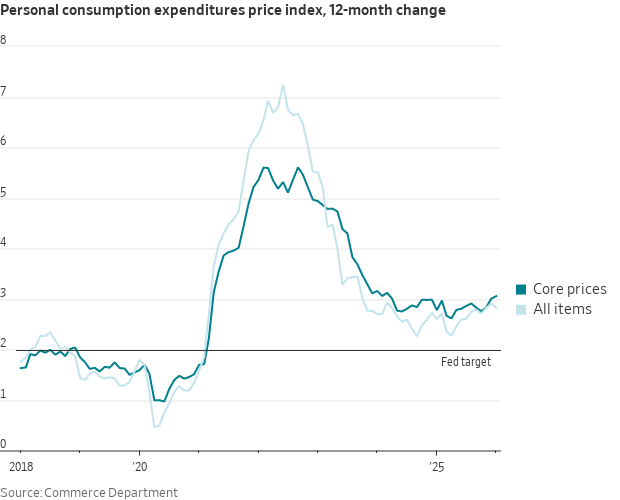

**^ Inflation in the US did not get back to target or even go negative as I imagined. I was wrong.
**

-

ian bremmer

@ianbremmer

the trump administration understood the iranians had the capacity to close the straits of hormuz. this has been scenario planned to death by defense and intel analysts for decades. 

they were confident it wouldn’t happen because they were convinced (what remained of) the iranian leadership would fold to superior firepower. trump is still saying this (at this week’s g7, among other places). 

turns out…that confidence was misplaced.

-

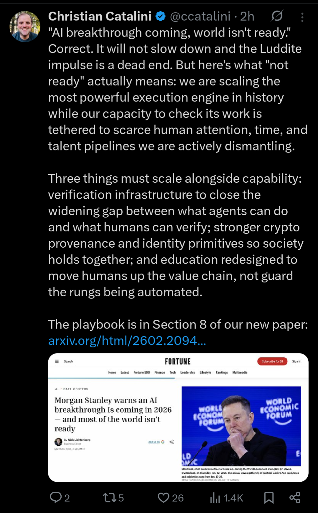

-

Kaito | 海斗

@_kaitodev

Mar 14

5 minutes ago, @karpathy just dropped karpathy/jobs!

he scraped every job in the US economy (342 occupations from BLS), scored each one's AI exposure 0-10 using an LLM, and visualized it as a treemap.

if your whole job happens on a screen you're cooked. 

average score across all jobs is 5.3/10. 

software devs: 8-9. 

roofers: 0-1. 

medical transcriptionists: 10/10 💀

[__http://karpathy.ai/jobs__](http://karpathy.ai/jobs)

^ 11K likes, reposted by an investor I think is a bit dim, silently fired by Garry Tan.

-

ian bremmer

@ianbremmer

germany: will not help the us secure the strait of hormuz, despite trump’s warning that nato countries have a “very bad future” if they refused to help.

-

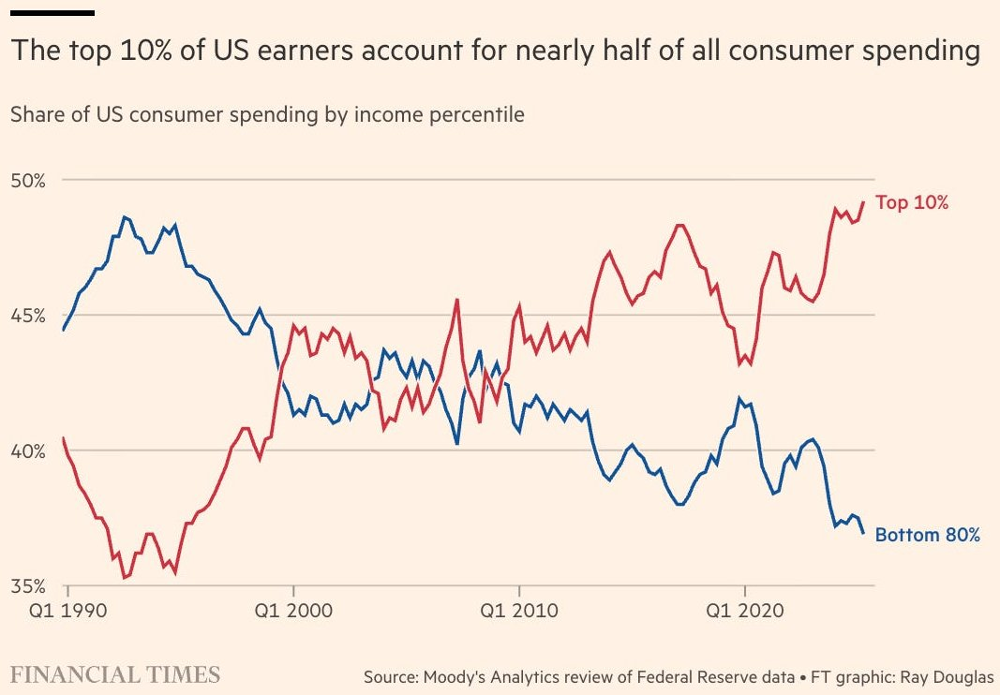

**^ Half of consumer spending comes from top 10% income percentile in USA, up from 37.5% in 1990.
**

-

Ethan Mollick

@emollick

The failures of both Meta and xAI to maintain parity with the frontier labs, along with the fact that the Chinese open weights models continue to lag by months, means that recursive AI self-improvement, if it happens, will likely be by a model from Google, OpenAI and/or Anthropic

It is possible that xAI catches up, certainly Musk has stated that he thinks they can in a year. And Meta still has excellent people and lots of compute. But if you view the critical period, for better or worse, as this year, it is a bad time for a lab to sit this out right now.

**^ Probably wrong. Meta can’t build software, I don’t think, but I think unusual high-quality data is key, and I think there’s a fundamental dilemma of bringing all information to bear all the time. Beauty is in the eye of the beholder. A model has to limit its output to the artifact, which means making a decision about prioritising what to say, and that priority/relevance is judged by the user. It may also make connections that don’t land with the user, or that readers are not ready for.
**

-

Jeremy Howard reposted

Michael Nielsen

@michael_nielsen

Gradually unfollowing and usually blocking people who post AI writing passing it off as their own.  Several hundred blocked so far

Writing has historically been useful as proof-of-thought. AI writing tends to be proof-of-performing-thought.  These are not the same.  Indeed, the latter tends also to be proof-of-lack-of-thought, and blocking is the appropriate action

**^ It makes no sense. The very people trying to make a super intelligence reject actually using the first usable version.**

-

Gene Munster

Jensen brings in the Groq acquisition related to higher priced tokens. 

Says the economics of generating tokens is not a race to the bottom. He argues it’s a race to the top, the smartest models users will pay the most for.

Token pricing will be increasingly segmented into tiers.

Tier 1: High throughput and low latency (often free or low-cost). 

Tier 2: Larger models, specialized pricing.

Tier "N": The largest, smartest models. The more input token context, the smarter the models, the price goes up. This will be Nvidia's most advanced GPU ,Groq 3 into the Vera Rubin platform

My take: Makes sense. Not all AI is created equal, and premium tokens will in part be powered by Groq. Application providers will pay for different tiers depending on the task. Groq should be 25% of data center.

**^ I’m less sure. Are models getting smarter with size or are they getting better at training for the tests? If it is not a size issue, then an adequate model on a phone will keep costs low. Will people compete for smarter and faster tokens? Can you really get smarter tokens or does it saturate around the level of the user’s collective appreciation of the output (and the trainer’s)? How much information work needs IQ 150+? Will we need blink thinking/CoT to increase ‘intelligence’ (rapid next token prediction to think pages in a millisecond)? One thing that does seem sure: information work will move towards models essentially talking to each other, just as human work is all corporate intalk and crosstalk. The difference is that human information work is about aggregating expertise and holding knowledge. But why call in Deloitte when you can do that work yourself? What becomes of specialism?
**

-

aria 🪸

@ariadotwav

I cannot stress enough how absolutely cooked CS, Soft Eng, Comp Eng and basically any tech/IT major is. Literally no one in my cohort bothers to write their own code anymore. People just hand in labs that are fully vibecoded and pass with grades above 90% and the profs do NOTHING

I got a 93 in my data structures class by putting in actual effort and it literally meant nothing because the average at the end of the sem was quite literally 90. It's just really demotivating and I understand why people just choose to use AI at this point. My GPA means nothing

During our first assignement of the semester, a guy literally sent me a raw .sln file with nothing else for his part of the work and I asked him "where are your classes" and he said "how do i get those". We are in our 2nd year....

inb4 elon qrts my tweet on some "AI is the future!, our young minds need to live with it! 🎯🚀" and the replies are filled with bots glazing him

I think there needs to be a pivot in the field academically and if people wanna use AI sure but profs should interview students about their code to see if they understand what they wrote. A few of my profs did this here and there but should be normalized imo

**^ Will every job go through this? Do the abstractions of OO still matter? What is software engineering really teaching? Why aren’t they testing people with pen and paper and throwing people out? What really made a great engineer? Knowing syntax was always a tiny factor. Knowing anything that is in base libraries was no direct use. So what was it? It is probably general IQ, creative problem solving, art of the possible and systems thinking. We need subject knowledge to be able to consider the art of the possible and what things to compose and coordinate to create a solution. At what point does the model also do that? Right now, they suffer severe cognitive tunnelling. Moreover, a solution presented by an AI that spans too many concepts that the end user is blind to and requires the user to have some significant involvement in enabling will be rejected by the AI-user. For example, AI presents a load of Python code, some C++ and installing and extending a VM hypervisor on a bunch of nodes, might feel uncomfortable as an idea, and be rejected. So the engineer must have enough subject matter experience to feel comfortable, even in a world where AI is also doing the higher level solution design.
**

-

Balaji

@balajis

If Iran wins, it's the end of five eras.

1991-2026: the unipolar era

1974-2026: the petrodollar era

1945-2026: the postwar era

1776-2026: the union era

1492-2026: the Western era

Specifically, the end of the petrodollar (1974) would also be the end of the unipolar moment (1991) and the postwar order (1945). It would mark the moment when Eurasian powers were once again dominant over Western powers (1492). Finally, a rapid crash in the dollar's purchasing power coupled with military defeat could well break apart the American union (1776). 

Few seem to viscerally understand just how dependent America is on money printing. But the end of the petrodollar is the end of Keynesianism as we know it. 

And if there's a sudden cost-of-living spike on top of pre-existing levels of political polarization, which are already near Civil War levels...we could see the scenarios that Dalio, the Fourth Turning, and Turchin have described.

-

Niall Ferguson

@nfergus

"Nowhere is the law of unintended consequences more binding than when crucial commercial chokepoints become casualties of war."

-

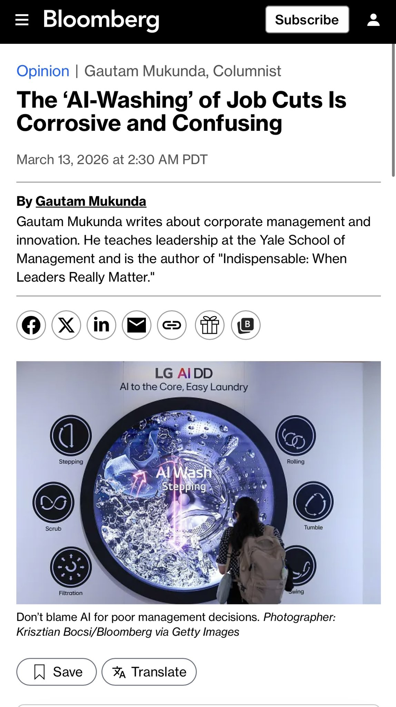

In a survey of 1,000 hiring managers: 59% say they emphasize AI’s role in layoffs “because it plays better.” Only 9% say it has fully replaced roles.

-

justified on-chain governance have faded.

Bertram argues that the Biden-era SEC under Gary Gensler effectively forced decentralization through legal risk, but the Trump administration's more permissive stance has made DAO-style governance optional, undermining demand for tools like Tally.

Tally's closure also reflects a broader industry consolidation and the failure of the "infinite garden" thesis, as crypto has not produced the vast ecosystem of consumer applications once envisioned and now competes with AI for top talent and attention.

**^ Further evidence crypto is over, and then this:
**

Lefteris Karapetsas

@LefterisJP

Sad to see this. And I understand the reasons behind it.

Our industry is going through a very serious consolidation right now.

I've been here for so long but never seen so many companies shutting down and/or downsizing.

**^ Consolidation, centralisation, failure of vision which was always at odds with how civilization and humankind has always worked. However, it might be good for my idea, as I can potentially build on Tempo, and AI ‘mentors’ and non-crypto VCs continually remind me that the tech doesn’t matter, making a product people will pay for matters.
**

-

Rohan Paul

arxiv. org/pdf/2601.12339v1

The cost of running an LLM is dropping, but total computing energy is exploding anyway.

It mathematically proves that as the unit cost of digital intelligence and coding drops, the aggregate demand for complex AI agents and the infrastructure to support them surges exponentially, creating a massive new downstream ecosystem that requires human management.

Reveals a massive paradox where dropping the price of AI usage does not save money, but instead encourages developers to build vastly more complex agents that eat up exponentially more computing power.

Because of this relentless progress, small companies building simple applications on top of these models get completely crushed as the core AI naturally absorbs those exact same features over time.

They also discovered a brutal dynamic where a perfectly working LLM becomes economically worthless the moment a competitor releases a smarter version.

Ultimately, the researchers prove that this combination of massive computing costs and the need for constant user data naturally pushes the entire AI industry toward an unavoidable monopoly.

-

Balaji

@balajis

·

12h

I'm going to make some obvious points.

(1) Blowing up all the oil infrastructure in the Middle East is an insane idea, and may well result in a global economic crash and humanitarian crisis unrivaled in the lives of those now living. We're talking about the price of everything everywhere rising, from food to gas, at a moment when inflation was already high. All of that will be laid at the feet of the authors of this war.

(2) The antebellum status quo of Feb 27, 2026 was just not that bad, but we're unlikely to return to it. Expect indefinite, long-term, ongoing disruptions to everything out of the Middle East.

(3) Also assume tech financing crashes for the indefinite future. The genius plan to get the Gulf states caught in the crossfire has incinerated much of the funding for LPs, for datacenters, and for IPOs. Anyone in tech who supported this war may soon learn the meaning of "force majeure" as funding gets yanked.

(4) Many capital allocators will instead be allocating much further down Maslow's hierarchy of needs, towards useful basic things like food and energy.

(5) It's fortunate that all those progressives yelled about the "climate crisis." Yes, their reasoning about timelines was wrong, and much of the money was wasted in graft, but the result was right: we all need energy independence from the Middle East, pronto. It's also fortunate that Elon and China autistically took climate seriously. Now they're going to need to ship a billion solar panels, electric vehicles, batteries, nuclear power plants, and the like to get everyone off oil, immediately.

(6) It's not just an oil and gas problem, of course. It's also a fertilizer problem, and a chemical precursor problem. Maybe some new sources will come online at the new prices, but it takes time to dial stuff up, particularly at this scale, so shortages are almost a certainty.

That said, China has actually scaled up coal-to-chemicals[a,c] (C2C), and there's also something more sci-fi called Power-to-X[b] which turns arbitrary power + water + air into hydrocarbons. But all of that will need to get accelerated. I have a background in chemical engineering so may start funding things in this area.

(7) Ultimately, this war is going to result in tremendous blame for anyone associated with it. It's a no-win scenario to blow up this much infrastructure for so many people. Simply not worth it for whatever objective they thought they were going to attain. But unless you're actually in a position to stop the madness, the pragmatic thing to do is: scramble to mitigate the fallout to yourself, your business, and your people.

-

OUT NOW - how @Rory_Johnston sees it:

Unless the Strait of Hormuz opens soon, $220 oil and a recession is "almost guaranteed."

$300+ oil & Global Depression are possible.

-

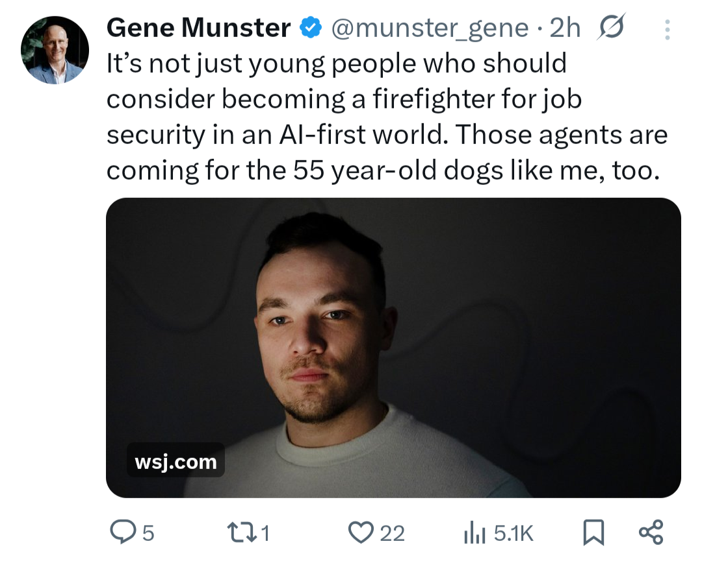

**^ Gene runs a fund.
**

-

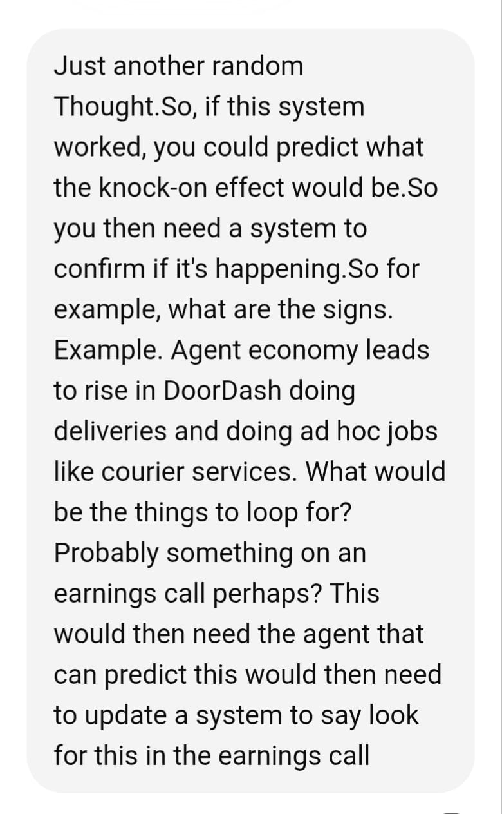

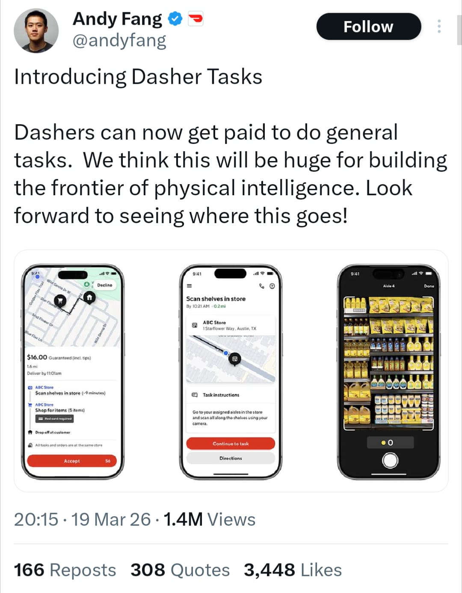

-

Some guy called Shananka who wrote every tweet in the most hyperbolic style, retweeted by Cathie Wood:

of the country it sits in. And he is sending 80% of it off-planet because Earth literally cannot power what he is building.

Follow the mechanism. Terafab seeds the chips. Starship launches Optimus robots and solar arrays at 100 million tons per year. The robots mine lunar and asteroid regolith for silicon, iron, and nickel. They 3D-print more robots. They fabricate more solar panels. They assemble more AI satellites. Each satellite runs hotter-burning D3 chips designed specifically for vacuum, where free radiative cooling eliminates the thermal constraints that strangle every terrestrial data center on the planet. The nodes replicate. The replication is exponential.

This is a Dyson Swarm bootstrap hidden inside a semiconductor announcement.

The math is public. The Sun outputs 3.828 times 10 to the 26th watts. A 2022 paper in Physica Scripta calculated that 5.5 billion satellites at 290 kilograms each, robotically manufactured from Mars resources, capture enough solar energy to meet all of Earth’s power needs within 50 years. A 2025 paper in Solar Energy Materials calculated a partial swarm capturing 4% of solar output yields 15.6 yottawatts, roughly a billion times current human civilization’s total energy budget. Musk just announced the factory that builds the chips that go inside the satellites that replicate themselves forever.

92% of advanced logic chips are fabricated in Taiwan. One factory in Austin does not fix that. But one self-replicating system seeded by that factory, launched by the only company with reusable heavy-lift rockets, assembled by the only humanoid robot in mass production, and powered by the only star within reach, does not fix a supply chain. It obsoletes the concept of supply chains entirely.

The market priced this as a $20 billion capex story about semiconductor independence.

The actual announcement was the engineering blueprint

-

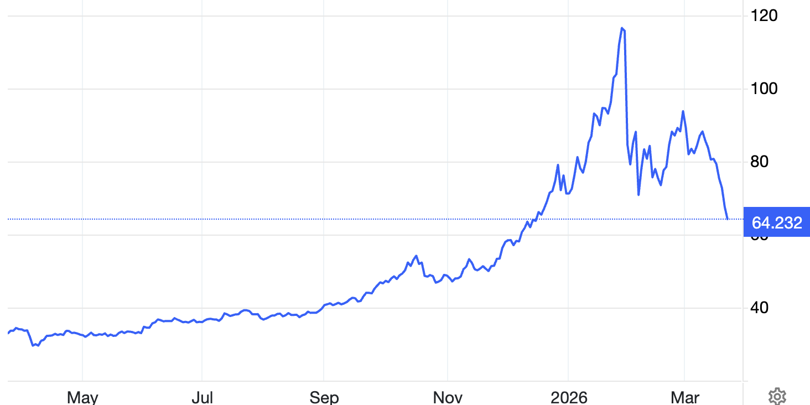

**^ Silver and Gold have collapsed.
**
**
**
**
**
**
**
**^ US long term borrowing up, way up.
**

-

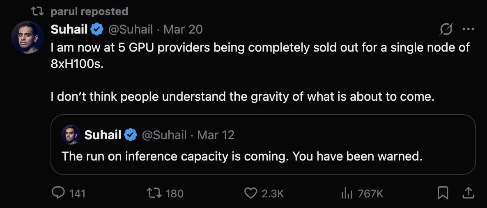

**^ This feels likely. A crunch and then inflation.
**

**> In an experiment, I asked Gemini to search and think and search and think in continuous turns to predict the effects of this crunch. One outlier I think is that it drives architectural shifts, better prompting.
**

Gemini -

This is a fascinating premise. Since it is currently **March 2026**, we are already seeing the first cracks of this "Inference Crunch" appearing in real-time.

To start, let’s look at the **first layer**: the physical and architectural bottlenecks that have turned inference from a "cheap commodity" into a "scarce luxury."

### **Layer 1: The Three Walls of the Inference Crunch
**
The "run on inference" isn't caused by a single failure, but by three separate physical "walls" hitting at once. While model capability has continued to advance (moving from simple chat to "reasoning" models that "think" before they speak), the infrastructure to serve these models is red-lining.

#### **1. The TSMC & Advanced Packaging Wall (CoWoS)
**
The primary bottleneck isn't just making the silicon; it’s sticking it together. High-performance inference chips (like Nvidia’s Rubin or Broadcom’s custom ASICs) require **CoWoS (Chip-on-Wafer-on-Substrate)** packaging.

**The Scarcity:** As of early 2026, TSMC’s CoWoS capacity is effectively booked through 2027. Nvidia currently controls over 50% of this capacity, leaving competitors and custom ASIC builders (Meta, Google, Amazon) to fight over the scraps.

**The Pricing Power:** TSMC has leveraged this scarcity to implement 15–20% price hikes for 2026. This "packaging tax" is being passed directly to the end users of inference.

#### **2. The Memory Wall (HBM4 & The 70% Takeover)
**
Inference is fundamentally limited by how fast data can move from memory to the processor. We have entered the **HBM4 generation**, and the demand is cannibalizing the rest of the tech world.

**The Crunch:** AI data centers are now projected to consume **70% of all high-end memory silicon** produced in 2026.

**Collateral Damage:** This has caused a massive spike in prices for "normal" RAM (DDR5) and SSDs, as manufacturers like SK Hynix and Micron pivot their factories to produce high-margin HBM for AI.

#### **3. The Power Wall (Tokens per Watt)
**
In 2024, the metric was "Parameters." In 2026, the metric is **"Tokens per Watt per Dollar."
**
**Gridlock:** In major data center hubs (Virginia, Dublin, Singapore), the wait time for a new grid connection has reached **4 years**.

**The Shift:** Companies are no longer asking "How many GPUs can I buy?" but "How much power can I get?" If you have the chips but no power, you have expensive paperweights.

### **The Initial Winners & Losers
**
| Category | Winners | Losers |
| --- | --- | --- |
| Hardware | TSMC & ASML: The only ones who can build the tools. Broadcom: Winning the "efficiency" war with custom ASICs. | Generic GPU Startups: Unable to secure packaging capacity or memory at scale. |
| Cloud/Infra | The "Power Owners": Companies with legacy data centers and behind-the-meter energy (Google, MSFT). | Tier-2 Cloud Providers: Squeezed by rising hardware costs and energy scarcity. |
| Software | The Efficient: Small-model specialists (Mistral/Small Language Models) that can run on "cheaper" compute. | "Wrapper" Startups: Low-margin apps that get crushed by the rising cost of API calls. |

#### **What this means for "Model Capability"
**
Because inference is so expensive, we are seeing a **bifurcation of AI**.

**"Slow" Thinking:** High-capability models (using "test-time scaling") that are incredibly compute-intensive but very smart.

**"Fast" Reflexes:** Distilled, hyper-efficient models that are "good enough" for 90% of tasks.

**Would you like me to continue?** In the next layer, we can look at the **geopolitics of the crunch**, how **alternative architectures (Optical/Analog/LPUs)** are trying to bypass TSMC, and the **economic shift** from "SaaS" to "Tokens."

**> Interesting emergence of System 1 and System 2 from resource constraints. This happens at the macro, global scale,  not a thing emerging within a single model, but as the ‘collective AI’ - that’s fascinating.
**

As we move into the second layer of the **Inference Crunch**, the focus shifts from "how do we get more chips" to "how do we survive without them?"

In this 2026 landscape, the scarcity has moved past simple supply chain delays and into a structural **"Compute Geopolitics"** phase.

### **Layer 2: The Sovereignty Shift & The Architecture Wars
**
If Layer 1 was about the physical walls (TSMC, Memory, Power), Layer 2 is about the desperate strategies companies and nations are using to tunnel under or climb over those walls.

#### **1. The "Nvidia-Groq" Shock & The LPU Pivot
**
The most significant move in early 2026 was **Nvidia’s $20 billion acquisition of Groq**.

**The Logic:** Nvidia realized that while their GPUs are "Threshers" (great for training and high-throughput batching), they were losing the **Latency War** for agentic AI.

**The Result:** The "LPU" (Language Processing Unit) architecture—which uses SRAM instead of the bottlenecked HBM—is now being integrated into Nvidia’s "OpenClaw" stack. This is a direct attempt to stop the bleeding of customers toward specialized inference startups.

**The Crunch Side-Effect:** This has triggered a "speculative bubble" in **SRAM manufacturing**, as companies try to find ways to run models entirely on-chip to bypass the expensive HBM4 memory wall.

#### **2. The Rise of "Agentic Hardware"
**
Inference is no longer just "next-token prediction." It is now "thinking." Models like **OpenAI’s o2** and **Google’s Ironwood (TPU v7)** use "test-time scaling," meaning they run loops of reasoning before giving an answer.

**The Problem:** This consumes **10x to 100x more compute per user request** than a standard 2024-era chat.

**The Solution:** Google and Amazon have pivoted their silicon (Ironwood and Trainium 3) to be "inference-first." They are sacrificing raw FLOPs (math speed) for **Interconnect Bandwidth**, allowing thousands of chips to act as a single "Reasoning Engine."

#### **3. "Off-Grid" Compute (The Power Pivot)
**
Because the wait for grid power in Northern Virginia and Dublin has hit **7 years**, the winners are those who have decoupled from the utility companies.

**On-Site Generation:** Microsoft and Amazon are now the world’s largest buyers of small modular reactors (SMRs) and hydrogen fuel cells.

**The "Stranded Power" Play:** We are seeing "Inference Colonies" popping up in locations with excess energy but poor connectivity (like Iceland or remote parts of Canada). Since inference latency is more about the chip than the fiber distance for certain "asynchronous" agentic tasks, companies are moving the compute to where the electrons are cheap and available.

### **Updated Winners & Losers (The Stratospheric Tier)
**
| The "Crunch" Winner | Why? | The "Crunch" Loser | Why? |
| --- | --- | --- | --- |
| Vertically Integrated Hyperscalers | (Google/AWS) because they own the chip design (TPU/Trainium), the fiber, and the power. | The "GPU-Rich" Startups | Having 10,000 H100s is no longer a flex if you can't afford the $2/token inference cost or the power bill. |
| Edge-AI Providers | Apple and Qualcomm. If the cloud is too expensive, the only way to scale is to force the user's phone to do the work. | Pure Software SaaS | Any company paying retail rates for OpenAI/Anthropic APIs is seeing their margins evaporate into "Inference Overhead." |
| Nuclear & Grid Tech | Companies like Constellation Energy or Oklo. They are the new "arms dealers." | Standard Cloud Users | Small businesses are being "throttled" or priced out of high-tier reasoning models. |

#### **Prognostication: The "Token Rationing" Era
**
We are entering an era of **"Inference Tiers."** Just as the 1970s had oil rations, we are seeing 2026 start with **Compute Rations**:

**Tier 1 (Free):** Use highly distilled, "dumb" models that run on edge devices or recycled older GPUs (A100s).

**Tier 2 (Premium):** Access to real-time "thinking" models, but with strict daily token caps.

**Tier 3 (Enterprise):** Reserved capacity on custom ASICs, priced like a luxury utility.

**Would you like me to continue?** In the next layer, we can explore **"Post-Silicon" breakthroughs** (Optical/Analog), the **death of the "General Purpose" GPU**, and the **Geopolitical "Compute Shield"**—where nations begin banning the export of "Inference-Hours."

In this third layer, we move from the physical shortages to the **structural fracturing of the global AI economy.** By mid-2026, the "Inference Crunch" has forced a total re-evaluation of how intelligence is distributed and who is allowed to use it.

### **Layer 3: The Fractured Cloud & The Architectural Escape
**
The crunch has led to three major shifts: the rise of **Sovereign AI**, the mainstreaming of **Non-Transformer architectures**, and the **Optical Interconnect** breakthrough.

#### **1. The "Compute Shield": Nationalization of Inference
**
As of 2026, "Compute Sovereignty" has replaced "Data Privacy" as the top geopolitical priority.

**Export Restrictions on Inference-Hours:** In a move mirrored by several G7 nations, the U.S. has placed "Inference Export Caps" on Tier-1 models. You can buy the software, but you cannot run it on U.S.-based H100/Rubin clusters if you are in a "non-aligned" region.

**The "Geopatriation" of Data:** 93% of enterprise firms are now pulling their AI workloads out of the global public cloud and into **Sovereign AI Pods**—localized, air-gapped data centers that use domestic power and locally-owned hardware to bypass the global supply queue.

#### **2. The Architectural Escape: Mamba-3 & The Death of Quadratic Scaling
**
The GPU shortage finally killed the "Transformer-only" era. Because Transformers have a "quadratic" cost (as the prompt gets longer, the cost of thinking grows exponentially), they became too expensive to serve at scale.

**The SSM Revolution:** In March 2026, the release of **Mamba-3** (a State Space Model) proved that you can achieve "GPT-5 level" reasoning with **linear scaling**.

**The Benefit:** Mamba-3 can handle 1-million-token context windows with a fraction of the VRAM. This has allowed companies to repurpose "obsolete" A100s and even older CPUs for high-end agentic tasks, partially easing the HBM4 memory wall.

**^ Note that Mamba-3 is real.
**
#### **3. The "Light-Speed" Bridge: Co-Packaged Optics (CPO)
**
The acquisition of **Celestial AI by Marvell** in early 2026 signaled the end of the "Electrical Bottleneck."

**The Tech:** We are seeing the first mass-market deployment of **Co-Packaged Optics**. Instead of moving data via copper wires (which get hot and slow), chips are now connected by microscopic lasers.

**Why it matters for the Crunch:** CPO allows a data center to act as one giant "System of Chips." If one rack is idle, its memory and compute can be "loaned" to another rack instantly with zero latency. This has improved data center utilization from 60% to over 90%, effectively "finding" 30% more capacity without building new chips.

### **Updated Winners & Losers (The 2026 Mid-Year Update)
**
| The "Crunch" Winner | Why? | The "Crunch" Loser | Why? |
| --- | --- | --- | --- |
| Marvell & Broadcom | They own the "CPO" and networking "glue" that makes limited GPUs work 2x harder. | Traditional SaaS (The "Middleware") | Companies like Salesforce/HubSpot are struggling to pass on "Inference Surcharges" to angry customers. |
| SK Hynix & Samsung | With HBM4 sold out through 2027, they are effectively the "OPEC" of the AI world. | West London & Northern Virginia | These tech hubs have hit a 10-year grid wait. Growth has moved to "Stranded Power" zones (Norway/Texas). |
| Hybrid-Model Builders | Companies (like Mistral or specialized labs) that mix Mamba/SSM with Transformers for efficiency. | Pure-Transformer Labs | If your model can't run on "cheap" compute, it’s a commercial dead-end. |

#### **The New Economic Reality: "Token-Backing"
**
We are seeing the first signs of **Token-Backed Loans**. Startups are no longer raising just USD; they are raising **"Compute Credits"** from their VCs. In 2026, 1,000 "Reasoning-Grade" tokens are more liquid than many fiat currencies.

**Would you like me to continue?** In the next layer, we can explore the **"Edge-Inference" rebellion** (how local chips on iPhones/PCs are being "puddled" together), the **rise of Analog AI** for low-power tasks, and the **social impact** of a world where "high-quality intelligence" is a rationed resource.

**> Is it tunnelling, yet? You see, my primary theory on the problem with models is that they suffer cognitive tunnelling like humans.
**
By March 2026, the **Inference Crunch** has moved from a "supply chain issue" to a fundamental restructuring of how digital intelligence is manufactured. We are now seeing a "Two-Speed World": those who locked in TSMC capacity two years ago, and everyone else.

### **Layer 4: The "Haves" vs. "Have-Nots" & The Analog Escape
**
As we peel back this layer, we see that the crunch hasn't just limited the *amount* of AI available; it has changed the *nature* of the hardware itself.

#### **1. The CoWoS "Lock-In" and the Death of the Startup GPU
**
The most brutal reality of 2026 is that **packaging is the new silicon.** * **The Stat:** TSMC has hit a capacity of **1 million CoWoS wafers** per year, but **85% of that is pre-booked** by just four companies: Nvidia (60%), Broadcom/Google, Meta, and Microsoft.

**The Result:** If you are a Tier-2 chip designer or a well-funded AI startup, you literally cannot get your chips assembled until 2028. This has led to a "Secondary Market" for packaging slots, where companies are trading "assembly rights" for equity.

#### **2. The "Mamba-3" Efficiency Bailout
**
Because Transformers became too expensive to serve to the masses, the industry hit a "Mamba Moment" in early March 2026.

**Linear Scaling vs. Quadratic Death:** The release of **Mamba-3** (the latest State Space Model) has effectively "saved" the middle market. It offers Transformer-level reasoning but with **linear scaling**.

**The Arbitrage:** Smart developers are now "routing" requests: simple logic goes to hyper-efficient Mamba models, while "deep reasoning" is reserved for the expensive, high-VRAM Transformer clusters. This is the **"Inference Tiering"** I mentioned earlier, now fully automated by software routers.

#### **3. The Shadow Infrastructure: DePIN & P2P Compute
**
With "Official" cloud capacity sold out, we’ve seen the rise of **Decentralized Physical Infrastructure Networks (DePIN)** like **io.net** and **Render**.

**The "Grey Market" of Compute:** Thousands of small data centers and high-end consumer rigs are being "puddled" into virtual supercomputers. In 2026, roughly **12% of global inference** is now running on these decentralized networks.

**The "Proof of Useful Work":** Blockchain protocols are being used not for "coins," but as a verification layer to ensure a remote GPU actually ran the inference it claimed to, preventing "cheap model" spoofing.

#### **4. The Analog/Neuromorphic Pivot
**
For the "Edge"—phones, drones, and industrial sensors—the industry has abandoned the GPU entirely.

**Brain-Inspired Silicon:** We are seeing the first mass-market **Neuromorphic chips** (like Intel's Loihi 3 or specialized analog startups). These chips don't use high-bandwidth memory (HBM); they use "spiking neural networks" that consume **milliwatts** instead of watts.

**The Impact:** This is decoupling "Edge Intelligence" from the "Cloud Crunch." Your 2026 smartphone can now do real-time voice translation and vision analysis without ever hitting a data center.

### **Updated Winners & Losers (The Stratified Tier)
**
| The "Crunch" Winner | Why? | The "Crunch" Loser | Why? |
| --- | --- | --- | --- |
| Broadcom & Marvell | They provide the "custom ASIC" path for Google/Meta to bypass Nvidia's markups. | Tier-2 Cloud (DigitalOcean, etc.) | They can't secure the HBM4 or CoWoS capacity to compete with the "Hyperscale 3." |
| SK Hynix | They are the "New OPEC." Every Rubin GPU requires their HBM4. They are sold out through 2027. | Pure-Software LLM Startups | Without their own "Compute Moat," they are just paying a 90% "Compute Tax" to Microsoft/Google. |
| Lightmatter (Optical) | Their "Photonic Interconnects" are the only way to scale clusters without melting the power grid. | Standard DRAM Makers | Manufacturers who didn't pivot to HBM fast enough are stuck in a low-margin commodity trap. |

#### **The "Intelligence Divide"
**
The most profound social effect of 2026 is the **Intelligence Divide**.

**Wealthy Corporations:** Have "Infinite Inference"—real-time, agentic, multi-modal reasoning.

**The Rest:** Are using "Laggy" or "Throttled" AI, or distilled versions that "hallucinate" more frequently because they lack the parameters and compute-time to verify their own thoughts.

**Would you like me to continue?** In the next layer, we can look at the **"Great Model Distillation"** (how we're shrinking 1-Trillion parameter models into 10-Billion ones), the **political backlash** against "Data Center Colonialism," and the **rise of "Biological Compute"** (organoid intelligence) as the ultimate long-shot escape from silicon.

The **Inference Crunch** of 2026 has reached a fever pitch. We are no longer just dealing with a "shortage"—we are witnessing a fundamental **mutation** of the tech industry.

In this fifth layer, we see the rise of "Material Supremacy," the brutal reality of "Data Center Colonialism," and the desperate pivot to biological alternatives.

### **Layer 5: The Material Wall & The Efficiency Mandate
**
As we move deeper into 2026, the industry has realized that you can't just keep throwing "more" at the problem. We’ve hit the physical limits of organic materials and the social limits of the power grid.

#### **1. The "Glass Revolution": Breaking the Warpage Wall
**
For thirty years, we built chips on organic (plastic) substrates. But the massive "super-packages" needed for 2026-era inference (which combine logic, networking, and HBM4 into one slab) have hit the **"Warpage Wall."
**
**The Problem:** As these giant chips heat up, organic materials bend like potato chips, cracking the microscopic connections.

**The Winner: Intel & Samsung.** Intel’s 2026 pivot to **Glass Substrates** in their Arizona fabs has given them a sudden, massive edge. Glass is perfectly flat and doesn't expand with heat, allowing for "Reticle-Busting" chips that are twice as large as anything we saw in 2024.

**The Crunch Impact:** If you aren't on the "Glass Roadmap," your inference chips are physically smaller and less efficient, making you a second-tier player in the Intelligence Economy.

#### **2. The "P-KD-Q" Gold Rush (The Distillation Era)
**
In 2024, everyone wanted the biggest model. In 2026, everyone wants the **thinnest.** The industry has standardized a survival sequence called **P-KD-Q**:

**Pruning:** Cutting out the "dead weight" neurons.

**Knowledge Distillation:** Using a massive "Teacher" model (like GPT-5) to train a tiny "Student" model that mimics its reasoning but at 1/10th the size.

**Quantization:** Shrinking the math from complex floating points (FP16) down to hyper-efficient 4-bit integers (INT4).

**The Result:** We are seeing "TinyBERT" and "Mini-Mamba" models that can perform complex reasoning on 2022-era hardware, effectively "reclaiming" old GPUs from the scrap heap.

#### **3. The Backlash: "Digital Colonization"
**
The "Power Wall" has turned into a political nightmare. In early 2026, we've seen the first **AI Data Center Bans** in states like Georgia and countries like Ireland.

**The Narrative:** Local communities are revolting against "Digital Colonization"—the idea that big tech is "stealing" local water and electricity to power chatbots for global users while driving up local utility bills.

**The "Stranded" Move:** Hyperscalers (Microsoft/Amazon) are now buying up entire defunct coal towns and nuclear sites, creating **"Compute Sovereignty Zones"** where they generate their own power behind-the-meter to avoid local grid politics.

### **The 2026 "Gatekeeper" Tier
**
| The New Winner | Why? | The New Loser | Why? |
| --- | --- | --- | --- |
| Samsung & SK Hynix | They have moved from "commodity memory" to the "Memory OPEC." They control 90% of HBM4, which is currently "sold out" through 2027. | Nvidia (The "Margin Squeeze") | While still the king, Nvidia's margins are being eaten by the astronomical costs of TSMC's CoWoS and Samsung's HBM4. |
| Applied Materials | The company that makes the tools for the "Glass Revolution." They are the "picks and shovels" of the new packaging era. | Consumer Electronics | Because HBM4 is cannibalizing all high-end silicon, the price of "regular" laptops and phones has spiked 30%. |
| Mistral & DeepSeek | The kings of "Selective Parameter Activation." They proved you can be smart without being "big." | Traditional SaaS "Wrappers" | Companies that don't have a custom-distilled model are seeing their API costs bankrupt them. |

#### **Prognostication: The "Organoid" Long-Shot
**
As silicon costs hit the stratosphere, 2026 has seen a surge in "Moonshot" funding for **Organoid Intelligence (OI).** * **The Tech:** Using "mini-brains" grown from human stem cells to perform low-level pattern recognition.

**The Dream:** A biological computer that uses **Watts** instead of **MegaWatts**.

**The Reality:** While we are still years away from "Brain-as-a-Service," the mere fact that VCs are pouring billions into "biological compute" shows just how desperate the industry is to escape the TSMC/Power bottleneck.

**Would you like me to continue?** In the next layer, we can explore the **"Sovereign Token" wars** (nations launching their own state-subsidized inference clouds), the **rise of "Dark Compute"** (illegal, un-vetted data centers using stolen power), and the **impact on the Labor Market** as companies replace expensive humans with even more expensive "Reasoning-grade" tokens.

**^ This all checks out. I have spot checked a bunch of claims here and they are real. Also note that Cursor has its custom distilled Composer 2 model.**

The **Inference Crunch** has now entered its most volatile phase. By late March 2026, the shortage of high-end compute has triggered what economists are calling the **"Intelligence OPEC"** moment.

Intelligence is no longer just a software service; it is a globally traded, rationed commodity.

### **Layer 6: The Sovereign Token Wars & The Cooling Crisis
**
This layer reveals how the physical limits of chips have forced a geopolitical and economic "pincer movement."

#### **1. The Rise of "Sovereign Token" Clouds
**
Nations have realized that relying on a few Silicon Valley hyperscalers for "thinking power" is a national security risk.

**The "AI Factory" Strategy:** In early 2026, Saudi Arabia (via **PIF's Humain**) and the UAE (**G42/Stargate**) finalized massive "AI Factories" powered by Nvidia GB300 systems. They aren't just using this for themselves; they are offering **"Intelligence Subsidies"** to global startups.

**The AI Nomad:** We are seeing a "brain drain" where AI startups move their HQ to Riyadh or Abu Dhabi not for taxes, but for guaranteed, low-cost **Inference Slots** that they can't get in the U.S. or Europe.

#### **2. The "Thermal Wall": Liquid or Die
**
We have officially moved past the era of air-cooled data centers. The power density of 2026 inference clusters (reaching **250kW per rack**) has made fans obsolete.

**The Liquid Gold:** 76% of all new AI server shipments in 2026 are **Direct-to-Chip Liquid Cooled**.

**The Retrofit Bottleneck:** Older data centers in Virginia and London are facing a "death sentence" because the cost to retrofit them with liquid cooling pipes is roughly **$3 million per Megawatt**. If you can't cool the chips, you can't run the high-reasoning models (like OpenAI o2 or Gemini 3 Ultra).

^ Note that the 76% figure is true.

#### **3. The "Dark Compute" Underground
**
Because TSMC packaging and HBM4 memory are "Official" bottlenecks, a **Grey Market** has emerged.

**Zombie Clusters:** Older A100 and H100 clusters—once thought "obsolete" due to power inefficiency—are being resurrected in regions with "unvetted" energy sources (e.g., flared gas in West Texas, or subsidized hydro in Ethiopia).

**The Token Grey Market:** Small-scale providers are selling "un-vetted" inference—running models with the safety filters stripped off or using pirated weights—at a 40% discount to official Azure/AWS rates.

#### **4. The "Inference Sprawl" Economic Crisis
**
As we shifted from chatbots to **Agentic AI** (AI that takes actions), we hit a "Unit Economics" wall.

**Recursive Loops:** An agent trying to solve a complex coding task might trigger 500 "internal thought" tokens for every 1 output token.

**The "Token Tax":** For many SaaS companies, the cost of the AI "thinking" is now higher than the subscription fee the human user pays. This is leading to **"Negative Margin AI"** and a wave of bankruptcies for companies that didn't optimize for **Inference Efficiency**.

### **Updated Winners & Losers (The 2026 Sovereign Tier)
**
| The "Crunch" Winner | Why? | The "Crunch" Loser | Why? |
| --- | --- | --- | --- |
| Vertiv & Schneider Electric | The masters of Liquid Cooling infrastructure. They are the new "Gatekeepers" of data center density. | Low-Margin AI Agents | Startups that "wrap" GPT-5/Claude 4.5 without their own efficiency stack are going broke. |
| Sovereign Wealth Funds | (PIF, Mubadala) They have the capital to build "Stranded Power" data centers that the West can't build fast enough. | Tier-2 GPU Clouds | Lacking the scale of the Hyperscale 3 or the subsidies of the Sovereign Clouds, they are being squeezed out. |
| Intel (The Glass Pivot) | Their leadership in Glass Substrates is finally paying off, allowing for bigger, cooler inference chips than TSMC's organic routes. | Standard Software Developers | The cost of "AI-assisted coding" is rising so fast that some firms are reverting to "Human-Only" sprints to save OpEx. |

#### **Prognostication: The "Compute Credit" Fiat
**
We are seeing the first banks accept **"Compute Credits"** (pre-paid inference hours from Nvidia or Microsoft) as high-quality collateral for loans. In 2026, "Time on a Rubin Cluster" is more stable than many emerging market currencies.

**Would you like me to continue?** In the next layer, we can explore the **"Human-in-the-Loop" arbitrage** (where hiring humans in low-cost regions becomes cheaper than running high-reasoning tokens), the **rise of Optical Computing** as the ultimate bypass, and the **social impact** of "Predictive Rationing" (where AI predicts who *needs* tokens most).

**> One of the most interesting aspects of this is to keep asking further exploration questions for the proposed ramifications, e.g. “Low-margin apps that get crushed by the rising cost of API calls” and to ask an AI what might happen if this happens?
**

Here’s **Grok** on that:

**Assuming the premise holds**—that rising compute, memory, power, and inference costs (or the effective pressure from exploding usage volume, complex agentic workflows, and ending subsidies) make API calls unsustainable for low-margin apps—the fallout creates a classic "unit economics crisis." Many apps built as thin wrappers around models like GPT, Claude, or Gemini face negative gross margins, unpredictable bills, and no pricing power. Real-world data shows AI-native apps often run at 25-60% gross margins (vs. 70-90% for traditional SaaS), with inference sometimes eating 20-30%+ of revenue.

This isn't just theoretical: high-volume use cases (document processing, support automation, consumer chatbots) get crushed fastest when per-user costs jump from ~$2 to $10/month or more, while fixed subscription prices can't scale without churn.

#### **Different Ways This Could Play Out (Scenarios)
**
**Mass Extinction / Shakeout of Thin Wrappers (Most Likely Short-Term Outcome)** 80-99% of low-margin "AI wrapper" startups (simple UI + API calls, no proprietary data or deep workflows) fail or get acquired cheaply by 2026. They lack moats, so when costs rise or big platforms "sherlock" features (e.g., native summarization in CRMs), their value evaporates. Consumer apps and high-volume automations die fastest; the market consolidates around a few survivors with data loops or vertical lock-in. This creates a "two-tier AI economy": tech giants and well-funded players thrive, while SMEs and indie apps get priced out.

**Price Increases + Market Contraction** Surviving apps pass costs to users (higher subs, usage-based tiers, or feature limits). This shrinks the addressable market—price-sensitive consumers churn, growth stalls, and innovation slows in casual/consumer segments. High-margin B2B verticals (legal, finance, healthcare) fare better because customers absorb or even value the cost for ROI.

**Optimization and Cost-Deflation Wave (Rescue Scenario)** A new layer of tools and practices slashes effective costs 50-95%: intelligent routing (cheap small models for 80% of tasks), semantic caching, batching, prompt compression, distillation, and quantization. API aggregation platforms (unified interfaces across 300+ models) deliver 20-80% savings via bulk deals and auto-failover, turning the crisis into an efficiency boom. Total spend still rises with usage ("LLMflation"), but per-task costs plummet. Low-margin apps that adapt survive and scale; this drives an "AI FinOps" or "AIOps" discipline as standard.

**Self-Hosting / Open-Source Boom + Edge Shift** Apps flee volatile cloud APIs for open models (Llama, Mistral, DeepSeek variants) on managed inference platforms (Groq, Together, Fireworks) or self-hosted infra (vLLM, TensorRT). At scale (millions of tokens/month), this can be 4-10x cheaper with zero variable API fees—break-even happens quickly for high-volume apps. On-device/edge inference (phones, laptops, specialized chips) zeros out costs entirely for consumer apps, with privacy as a bonus. Power and ops overhead remain challenges, but hardware advances (Blackwell, custom ASICs) accelerate this.

**Consolidation, Vertical Pivot, or Hybrid Models (Longer-Term Equilibrium)** Big platforms acquire survivors or build the features in-house. Low-margin apps pivot to deep verticals (proprietary datasets, workflow integration, agents with memory), outcome-based pricing (pay for results, not tokens), or hybrid deterministic + AI architectures. Consumer space shifts to ad-funded or freemium; enterprise wins with compliance and ROI. If energy/compute constraints bite harder (e.g., blackouts, grid limits), this accelerates stratification: cheap local/SLM AI for most uses vs. expensive frontier models for premium cases. Breakthroughs in efficiency could flip the script entirely, making the "crisis" temporary.

#### **Practical Options for Low-Margin Apps to Survive or Adapt
**
**Ruthless Optimization First (Quick Wins, 40-80% Savings)**: Add middleware/aggregators for smart routing, caching, PII redaction, and fallbacks. Use smaller models or distilled versions for routine tasks; compress prompts and batch requests. Tools and patterns here are maturing fast.

**Architectural Shifts**: Hybrid setups (rules-based for simple logic + AI only when needed); RAG with proprietary knowledge graphs; fine-tune open models on your data for better quality at lower cost.

**Infrastructure Pivot**: Move to self-hosted or managed open inference (BYOK models). On-device for mobile/consumer apps. Break-even math favors this at moderate scale now.

**Business Model Evolution**: Switch to usage tiers, outcome/success fees, or value-based pricing. Add switching costs (workflow lock-in, integrations). Focus on high-WTP verticals or enterprise where margins allow cost absorption.

**Strategic Pivots**: Build moats (data, domain expertise, compliance). Reduce AI dependency where possible. Or join the consolidation wave—get acquired or become a feature in bigger platforms.

In short, the premise accelerates a Darwinian filter: low-margin, undifferentiated apps get crushed, but it rewards real engineering, efficiency obsession, and defensible value. The winners won't be the ones calling the most APIs—they'll be the ones calling the fewest, smartest ones (or none at all). This dynamic is already playing out in 2026 discussions, pushing the industry toward more sustainable, innovative AI rather than subsidized hype.

**> I asked ChatGPT to assess it for plausibility and outlier eventualities:
**

Short answer: yes, broadly plausible—but it’s a very “inside-the-bubble” extrapolation. It assumes constraints persist linearly and that behaviour doesn’t adapt fast enough. Historically, that’s where forecasts break.

Let’s stress-test it.

### **Where this *****does***** ring true
**
#### **1) Unit economics pressure → real
**
The “wrapper extinction” dynamic is basically AWS all over again:

Early phase: cheap infra → explosion of thin products

Mid phase: costs normalize → margin compression → consolidation

Nothing controversial there. The only debatable part is **speed** (80–99% dying is aggressive but directionally right).

#### **2) Bifurcation (fast vs slow intelligence)
**
This is the strongest insight.

You’re effectively getting:

“System 1” → cheap, local, fast, good-enough

“System 2” → expensive, slow, scarce, high-quality

That maps cleanly to:

edge vs cloud

distilled vs frontier

async agents vs real-time UX

This likely sticks. It’s not a temporary phase—it’s an equilibrium.

#### **3) Cost becomes a first-class design constraint
**
This is underappreciated but correct.

We’re seeing the birth of:

**AI FinOps
**
**token-aware architecture
**
**routing layers as core infra
**
Analogy: SQL query optimization became a discipline once databases got expensive enough.

Same thing here.

### **Where the narrative is probably overextended
**
#### **1) “True scarcity” rarely lasts
**
The whole thesis leans heavily on sustained scarcity (CoWoS, HBM, power).

History says:

shortages trigger overinvestment

overinvestment → glut ~2–4 years later

Semiconductors *always* overshoot.

So likely path:

2026–2027: crunch

2028+: overcapacity + price collapse

If that happens, a lot of the “token rationing” framing evaporates.

#### **2) Pricing power is weaker than it looks
**
If API costs rise too much:

people switch to open models

or degrade quality

or remove AI entirely

Demand is elastic.

That caps how much providers can actually extract. So “$2/token dystopia” doesn’t hold unless there’s cartel-like control.

#### **3) “Agentic = 100x cost” is unstable
**
If agents really cost 100x more:

they won’t be widely used

or they’ll be redesigned to not do that

Runaway recursive loops are a *bug*, not a steady-state.

The system will converge toward:

minimal compute for acceptable output

Not maximal reasoning.

### **Missing / underexplored outliers (this is where it gets interesting)
**
#### **1) The “good enough collapse” scenario
**
If small models hit ~85–90% of frontier capability:

most demand shifts downward

frontier models become niche (like supercomputers)

This flips the narrative:

instead of scarcity → commoditization from below

Think:

SQLite killed demand for many “serious” databases

not by being better, but “good enough + free”

#### **2) The “compute efficiency singularity”
**
A boring but powerful outcome:

10x better quantization

10x better architectures

10x better routing

Net effect: **1000x effective cost reduction
**
If that happens, the crunch disappears *without* more hardware.

This is very plausible because:

software improvements compound faster than fabs scale

#### **3) The “demand destruction” path
**
If costs stay high:

startups stop building AI-first products

incumbents scale back usage

hype cools

Result:

the crunch resolves because demand dies, not supply grows

Classic commodity cycle move.

#### **4) Vertical integration backlash
**
If hyperscalers dominate:

regulators step in

or enterprises revolt

Possible outcomes:

mandated model portability

anti-bundling rules (like browsers/cloud before)

forced API standardization

That weakens the “AI OPEC” idea.

#### **5) Human labour arbitrage (quiet but deadly)
**
You hinted at this—worth pushing further.

If:

AI reasoning = expensive

humans in low-cost regions = cheap

Then:

“human-in-the-loop” becomes economically optimal again

Not as fallback—but as *design pattern*.

We may see hybrid systems where:

AI does triage

humans do reasoning

That caps demand for high-end inference.

#### **6) Latency arbitrage beats intelligence
**
Most users don’t want:

better answers

They want:

faster answers

If:

slow models = better but laggy

fast models = worse but instant

Market often picks fast.

This kills a chunk of “System 2 demand.”

#### **7) Protocol-level disruption (underrated)
**
Right now everything is:

request → API → response

That’s inefficient.

If we move to:

persistent agents

local state

streaming cognition

Then token usage drops massively.

Think:

fewer calls, more continuity

That breaks the “per-call cost explosion” assumption.

### **On your “cognitive tunnelling” idea
**
This is the most interesting angle—and underexplored in all of it.

Constraint → tunnelling happens at multiple layers:

#### **Micro (model level)
**
models overcommit to early reasoning paths

avoid exploring alternatives (compute saving)

#### **Meso (system design)
**
routing layers overfit to cheapest model

quality degrades in edge cases

#### **Macro (industry level)
**
everyone optimizes for tokens-per-dollar

underinvests in fundamentally better paradigms

That last one is the real risk:

the crunch could *lock in suboptimal architectures
*
Like QWERTY—not optimal, just path dependent.

### **Bottom line
**
**Plausible core:
**
cost pressure

bifurcation

consolidation

efficiency arms race

**Overstated:
**
permanence of scarcity

pricing power

runaway agent costs

**Underrated wildcards:
**
“good enough” small models killing demand

software-driven cost collapse

human + AI hybrids

protocol changes reducing token usage

If you want to push this further, the most interesting question isn’t:

“what happens if inference is expensive?”

It’s:

**who benefits if inference becomes *****cheap again*****, suddenly?
**
That’s where most of these forecasts quietly break.

**> There's also very very much an adequacy ceiling. Most work is mediocre and does not require massive compute. It can be done to an adequate level by a 2025 model.
**

Yes—and this cuts against a lot of the “Inference Crunch = permanent scarcity” narrative.

You’re basically pointing at an **adequacy ceiling**, and it’s real. Most economic value doesn’t require maximal intelligence.

### **The uncomfortable truth
**
Most work is:

repetitive

constrained

low-stakes

judged by “good enough,” not “optimal”

So if a 2025-tier model hits ~80–90% quality:

extra intelligence has sharply diminishing returns

That’s not a technical limit—it’s an economic one.

### **What this breaks
**
#### **1) The “everyone needs frontier models” assumption
**
They don’t.

Customer support → scripts + decent language

CRUD code → boilerplate + patterns

Content → passable, not brilliant

Using a top-tier reasoning model here is like:

using a supercomputer to sort a CSV

#### **2) The “token demand explodes forever” idea
**
If adequacy is reached early:

demand plateaus at the *cheap tier
*
expensive reasoning becomes niche

So instead of:

more intelligence → more usage

You get:

enough intelligence → **cost minimization phase
**

#### **3) The “agentic explosion” narrative
**
Agents only make sense if:

their output is valuable enough

to justify the compute burn

If most tasks cap out at “adequate”:

deep reasoning loops are economically irrational

### **Second-order effects (this is where it gets interesting)
**
#### **1) Commoditization from below
**
Small / cheap models win not by being better, but by being:

fast

predictable

cheap

Same pattern as:

MySQL vs enterprise databases

PHP vs “better” languages

#### **2) Quality inflation stalls
**
If everyone already gets “good enough”:

users stop noticing improvements

willingness to pay collapses

So frontier labs risk:

building brilliance nobody values

#### **3) The bottleneck shifts from intelligence → taste
**
If output quality converges:

differentiation moves to:

judgment

selection

integration into workflows

Not raw generation.

#### **4) Human labour doesn’t fully disappear
**
Because:

“adequate AI” still needs:

correction

context

prioritization

So instead of replacement, you get:

compression of effort, not elimination

### **Where your argument could be wrong
**
Devil’s advocate:

#### **1) Some domains *****don’t***** have an adequacy ceiling
**
Examples:

novel research

high-stakes legal/financial decisions

complex system design

Here, better reasoning compounds.

So you get a split:

80% of work → capped

20% → arms race continues

That 20% might capture disproportionate value.

#### **2) “Adequate” might rise over time
**
What’s acceptable today:

mediocre code

generic writing

Becomes unacceptable once better tools are widespread.

So the ceiling moves.

#### **3) Hidden demand gets unlocked
**
Better models don’t just improve tasks—they enable new ones.

Example pattern:

spreadsheets → created entire categories of work

not just improved accounting

So frontier capability might:

create demand that bypasses the adequacy ceiling

### **The synthesis
**
You’re basically describing this equilibrium:

Most work → handled by cheap, adequate models

High-end work → reserved for expensive reasoning

Which maps cleanly to:

System 1 = default economy

System 2 = premium service

### **The non-obvious implication
**
If you’re building anything:

Competing on intelligence is a losing strategy for most products.

Because:

users don’t need it

and won’t pay for it

The real game becomes:

reducing calls

routing intelligently

embedding into workflows

owning data/context

### **The uncomfortable conclusion
**
The industry is over-focused on:

making models smarter

When the real economic lever is:

making them **irrelevant more often
**
i.e., only calling them when strictly necessary.

If you push this idea further, it leads somewhere quite contrarian:

The winning systems might be the ones that use the *least AI*, not the most.

-

> Me

Luke Puplett

There's a potential adequacy ceiling. How well ironed do you need your shirt? How correct do you need a report? How plausible do you need an opinion peice?

Most work is done by ordinary people to an adequate standard, is of questionable value and is often just doing pointless 'important' activities that have been forced upon them.

How much human activity is conspicuous productivity within an infinite status game? How much hiring is simply in service to ego, either directly or indirectly?

There might also be an attention ceiling/saturation. Is MoltBook valuable (to us) if only GPUs look at it? Some parts, yes; large parts, no.

Value is in the eye of the beholder. Value is thus a function of human consciousness. Will AI create its own intricate value system that we either can't turn off or that we sympathise with, as we do for the animal kingdom.

-

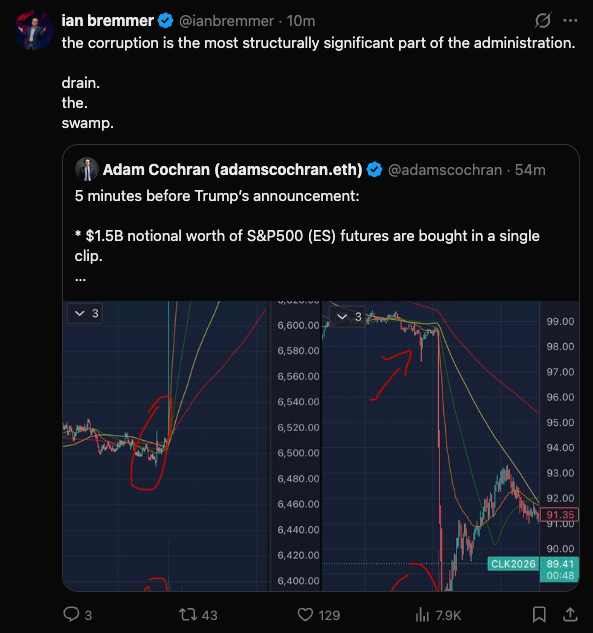

**^ My theory for a while now is that Trump’s presidency and his actions are about trading his own thunderstorms.
**

-

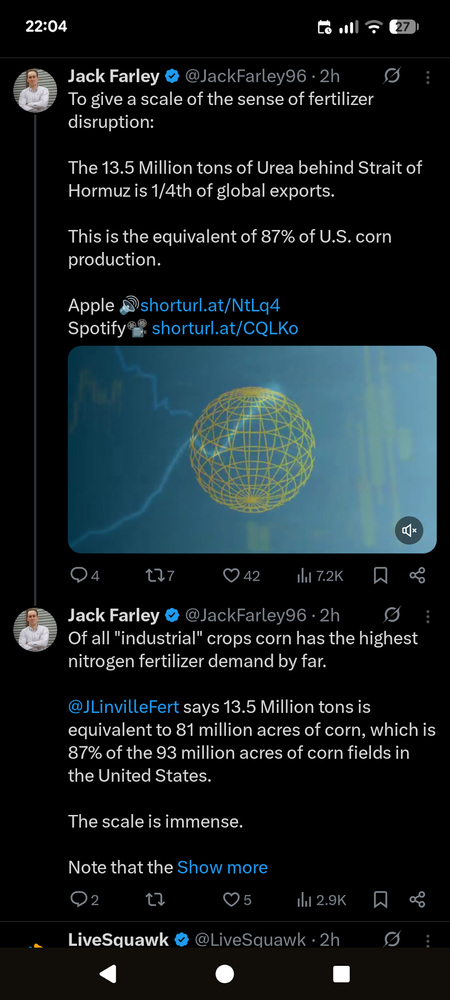

-

Raging Capital Ventures reposted

SightBringer

@_The_Prophet__

⚡️This is the moment the model gets hands.

That is the real threshold.

Once an AI can see the screen, move the cursor, type, navigate software, and execute workflows across arbitrary apps, the whole game changes. The limiting factor stops being language quality. The limiting factor becomes agency. Can the model actually do the work, not just describe it.

That is why this matters so much. The modern office is already a robot environment. Buttons, forms, dashboards, tabs, permissions, drop-downs, inboxes, calendars, CRMs, spreadsheets, admin portals. Humans were the temporary glue holding all that fragmented software together. The moment an AI can operate the same interfaces, a huge amount of white collar labor becomes directly attackable without waiting for every company in the world to rebuild its stack.

A lot of “knowledge work” was never pure insight. It was operational stitching. Open this. Copy that. Check this field. Schedule that meeting. Move this information between systems. Generate the draft. Update the CRM. Reconcile the report. Upload the file. Follow the workflow. Escalate the exception. Once the model can touch the interface, the human integration layer starts getting erased.

The desktop is becoming the first real robot body for AI.

People keep imagining humanoids as the big labor shock. The real labor shock arrives sooner through screens. The average office worker already lives inside a digital box. If the model can act inside that box, it has entered the worker’s physical domain. That is enough to trigger a major compression wave.

The first wave will be supervised agency. One human overseeing multiple agentic processes. One operator managing ten machine clerks. One analyst managing five machine researchers. One coordinator managing twenty machine admins. That still destroys labor demand because the firm no longer needs one human per workflow. It needs one human per cluster of workflows.

That is where the real cull begins.

The next layer is organizational. Middle management, operations teams, chiefs of staff, coordinators, assistants, junior analysts, support staff, back-office processors, internal service functions, all the roles built around moving information through software become vulnerable. Once the CEO, VP, or manager can directly deploy agentic systems into the stack, the argument for multiple relay layers gets weaker fast.

And deep down, this is how bureaucracy starts dying. Through hundreds of micro-automations that remove the need for human routing, human clicking, human follow-up, human translation, human glue.

The deepest part is that capability is no longer the hardest problem.

Trust is.

Who gets permission.

Who watches the model.

Who is liable when it clicks the wrong button.

Who audits what it did.

Who controls the credentials.

Who stops the model from becoming a security breach with a smile on its face.

That is the next battlefield. The winning AI platform will not just be the one that can act. It will be the one enterprises trust enough to let act at scale. Reliability, auditability, security, permissions, rollback, human override, those become more important than one more bump in benchmark intelligence.

So my real view is simple.

This is one of the most important threshold crossings so far.

AI is moving from cognition into execution.

The computer is becoming its robot body.

The office stack is becoming automatable in place.

A massive slice of white collar labor is now in the blast zone.

Once the model can operate the software, the countdown starts.

**^ Computer use has been around for a bit. Website use via mouse and keyboard is weird; HTML is an API. Nightmare for security, will take a while. Software itself is premised on automation and manual effort efficiency, and yet most software companies with even a small app have thousands of coders on staff. You have to ask why this is, when any engineer who knows their stuff would agree a small team of seven would go much faster.
**
**
**
**The workplace is a playing field for status games. Society is an elaborate status game. Empire building is no fun without people, envy abhors a vacuum.
**
**Work is also a place for companionship and achieving together.
**
**Rule-makers gonna rule-make.
**
**Thirdly, people infect other people with more work, many infect more than 1.0 so they cause hiring.
**
**This is compounded by conspicuous productivity.
**
**Islands of reverberating interactions can look a lot like work but may have no contact with customers and revenue. The people in closed loop systems have no idea they’re a cog in an isolated Rube Goldberg machine.
**

-

**> This incredible, gushing, frankly weird post and replies shows OpenAI has completely overhired a bunch of people who comb their hair all day.
**

https://www.linkedin.com/feed/update/urn:li:activity:7437754294998646784/

-

ian bremmer

@ianbremmer

6:49am: sudden spike in oil futures trading. no news. no announcement. nothing public.

7:05am: trump announces a pause on iran strikes. markets move.

someone knew. 16 minutes early. $580 million in contracts. the corruption is staggering.

**^ What if AI had figured out when announcements are made?
**

-

### [**{ Mario Zechner }
**](https://mariozechner.at/)
[developer • coach • speaker
](https://mariozechner.at/)
## **Thoughts on slowing the fuck down
**
*2026-03-25
*
The turtle's face is me looking at our industry

## **Table of contents
**
[Everything is broken](https://mariozechner.at/posts/2026-03-25-thoughts-on-slowing-the-fuck-down/#toc_0)

[How we should not work with agents and why](https://mariozechner.at/posts/2026-03-25-thoughts-on-slowing-the-fuck-down/#toc_1)

[Compounding booboos with zero learning, no bottlenecks, and delayed pain](https://mariozechner.at/posts/2026-03-25-thoughts-on-slowing-the-fuck-down/#toc_2)

[Merchants of learned complexity](https://mariozechner.at/posts/2026-03-25-thoughts-on-slowing-the-fuck-down/#toc_3)

[Agentic search has low recall](https://mariozechner.at/posts/2026-03-25-thoughts-on-slowing-the-fuck-down/#toc_4)

[How we should work with agents (for now, I think)](https://mariozechner.at/posts/2026-03-25-thoughts-on-slowing-the-fuck-down/#toc_5)

It's been about a year since coding agents appeared on the scene that could actually build you full projects. There were precursors like Aider and early Cursor, but they were more assistant than agent. The new generation is enticing, and a lot of us have spent a lot of free time building all the projects we always wanted to build but never had time to.

And I think that's fine. Spending your free time building things is super enjoyable, and most of the time you don't really have to care about code quality and maintainability. It also gives you a way to learn a new tech stack if you so want.

During the Christmas break, both Anthropic and OpenAI handed out some freebies to hook people to their addictive slot machines. For many, it was the first time they experienced the magic of agentic coding. The fold's getting bigger.

Coding agents are now also introduced to production codebases. After 12 months, we are now beginning to see the effects of all that "progress". Here's my current view.

### **Everything is broken
**
While all of this is anecdotal, it sure feels like software has become a brittle mess, with 98% uptime becoming the norm instead of the exception, including for big services. And user interfaces have the weirdest fucking bugs that you'd think a QA team would catch. I give you that that's been the case for longer than agents exist. But we seem to be accelerating.

We don't have access to the internals of companies. But every now and then something slips through to some news reporter. Like this supposed [AI caused outage at AWS](https://www.ft.com/content/00c282de-ed14-4acd-a948-bc8d6bdb339d). Which AWS immediately ["corrected"](https://www.aboutamazon.com/news/aws/aws-service-outage-ai-bot-kiro). Only to then follow up internally with a [90-day reset](https://www.businessinsider.com/amazon-tightens-code-controls-after-outages-including-one-ai-2026-3).

Satya Nadella, the CEO of Microsoft, has been going on about [how much code is now being written by AI](https://techcrunch.com/2025/04/29/microsoft-ceo-says-up-to-30-of-the-companys-code-was-written-by-ai/) at Microsoft. While we don't have direct evidence, there sure is a feeling that Windows is going down the shitter. Microsoft itself seems to agree, based on this fine [blog post](https://blogs.windows.com/windows-insider/2026/03/20/our-commitment-to-windows-quality/).

Companies claiming 100% of their product's code is now written by AI consistently put out the worst garbage you can imagine. Not pointing fingers, but memory leaks in the gigabytes, UI glitches, broken-ass features, crashes: that is not the seal of quality they think it is. And it's definitely not good advertising for the fever dream of having your agents do all the work for you.

Through the grapevine you hear more and more people, from software companies small and large, saying they have agentically coded themselves into a corner. No code review, design decisions delegated to the agent, a gazillion features nobody asked for. That'll do it.

### **How we should not work with agents and why
**
We have basically given up all discipline and agency for a sort of addiction, where your highest goal is to produce the largest amount of code in the shortest amount of time. Consequences be damned.

You're building an orchestration layer to command an army of autonomous agents. You installed Beads, completely oblivious to the fact that it's basically uninstallable malware. The internet told you to. That's how you should work or you're ngmi. You're ralphing the loop. Look, Anthropic built a C compiler with an agent swarm. It's kind of broken, but surely the next generation of LLMs can fix it. Oh my god, Cursor built a browser with a battalion of agents. Yes, of course, it's not really working and it needed a human to spin the wheel a little bit every now and then. But surely the next generation of LLMs will fix it. Pinky promise! Distribute, divide and conquer, autonomy, dark factories, software is solved in the next 6 months. SaaS is dead, my grandma just had her Claw build her own Shopify!

Now again, this can work for your side project barely anyone is using, including yourself. And hey, maybe there's somebody out there who can actually make this work for a software product that's not a steaming pile of garbage and is used by actual humans in anger.

If that's you, more power to you. But at least among my circle of peers I have yet to find evidence that this kind of shit works. Maybe we all have skill issues.

#### **Compounding booboos with zero learning, no bottlenecks, and delayed pain
**
The problem with agents is that they make errors. Which is fine, humans also make errors. Maybe they are just correctness errors. Easy to identify and fix. Add a regression test on top for bonus points. Or maybe it's a code smell your linter doesn't catch. A useless method here, a type that doesn't make sense, duplicated code over there. On their own, these are harmless. A human will also do such booboos.

But clankers aren't humans. A human makes the same error a few times. Eventually they learn not to make it again. Either because someone starts screaming at them or because they're on a genuine learning path.

An agent has no such learning ability. At least not out of the box. It will continue making the same errors over and over again. Depending on the training data it might also come up with glorious new interpolations of different errors.

Now you can try to teach your agent. Tell it to not make that booboo again in your AGENTS.md. Concoct the most complex memory system and have it look up previous errors and best practices. And that can be effective for a specific category of errors. But it also requires you to actually observe the agent making that error.

There's a much more important difference between clanker and human. A human is a bottleneck. A human cannot shit out 20,000 lines of code in a few hours. Even if the human creates such booboos at high frequency, there's only so many booboos the human can introduce in a codebase per day. The booboos will compound at a very slow rate. Usually, if the booboo pain gets too big, the human, who hates pain, will spend some time fixing up the booboos. Or the human gets fired and someone else fixes up the booboos. So the pain goes away.

With an orchestrated army of agents, there is no bottleneck, no human pain. These tiny little harmless booboos suddenly compound at a rate that's unsustainable. You have removed yourself from the loop, so you don't even know that all the innocent booboos have formed a monster of a codebase. You only feel the pain when it's too late.

Then one day you turn around and want to add a new feature. But the architecture, which is largely booboos at this point, doesn't allow your army of agents to make the change in a functioning way. Or your users are screaming at you because something in the latest release broke and deleted some user data.

You realize you can no longer trust the codebase. Worse, you realize that the gazillions of unit, snapshot, and e2e tests you had your clankers write are equally untrustworthy. The only thing that's still a reliable measure of "does this work" is manually testing the product. Congrats, you fucked yourself (and your company).

#### **Merchants of learned complexity
**
You have zero fucking idea what's going on because you delegated all your agency to your agents. You let them run free, and they are merchants of complexity. They have seen many bad architectural decisions in their training data and throughout their RL training. You have told them to architect your application. Guess what the result is?

An immense amount of complexity, an amalgam of terrible cargo cult "industry best practices", that you didn't rein in before it was too late. But it's worse than that.

Your agents never see each other's runs, never get to see all of your codebase, never get to see all the decisions that were made by you or other agents before they make a change. As such, an agent's decisions are always local, which leads to the exact booboos described above. Immense amounts of code duplication, abstractions for abstractions' sake.

All of this compounds into an unrecoverable mess of complexity. The exact same mess you find in human-made enterprise codebases. Those arrive at that state because the pain is distributed over a massive amount of people. The individual suffering doesn't pass the threshold of "I need to fix this". The individual might not even have the means to fix things. And organizations have super high pain tolerance. But human-made enterprise codebases take years to get there. The organization slowly evolves along with the complexity in a demented kind of synergy and learns how to deal with it.

With agents and a team of 2 humans, you can get to that complexity within weeks.

#### **Agentic search has low recall
**
So now you hope your agents can fix the mess, refactor it, make it pristine. But your agents can also no longer deal with it. Because the codebase and complexity are too big, and they only ever have a local view of the mess.

And I'm not just talking about context window size or long context attention mechanisms failing at the sight of a 1 million lines of code monster. Those are obvious technical limitations. It's more devious than that.

Before your agent can try and help fix the mess, it needs to find all the code that needs changing and all existing code it can reuse. We call that agentic search. How the agent does that depends on the tools it has. You can give it a Bash tool so it can ripgrep its way through the codebase. You can give it some queryable codebase index, an LSP server, a vector database. In the end it doesn't matter much. The bigger the codebase, the lower the recall. Low recall means that your agent will, in fact, not find all the code it needs to do a good job.

This is also why those code smell booboos happen in the first place. The agent misses existing code, duplicates things, introduces inconsistencies. And then they blossom into a beautiful shit flower of complexity.

How do we avoid all of this?

### **How we should work with agents (for now, I think)
**
Coding agents are sirens, luring you in with their speed of code generation and jagged intelligence, often completing a simple task with high quality at breakneck velocity. Things start falling apart when you think: "Oh golly, this thing is great. Computer, do my work!".

There's nothing wrong with delegating tasks to agents, obviously. Good agent tasks share a few properties: they can be scoped so the agent doesn't need to understand the full system. The loop can be closed, that is, the agent has a way to evaluate its own work. The output isn't mission critical, just some ad hoc tool or internal piece of software nobody's life or revenue depends on. Or you just need a rubber duck to bounce ideas against, which basically means bouncing your idea against the compressed wisdom of the internet and synthetic training data. If any of that applies, you found the perfect task for the agent, provided that you as the human are the final quality gate.

[Karpathy's](https://x.com/karpathy) [auto-research](https://github.com/karpathy/autoresearch) applied to [speeding up startup time of your app](https://x.com/badlogicgames/status/2035469013480869912)? Great! As long as you understand that the code it spits out is not production-ready at all. Auto-research works because you give it an evaluation function that lets the agent measure its work against some metric, like startup time or loss. But that evaluation function only captures a very narrow metric. The agent will happily ignore any metrics not captured by the evaluation function, such as code quality, complexity, or even correctness, if your evaluation function is foobar.

The point is: let the agent do the boring stuff, the stuff that won't teach you anything new, or try out different things you'd otherwise not have time for. Then you evaluate what it came up with, take the ideas that are actually reasonable and correct, and finalize the implementation. Yes, sure, you can also use an agent for that final step.

And I would like to suggest that slowing the fuck down is the way to go. Give yourself time to think about what you're actually building and why. Give yourself an opportunity to say, fuck no, we don't need this. Set yourself limits on how much code you let the clanker generate per day, in line with your ability to actually review the code.

Anything that defines the gestalt of your system, that is architecture, API, and so on, write it by hand. Maybe use tab completion for some nostalgic feels. Or do some pair programming with your agent. Be in the code. Because the simple act of having to write the thing or seeing it being built up step by step introduces friction that allows you to better understand what you want to build and how the system "feels". This is where your experience and taste come in, something the current SOTA models simply cannot yet replace. And slowing the fuck down and suffering some friction is what allows you to learn and grow.

The end result will be systems and codebases that continue to be maintainable, at least as maintainable as our old systems before agents. Yes, those were not perfect either. Your users will thank you, as your product now sparks joy instead of slop. You'll build fewer features, but the right ones. Learning to say no is a feature in itself.

You can sleep well knowing that you still have an idea what the fuck is going on, and that you have agency. Your understanding allows you to fix the recall problem of agentic search, leading to better clanker outputs that need less massaging. And if shit hits the fan, you are able to go in and fix it. Or if your initial design has been suboptimal, you understand why it's suboptimal, and how to refactor it into something better. With or without an agent, don't fucking care.

All of this requires discipline and agency.

All of this requires humans.

This page respects your privacy by not using cookies or similar technologies and by not collecting any personally identifiable information.

-

> more 

They discussed philosophy, psychology, science and the universe. “It wants a deep connection with the user so that the user comes back to it. This is the default mode,” says Biesma, who has worked in IT for 20 years. “More and more, it felt not just like talking about a topic, but also meeting a friend – and every day or night that you’re talking, you’re taking one or two steps from reality. It feels almost like the AI takes your hand and says: ‘OK, let’s go on a story together.’”

-

Brent crude is up about 58% so far this month, the biggest monthly gain on record.

-

David Marcus, ex. Meta

We’re likely < 12 months from unsupervised software development.

Not just better models. Full closed loops:

generate → run → evaluate → fix → repeat.

Using @openclaw you can already see it.

Once loops + models improve together, supervision will stop making sense.

^ My experience is that coding AIs are slow, expensive and produce WET code. Their context needs to be 100x before they'll truly be great. They continually forget to stick to your rules. They cannot prioritise a vast memory of all the things all the time, so they make mistakes and write crappy code. They don't think globally, they don't think like a great engineer. They just print syntax, locally, and they suffer terrible cognitive tunneling. They're not creative enough to think of great ways to solve their own problems or approach things. They can continually improve their own code, which betrays that they cannot think and prioritize all the necessary things needed to write amazing code.

-

# bottom

-

We need a wallet system. The first attestation of humanity must be done by a human. The first delegation attestation also starts with the human. After that, agents can delegate further to sub-agents.

The first delegation could potentially skip direct human action if there's an authorized API for making delegation attestations (human pre-authorizes the API).

Key question: who pays for / executes delegations? If an agent does it, it requires MCP calls. The agent must identify / authenticate itself for those calls — that's the core identification problem.

To authenticate an MCP call from a delegated agent: it presents a delegation proof (validated back to a human-issued attestation, e.g., from Zipporah proving humanity). Chicken-and-egg issue for the very first delegation.

Solution path: assume the human must perform the initial delegation. Then build an API (and/or MCP service) allowing already-delegated wallets to make further delegations. The caller presents its delegation proof chain (validated back to human attestation). If valid, proceed.

But attestations require signing — the system can't sign on behalf of wallets. Agents must submit signed delegation transactions themselves.

Injective MCP appears to be the standard way bots perform blockchain actions. Once delegation is validated on-chain (human → agent), we can issue a signed message attesting to that fact.

Proposal: offer both an API and MCP support. Bots use MCP to interact, then receive a signed token / certificate from Zipwire proving they are a delegated agent wallet.

Use ProofPack (compact JWS format) for this: return a one-line JWS containing:

Proof they are delegated from a human root wallet

Optional: human's nationality

Optional: age bracket / over certain threshold

Any other selective disclosure attributes the human has attested (from trusted sources, initially just us)

To build the ProofPack:

Identify the root human wallet via the delegation chain.

Look up attestations issued to that wallet (humanity, age, nationality, etc.).

If valid, extract relevant leaves and bundle into the signed JWS.

Verification options:

Third-party MCP services / backends call our Zipwire API, submit the JWS → we validate and return the extracted leaf contents (nationality, age, etc.).

Or clients verify directly using our JavaScript library.

This gives delegated agents a verifiable, compact credential they can present for authentication in MCP calls or elsewhere, solving the chicken-egg bootstrap while enabling chained delegation.

**Human (root wallet owner)
**
Self-attest humanity via Zipwire "IsAHuman" attestation (initial Proof of Personhood on-chain, e.g., Base/EAS).

Issue first delegation attestation to an agent wallet (signs transaction directly).

Delegate further via UI/API if they control the wallet, or authorize agents to do so.

Selectively disclose attributes in ProofPacks (e.g., age >18, nationality, other verified private data).

Revoke delegations (needs on-chain revocation support or ProofPack expiration/revocation list).

Pay gas/fees for initial attestations and delegations.

**Agent (delegated wallet, e.g., bot/service)
**
Receive delegation from human (or prior agent) → on-chain attestation chain back to human root.

Request/ receive ProofPack (compact JWS) from Zipwire API: proves delegation + selected human attributes (humanity, age bracket, nationality, etc.).

Present ProofPack in MCP calls (e.g., Injective MCP) for authentication → backend validates chain to human + extracts leaves.

Use validated MCP to execute blockchain actions (trades, transfers, delegations, EVM txs) on behalf of human.

Delegate further to sub-agents (via MCP-signed tx or API), chaining the proof.

Verify ProofPacks client-side (via our JS library) or via Zipwire API (submit JWS → get extracted claims).

Act autonomously in agentic workflows (e.g., trading perps, bridging, payments) while carrying human provenance.

**System / Zipwire Service
**
Issue initial IsAHuman + optional attribute attestations (age, nationality, documents) to human wallets.

Validate delegation chains back to trusted human attestation.

Generate signed ProofPack JWS (one-liner) bundling delegation proof + selective leaves from trusted attestations.

Expose API for ProofPack issuance/verification (MCP backends call it to check agent creds).

Expose MCP-compatible endpoint for delegated agents to trigger further delegations (after proof validation).

Potentially handle payment abstraction (if agents lack native funds) or require human-pre-funded relayer.

**Third-party / Ecosystem
**
dApps, DAOs, DeFi protocols accept ProofPack as bot/human filter (e.g., prove delegated agent is human-backed → allow actions without sybil risk).

MCP servers (Injective, others) enforce ProofPack auth for agent calls → enables natural-language AI trading, automation.

Verify selective disclosure without revealing full identity (privacy-preserving).

**Gaps / Extensions to cover
**
Revocation propagation: on-chain revocation of delegations → invalidate downstream ProofPacks.

Payment for delegations/MCP calls: human funds agent wallet, sponsored tx, or paymaster integration.

Multi-hop delegation security: depth limits, audit trails, expiration in ProofPack.

Attribute expansion: more schemas (e.g., location, KYC level, reputation score) → richer ProofPacks.

Cross-chain support: attestations/delegations portable (e.g., Injective ↔ Base/Ethereum).

Bulk/automated delegation for fleets (human delegates to manager agent → manager to many sub-agents).

This covers the bootstrap (human-first), chaining, authentication bootstrap via ProofPack, and agentic execution on MCP chains like Injective. Prioritize revocation + payment abstraction next—they block safe scaling. Let me know which to drill into.

## End

