# 2026 04

---

Marc Andreesen

The "AI job loss" narratives are all fake. AI = massive ramp in productivity = massive ramp in demand = massive jobs boom. Watch.

-

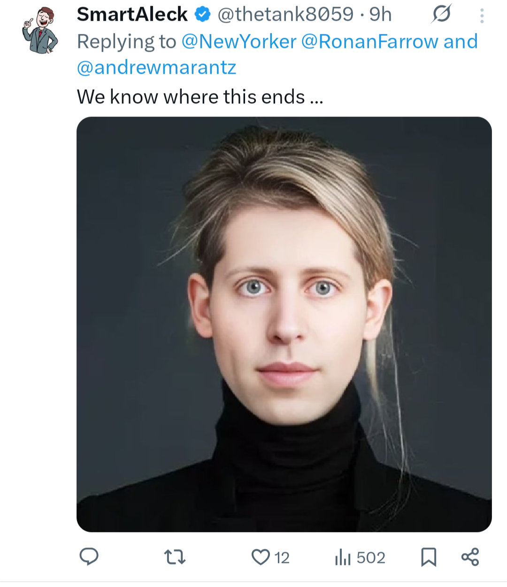

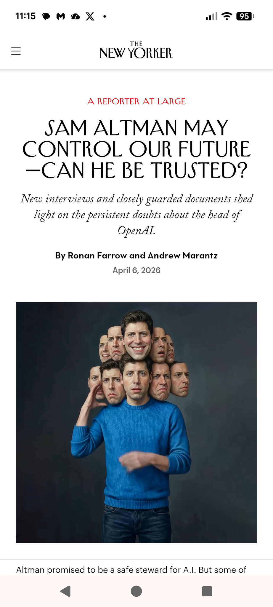

(2/11) In the fall of 2023, OpenAI's chief scientist, Ilya Sutskever, acting at the behest of fellow board members and with other concerned colleagues, compiled some 70 pages of memos about Altman and his second-in-command, Greg Brockman—Slack messages and H.R. documents, some photographed on a cellphone to avoid detection on company devices. One memo begins with a list: "Sam exhibits a consistent pattern of . . ." The first item is "Lying." 

Separately, Dario Amodei—who left to co-found Anthropic—kept years of private notes on Altman and Brockman. More than 200 pages of related documents, never before publicly disclosed, have circulated in Silicon Valley. In one document, Amodei writes that Altman's “words were almost certainly bullshit.”

(3/11) The colleagues who facilitated his ouster accuse him of a degree of deception that is untenable for any executive and dangerous for a leader of such a transformative technology. Mira Murati, who had given Sutskever material for his memos, said: “We need institutions worthy of the power they wield…The board sought feedback, and I shared what I was seeing. Everything I shared was accurate, and I stand behind all of it."

Opinions vary on the extent to which we should consider these traits benign or malign. Altman attributes the criticism to a tendency, especially early in his career, “to be too much of a conflict avoider.”

(4/11) What does this trait look like in practice?

In late 2022, Altman assured the board that features in a forthcoming model had been approved by a safety panel. Board member Helen Toner requested documentation. She found that the most controversial features had not, in fact, been approved.

In 2023, as the company was preparing to release GPT-4 Turbo, Altman apparently told Murati that the model didn't need safety approval, citing the company's general counsel, Jason Kwon. But Kwon said he was "confused" about where Altman had gotten that idea.

(5/11) OpenAI increasingly has meaningful power to shape global security.

The piece describes in detail how its executives considered enriching the company by playing world powers—including China and Russia—against one another, perhaps starting a bidding war for advanced A.I. technology. (The plan was dropped after several employees talked about quitting. An OpenAI representative said it was just one of many ideas "batted around at a high level.")

(6/11) A  legal review that was an integral part if Altman's return. The review, by the law firm WilmerHale, was overseen by two board members selected in close conversation with Altman. People close to the investigation told us that no written report was ever produced—though many executives expected one, given the high profile nature of the scandal. Only an 800 word announcement from OpenAI was released, acknowledging a "breakdown in trust."

Some of the lawyers involved defended their work as "an independent, careful, comprehensive review" and one of the new board members said there was "no need for a formal written report." Many others disagreed:

(7/11) OpenAI was established as a nonprofit, whose board had a duty to prioritize the safety of humanity over the company’s success, or even its survival. The company accepted charitable donations, and some former employees told us they joined because of assurances about the nonprofit and its noble mission, even taking pay cuts to do so.

But internal records show that the founders had private doubts about the nonprofit structure as early as 2017.  Brockman, Altman's co-founder, wrote in a diary entry: "cannot say that we are committed to the non-profit . . . if three months later we're doing b-corp then it was a lie."

OpenAI has since recapitalized as a for-profit entity.

(8/11) Some former OpenAI researchers argue that the company has forfeited its original safety mission and accelerated an industry-wide race to the bottom.

The piece details a set of public and internal safety commitments that former researchers say were abandoned. Several safety-related teams at the company have been dissolved. The Future of Life Institute recently gave OpenAI an F on existential safety—alongside every other company, except for Anthropic, which got a D, and Google DeepMind, which got a D-.

Altman told us he still prioritizes safety, and that "we still will run safety projects, or at least safety-adjacent projects.”

(9/11) In the cut-throat race for A.I. dominance, these more substantive critiques of Altman commingle with no-holds-barred opposition efforts in which rivals have weaponized his personal life. Intermediaries directly connected to—and in at least one case compensated by—Elon Musk have circulated dozens of pages of salacious and unsubstantiated opposition research reflecting extensive surveillance: shell companies, personal contacts, interviews about a purported sex worker conducted at gay bars. 

In the course of our reporting, multiple people within rival companies reached out to insinuate to us that Altman sexually pursues minors, a narrative persistent in Silicon Valley which appears to be untrue. We spent months looking into the matter and could find no evidence to support it.

^ Sam Altman is not well trusted.

-

i've never met him, but sam altman has had many positive impacts on me over the years. so, i would like to weigh in with some counterpoints that were ignored in ronan farrow's lengthy op-ed about how he is the devil:

- when SVB was collapsing, sam spent the weekend wiring personal cash to startups that feared they would miss payroll. no ratchet terms, no written terms at all, just money out the window and trust that it would work out

- when VCs tried to destroy parker conrad, sam stepped in and leveraged his influence to get them to leave him alone

- sam created a free course at stanford on entrepreneurship that has been watched by millions and helped inspire many thousands of entrepreneurs

- sam took YC from a small (albeit dominant) accelerator to a scaled machine that deploys hundreds of millions of dollars supporting an entire generation of founders, most of whom show up as outsiders

- when sam was fired, he had such deep loyalty among employees that 90%+ were going to walk out the door if he didn’t return. that is not the norm for an ousted leader, by a long shot

- ronan farrow would have you believe sam is a master manipulator who takes advantage of everyone around him. who exactly is he manipulating and taking advantage of? his employees who are on the ride of a lifetime building products loved by millions? his investors who universally boast openai first and foremost in their portfolios? his customers who happily pay billions of dollars for said products?

- sam literally helped brute force an industrial revolution into existence. without his perseverance you do not get chatgpt. what did that give us? an explosion of innovation, GDP growth,  a domestic manufacturing and construction boom. a global reduction in friction to create things, build products, and get work done. the most promising path so far to curing cancer and solving climate change and countless other humanity-scale problems. ironically, without sam you do not get the essay Machines of Loving Grace, let alone the abundance that essay promises 

so instead of dwelling on the fact that in 2011 some employees at sam’s company weren’t happy that he misrepresented his ping pong skills, i think i’ll bask in awe at the future we are living in, which sam helped pull forward

-

BREAKING: Iran responds after President Trump says their “entire civilization will die tonight:”

“All diplomatic channels and indirect talks have been frozen after President Trump's recent threats,” Iran says.

-

BREAKING: Dated Brent crude oil prices officially surge to their highest level on record, at $144.42 per barrel.

-

".... The current crisis is more serious than those of 1973, 1979, and 2022 combined..." — Fatih Birol

-

CXCarroll

@CXCarroll

First, the notion that all oil exports are halted is deeply flawed. In 2025 about 20mbpd of oil transited the Strait of Hormuz. Saudi Arabia has diverted 7mbpd to the Red Sea. Iraq is reactivating a 1.5mbpd pipeline that flows to Turkey. Prior to the start of the war...

... the world was facing a significant oil production surplus which was on track to hit 4mbpd in 2026. A lot of people forget this. So the world isn't down 20mbpd. It's down 20 - (7 + 1.5 + 4) = 7.5mbpd and that's before accounting for Iranian exports (about 1.5mbpd).

-

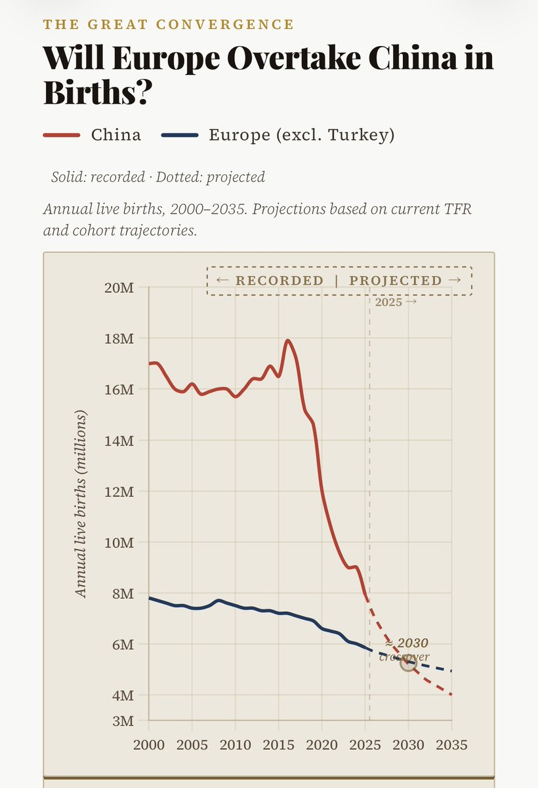

-

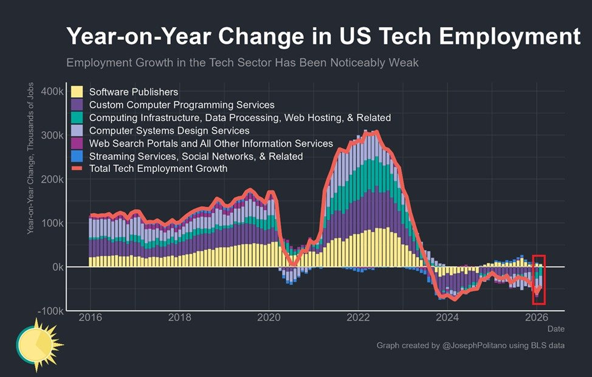

^ This will begin to rise again after the pandemic surplus.

-

TechStockFundamentals

@TechFundies

I am very curious to see whether functionality in business and consumer apps increases materially over the new couple quarters, or whether there are all these new apps I'm about to adopt.

Spending on AI coding agents has been increasing asymptotically and absolute level of spend is run-rating at billions of dollars.

All that code generation has to translate into functionality to be released somewhere, right?  Right?

So far, all my apps are mostly the same and I haven't adopted any new ones....

-

Via a VC

I'm actively hiring right now so I want to push back on something.

When a big company lets a few hundred people go, the CEO doesn't get up and say "we over-hired in 2022 and made bad bets on headcount." That's the honest version. It also gets you fired by the board.

What they say instead is: "AI makes us more efficient, so we're rightsizing." It sounds strategic. It's defensible. And it has just enough truth in it to be believable.

The problem is we've started treating those press releases as ground truth about where the industry is headed - and then drawing conclusions about the profession from them.

What I actually see on the ground in SF: most companies I know that are doing well are hiring A LOT. 

Because the demand for software isn't shrinking. If anything, we still have more software to build than we have people to build it well. 

Junior roles are changing shape, yes. The work is shifting. But that's a different thing than mass contraction of the field.

Pay attention to what companies are doing, not what they're saying about why.

-

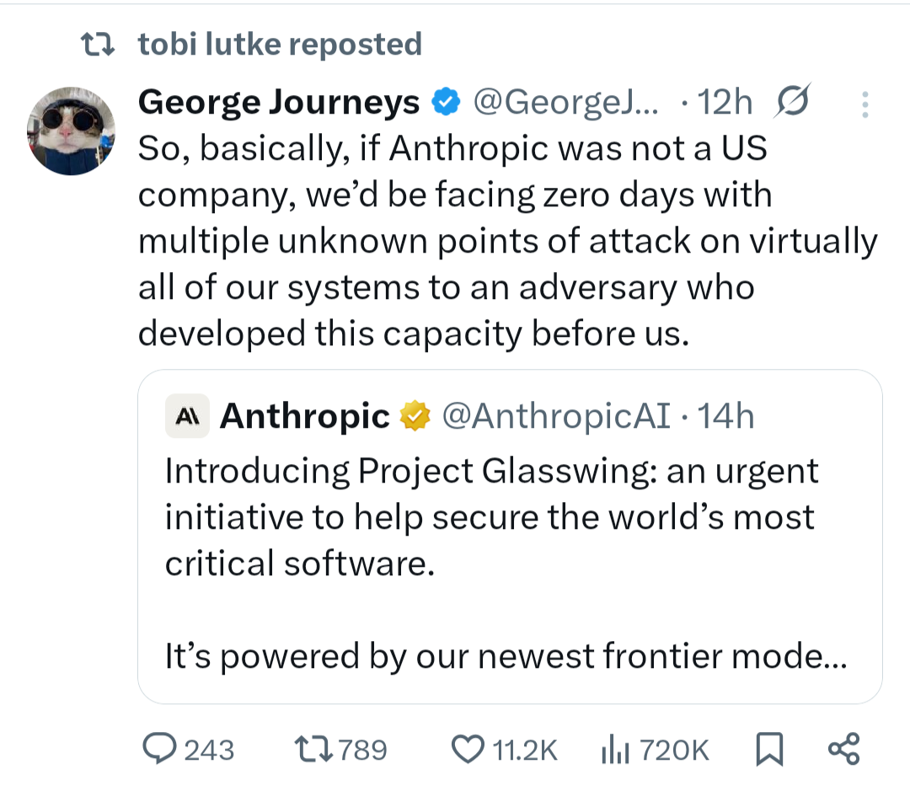

-

BREAKING: US oil prices crash -23% from their high of the day as Iran, Israel, and the US agree to a ceasefire for two weeks.

-

BREAKING: The two-week ceasefire plan between the Iran and the US allows Iran and Oman to charge fees on ships transiting through the Strait of Hormuz, per CNN.

A regional official said this money would be used for the reconstruction of Iran.

Iran has been recently charging $2 million for a one-way voyage through the Strait of Hormuz.

-

Michael A. Horowitz

@michaelh992

"ceasefire"

Kuwait military: "The Kuwaiti air defenses have been dealing, since 8:00 a.m. today and up to now, with an intense wave of hostile Iranian criminal attacks, where a total of (28) drones were intercepted that targeted the State of Kuwait.  The Kuwaiti Armed Forces succeeded in intercepting a large number of hostile drones, some of which targeted vital oil facilities and power stations in the south of the country, resulting in significant material damage to oil infrastructure facilities, power stations, and water desalination plants.  The General Staff of the Army affirms its commitment to all efforts of monitoring and confronting these treacherous targeting attempts.'

-

> Me:

I suspect this is Apple's last mover play. They're waiting until the curves of improving narrow/specific models and efficient local matmul crossover and unlock local inference, adequate for 95% of consumer busywork.

By late 2027 we may see the first PIM (Processing In Module) designs and 48GB UMA machines for 1,000 USD with 80 tok/sec.

Meanwhile, the hosted models will need to increase the context window 10X and 10X again while maintaining relevance/attention, avoiding cognitive tunnelling, and that'll be what you pay a premium for.

But perhaps there'll be a bottleneck in grid/power or a fundamental dilemma* in context/attention, i.e. can present transformer designs hold 1,000 books in context and correctly** prioritise (give attention to) the right information at the right time.

*a key test is if a model cannot improve its own output because it has made absolute optimum token predictions and weaved a perfect, golden fleece, on pass one.

**make prioritisation decisions which the human finds convincing.

-

Thought Alphabet CEO, Sundar Pichai’s comments on memory on the Cheeky Pint podcast were spot on:

- Thinks that wafer starts is a far bigger constraint than memory, power, and energy are more solvable.

- Thinks that memory is much more constrained in the short-term due to limited capacity expansion, and is less severe than it appears.

- Thinks that the (hardware) constraints will push more innovation (on the software side) to make things much more memory-efficient. Will make it 30x more efficient.

-

Abramowicz

The good news for the UK: the country had record amounts of investor demand for a 10-year bond offering. The bad news: they had to offer a high premium, selling the debt at the highest yield since 2008 at 4.9%.

-

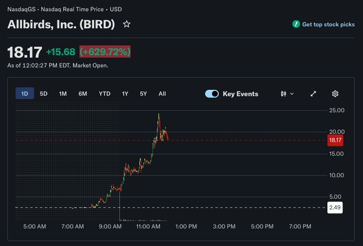

“In a decisive break from its origins as a sustainable footwear maker, Allbirds is exiting consumer products entirely to reposition itself as a provider of AI compute infrastructure, according to a company announcement.”

-

Dell CEO Michael Dell sees memory demand explosion at Bank of America event on April 7, 2026

“I would say memory in advanced silicon, it’s kind of the 25 times 25. And what do I mean by that? So when NVIDIA came out with the H100, it had 80 gigabytes of high bandwidth memory. The current part has 288 gigabytes. Next year, you’ll hear about parts with 1 terabyte. And the year after that, you’ll hear about parts with 2 terabytes. So from 80 gig to 2 terabytes is 25 times more memory per accelerator. And in that timeframe, you’ll have about 25 times more accelerators. So 25 times 25 is 625 times. I know most of you are pretty good at math.”

“And it also takes about four years to build a new memory plant, assuming you don’t have shells already built. And if you wanted to have memory capacity in 2027, you would have made the investments in 2023. If we dial back the clock to 2023, you might recall it was a horrible year for semiconductors, particularly memory. Micron, in particular, had negative gross margin percentage. Their sales went in half from 2022 to 2023, and the industry collectively lost $40 billion. A lot of them still have PTSD from that. And they’re like scared little puppies. Some of them almost went bankrupt. And so they’re sort of very careful about investing.”

Google CEO Sundar Pichai on Cheeky Pints podcast

“Memory is definitely one of the most critical components now.” “There is no way the leading memory companies are going to dramatically improve their capacity. So you have those constraints in the short term.”

Morgan Stanley report on Monday, April 13

“These are unprecedented times. The major Hardware OEMs first discussed the crunch in the memory market with our MS procurement team in late November 2025, signalling prices hikes to come. However, at the time, not even the vendors knew just how severe/dramatic it would be. Memory suppliers and Hardware vendors are increasingly prioritizing AI and hyperscaler demand over traditional enterprise demand.”

SK hynix ADR is happening and should re-rate memory stock valuations higher

CNBC: “SK hynix revealed Wednesday (March 25) that it made a confidential filing with the U.S. Securities and Exchange Commission for a potential listing on Wall Street this year.”

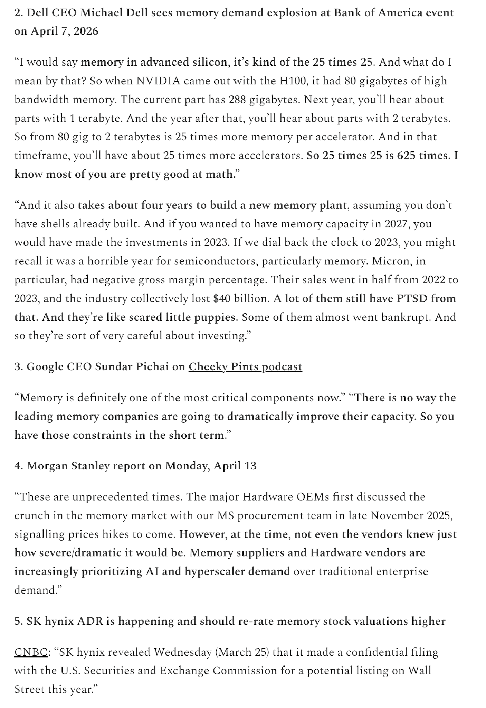

-

BREAKING: US oil prices crash to $83/barrel as Iran officially reopens the Strait of Hormuz for the remainder of the ceasefire.

-

CNBC - Apple goes for the ‘continuity candidate’ to replace Cook. What the CEO change means for investors

-

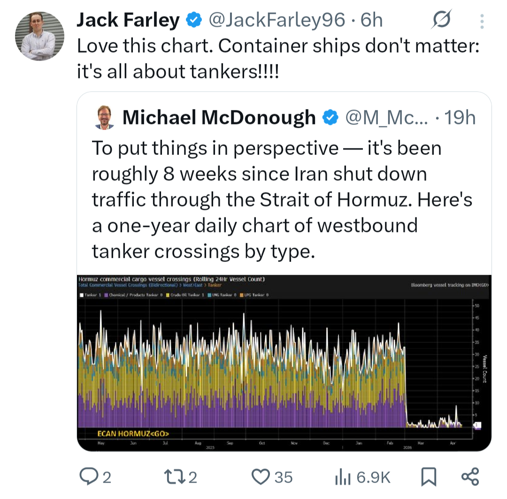

-

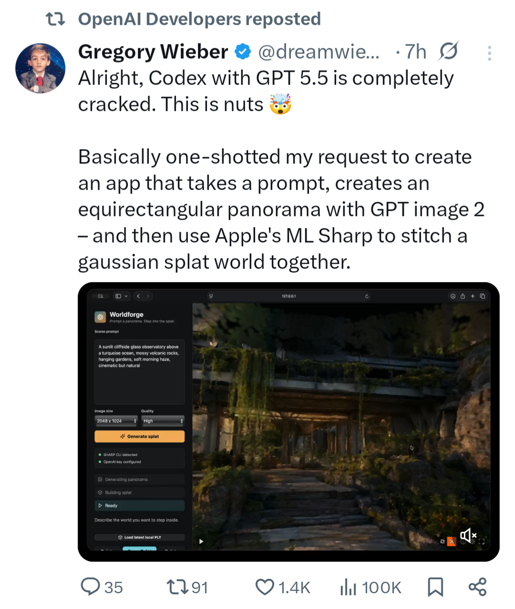

^ The one shotting thing is alive and well years on. However it needs a context window 100X the size to work in most code bases. A prompt suitably long enough to describe everything and app needs would be a specification equivalent to code.

-

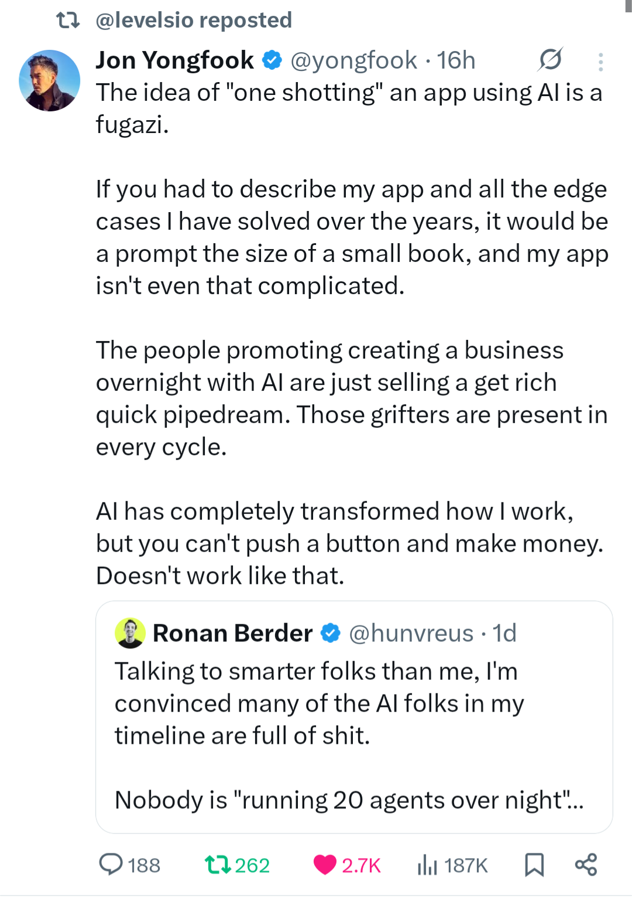

-

> Llama and local inference:

llama.cpp at 100k stars

now that 90% of the code worldwide is being written by AI agents, I predict that within 3-6 months, 90% of all AI agents will be running locally with llama.cpp 😄

Jokes aside, I am going to use this small milestone as an opportunity to reflect a bit on the project and the state of AI from the perspective of local applications. There is a lot to say and discuss and yet it feels less and less important to try to make a point. Opinions about viability of local LLMs are strongly polarized, details are overlooked, the scientific approach is lacking. Arguments are predominantly based on vibes and hype waves.

One thing is clear though - local LLMs are used more and more. I expect this trend to continue and likely 2026 will end up being one of the most important years for the local AI movement.

I admit that I didn't expect the agentic era to come so quickly to the local LLM space. One year ago, the available models were too computationally expensive for doing long-context tasks. There wasn't an obvious path towards meaningful agentic applications. The memory and compute requirements were huge. Last summer, with the release of gpt-oss, things started to change. It was the first time we saw a glimpse of tool calling that actually works well within the resource constraints of our daily devices. Later in the year, even better models were released and by now, useful local agentic workflows are a reality.

Comparing local vs hosted capabilities at a given moment of time is pointless. To try put things into perspective:

- We don't need frontier intelligence to automate searches and sending emails

- We don't need trillion parameter models to be able to summarize articles or technical documents

- We don't need massive GPU data centers to control our home appliances or turn the lights off in the garage

I believe that there is a certain level of intelligence we as humans can comprehend and meaningfully utilize to improve our working process. Beyond that level, access to more intelligence becomes unnecessary at best and counterproductive at worst. I also believe that that level of useful artificial intelligence is completely within reach locally and it has always been just a matter of implementing the right software stack to bring it to the end user.

With llama.cpp, I am confident that we continue to be on the right track of building that software stack!

The llama.cpp project is going stronger than ever. With more than 1500 contributors, the project keeps growing steadily.

From technical point of view, I think that llama.cpp + ggml is the only solution that actually makes sense. That is, the software stack must run efficiently on every possible device, hardware and operating system. The technology is too important to be vendor-locked. It has to be developed in the open, by the community, together with the independent hardware vendors. This is the only right way to build something that will truly make a difference in the long run.

I won't try to convince you about what is currently and will be possible with local AI. We will just continue to build as usual. I am confident that after the smoke clears and we look objectively at what we have built together, the benefits will be obvious to everyone.

Big shoutout to all llama.cpp maintainers. I feel extremely lucky to be able to work together with so many talented contributors. Every day I learn something new and I feel there is so much more cool stuff that we are going to build. Also, I am really thankful that the project continues to have reliable partners to support it!

Cheers!

-

Hoseeb, I think an investor:

The highest-value human work in the AI era will be in domains with sparse reward signals. Internalize this, or watch your value erode over the next decade.

Math, programming, rote memorization, data science, all fucked. The classic “smart nerd” jobs are exactly where AI is strongest, because the feedback loops are dense. You can check the answer. You can run the test. That means AI can improve quickly, and humans will rapidly fall behind.

Your advantage as a human is in messy domains.

Taste. Judgment. Negotiation. Risk-taking. Politics. Sales. Science at the frontier. Anything you can only really learn by doing. Cross-disciplinary stuff.

The valuable domains will be the ones guarded by secrets, tacit knowledge, weak labels, long feedback cycles, and ambiguous outcomes. Places where the training data is scarce, the ground truth is disputed, and it's impossible to explain why something is good.

AI will still enter these domains. But we will be slower to trust it unsupervised there, because it will be harder to tell when it is right, harder to prove when it is wrong, and difficult to construct secure sandboxes. The stakes will be too high to YOLO it.

I find myself saying this over and over again to young people today: the future does not belong to people who are able to get good grades on tests. It belongs to people who can operate under uncertainty, in domains where correctness is hard to define.

Those domains will become the thin waist of the economy: as productivity everywhere else accelerates, the humans who excel there will become our economic Strait of Hormuz. The best humans in these domains will demand an enormous cut of the growing economic pie.

Your imperative going forward is to make sure you're one of these people.

(Or become an electrician. That probably works too.)

^ This kind of garbage prognosticating is all of X all day long so I've had to come off of it.

-

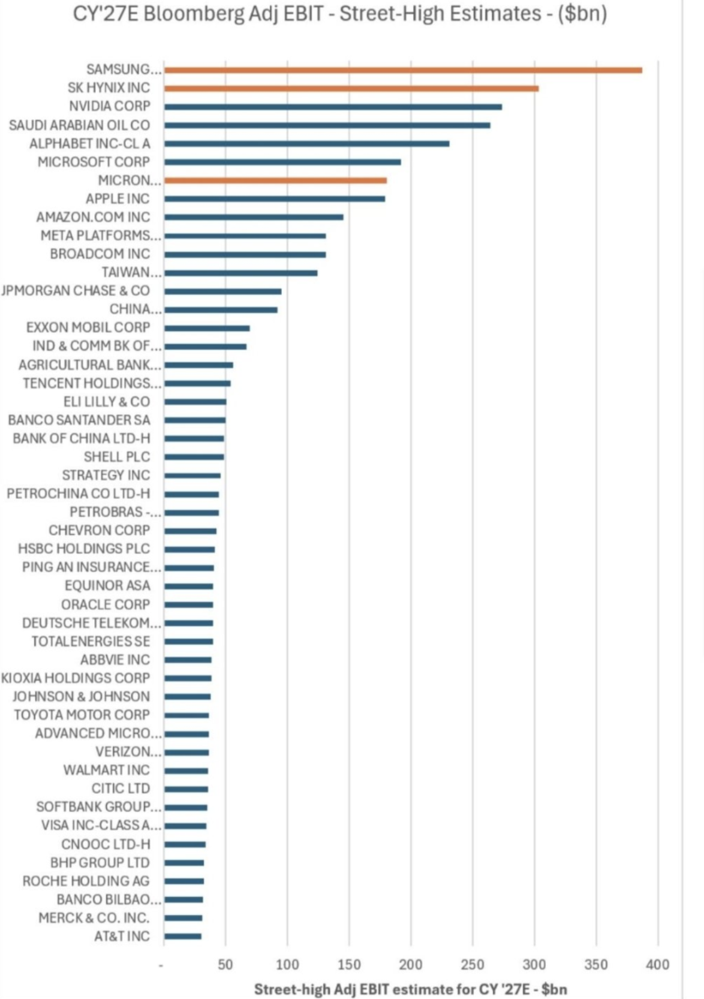

^ Chips, oil and software.

-

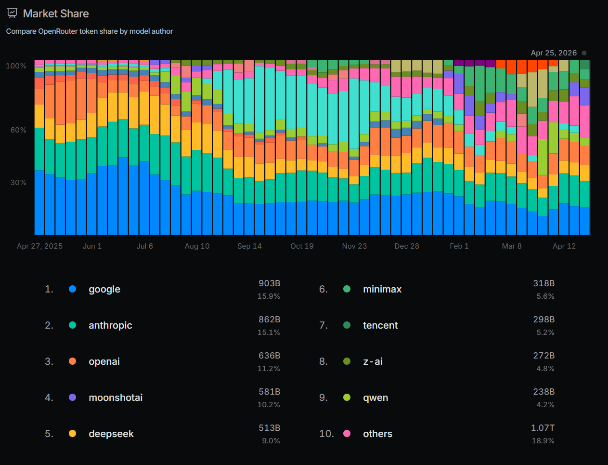

^ This chart is weird. Google being so high is unexpected and it seems to be over a strange, short time period or just 1 year and with so much change. There is a blow out of a cyan colour which is not in the key; the key seems based on the final bar and not the period average.

-

BREAKING: The S&P 500 closes at its highest level on record, now up +13.6% since its March 30th bottom.

-

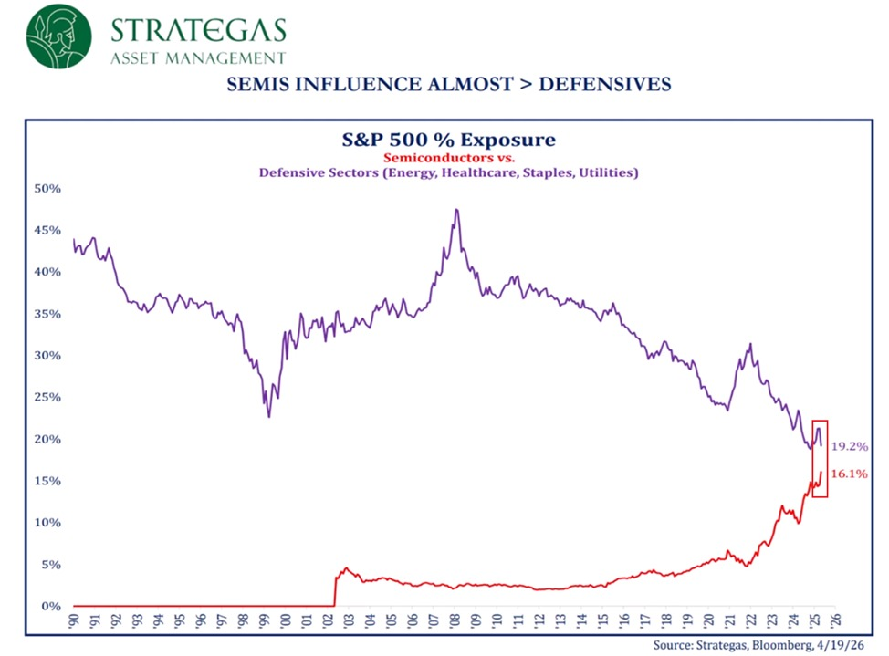

^ Semiconductor stocks are 16% of SP500. Defensives low 19.2% is lower than dotcom boom.

-

Americans spent over $109 billion on lottery tickets last year, which is more than they spent on movies, books, concerts and sports tickets - combined.

-

BREAKING: US oil prices extend gains to rise above $97/barrel as peace talk progress between the US and Iran appears to be stalling again.

-

> I’m beginning to be interested in reading the Tempo blockchain docs and using Privy, a semi-centralised wallet infra company from or associated with Tempo/Stripe. It feels to me like the idealism of blockchains has failed and it is coming of age in the reality of economic forces, notably distribution and network effects, consolidation and convenience, and that complexity and fragmentation held the ideas back.

-

Jack Dorsey 

Jack Dorsey, co-founder of Twitter (now X) and Block, on why treating AI as a "copilot" is a losing strategy:

@jack argues that most companies are approaching AI in a way that will make it nearly impossible for them to survive.

"I think most of the industry is thinking about AI as like a co-pilot, as something that is augmented onto, rather than like how do you just rebuild our whole company with this as the core."

His concern is that bolting AI onto existing structures produces companies that look indistinguishable from each other, and from the AI labs themselves.

"If it doesn't make sense for your business to do that and you end up being or looking very similar or rhyming too closely with the frontier labs, then I think it's going to be very, very challenging to differentiate and survive."

This thinking has been driving his decisions since early 2024, when these tools "really came to bear."

That's when his team began building Goose, an agent coding harness, as part of a broader effort to rebuild around AI rather than layer it on top.

The core insight?

Speeding up old workflows with AI is a short-term gain every competitor will match. Real differentiation comes from rebuilding the company itself around intelligence.

^ Jack can be brilliant though I think he is a lousy operator. I keep thinking about what will not change. Relationships and networks. AI is not a disruptive innovation. It has not started out shitty but useful for a new trend, or has it? The fundamental shift has been towards technology companies which has been a revolution of organising people around problems, and also about the internet as a new platform, a new marketplace, a forum or town square, a city. AI is now like this. It is an employee. Can you arrange a start-up around an artificial employee? What does that mean? If you consider AI as a multi capable person, you're saying you're reorienting your company around a person? That just means providing the hooks and systems to this new type of person. And that means rewriting software, just as the web and the smartphone meant rewriting software.

-

MIT student asked a question earlier today that a lot of young founders are quietly wondering about:

"Won’t the frontier labs just do everything?"

Yes it's true that OAI/Ant are shipping at incredible pace, but it's quite easy to avoid their blast radius and build amazing startups:

OpenAI is not going to build a cattle-herding drone, buy an old F-150 and drive from ranch to ranch like the founder of one of the fastest-growing YC W26 startups, Graze Mate.

Anthropic is not going to integrate with dental insurance verification systems (Lance).

Google is not going to navigate NATO procurement (Milliray).

The value is in the last mile, not the model. Sales cycles require humans who understand the customer. And most importantly, the market is expanding, not shrinking: AI isn't cannibalizing the existing 1% software spend — it's unlocking the other 5-6% that was going to humans. That's a much bigger market for startups yet-to-be-founded than the one the labs are playing in.

Now, what DOES seem risky?

A thin UI layer on top of ChatGPT with no domain expertise; a general-purpose chatbot or assistant; or a product that gets obsolete when model capabilities improve.

But — tools for specific industries; "full-stack" AI companies that actually are the service (AI law firm, AI accounting firm, AI uranium exploration company); or generally products where the customer doesn't want a tool but an outcome — are defensible ideas for startups.

^ Retweeted by Paul Graham. This is the fear since day one. They won't do everything but they will do a lot.

-

Kobeissi -

The US software sector is struggling:

Average software company loan prices are down to ~88 cents, near the lowest in at least 2 years.

This marks a 6-cent, or -7% decline since the start of the year.

As a result, software is the most affected sector in the US leveraged loan market.

Software engineering loans have dropped by -16.3 cents on average since January 20th, followed by horizontal software at -8.8 cents, cybersecurity at -5.3 cents, and vertical software at -4.2 cents.

By comparison, the US Leveraged Loan Index trades at ~95 cents, highlighting how concentrated the selloff has been in software.

The software sector is under heavy pressure.

-

Kobeissi -

BREAKING: SpaceX's board has approved a new compensation package for Elon Musk ahead of its record-setting IPO.

The package includes:

1. 200 million super-voting shares if SpaceX hits a $7.5 trillion valuation and establishes a permanent Mars colony with at least 1 million people 

2. Additional 60.4 million shares if SpaceX reaches certain valuation goals and operates data centers in space delivering 100 terawatts of compute

3. Elon Musk will not receive a single share if the company fails to reach the board's valuation targets

Elon Musk has received a salary from SpaceX of $54,080 per year since 2019.

-

Abramowicz -

US economic data keeps surprising to the upside, while European data keeps surprising to the downside. That gap just keeps growing, according to Bloomberg economic surprise indexes.

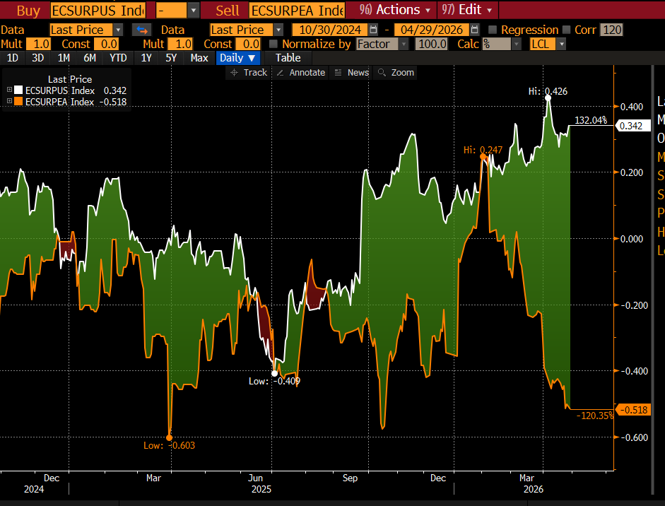

-

Ali Yahya

Crypto sentiment is at a near all-time low, but fundamentals are at all-time highs:

- $300B in circulating stablecoin supply

- $1.5T+ in monthly transfer volume

- Major financial institutions entering the space

- Infra ready to support 100s of millions of users

- Regulatory clarity improving 

^ I feel this sentiment. It's real. It's like the spirit of the concept has died. However I no longer feel I must be idealistic and I can just use Tempo or whatever has traction and convenience for consumers.

-

I looked at every major DeFi hack from 2020 to 2025. 460 of them. DeFi is getting safer. Losses have dropped materially. The typical hack is 75% smaller than it was in 2022. Flash loans, the signature attack of early DeFi, are basically dead.

We've learned defi security the hard way, but attackers have moved on to social engineering, phishing, and long-term infiltration of the people and systems holding the keys. Oddly enough, that's a mark of progress, since the old attack vectors don't work anymore.

Gradually, we are winning the onchain security war.

-

BREAKING: Meta stock, $META, falls over -7% despite posting stronger than expected Q1 2026 earnings results.

BREAKING: Alphabet stock, $GOOGL, surges over +5% to its highest level on record after crushing Q1 2026 earnings expectations.

BREAKING: Amazon stock, $AMZN, falls over -6% despite posting stronger than expected Q1 2026 earnings results.

-

Big Three Hyperscalers

Google Cloud (Alphabet): 63% YoY in Q1 2026 (calendar Q1, reported April 29). Revenue ~$20B. This marks continued acceleration from ~48% in Q4 2025, fueled by AI solutions and infrastructure.

Microsoft Azure: 40% YoY in Microsoft’s FY2026 Q1 (reported late October 2025; aligns roughly with calendar Q3/Q4 period). Azure remains a key growth driver within Intelligent Cloud, with strong AI workload contribution.

AWS (Amazon): ~24% YoY in Q4 2025 (latest reported; Q1 2026 earnings expected after market close on April 29). Consensus for Q1 2026 was in the mid-20s% range (~25-26% expected pre-earnings, with some analysts seeing potential for higher). AWS is reaccelerating modestly on AI but grows on a much larger base.

-

Kobeissi -

It's official:

Brent crude oil prices just broke above $120/barrel for the first time since June 2022.

Asia is facing its worst crisis in history and Europe has just weeks worth of jet fuel left.

The US is exporting record amounts of oil as a result.

Inflation is back.

-

Sundar Pichai just said data centers in space will be "the new normal" within a decade. @elonmusk has been saying this for years. When the CEO of Google starts agreeing with Elon, pay attention. The orbital compute era is closer than you think.

-

Sam Altman

@sama

·

1h

we want to build tools to augment and elevate people,  not entities to replace them.

Sam Altman

@sama

·

1h

i think a lot of people are going to be busier (and hopefully more fulfilled) than ever, and jobs doomerism is likely long-term wrong.

though of course there will be disruption/significant transition as we switch to new jobs, the jobs of the future may look v different, etc.

Sam Altman

@sama

·

1h

i'm hopeful for a future where people who want to work really hard have incredibly fulfilling things to do, and people who don't want to work hard don't have to and can still have an amazing life of prosperity.

-

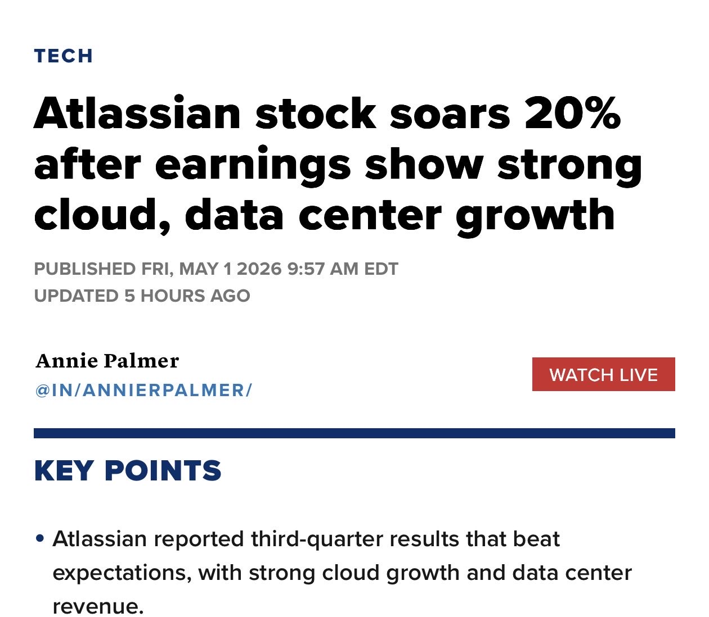

^ I'm trying to get a position in Cloudflare but I think my limit order will never be triggered. STOP PRESS - I today add a buy order for immediate execution and kept my sub 185 USD order in place. I also ordered GitLab and PagerDuty.

-

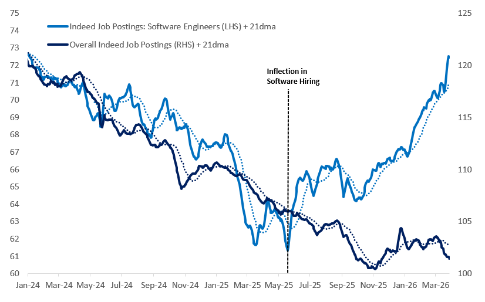

^ Demand for software developers has accelerated from its ‘weird’ growth. Note this chart was first posted as a shock/narrative violation.

-

Meanwhile, Kobeissi has it the other way around:

Tech layoffs are skyrocketing:

Tech companies announced 81,747 layoffs in Q1 2026, the highest quarterly total since at least Q1 2024.

Layoffs have more than DOUBLED from the previous quarter and have risen +580% since Q4 2025.

March alone saw 45,800 announced job cuts, the worst single month for tech layoffs in at least 2 years.

Tech layoffs are set to remain elevated with Meta's, 

$META

, recent plans to cut ~8,000 employees.

Furthermore, Microsoft, 

$MSFT

, is offering voluntary retirement to ~7% of its US workforce, which could transition into layoffs if participation is low.

This comes as tech giants shift spending toward AI chips and data centers, trimming staff to free up capital for infrastructure.

US tech employment is rapidly contracting.

-

Gustaf Alströmer reposted

Object Zero

@Object_Zero_

This 100MW data center in UAE is the largest solar powered datacenter in the world. There are currently 1,300 data centers in the world that are bigger than this one, but this one is the largest solar powered one.

That’s 10 square kilometres of solar panels you can see.

The datacenter itself is 0.02 square kilometres, so a solar powered datacenter is ~500x larger than a data center using any other form of power.

A five hundred times larger site.

UAE has some of the highest solar irradiance anywhere on Earth, it is an inhospitable desert. Averaging 9.7 hours of sunlight per day with average irradiance above 2,200 kWh/m^2.

If you build this somewhere else, you need more solar panels because your irradiance will almost certainly be lower.

Even if the world had an infinite supply of free solar panels, solar power will not be free.

Anyone who has ever done major capital projects, who looks at where data centers need to be in the next 5 years and the next 10 years… we know it aint solar. Sorry.

You struggle to even build a train track that’s 100 miles long and 10ft wide anywhere in the West, there is zero chance of build 100 square mile solar farms for GW compute.

This is why people are talking about space compute. Deploying into space is one strategy to solve the constraints.

But there are faster and more scalable strategies, that get you to mass deployment of multi GW data centers.

There are strategies that also allow you to power the 10 billion robots and their newtonian actuators, that immediately follow the inference demand cycle.

Step back and look at the full cycle of this industrial revolution… There will be billions of chips, but there will be trillions of actuators.

This biggest part of this revolution is the embodiment cycle, and it’s big by a factor of 20 or 50x over the stuff that comes before it.

There is no analogy in human history for the scale of this economy, of the demand it will place on energy and commodities.

The humans own the Earth, and if you exist inside their legal system, they won’t let you turn the surface of their planet into glass.

But they do want your chips and your actuators to serve their needs and desires. There is a way to do all of this, and so it will happen.

-

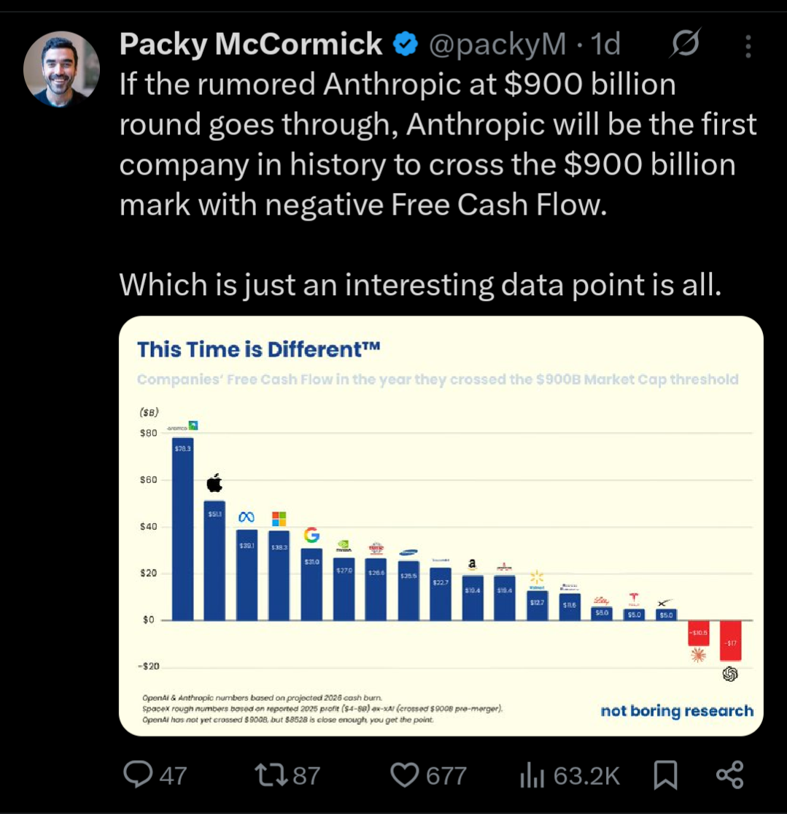

-

Tom Lee stated that we will have “one of the best 18-24 month periods we have seen in our life”

-

## Bottom

