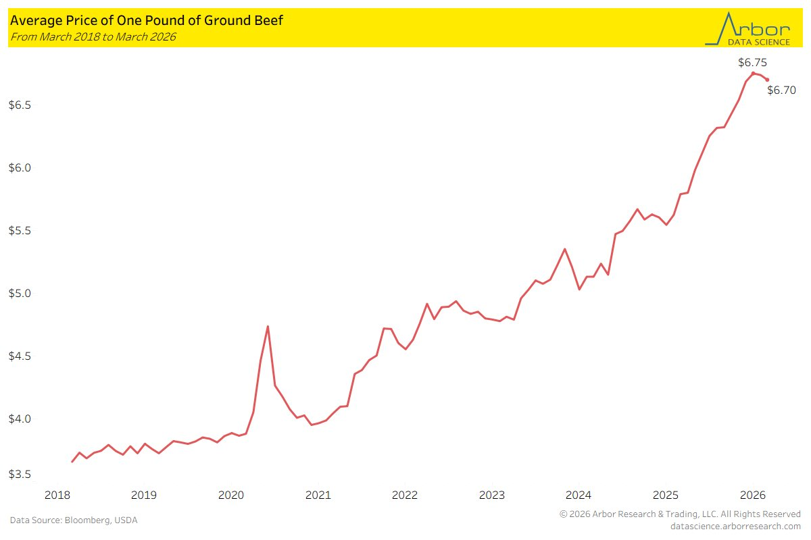
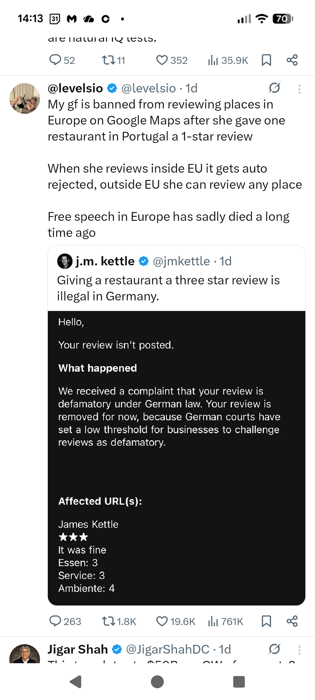
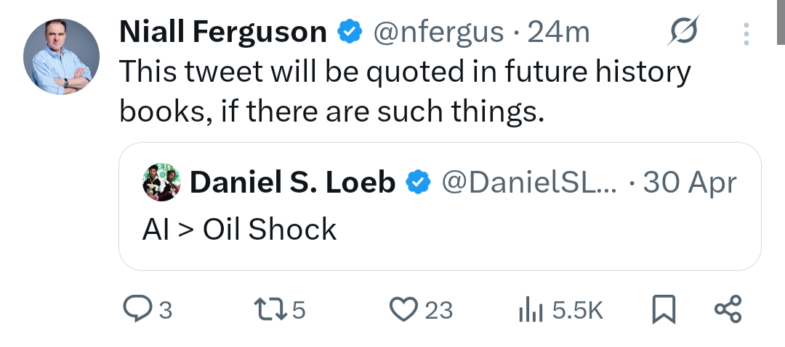
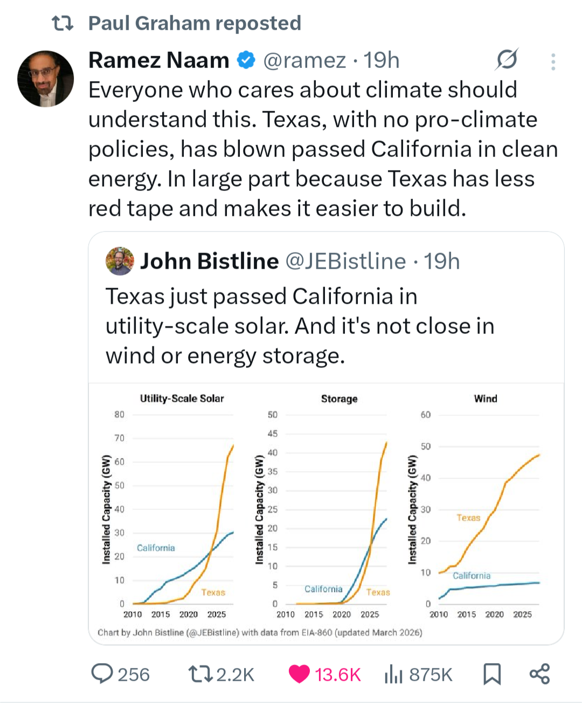
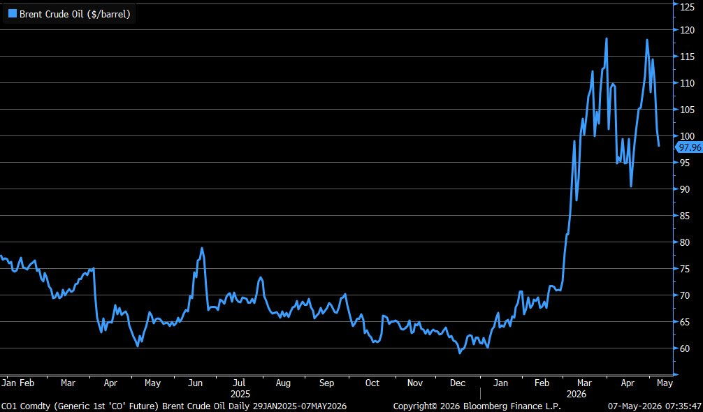

# 2026 05

---

May

$TSLA BYD UK New Car Sales In April Up 73.6% Y/Y To 2,612 Electric Vehicles - New Automotive Data

- Tesla's UK New Car Sales In April Up 48.6% Y/Y To 838 Electric Vehicles

-

BREAKING: Japan's stock market surges +6% to its highest level on record as global technology stocks see massive gains.

-

S&P 500. Nasdaq. Russell 2000. All at records.

@MarkNewtonCMT goes live tomorrow at 2pm ET with his technical read on what comes next -- plus live analysis on $TSLA, $NVDA, $AMD, and the stocks you ask about. 👉[__fundstratdirect.com/event/mark-new…__](http://fundstratdirect.com/event/mark-new…)

-

Sam Korus, ARK Invest, in Anthropic booking xAI Colossus supercomputer.

Anthropic reportedly cut off xAI at the model layer, then signs a deal because they need the compute. Tells you a lot about which layer of the stack holds more power (literally)

Ramez Naam, VC, replies.

None of the layers have much of a moat right now. But this particular deal appears more positive for Anthropic than xAI.

-

Latest from @LizAnnSonders and me is live … so far in this earnings season, we’re seeing double-digit growth across most sectors, a substantial upward revision to the consensus (since January), and margins holding near cyclical highs:

[__schwab.com/learn/story/ea…__](http://schwab.com/learn/story/ea…)

-

^ A pack of 500g ground beef is 6.7 USD or 4.92 GBP.

-

-

Jamie Dimon says he used Claude this weekend, saying “I’m the ceo of a bank” then asking about asset swaps and treasury bid/ask spreads, adding that AI use cases in finance are “just starting”

^ Using Claude years late it's true leadership.

-

-

-

^ Brent crude under 100 USD. Is that the double top?

-

-

